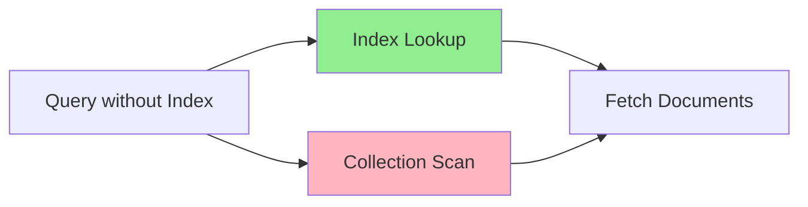

# MongoDB createIndex

## Introduction

In MongoDB, indexes play a crucial role in improving the efficiency of database operations. Without indexes, MongoDB would need to scan every document in a collection to find the documents that match a query condition. This process, known as a collection scan, can be extremely inefficient, especially for large collections.

The `createIndex` method in MongoDB allows you to create indexes on specific fields within your collections. These indexes serve as roadmaps that help MongoDB find data quickly, significantly improving query performance.

In this guide, we'll explore how to use the `createIndex` method effectively, understand its options, and apply it in real-world scenarios.

## Understanding MongoDB Indexes

Before diving into `createIndex`, let's briefly understand what indexes are in MongoDB:

An index in MongoDB is a special data structure that stores a small portion of the collection's data in an easy-to-traverse form. The index stores the value of a specific field or set of fields, ordered by the value(s) of the field(s) specified in the index.



## Basic Syntax of createIndex

The basic syntax for creating an index using `createIndex` is:

```javascript
db.collection.createIndex({ field: sort_order }, options)
```

Where:
- `field` is the name of the field to index
- `sort_order` is either 1 (for ascending) or -1 (for descending)
- `options` is an optional document that controls the creation of the index

## Creating a Simple Index

Let's start with creating a simple index on a single field:

```javascript
// Assume we have a collection named 'users'
db.users.createIndex({ email: 1 })
```

This command creates an ascending index on the `email` field. MongoDB will return a response indicating the successful creation of the index:

```javascript
{
  "createdCollectionAutomatically": false,
  "numIndexesBefore": 1,
  "numIndexesAfter": 2,
  "ok": 1
}
```

## Types of Indexes You Can Create

### Single Field Index

We've just seen a single field index in the previous example.

### Compound Index

When your queries frequently include multiple fields, a compound index might be more appropriate:

```javascript
db.products.createIndex({ category: 1, price: -1 })
```

This creates an index on both the `category` (ascending) and `price` (descending) fields, which is useful for queries that filter on category and sort by price.

### Multi-key Index

If you index a field that contains an array, MongoDB creates an index key for each element in the array. These are called multi-key indexes:

```javascript
// Assuming documents with 'tags' as arrays
db.blog.createIndex({ tags: 1 })
```

### Text Index

For text search capabilities, you can create a text index:

```javascript
db.articles.createIndex({ content: "text" })
```

This allows you to perform text searches on the `content` field:

```javascript
db.articles.find({ $text: { $search: "mongodb index" } })
```

### Geospatial Index

For location-based queries:

```javascript
db.places.createIndex({ location: "2dsphere" })
```

## Index Options

The `createIndex` method accepts various options to customize index creation:

### Unique Index

To ensure uniqueness across indexed fields:

```javascript
db.users.createIndex({ email: 1 }, { unique: true })
```

If you try to insert a document with an email that already exists, MongoDB will reject it.

### Sparse Index

A sparse index only includes entries for documents that have the indexed field:

```javascript
db.contacts.createIndex({ "phone.mobile": 1 }, { sparse: true })
```

This index will only include documents that have a `phone.mobile` field.

### TTL Index

Time-to-live (TTL) indexes allow you to automatically remove documents after a specified amount of time:

```javascript
db.sessions.createIndex({ lastModified: 1 }, { expireAfterSeconds: 3600 })
```

This will remove documents one hour after their `lastModified` timestamp.

### Background Creation

For production environments, you might want to create indexes in the background to avoid blocking operations:

```javascript
db.products.createIndex({ name: 1 }, { background: true })
```

**Note**: In MongoDB 4.2 and later, background index builds are automatically used for replica sets, so this option is less necessary.

## Practical Examples

### Example 1: E-commerce Product Catalog

Let's create indexes for a product catalog in an e-commerce application:

```javascript
// Create a product collection with sample data
db.products.insertMany([
  { name: "Laptop", category: "Electronics", price: 999, inStock: true, tags: ["computer", "tech"] },
  { name: "Headphones", category: "Electronics", price: 99, inStock: true, tags: ["audio", "tech"] },
  { name: "T-shirt", category: "Clothing", price: 19.99, inStock: true, tags: ["apparel", "cotton"] }
])

// Create indexes for common query patterns
db.products.createIndex({ category: 1, price: 1 }) // For browsing by category and sorting by price
db.products.createIndex({ name: "text" }) // For product search functionality
db.products.createIndex({ tags: 1 }) // For filtering products by tags
```

When users browse the electronics category and sort from lowest to highest price, MongoDB can use the compound index:

```javascript
db.products.find({ category: "Electronics" }).sort({ price: 1 })
```

### Example 2: User Management System

For a user management system, we might need indexes to ensure uniqueness and speed up lookups:

```javascript
// Sample user collection
db.users.insertMany([
  { username: "john_doe", email: "john@example.com", active: true, lastLogin: new Date() },
  { username: "jane_smith", email: "jane@example.com", active: true, lastLogin: new Date() }
])

// Create indexes for common operations
db.users.createIndex({ email: 1 }, { unique: true }) // Ensure email uniqueness
db.users.createIndex({ username: 1 }, { unique: true }) // Ensure username uniqueness
db.users.createIndex({ lastLogin: 1 }) // For queries filtering inactive users
```

When users try to sign up with an existing email:

```javascript
// This operation will fail due to the unique index constraint
db.users.insertOne({ username: "new_user", email: "john@example.com", active: true })
```

## Checking Existing Indexes

To see what indexes already exist on a collection:

```javascript
db.collection.getIndexes()
```

This returns an array of documents, each describing an index on the collection.

## Removing Indexes

If you need to remove an index:

```javascript
// Remove by index name
db.collection.dropIndex("index_name")

// Or remove by field specification
db.collection.dropIndex({ field: 1 })
```

## Understanding Index Performance

Creating an index has both benefits and costs:

**Benefits:**
- Faster query execution
- Efficient sorting operations
- Support for unique constraints

**Costs:**
- Additional disk space usage
- Increased write operation overhead
- Memory usage for index storage

You can analyze index usage with the `explain()` method:

```javascript
db.products.find({ category: "Electronics" }).explain("executionStats")
```

This provides detailed information about how MongoDB executed the query and which indexes it used.

## Best Practices for createIndex

1. **Create indexes that support your common queries** - Don't create indexes for every field, but focus on fields used in queries, sorts, and aggregations.

2. **Consider query patterns** - Create compound indexes based on your query patterns: equality conditions first, then sort conditions, and finally range conditions.

3. **Avoid over-indexing** - Too many indexes can slow down write operations and consume excessive storage.

4. **Use background indexing in production** - For large collections, consider creating indexes in the background to avoid blocking operations.

5. **Monitor index size** - Large indexes consume memory and can affect performance.

6. **Update indexes when query patterns change** - Periodically review your indexes and update them as your application's query patterns evolve.

## Summary

The `createIndex` method is a powerful tool for optimizing MongoDB query performance. By creating appropriate indexes for your common query patterns, you can significantly improve the speed and efficiency of your database operations.

We've covered:
- Basic syntax for creating various types of indexes
- Options for customizing index behavior
- Real-world examples showing practical applications
- Best practices for effective index management

Remember that indexes come with trade-offs - they speed up reads but can slow down writes and consume storage space. The key to effective indexing is understanding your application's query patterns and creating targeted indexes accordingly.

## Additional Resources and Exercises

### Exercises

1. Create a collection named `students` with fields for `name`, `grade`, `subjects` (array), and `enrollmentDate`. Then create appropriate indexes for:
   - Looking up students by name
   - Finding all students in a specific grade
   - Querying students who take a particular subject
   - Finding students who enrolled after a certain date

2. Experiment with text indexes by creating a collection of blog posts and implementing a search functionality.

3. Create a TTL index on a collection and verify that documents are automatically removed after the specified duration.

### Further Reading

- [MongoDB Official Documentation on Indexes](https://docs.mongodb.com/manual/indexes/)
- [MongoDB Index Strategies](https://docs.mongodb.com/manual/applications/indexes/)
- [MongoDB Query Performance](https://docs.mongodb.com/manual/tutorial/analyze-query-plan/)

By mastering the `createIndex` method and understanding index strategies, you'll be well-equipped to optimize your MongoDB database performance and build efficient, scalable applications.