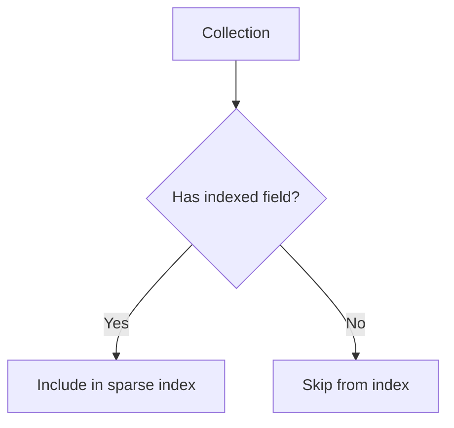

# MongoDB Sparse Indexes

## Introduction

In MongoDB, not all documents in a collection need to have the same fields. This flexibility is one of MongoDB's strengths, but it can complicate indexing. Regular indexes include all documents in a collection, creating null entries for documents missing the indexed field. This approach can be inefficient when many documents don't contain the indexed field.

**Sparse indexes** solve this issue by indexing only the documents that contain the indexed field, ignoring documents where the field is absent. This makes sparse indexes smaller and more efficient when you frequently query for the existence of a field that appears in a small percentage of your documents.

## Understanding Sparse Indexes

### What is a Sparse Index?

A sparse index only includes entries for documents that contain the indexed field, even if the field value is null. If a document doesn't have the indexed field, MongoDB doesn't include it in the sparse index.

Here's a visual representation of how sparse indexes work:



### Regular Index vs. Sparse Index

To understand the difference between regular and sparse indexes:

- **Regular Index**: Includes all documents; creates null entries for documents missing the indexed field
- **Sparse Index**: Only includes documents that have the indexed field, even if the value is null

## Creating Sparse Indexes

To create a sparse index in MongoDB, you use the `createIndex()` method with the `sparse: true` option:

```javascript
db.collection.createIndex({ fieldName: 1 }, { sparse: true })
```

### Example: Creating a Sparse Index

Let's create a collection of users where some users have an "email" field and others don't:

```javascript
db.users.insertMany([
  { _id: 1, name: "John", email: "john@example.com" },
  { _id: 2, name: "Sue", email: "sue@example.com" },
  { _id: 3, name: "Mark" },
  { _id: 4, name: "Alice" },
  { _id: 5, name: "Tom", email: null }
])
```

Now, let's create a sparse index on the "email" field:

```javascript
db.users.createIndex({ email: 1 }, { sparse: true })
```

The result will indicate that the index was created:

```
{
  "createdCollectionAutomatically" : false,
  "numIndexesBefore" : 1,
  "numIndexesAfter" : 2,
  "ok" : 1
}
```

## When to Use Sparse Indexes

Sparse indexes are particularly useful in the following scenarios:

1. **When the indexed field exists in a small percentage of documents**
2. **When you frequently query for the existence of the field**
3. **When you need to enforce uniqueness only among documents that have the field**

### Example: Using Sparse Index for Querying

With our sparse index on the "email" field, queries that include this field will be efficient:

```javascript
// This query will use the sparse index
db.users.find({ email: "john@example.com" })

// This query will also use the sparse index
db.users.find({ email: { $exists: true } })
```

## Sparse Indexes with Unique Constraint

One powerful use case for sparse indexes is combining them with a uniqueness constraint. This enforces uniqueness only for documents that have the field, allowing multiple documents without the field.

```javascript
db.users.createIndex(
  { email: 1 },
  { sparse: true, unique: true }
)
```

This index ensures:
- No two documents can have the same email
- Multiple documents can exist without an email field

### Example: Unique Sparse Index

Let's try to create documents with our unique sparse index in place:

```javascript
// These will work fine
db.users.insertOne({ name: "Rebecca" })
db.users.insertOne({ name: "David" })

// This will fail with a duplicate key error
db.users.insertOne({ name: "Emma", email: "john@example.com" })
```

The last insertion would fail because "john@example.com" already exists in the collection.

## Limitations of Sparse Indexes

While sparse indexes are useful, they have some limitations:

1. **Sort operations**: Sparse indexes may return incomplete results for sort operations if the indexed field is missing in some documents
2. **Cannot support covered queries** where the indexed field is missing
3. **$or operations**: May not use the sparse index efficiently for some $or queries

### Example: Sort Limitation

When sorting with a sparse index, documents missing the indexed field will be excluded from the results:

```javascript
// This only returns documents with the email field
db.users.find().sort({ email: 1 })
```

To get all documents when sorting, you might need to use a different approach or a regular (non-sparse) index.

## Practical Real-World Applications

### Application 1: User Verification System

In a user management system where only some users have verified their accounts:

```javascript
db.users.insertMany([
  { username: "user1", verified: true, verificationDate: new Date() },
  { username: "user2" },
  { username: "user3", verified: true, verificationDate: new Date() },
  { username: "user4" }
])

// Create a sparse index on verification date
db.users.createIndex({ verificationDate: 1 }, { sparse: true })

// Query for users who verified within last 30 days
const thirtyDaysAgo = new Date(new Date().setDate(new Date().getDate() - 30))
db.users.find({ verificationDate: { $gt: thirtyDaysAgo } })
```

### Application 2: Optional Product Features

For an e-commerce platform with optional product features:

```javascript
db.products.insertMany([
  { name: "Basic Phone", price: 100 },
  { name: "Smart Phone", price: 500, cameraSpec: "12MP" },
  { name: "Super Phone", price: 800, cameraSpec: "48MP" },
  { name: "Ultra Phone", price: 1200, cameraSpec: "108MP" }
])

// Create a sparse index for the camera specification
db.products.createIndex({ cameraSpec: 1 }, { sparse: true })

// Query for phones with camera specs
db.products.find({ cameraSpec: { $exists: true } })
```

### Application 3: Temporary Data with TTL

Using sparse indexes with Time-To-Live (TTL) indexes:

```javascript
// Create a collection for session data
db.sessions.insertMany([
  { userId: 1, sessionData: "data1", expiresAt: new Date(Date.now() + 3600000) },
  { userId: 2, sessionData: "data2" },
  { userId: 3, sessionData: "data3", expiresAt: new Date(Date.now() + 7200000) }
])

// Create a TTL sparse index
db.sessions.createIndex(
  { expiresAt: 1 },
  { expireAfterSeconds: 0, sparse: true }
)
```

This creates a TTL index that will automatically delete documents with an `expiresAt` field after the specified time, while ignoring documents without the field.

## Performance Considerations

Sparse indexes can significantly improve performance in specific scenarios:

1. **Reduced index size**: By excluding documents without the indexed field, the index takes up less space
2. **Faster insertions and updates**: Fewer index entries mean faster write operations
3. **More efficient queries**: When querying for the indexed field, MongoDB has fewer entries to scan

However, be careful with:

- Queries that need to return all documents
- Sort operations that must include all documents
- Queries using `$or` clauses that combine conditions on sparse-indexed and non-indexed fields

## Summary

Sparse indexes in MongoDB are a powerful tool for optimizing query performance when dealing with fields that exist in only a portion of your documents. By indexing only documents that contain the specified field, sparse indexes:

- Reduce index size
- Improve write performance
- Make queries for the field's existence more efficient
- Can be combined with unique constraints to enforce uniqueness only when the field exists

Remember the key limitations of sparse indexes, particularly around sorting and covered queries, when deciding whether to use them in your application.

## Additional Resources and Exercises

### Exercises

1. Create a collection of 100 documents where only 20% have a field called "specialFeature". Compare the size and performance of regular and sparse indexes on this field.

2. Implement a user profile system where premium users have additional fields. Use sparse indexes to optimize queries for premium features.

3. Create a sparse compound index and test various queries to see when the index is used and when it isn't.

### MongoDB Documentation

- [MongoDB Sparse Indexes Official Documentation](https://www.mongodb.com/docs/manual/core/indexes/index-types/index-sparse/)
- [MongoDB createIndex() method](https://www.mongodb.com/docs/manual/reference/method/db.collection.createIndex/)
- [MongoDB Indexing Strategies](https://www.mongodb.com/docs/manual/applications/indexes/)

Happy indexing with MongoDB!