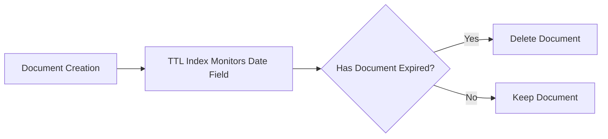

# MongoDB TTL Indexes

Time-To-Live (TTL) indexes are a special type of index in MongoDB that allows you to automatically remove documents from a collection after a specified amount of time. This is particularly useful for managing temporary data, session information, logs, or any data that needs to be automatically purged after a certain period.

## What Are TTL Indexes?

TTL indexes provide a way to set an expiration time for documents. When that time is reached, MongoDB automatically removes those documents. This feature helps in:

- Managing cache data
- Handling session information
- Cleaning up logs and temporary records
- Implementing data retention policies

## How TTL Indexes Work

A TTL index works by:

1. Creating a special single-field index on a date field
2. Specifying an expiration time in seconds
3. MongoDB's background thread then periodically checks and removes expired documents



## Creating a TTL Index

To create a TTL index, use the `createIndex()` method with the `expireAfterSeconds` option:

```javascript
db.collection.createIndex(
  { "lastModifiedDate": 1 },
  { expireAfterSeconds: 3600 } // Documents expire after 1 hour (3600 seconds)
)
```

### Key Points About TTL Indexes

- The indexed field **must** be a date or an array containing date values
- If the field is an array, MongoDB uses the lowest (earliest) date for expiration
- The expiration time is calculated by adding the `expireAfterSeconds` value to the indexed date field value
- TTL indexes cannot be compound indexes (they must be single-field indexes)
- The expiration of documents is not immediate; the TTL monitor runs every 60 seconds

## Practical Examples

### Example 1: Managing User Sessions

Let's create a sessions collection that automatically removes user sessions after 30 minutes of inactivity:

```javascript
// Create sessions collection
db.createCollection("sessions")

// Create TTL index on the lastActivity field
db.sessions.createIndex(
  { "lastActivity": 1 },
  { expireAfterSeconds: 1800 } // 30 minutes = 1800 seconds
)

// Insert a session document
db.sessions.insertOne({
  "userId": "user123",
  "sessionId": "abc123xyz456",
  "lastActivity": new Date(), // Current time
  "data": {
    "authenticated": true,
    "preferences": { "language": "en" }
  }
})
```

When a user interacts with our application, we would update the `lastActivity` field:

```javascript
// Update the lastActivity timestamp when user performs an action
db.sessions.updateOne(
  { "sessionId": "abc123xyz456" },
  { $set: { "lastActivity": new Date() } }
)
```

This session document will be automatically deleted 30 minutes after the last update to its `lastActivity` field.

### Example 2: Implementing a Log Rotation System

Let's create a logs collection that keeps error logs for 7 days:

```javascript
// Create logs collection
db.createCollection("errorLogs")

// Create TTL index on the createdAt field
db.errorLogs.createIndex(
  { "createdAt": 1 },
  { expireAfterSeconds: 604800 } // 7 days = 604800 seconds
)

// Insert a log entry
db.errorLogs.insertOne({
  "level": "ERROR",
  "message": "Failed to connect to payment gateway",
  "stack": "Error: Connection timeout at paymentService.js:123",
  "createdAt": new Date()
})
```

These log documents will be automatically deleted 7 days after their creation.

## Modifying TTL Indexes

You can change the expiration time of an existing TTL index using the `collMod` command:

```javascript
db.runCommand({
  "collMod": "sessions",
  "index": {
    "keyPattern": { "lastActivity": 1 },
    "expireAfterSeconds": 3600 // Changed to 1 hour
  }
})
```

## Using a Future Date for Expiration

Instead of using `expireAfterSeconds`, you can store a future expiration date directly in your documents:

```javascript
// Create TTL index with expireAfterSeconds set to 0
db.temporaryData.createIndex(
  { "expiresAt": 1 },
  { expireAfterSeconds: 0 }
)

// Insert a document with a specific expiration date
const futureDate = new Date();
futureDate.setDate(futureDate.getDate() + 3); // 3 days from now

db.temporaryData.insertOne({
  "data": "Some temporary information",
  "expiresAt": futureDate
})
```

With `expireAfterSeconds` set to 0, MongoDB will use the exact date in the `expiresAt` field as the expiration time.

## Limitations of TTL Indexes

- They don't guarantee immediate removal when documents expire (the TTL monitor runs every 60 seconds)
- The precision is limited to seconds, not milliseconds
- TTL indexes can only be single-field indexes
- They cannot be used on the `_id` field
- Hidden indexes cannot be TTL indexes
- Capped collections don't support TTL indexes

## Best Practices

1. **Choose the right field**: Use a field that naturally represents when the document should expire
2. **Index efficiency**: Remember that TTL indexes are normal indexes for queries too, so they follow the same performance considerations
3. **Consider server load**: If you expect a large number of documents to expire simultaneously, it might impact server performance
4. **Monitor index creation**: On large collections, creating a TTL index might take time
5. **Plan for grace periods**: Since deletion isn't immediate, build in a grace period if precise timing is critical

## Summary

TTL indexes in MongoDB provide an elegant solution for automatically managing data with a limited lifespan. They eliminate the need to write custom code or scheduled jobs for cleaning up expired data. By setting up the appropriate TTL index, you can ensure your database stays clean and your application remains performant.

Some key takeaways:
- TTL indexes automatically remove documents after a specified period
- They require a date field to determine when documents expire
- The TTL monitor runs every 60 seconds to check for expired documents
- They're ideal for session data, logs, temporary records, and implementing data retention policies

## Exercises

1. Create a TTL index for a `notifications` collection that deletes read notifications after 30 days.
2. Implement a caching system using MongoDB with TTL indexes that automatically expires items after 12 hours.
3. Create a collection for password reset tokens that expire after 1 hour.
4. Set up a logs collection with different retention policies based on log severity (e.g., ERROR logs kept for 30 days, INFO logs for 7 days).

## Additional Resources

- [MongoDB Documentation on TTL Indexes](https://www.mongodb.com/docs/manual/core/index-ttl/)
- [MongoDB Blog: TTL Indexes in MongoDB](https://www.mongodb.com/blog/post/mongodb-time-series-collections)
- [Database Indexing Strategies](https://www.mongodb.com/docs/manual/applications/indexes/)