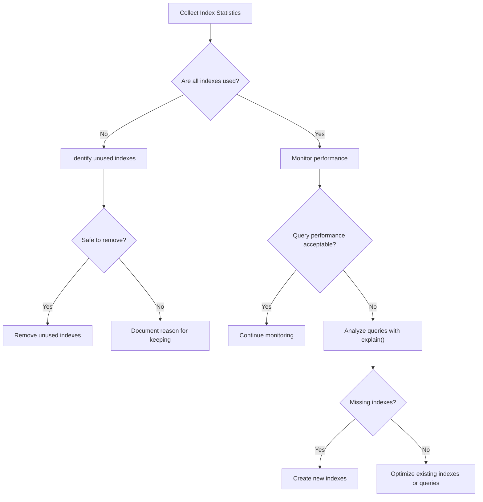

# MongoDB Index Statistics

Understanding how your indexes are performing is crucial for database optimization. MongoDB provides various tools and commands to analyze index statistics, helping you make informed decisions about index creation, modification, or removal. This guide will walk you through the process of gathering and interpreting MongoDB index statistics.

## Introduction to Index Statistics

Index statistics in MongoDB provide insights into how your indexes are being used, their size, and their overall impact on your database performance. By analyzing these statistics, you can:

- Identify unused indexes that can be safely removed
- Discover queries that might benefit from additional indexes
- Determine if your existing indexes are optimally structured
- Understand the storage impact of your indexes

## Basic Index Information Commands

### Listing All Indexes

Before diving into detailed statistics, you'll need to know what indexes exist in your collection. You can use the `getIndexes()` method for this purpose:

```javascript
db.collection.getIndexes()
```

**Example Output:**

```json
[
  {
    "v" : 2,
    "key" : { "_id" : 1 },
    "name" : "_id_",
    "ns" : "mydb.users"
  },
  {
    "v" : 2,
    "key" : { "email" : 1 },
    "name" : "email_1",
    "ns" : "mydb.users",
    "unique" : true
  },
  {
    "v" : 2,
    "key" : { "username" : 1, "age" : -1 },
    "name" : "username_1_age_-1",
    "ns" : "mydb.users"
  }
]
```

This output shows three indexes:
1. The default `_id` index
2. A unique index on the `email` field
3. A compound index on `username` (ascending) and `age` (descending)

### Index Size Information

To get information about the size of your indexes, you can use the `stats()` method:

```javascript
db.collection.stats()
```

Look for the `indexSizes` field in the output, which shows the size of each index in bytes:

```json
"indexSizes" : {
  "_id_" : 106496,
  "email_1" : 86016,
  "username_1_age_-1" : 118784
}
```

This tells you how much storage space each index is consuming.

## Detailed Index Statistics

### Using explain() to Understand Index Usage

The `explain()` method is a powerful tool for understanding how MongoDB uses indexes when executing your queries:

```javascript
db.collection.find({ username: "john_doe" }).explain("executionStats")
```

**Example Output:**

```json
{
  "queryPlanner" : {
    "plannerVersion" : 1,
    "namespace" : "mydb.users",
    "indexFilterSet" : false,
    "parsedQuery" : { "username" : { "$eq" : "john_doe" } },
    "winningPlan" : {
      "stage" : "FETCH",
      "inputStage" : {
        "stage" : "IXSCAN",
        "keyPattern" : { "username" : 1, "age" : -1 },
        "indexName" : "username_1_age_-1",
        // ...more details
      }
    },
    "rejectedPlans" : [ ]
  },
  "executionStats" : {
    "executionSuccess" : true,
    "nReturned" : 1,
    "executionTimeMillis" : 0,
    "totalKeysExamined" : 1,
    "totalDocsExamined" : 1,
    // ...more stats
  }
}
```

Key information to notice:
- `winningPlan.inputStage.stage`: Shows whether an index was used (`IXSCAN`) or if a collection scan was performed (`COLLSCAN`)
- `winningPlan.inputStage.indexName`: Name of the index used
- `executionStats.nReturned`: Number of documents returned
- `executionStats.totalKeysExamined`: Number of index entries examined
- `executionStats.totalDocsExamined`: Number of documents examined

### Index Usage Statistics with $indexStats

The `$indexStats` aggregation stage provides statistics about index usage:

```javascript
db.collection.aggregate([
  { $indexStats: {} }
])
```

**Example Output:**

```json
[
  {
    "name" : "_id_",
    "key" : { "_id" : 1 },
    "host" : "mongodb-server:27017",
    "accesses" : {
      "ops" : NumberLong(1050),
      "since" : ISODate("2023-07-10T15:23:45.678Z")
    }
  },
  {
    "name" : "email_1",
    "key" : { "email" : 1 },
    "host" : "mongodb-server:27017",
    "accesses" : {
      "ops" : NumberLong(825),
      "since" : ISODate("2023-07-10T15:23:45.678Z")
    }
  },
  {
    "name" : "username_1_age_-1",
    "key" : { "username" : 1, "age" : -1 },
    "host" : "mongodb-server:27017",
    "accesses" : {
      "ops" : NumberLong(521),
      "since" : ISODate("2023-07-10T15:23:45.678Z")
    }
  }
]
```

This output provides:
- `name`: The index name
- `key`: The fields and sort order of the index
- `accesses.ops`: Number of operations that used the index since the server was started or since the index was created
- `accesses.since`: When the server began tracking access statistics for the index

## Analyzing Index Efficiency

### Cardinality and Selectivity

Index efficiency is often related to the cardinality (uniqueness) of the indexed field(s). You can estimate this with the following aggregation:

```javascript
db.collection.aggregate([
  { $group: { _id: "$fieldName", count: { $sum: 1 } } },
  { $group: { _id: null, uniqueValues: { $sum: 1 }, totalDocuments: { $sum: "$count" } } },
  { $project: { 
      uniqueValues: 1, 
      totalDocuments: 1, 
      selectivity: { $divide: ["$uniqueValues", "$totalDocuments"] } 
    } 
  }
])
```

The higher the selectivity ratio (closer to 1), the more useful an index typically is for equality queries.

### Covered Queries

A covered query is one where all the fields in the query are part of an index, so MongoDB doesn't need to examine the actual documents. This is highly efficient. You can check if a query is covered by looking at the `executionStats`:

```javascript
db.collection.find({ username: "john_doe" }, { username: 1, age: 1, _id: 0 }).explain("executionStats")
```

If `totalDocsExamined` is 0 but `nReturned` is greater than 0, your query is covered by the index.

## Practical Examples

### Example 1: Identifying Unused Indexes

Let's identify any indexes that haven't been used recently:

```javascript
db.collection.aggregate([
  { $indexStats: {} },
  { $match: { "accesses.ops": { $lt: 10 } } },
  { $project: { name: 1, usage: "$accesses.ops" } }
])
```

This will return indexes that have been used less than 10 times, which might be candidates for removal.

### Example 2: Analyzing Query Performance

Let's say users are complaining about a slow search function. We can analyze the query:

```javascript
db.products.find({
  category: "electronics",
  price: { $lt: 500 },
  inStock: true
}).sort({ rating: -1 }).explain("executionStats")
```

After examining the results, we might discover that we need a compound index:

```javascript
db.products.createIndex({ category: 1, inStock: 1, price: 1, rating: -1 })
```

Now we can compare the execution statistics before and after adding the index:

```javascript
// Before adding index
// executionTimeMillis: 150, totalDocsExamined: 10000

// After adding index
// executionTimeMillis: 5, totalDocsExamined: 120
```

### Example 3: Index Size Management

If your database size is growing too large due to indexes, you can identify the largest ones:

```javascript
let stats = db.collection.stats();
let indexSizes = [];

for (let indexName in stats.indexSizes) {
  indexSizes.push({
    name: indexName,
    size: stats.indexSizes[indexName]
  });
}

// Sort by size in descending order
indexSizes.sort((a, b) => b.size - a.size);

// Print results
indexSizes.forEach(index => {
  print(`Index ${index.name}: ${(index.size / 1024 / 1024).toFixed(2)} MB`);
});
```

## Best Practices for Using Index Statistics

1. **Regularly Monitor Index Usage**: 
   Use `$indexStats` periodically to identify indexes that are rarely or never used.

2. **Review Execution Plans**: 
   Use `explain()` to verify that your queries are using the expected indexes.

3. **Balance Index Size vs. Query Performance**: 
   Indexes speed up queries but consume storage and slow down writes. Remove unused indexes.

4. **Look for Collection Scans**: 
   When `explain()` shows `COLLSCAN`, it means no index is being used, which might indicate a need for a new index.

5. **Monitor Index Build Progress**: 
   For large collections, use `db.currentOp()` to monitor the progress of index builds.

```javascript
db.currentOp(
  { $or: [
      { "command.createIndexes": { $exists: true } },
      { "op": "command", "query.createIndexes": { $exists: true } }
    ]
  }
)
```

## Visualizing Index Statistics

Understanding index usage patterns can be easier with visual representations. Here's a simple flowchart for the index evaluation process:



## Summary

MongoDB index statistics provide valuable insights into the performance and usage of your indexes. By regularly analyzing these statistics, you can optimize your database by:

- Adding indexes where they'll improve performance
- Removing unused indexes to save storage and improve write performance
- Restructuring indexes to better match your query patterns
- Identifying inefficient queries that might need optimization

Making data-driven decisions about your indexes based on actual usage statistics is key to maintaining an efficient MongoDB database.

## Additional Resources

- Learn to use MongoDB's built-in `Database Profiler` to capture more detailed query performance data
- Practice analyzing index statistics on a test database with various data volumes and query patterns
- Try implementing automated monitoring for index usage to receive alerts about unused indexes

## Practice Exercises

1. Find all unused indexes in a sample database that have not been accessed in the last week.
2. Identify a slow-running query in your application and use `explain()` to determine if adding or restructuring an index would help.
3. Calculate the total storage space used by indexes versus the data itself in a collection.
4. Create a script that generates a report of index usage statistics for all collections in a database.

By mastering MongoDB index statistics, you'll be able to make informed decisions that keep your database running efficiently as it scales.