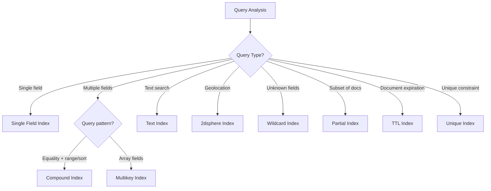

# MongoDB Index Types

## Introduction

Indexes are crucial components in any database system as they significantly improve the performance of read operations. In MongoDB, indexes work similarly to their counterparts in relational databases, acting as optimized data structures that help queries quickly locate and access the documents they need without scanning the entire collection.

In this guide, we'll explore the various index types offered by MongoDB and understand when and how to use each type to optimize your database operations.

## Basic Index Concepts

Before diving into specific index types, let's understand some foundational concepts:

- **Indexes** store a small portion of the collection's data in an easy-to-traverse form
- MongoDB automatically creates an index on the `_id` field of each collection
- Without appropriate indexes, MongoDB must perform collection scans (examining every document)
- While indexes improve query performance, they add overhead to write operations

## Single Field Indexes

Single field indexes are the simplest form of indexes in MongoDB, supporting queries that filter on a single field.

### Creating a Single Field Index

```javascript
db.collection.createIndex({ fieldName: 1 })  // Ascending index
db.collection.createIndex({ fieldName: -1 }) // Descending index
```

Where `1` represents ascending order and `-1` represents descending order.

### Example: Creating an Index on User Emails

```javascript
db.users.createIndex({ email: 1 })
```

### Querying with Single Field Index

```javascript
// This query will utilize the index we just created
db.users.find({ email: "user@example.com" })
```

Single field indexes are particularly useful when you frequently query on a specific field, such as finding users by email, products by SKU, or articles by publication date.

## Compound Indexes

When your queries regularly filter on multiple fields together, compound indexes provide enhanced performance by indexing a combination of fields.

### Creating a Compound Index

```javascript
db.collection.createIndex({ field1: 1, field2: -1, field3: 1 })
```

### Example: Index for User Search by Location and Age

```javascript
db.users.createIndex({ city: 1, age: -1 })

// This query can now use the compound index
db.users.find({ city: "New York", age: { $gt: 21 } })
```

### Important Considerations for Compound Indexes

1. **Index Prefix**: MongoDB can use a compound index for queries on prefixes of the index fields. For example, the index `{ a: 1, b: 1, c: 1 }` can support queries on:
   - `{ a: 1 }`
   - `{ a: 1, b: 1 }`
   - `{ a: 1, b: 1, c: 1 }`

2. **Sort Operations**: A compound index can support sorting operations if the query condition contains an equality condition on the field(s) preceding the sort field.

```javascript
// Index: { userId: 1, createdAt: -1 }
// This query can use the index for both filtering and sorting
db.posts.find({ userId: 123 }).sort({ createdAt: -1 })
```

## Multikey Indexes

MongoDB creates a multikey index when you index a field that contains an array value. For each element in the array, MongoDB creates a separate index key.

### Creating a Multikey Index

```javascript
// This is created like a regular index
db.collection.createIndex({ tags: 1 })
```

### Example: Indexing Blog Posts by Tags

```javascript
// Sample document
db.blog.insertOne({
  title: "Introduction to MongoDB Indexes",
  tags: ["mongodb", "database", "performance"]
})

// Create an index on the tags array field
db.blog.createIndex({ tags: 1 })

// Find all blog posts tagged with "mongodb"
db.blog.find({ tags: "mongodb" })
```

MongoDB automatically determines whether the index should be multikey based on the data, so the syntax is identical to creating a normal single field index.

## Text Indexes

Text indexes support text search queries on string content. MongoDB provides text indexes to support text search queries on string content.

### Creating a Text Index

```javascript
db.collection.createIndex({ content: "text" })
```

### Example: Searching Articles by Content

```javascript
// Create a text index on article content and title
db.articles.createIndex({ 
  title: "text", 
  content: "text" 
})

// Search for articles containing the word "mongodb"
db.articles.find({ $text: { $search: "mongodb" } })

// Search for a phrase
db.articles.find({ $text: { $search: "\"mongodb indexes\"" } })
```

### Text Index Features

1. **Stemming**: The text index performs stemming in English and other supported languages
2. **Stop Words**: Common words like "a", "the", "and" are ignored
3. **Case Insensitivity**: Text searches are not case-sensitive
4. **Diacritic Insensitivity**: Ignores diacritics like é, è, ê, etc.

### Weight Options

You can assign weights to specific fields to boost their importance in text search results:

```javascript
db.articles.createIndex(
  { title: "text", content: "text", keywords: "text" },
  { weights: { title: 10, content: 5, keywords: 3 } }
)
```

## Geospatial Indexes

MongoDB provides two types of geospatial indexes to support queries for geospatial coordinate data:

### 1. 2dsphere Index

Optimized for Earth-like spheres and supports queries that calculate geometries on a sphere.

```javascript
db.collection.createIndex({ location: "2dsphere" })
```

#### Example: Finding Restaurants Near a Location

```javascript
// Create a 2dsphere index
db.restaurants.createIndex({ location: "2dsphere" })

// Sample document with GeoJSON Point
db.restaurants.insertOne({
  name: "Delicious Diner",
  location: {
    type: "Point",
    coordinates: [-73.97, 40.77]  // [longitude, latitude]
  },
  cuisine: "American"
})

// Find restaurants within 1000 meters of a point
db.restaurants.find({
  location: {
    $near: {
      $geometry: {
        type: "Point",
        coordinates: [-73.98, 40.76]  // [longitude, latitude]
      },
      $maxDistance: 1000  // in meters
    }
  }
})
```

### 2. 2d Index

For planar geometry when storing data for flat surfaces.

```javascript
db.collection.createIndex({ location: "2d" })
```

2d indexes are primarily used for legacy applications or when exact spherical calculations aren't required.

## Hashed Indexes

Hashed indexes hash the values of a field to create more randomly distributed values. They're useful for:
- Sharding based on a field that may not distribute evenly
- Cases where the exact value doesn't matter, just the equality match

### Creating a Hashed Index

```javascript
db.collection.createIndex({ fieldName: "hashed" })
```

### Example: Preparing for Sharding Using userId

```javascript
db.users.createIndex({ userId: "hashed" })
```

Hashed indexes cannot support range-based queries efficiently, so they're best used for equality matches or when preparing a collection for sharded distribution.

## Wildcard Indexes

Wildcard indexes were introduced in MongoDB 4.2 to support queries against unknown or highly variable document fields or nested paths.

### Creating a Wildcard Index

```javascript
// Index all fields and subpaths
db.collection.createIndex({ "$**": 1 })

// Index specific paths and their subpaths
db.collection.createIndex({ "user.profile.$**": 1 })
```

### Example: Dynamic Product Attributes

```javascript
// Create a wildcard index for product attributes
db.products.createIndex({ "attributes.$**": 1 })

// Sample document with dynamic attributes
db.products.insertOne({
  name: "Smartphone",
  price: 599,
  attributes: {
    color: "black",
    storage: "128GB",
    display: {
      type: "OLED",
      size: 6.1,
      resolution: "1170 x 2532"
    }
  }
})

// Query by any attribute, even nested ones
db.products.find({ "attributes.display.type": "OLED" })
```

Wildcard indexes are particularly useful for:
- Collections with unpredictable field names
- Supporting arbitrary queries on documents with nested fields
- Schema-less designs where document structure varies significantly

## Partial Indexes

Partial indexes only index documents that meet a specified filter expression, reducing index size and improving performance.

### Creating a Partial Index

```javascript
db.collection.createIndex(
  { fieldName: 1 },
  { partialFilterExpression: { condition: true } }
)
```

### Example: Indexing Only Active Users

```javascript
// Create a partial index only for active users
db.users.createIndex(
  { lastName: 1, firstName: 1 },
  { partialFilterExpression: { active: true } }
)

// This query can use the partial index
db.users.find({ lastName: "Smith", active: true })

// This query cannot use the partial index because it doesn't
// include the active:true condition
db.users.find({ lastName: "Smith" })
```

Partial indexes are ideal when:
- Only a subset of documents are frequently queried
- You want to avoid indexing documents that don't need to be indexed
- You want to reduce index storage requirements and maintenance overhead

## TTL Indexes

Time-to-Live (TTL) indexes automatically remove documents from a collection after a specified amount of time or at a specific clock time.

### Creating a TTL Index

```javascript
db.collection.createIndex(
  { lastModifiedDate: 1 },
  { expireAfterSeconds: 3600 }  // 1 hour
)
```

### Example: Automatically Expire Session Data

```javascript
// Create a TTL index on session collection
db.sessions.createIndex(
  { createdAt: 1 },
  { expireAfterSeconds: 86400 }  // 24 hours
)

// Insert a session document
db.sessions.insertOne({
  userId: "user123",
  createdAt: new Date(),
  data: { /* session data */ }
})
```

TTL indexes are particularly useful for:
- Session data that should expire
- Temporary logs or metrics
- Cache data with a defined lifetime
- Event data that's only relevant for a limited time

## Unique Indexes

Unique indexes ensure that the indexed fields don't store duplicate values, similar to unique constraints in relational databases.

### Creating a Unique Index

```javascript
db.collection.createIndex({ email: 1 }, { unique: true })
```

### Example: Ensuring Unique Usernames

```javascript
// Create a unique index on username field
db.users.createIndex({ username: 1 }, { unique: true })

// This will succeed
db.users.insertOne({ username: "jsmith", name: "John Smith" })

// This will fail with a duplicate key error
db.users.insertOne({ username: "jsmith", name: "Jane Smith" })
```

You can also combine unique constraints with other index types, such as compound indexes:

```javascript
db.companies.createIndex(
  { companyId: 1, location: 1 },
  { unique: true }
)
```

This ensures that the combination of `companyId` and `location` is unique, even if individual values repeat.

## Index Properties and Options

When creating indexes, you can specify various properties to control their behavior:

### Common Index Options

```javascript
db.collection.createIndex(
  { fieldName: 1 },
  {
    background: true,           // Build in the background (MongoDB < 4.2)
    name: "customIndexName",    // Custom name for the index
    sparse: true,               // Only index documents where the field exists
    unique: true,               // Enforce uniqueness
    expireAfterSeconds: 3600,   // TTL index: expire after 1 hour
    collation: { locale: "en" } // Language-specific collation rules
  }
)
```

## Choosing the Right Index Type

Here's a quick reference to help you choose the appropriate index type:



## Best Practices for MongoDB Indexes

1. **Don't over-index**: Indexes consume disk space and impact write performance
2. **Analyze query patterns**: Use `explain()` to understand how your queries run
3. **Compound index ordering**: Place equality fields before range/sort fields
4. **Cover your queries**: Create indexes that include all fields referenced in the query for covered queries
5. **Consider background indexing** for production systems (`MongoDB <4.2`)
6. **Monitor index usage**: Remove indexes that aren't being used

## Example: Comprehensive Index Strategy for a Blog Platform

Let's apply our knowledge to design indexes for a blog platform:

```javascript
// Collection: users
db.users.createIndex({ email: 1 }, { unique: true })
db.users.createIndex({ username: 1 }, { unique: true })
db.users.createIndex({ 
  "profile.fullName": "text", 
  "profile.bio": "text" 
})

// Collection: posts
db.posts.createIndex({ authorId: 1, createdAt: -1 }) // Author's posts by date
db.posts.createIndex({ tags: 1, createdAt: -1 })    // Posts by tag and date
db.posts.createIndex({ 
  title: "text", 
  content: "text" 
}, { 
  weights: { title: 10, content: 5 } 
})

// Collection: comments
db.comments.createIndex({ postId: 1, createdAt: 1 }) // Comments per post by date
db.comments.createIndex({ userId: 1 })              // Comments by user

// Collection: sessions (with auto-expiry)
db.sessions.createIndex(
  { createdAt: 1 },
  { expireAfterSeconds: 86400 }
)
```

## Summary

MongoDB offers a rich variety of index types to optimize different query patterns:

- **Single Field Indexes** for basic queries on one field
- **Compound Indexes** for queries that filter or sort by multiple fields
- **Multikey Indexes** for array fields
- **Text Indexes** for full-text search capabilities
- **Geospatial Indexes** for location-based queries
- **Hashed Indexes** for sharding and equality matches
- **Wildcard Indexes** for dynamic schema designs
- **Partial Indexes** to reduce overhead by indexing only relevant documents
- **TTL Indexes** for automatic document expiration
- **Unique Indexes** to enforce data integrity

Choosing the right index type and structure for your application's query patterns is crucial for optimal MongoDB performance. Always analyze your actual query patterns and create indexes that support those specific patterns.

## Exercises

1. Create a single field index on a collection and use `explain()` to verify that it's being used.
2. Design a compound index strategy for a product catalog that needs to support:
   - Finding products by category and sorting by price
   - Finding products by brand and sorting by rating
3. Implement a text index on a collection with weighted fields and test searching with various terms.
4. Create a geospatial index and write queries to find locations within a specified distance.
5. Design a partial index that only indexes "premium" users and verify it's only being used for qualifying queries.

## Additional Resources

- [MongoDB Index Documentation](https://www.mongodb.com/docs/manual/indexes/)
- [Query Optimization](https://www.mongodb.com/docs/manual/core/query-optimization/)
- [Analyze Query Performance](https://www.mongodb.com/docs/manual/tutorial/analyze-query-plan/)
- [Indexing Strategies](https://www.mongodb.com/docs/manual/applications/indexes/)

Remember that the best index structure depends on your specific query patterns, data distribution, and application requirements. Regular monitoring and adjustment of your indexing strategy is key to maintaining optimal database performance.