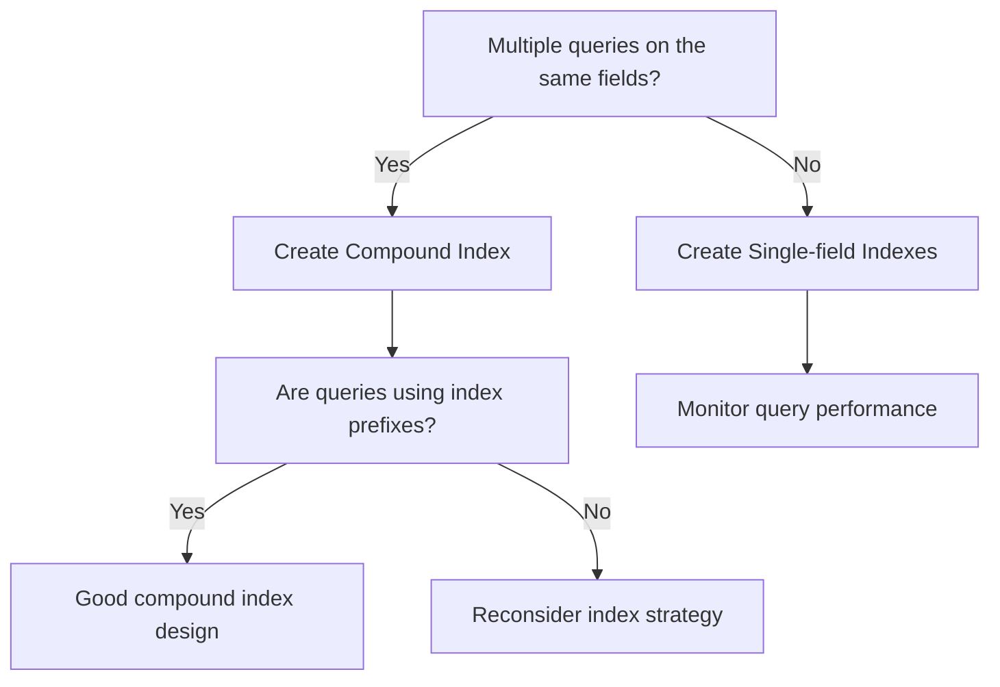

# MongoDB Compound Indexes

In MongoDB, compound indexes are powerful tools that allow you to optimize queries that filter on multiple fields. Instead of using multiple single-field indexes, a compound index can provide better performance by creating one index structure that covers multiple fields in a specific order.

## Introduction to Compound Indexes

A compound index is an index on two or more fields. Think of it as an organized phonebook that's sorted first by last name, then by first name. This organization allows quick lookups when you need to find someone by both their last and first names.

In MongoDB, compound indexes follow the same principle - they organize data based on multiple fields in a specific order, allowing for faster query execution when filtering on those fields.

## Why Use Compound Indexes?

There are several benefits to using compound indexes:

1. **Improved query performance** on multiple fields
2. **Reduced index storage requirements** compared to creating separate indexes
3. **Support for sorting** on multiple fields
4. **Can cover more query patterns** than single-field indexes

## Creating a Compound Index

Let's start by creating a compound index. The syntax is similar to single-field indexes, but you specify multiple fields:

```javascript
db.collection.createIndex({ field1: 1, field2: -1, field3: 1 })
```

The numbers (1 or -1) indicate the sort order for the index:
- `1`: ascending order
- `-1`: descending order

### Example: Creating a Compound Index

Let's create a sample collection for users and add a compound index:

```javascript
// Create a users collection with sample data
db.users.insertMany([
  { name: "John", age: 25, city: "New York", joined: new Date("2020-01-15") },
  { name: "Sarah", age: 32, city: "Boston", joined: new Date("2019-05-10") },
  { name: "Mike", age: 28, city: "Chicago", joined: new Date("2021-03-22") },
  { name: "Emily", age: 25, city: "New York", joined: new Date("2020-07-08") }
]);

// Create a compound index on city and age fields
db.users.createIndex({ city: 1, age: 1 })
```

This creates a compound index that organizes documents first by city (in ascending order) and then by age (also in ascending order).

## Index Order Matters

The order of fields in a compound index is crucial. MongoDB can use a compound index for queries that include:

1. The prefix fields of the index
2. Multiple fields specified in the index, even if they're not in the same order
3. A subset of fields from the beginning of the index

### Prefix Rule

A query can use a compound index if it includes the **prefix** of the indexed fields. For example, if you have an index on `{ a: 1, b: 1, c: 1 }`:

- A query on field `a` can use this index
- A query on fields `a` and `b` can use this index
- A query on fields `a`, `b`, and `c` can use this index

But:
- A query on just field `b` cannot use this index
- A query on fields `b` and `c` cannot use this index

Let's illustrate this with our users collection:

```javascript
// These queries can use the { city: 1, age: 1 } index
db.users.find({ city: "New York" });
db.users.find({ city: "New York", age: 25 });

// This query cannot use the index (no prefix field)
db.users.find({ age: 25 });
```

## Using Compound Indexes for Sorting

Compound indexes are particularly valuable for queries that sort results. When the sort operation matches the index order or its reverse, MongoDB can use the index for efficient sorting.

```javascript
// This sort operation is efficient because it matches our compound index
db.users.find().sort({ city: 1, age: 1 });

// This sort operation is also efficient (reverse order)
db.users.find().sort({ city: -1, age: -1 });

// This mixed sort is not efficient with our current index
db.users.find().sort({ city: 1, age: -1 });
```

For the mixed sort pattern, you would need to create a specific index:

```javascript
db.users.createIndex({ city: 1, age: -1 });
```

## ESR Rule (Equality, Sort, Range)

When designing compound indexes, follow the ESR rule for optimal performance:

1. **E**quality fields first (exact matches)
2. **S**ort fields next
3. **R**ange query fields last

Let's see why this matters with an example:

```javascript
// Example query with equality, sorting, and range
db.users.find(
  { city: "New York", age: { $gt: 20 } }
).sort({ joined: 1 })
```

For this query, an optimal index would be:

```javascript
db.users.createIndex({ city: 1, joined: 1, age: 1 });
```

Here:
- `city` is an equality match (comes first)
- `joined` is used for sorting (comes second)
- `age` is a range query with `$gt` (comes last)

## Covered Queries with Compound Indexes

A covered query is one where all the fields in the query are part of an index, so MongoDB doesn't need to look up the actual documents. This significantly improves performance.

```javascript
// Create a compound index that includes all needed fields
db.users.createIndex({ city: 1, age: 1, name: 1 });

// This is a covered query - all required fields are in the index
db.users.find(
  { city: "New York", age: 25 },
  { _id: 0, name: 1, city: 1, age: 1 }
);
```

In this example, the query is covered because:
1. All fields in the query conditions (`city` and `age`) are in the index
2. All fields in the projection (`name`, `city`, and `age`) are in the index
3. We exclude `_id` from the results (it's included by default)

## Real-world Examples

### E-commerce Product Catalog

Consider an e-commerce website with a product catalog:

```javascript
// Sample product data
db.products.insertMany([
  { 
    name: "Wireless Headphones",
    category: "Electronics",
    brand: "AudioMax",
    price: 89.99,
    rating: 4.5,
    inStock: true
  },
  {
    name: "Running Shoes",
    category: "Sports",
    brand: "SpeedRunner",
    price: 120.00,
    rating: 4.8,
    inStock: true
  }
]);
```

Common queries might include:

1. Products in a specific category with filtering by price range
2. In-stock products of a specific brand, sorted by rating
3. Products in a price range sorted by rating

For these query patterns, we could create these compound indexes:

```javascript
// For category + price range queries
db.products.createIndex({ category: 1, price: 1 });

// For brand + availability queries with rating sort
db.products.createIndex({ brand: 1, inStock: 1, rating: -1 });

// For price range queries with rating sort
db.products.createIndex({ price: 1, rating: -1 });
```

### User Activity Logging

For an application tracking user activities:

```javascript
// Sample user activity logs
db.activityLogs.insertMany([
  { 
    userId: "user123",
    action: "login",
    timestamp: new Date("2023-09-15T10:30:00Z"),
    device: "mobile",
    status: "success"
  },
  {
    userId: "user456",
    action: "purchase",
    timestamp: new Date("2023-09-15T14:22:00Z"),
    device: "desktop",
    amount: 245.99,
    status: "completed"
  }
]);
```

Efficient compound indexes might include:

```javascript
// For querying user activities within a time range
db.activityLogs.createIndex({ userId: 1, timestamp: -1 });

// For analyzing actions by status
db.activityLogs.createIndex({ action: 1, status: 1, timestamp: -1 });

// For device-specific user activity
db.activityLogs.createIndex({ userId: 1, device: 1, timestamp: -1 });
```

## Index Size and Performance Considerations

While compound indexes are powerful, they come with tradeoffs:

1. **Index size**: Each additional index consumes storage space
2. **Write performance**: More indexes mean slower write operations
3. **Index limit**: MongoDB has a limit on the number of indexes per collection

```javascript
// Check the size of indexes in a collection
db.users.stats().indexSizes;
```

## Best Practices for Compound Indexes

1. **Analyze your query patterns** before creating indexes
2. **Follow the ESR rule** (Equality, Sort, Range)
3. **Create indexes that support your most common queries**
4. **Don't create redundant indexes** (e.g., if you have an index on `{a:1, b:1}`, you don't need one on just `{a:1}`)
5. **Use the `explain()` method** to verify index usage
6. **Regularly review and update your indexes** as application needs change

```javascript
// Use explain() to check index usage
db.users.find({ city: "New York", age: 25 }).explain("executionStats");
```

## Compound Indexes vs. Multiple Single-field Indexes

One common question is whether to use compound indexes or multiple single-field indexes.



For example, if you frequently query with both `city` AND `age` conditions, a compound index is better. If you sometimes query by just `city` and sometimes just by `age` (but rarely both), then two separate indexes might be more appropriate.

## Summary

Compound indexes in MongoDB are powerful tools for optimizing queries that involve multiple fields. They:

- Allow efficient filtering on multiple fields
- Support sorting operations when designed correctly
- Follow the ESR rule for optimal performance
- Can provide coverage for queries, eliminating document lookups
- Need careful planning to balance performance needs with resource usage

By understanding the principles of compound indexes and analyzing your application's query patterns, you can significantly improve database performance.

## Exercises

1. Create a compound index for an employee collection that would optimize queries filtering on department and sorting by salary.
2. Explain how you would design indexes for a blog platform that commonly filters posts by author, tags, and publication date.
3. Given a compound index on `{a:1, b:-1, c:1}`, list which of these queries could use the index efficiently:
   - `db.collection.find({a: "value"})`
   - `db.collection.find({b: "value"})`
   - `db.collection.find({a: "value", c: "value"})`
   - `db.collection.find({a: "value", b: "value"}).sort({c: 1})`

## Additional Resources

- [MongoDB Documentation on Compound Indexes](https://docs.mongodb.com/manual/core/index-compound/)
- [MongoDB University Courses](https://university.mongodb.com/)
- [MongoDB Compass - Visual Index Management](https://www.mongodb.com/products/compass)