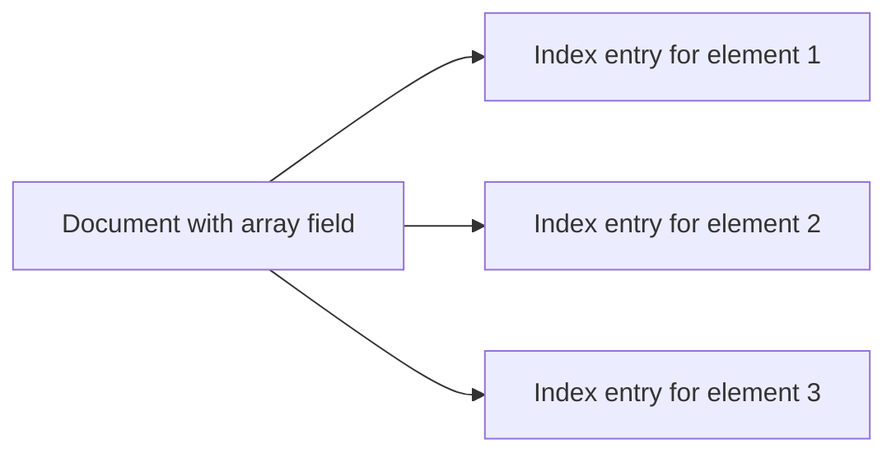

# MongoDB Multikey Indexes

When working with arrays in MongoDB, you need a special indexing strategy to efficiently query array elements. This is where multikey indexes come into play. Let's explore how they work and how to use them effectively.

## What Are Multikey Indexes?

A multikey index is a MongoDB index created on a field that contains an array. MongoDB automatically creates a separate index entry for **each element** in the array, making it efficient to query for individual array elements.

For example, if you have a document with an array field containing three elements, MongoDB creates three separate index entries – one for each element in the array.



## How Multikey Indexes Work

When you create an index on an array field, MongoDB automatically converts it to a multikey index. You don't need to specify any special options or syntax – MongoDB detects array fields and handles them appropriately.

Let's look at how multikey indexes are created and used:

### Creating a Multikey Index

You create a multikey index the same way you create a regular index, but on a field that contains array values:

```javascript
db.products.createIndex({ "tags": 1 });
```

This command creates an index on the `tags` field, which contains an array of values. MongoDB automatically recognizes that `tags` is an array field and creates a multikey index.

## When to Use Multikey Indexes

Multikey indexes are ideal for:

1. Querying array elements directly
2. Finding documents that contain specific array values
3. Improving the performance of array-related queries

## Examples of Multikey Indexes

Let's work through some practical examples to understand how multikey indexes function.

### Example 1: Basic Multikey Index

Consider a collection of product documents:

```javascript
db.products.insertMany([
  {
    name: "Smartphone",
    tags: ["electronics", "mobile", "gadget"],
    price: 699.99
  },
  {
    name: "Laptop",
    tags: ["electronics", "computer", "gadget"],
    price: 1299.99
  },
  {
    name: "Headphones",
    tags: ["electronics", "audio", "accessories"],
    price: 149.99
  }
]);
```

Create a multikey index on the `tags` array field:

```javascript
db.products.createIndex({ "tags": 1 });
```

Now you can efficiently query products by tag:

```javascript
// Find all products with the "audio" tag
db.products.find({ "tags": "audio" });

// Output
// { "_id" : ObjectId("..."), "name" : "Headphones", "tags" : ["electronics", "audio", "accessories"], "price" : 149.99 }
```

### Example 2: Compound Multikey Index

You can also create compound indexes that include array fields:

```javascript
db.products.createIndex({ "tags": 1, "price": -1 });
```

This index allows for efficient queries that filter by tag and sort by price:

```javascript
// Find all electronic products, sorted by price in descending order
db.products.find({ "tags": "electronics" }).sort({ "price": -1 });

// Output
// { "_id" : ObjectId("..."), "name" : "Laptop", "tags" : ["electronics", "computer", "gadget"], "price" : 1299.99 }
// { "_id" : ObjectId("..."), "name" : "Smartphone", "tags" : ["electronics", "mobile", "gadget"], "price" : 699.99 }
// { "_id" : ObjectId("..."), "name" : "Headphones", "tags" : ["electronics", "audio", "accessories"], "price" : 149.99 }
```

## Multikey Index Limitations

While multikey indexes are powerful, they have some important limitations to keep in mind:

1. **At most one array field**: A compound index can have at most one field that contains an array. For example, if both `tags` and `categories` are arrays, you cannot create a compound index on both fields.

```javascript
// This will NOT work if both fields are arrays
db.products.createIndex({ "tags": 1, "categories": 1 });
```

2. **Increased index size**: For each array element, there's a separate index entry, which can significantly increase the index size for large arrays.

3. **Write performance impact**: Inserting or updating documents with indexed arrays requires more work since multiple index entries must be updated.

## Real-world Use Case: Product Search System

Let's look at a practical example of how multikey indexes can be used in a product search system:

### Product Catalog with Multiple Attributes

Consider an e-commerce platform with a product catalog where products can have multiple categories, features, and target audience groups:

```javascript
db.products.insertMany([
  {
    name: "Gaming Laptop",
    categories: ["electronics", "computers", "gaming"],
    features: ["high-performance", "RGB lighting", "dedicated GPU"],
    audience: ["gamers", "professionals", "enthusiasts"],
    price: 1899.99
  },
  {
    name: "Digital Camera",
    categories: ["electronics", "photography"],
    features: ["high-resolution", "optical zoom", "image stabilization"],
    audience: ["photographers", "travelers", "hobbyists"],
    price: 799.99
  },
  {
    name: "Wireless Earbuds",
    categories: ["electronics", "audio", "accessories"],
    features: ["noise-cancellation", "waterproof", "bluetooth"],
    audience: ["music-lovers", "commuters", "athletes"],
    price: 149.99
  }
]);
```

To optimize search functionality, you might create the following indexes:

```javascript
// Create multikey index on categories
db.products.createIndex({ "categories": 1 });

// Create multikey index on features
db.products.createIndex({ "features": 1 });

// Create multikey index on audience with price sorting
db.products.createIndex({ "audience": 1, "price": -1 });
```

Now you can efficiently run queries like:

```javascript
// Find all products for athletes
db.products.find({ "audience": "athletes" });

// Find all products with noise-cancellation feature
db.products.find({ "features": "noise-cancellation" });

// Find all products for gamers, sorted by price (high to low)
db.products.find({ "audience": "gamers" }).sort({ "price": -1 });
```

## Checking if an Index is Multikey

You can check if an index is multikey by running the `getIndexes()` method and looking for the `multikey` field:

```javascript
db.products.getIndexes();

// Sample output
// [
//   {
//     "v" : 2,
//     "key" : { "_id" : 1 },
//     "name" : "_id_"
//   },
//   {
//     "v" : 2,
//     "key" : { "tags" : 1 },
//     "name" : "tags_1",
//     "multikey" : true  // This indicates a multikey index
//   }
// ]
```

## Best Practices for Multikey Indexes

To get the most out of multikey indexes, follow these best practices:

1. **Index Selectivity**: Create multikey indexes on array fields with high selectivity (fields whose values differ significantly across documents).

2. **Limit Array Size**: Try to keep the number of array elements reasonably small, as each element creates an additional index entry.

3. **Monitor Index Size**: Keep an eye on the size of multikey indexes, especially for collections with large arrays.

4. **Consider Coverage**: Design queries to leverage index coverage when possible by including the indexed fields in projections.

5. **Be Mindful of Compound Indexes**: Remember the limitation that a compound index can have at most one array field.

## Summary

Multikey indexes are a powerful feature in MongoDB that optimize queries on array fields by creating separate index entries for each array element. They're created automatically when you index a field that contains array values, and they work seamlessly with MongoDB's query engine.

Key points to remember:
- Multikey indexes are created automatically for array fields
- They enable efficient querying of array elements
- A compound index can have at most one field that's an array
- They increase the index size but significantly improve query performance for array-related operations

## Additional Resources and Exercises

### Exercises:

1. **Create a blog post collection**: Design a schema for blog posts with tags as an array, create a multikey index on tags, and write queries to find posts by tag.

2. **Analyze multikey index performance**: Create a collection with array fields, add multikey indexes, and use the `explain()` method to see how the indexes improve query performance.

3. **Explore multikey index limitations**: Try creating a compound index with two array fields and observe the error message.

### Resources:

- [MongoDB Multikey Index Documentation](https://www.mongodb.com/docs/manual/core/index-multikey/)
- [MongoDB Query Optimization Guide](https://www.mongodb.com/docs/manual/core/query-optimization/)
- [MongoDB Indexing Strategies](https://www.mongodb.com/docs/manual/applications/indexes/)

With multikey indexes, you can efficiently work with arrays in MongoDB, making your applications faster and more responsive when querying array fields.