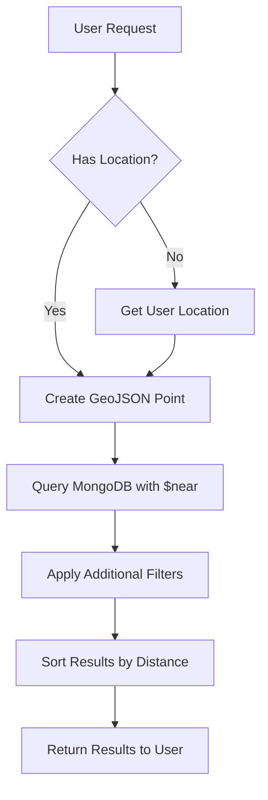

# MongoDB Geospatial Indexes

In today's connected world, location data has become increasingly important for applications ranging from retail store locators to ride-sharing services. MongoDB provides powerful support for geospatial data through specialized indexes that optimize queries involving geographic coordinates.

## What are Geospatial Indexes?

Geospatial indexes are special indexes in MongoDB that efficiently store and query location-based data. They allow you to:

- Find locations within a specific distance
- Identify points contained within geometric shapes
- Calculate distances between locations
- Sort results by proximity to a specific point

MongoDB offers two primary types of geospatial indexes:

1. **2D Indexes**: For planar (flat) geometry
2. **2dsphere Indexes**: For spherical geometry calculations (Earth-like queries)

## 2D Indexes vs. 2dsphere Indexes

Before diving into examples, let's understand the key differences:

| Feature | 2D Index | 2dsphere Index |
|---------|----------|----------------|
| Geometry | Flat plane | Spherical (Earth-like) |
| Coordinates | [x, y] | GeoJSON or legacy pairs |
| Distance calculation | Euclidean (straight line) | Great circle (over Earth's surface) |
| Best for | Simple applications, gaming | Real-world mapping applications |

## Creating Geospatial Indexes

### 2D Index

The 2D index works with legacy coordinate pairs `[longitude, latitude]`:

```js
db.places.createIndex({ location: "2d" })
```

### 2dsphere Index

The 2dsphere index works with GeoJSON objects and is ideal for real-world geographic applications:

```js
db.places.createIndex({ location: "2dsphere" })
```

## GeoJSON Format

MongoDB's 2dsphere indexes use the GeoJSON format to represent geometric shapes. The basic format is:

```js
{
  type: "<GeoJSON type>",
  coordinates: <coordinates>
}
```

Common GeoJSON types include:

- **Point**: A single location
- **LineString**: A line between points
- **Polygon**: A closed shape
- **MultiPoint**, **MultiLineString**, **MultiPolygon**: Collections of their respective types

## Practical Example: Building a Store Locator

Let's build a simple store locator application. First, we'll create a collection of stores with location data:

```js
db.stores.insertMany([
  {
    name: "Central Park Store",
    location: {
      type: "Point",
      coordinates: [-73.968285, 40.785091] // [longitude, latitude]
    },
    category: "electronics"
  },
  {
    name: "Downtown Store",
    location: {
      type: "Point",
      coordinates: [-73.997456, 40.725606]
    },
    category: "clothing"
  },
  {
    name: "Brooklyn Store",
    location: {
      type: "Point",
      coordinates: [-73.949721, 40.652714]
    },
    category: "electronics"
  }
])
```

Next, let's create a 2dsphere index on the location field:

```js
db.stores.createIndex({ location: "2dsphere" })
```

### Finding Nearby Stores

Now that we have our data and index, we can find stores near a specific location using the `$near` operator:

```js
// Find stores within 5 kilometers of Times Square
db.stores.find({
  location: {
    $near: {
      $geometry: {
        type: "Point",
        coordinates: [-73.9857, 40.7484] // Times Square
      },
      $maxDistance: 5000 // in meters
    }
  }
})
```

Output:
```
{
  "_id": ObjectId("..."),
  "name": "Downtown Store",
  "location": {
    "type": "Point",
    "coordinates": [-73.997456, 40.725606]
  },
  "category": "clothing"
}
{
  "_id": ObjectId("..."),
  "name": "Central Park Store",
  "location": {
    "type": "Point",
    "coordinates": [-73.968285, 40.785091]
  },
  "category": "electronics"
}
```

### Finding Stores Within a Region

We can also find stores within a specific polygon (region):

```js
// Find stores within Manhattan area
db.stores.find({
  location: {
    $geoWithin: {
      $geometry: {
        type: "Polygon",
        coordinates: [[
          [-74.0107, 40.7140], // Battery Park
          [-73.9770, 40.7529], // Empire State
          [-73.9681, 40.7830], // Central Park
          [-74.0170, 40.7580], // Hudson Yards
          [-74.0107, 40.7140]  // Back to Battery Park
        ]]
      }
    }
  }
})
```

Output:
```
{
  "_id": ObjectId("..."),
  "name": "Central Park Store",
  "location": {
    "type": "Point",
    "coordinates": [-73.968285, 40.785091]
  },
  "category": "electronics"
}
{
  "_id": ObjectId("..."),
  "name": "Downtown Store",
  "location": {
    "type": "Point",
    "coordinates": [-73.997456, 40.725606]
  },
  "category": "clothing"
}
```

## Compound Geospatial Queries

You can combine geospatial queries with regular queries. For example, to find electronics stores within 10km of Times Square:

```js
db.stores.find({
  location: {
    $near: {
      $geometry: {
        type: "Point",
        coordinates: [-73.9857, 40.7484]
      },
      $maxDistance: 10000
    }
  },
  category: "electronics"
})
```

Output:
```
{
  "_id": ObjectId("..."),
  "name": "Central Park Store",
  "location": {
    "type": "Point",
    "coordinates": [-73.968285, 40.785091]
  },
  "category": "electronics"
}
```

## Key Geospatial Query Operators

MongoDB provides several operators for geospatial queries:

| Operator | Description | Index Type |
|----------|-------------|------------|
| `$near` | Returns points from nearest to farthest | 2dsphere or 2d |
| `$geoWithin` | Returns points within a specified shape | 2dsphere or 2d |
| `$geoIntersects` | Returns geometries that intersect with the query geometry | 2dsphere only |
| `$nearSphere` | Similar to `$near` but always calculates distances on a sphere | 2dsphere or 2d |

## Performance Considerations

Geospatial indexes improve query performance dramatically, but keep in mind:

1. **Index Size**: Geospatial indexes can be larger than regular indexes
2. **Query Complexity**: Complex polygon queries can be resource-intensive
3. **Compound Indexes**: For frequent queries combining location with other fields, consider compound indexes

```js
// Example of a compound geospatial index
db.stores.createIndex({ location: "2dsphere", category: 1 })
```

## Real-World Applications

Geospatial indexes enable a wide range of location-aware features:

1. **Proximity search**: "Find restaurants within 2 miles of me"
2. **Geofencing**: "Alert me when I enter this area"
3. **Delivery zones**: "Is this address eligible for delivery?"
4. **Territory management**: "Which sales rep is responsible for this area?"

## Example: Delivery Zone Application

Let's implement a delivery zone checker:

```js
// Define delivery zones
db.deliveryZones.insertMany([
  {
    name: "Zone A",
    coverage: {
      type: "Polygon",
      coordinates: [[
        [-74.01, 40.71],
        [-73.96, 40.74],
        [-73.98, 40.77],
        [-74.02, 40.75],
        [-74.01, 40.71]
      ]]
    },
    fee: 2.99
  },
  {
    name: "Zone B",
    coverage: {
      type: "Polygon",
      coordinates: [[
        [-73.96, 40.74],
        [-73.91, 40.76],
        [-73.94, 40.79],
        [-73.98, 40.77],
        [-73.96, 40.74]
      ]]
    },
    fee: 3.99
  }
])

// Create index
db.deliveryZones.createIndex({ coverage: "2dsphere" })
```

Now we can check if a customer's address is within a delivery zone:

```js
// Check if an address is serviceable
function checkDeliveryZone(longitude, latitude) {
  const customerLocation = {
    type: "Point",
    coordinates: [longitude, latitude]
  };
  
  return db.deliveryZones.findOne({
    coverage: {
      $geoIntersects: {
        $geometry: customerLocation
      }
    }
  });
}

// Example usage
const result = checkDeliveryZone(-73.97, 40.75);
if (result) {
  console.log(`Delivery available in ${result.name}. Fee: $${result.fee}`);
} else {
  console.log("Sorry, delivery is not available in your area.");
}
```

Output:
```
Delivery available in Zone A. Fee: $2.99
```

## Advanced Visualization Using Mermaid

Let's visualize the flow of a geospatial query:



## Summary

MongoDB's geospatial indexes provide powerful capabilities for location-based applications:

- **2D indexes** for simple planar data
- **2dsphere indexes** for real-world geographic applications
- Various query operators (`$near`, `$geoWithin`, `$geoIntersects`) for different use cases
- Support for complex geospatial shapes through GeoJSON

With these tools, you can build sophisticated location-aware features that efficiently query geographic data, whether you're developing store locators, delivery services, social networks, or any application that benefits from location intelligence.

## Practice Exercises

1. Create a collection of restaurants with location data and build a query to find restaurants within 1km of your location.
2. Define several polygons representing different neighborhoods and write a query to find which neighborhood a given point falls within.
3. Implement a "find nearest" function that returns the closest 5 places of interest from a user's current location.
4. Build a simple geofencing application that checks if a user is inside or outside a predefined area.

## Further Resources

- [MongoDB Geospatial Indexes Documentation](https://www.mongodb.com/docs/manual/applications/geospatial-indexes/)
- [GeoJSON Specification](https://geojson.org/)
- [Calculating Distance Using MongoDB's Geospatial Queries](https://www.mongodb.com/docs/manual/tutorial/calculate-distances-using-spherical-geometry/)