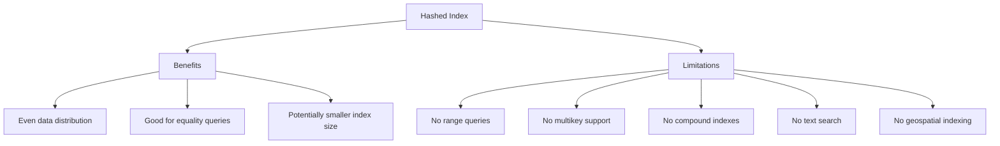

# MongoDB Hashed Indexes

## Introduction

Hashed indexes are a specialized type of index in MongoDB that indexes the hash of a field's value instead of the actual value itself. They're particularly useful for facilitating equality matches and supporting sharding in MongoDB distributed systems.

Unlike regular indexes that store the actual field values, hashed indexes store hash values computed from the indexed field values. This approach offers unique advantages, especially when working with high-cardinality fields or implementing sharded clusters.

In this guide, we'll explore what hashed indexes are, when to use them, how to create them, and their benefits and limitations.

## Understanding Hashed Indexes

### What Is a Hashed Index?

A hashed index uses a hashing function to convert field values into hash codes - fixed-size values that represent the original data. MongoDB then indexes these hash values instead of the original data.


### Key Features

- **Optimized for equality queries**: Hashed indexes excel at exact match queries (`field: value`)
- **Random distribution**: Hash values distribute randomly, which helps with even data distribution across shards
- **Reduced index size**: In some cases, hashed indexes can be smaller than regular indexes
- **No support for range queries**: Hashed indexes cannot support range-based operations

## Creating a Hashed Index

Creating a hashed index in MongoDB is simple. You use the `createIndex()` method with the `hashed` index type:

```javascript
db.collection.createIndex({ fieldName: "hashed" })
```

### Example - Creating a Hashed Index on User ID

Let's create a hashed index on the `userId` field in a `users` collection:

```javascript
db.users.createIndex({ userId: "hashed" })
```

MongoDB will return a success message:

```
{
  "createdCollectionAutomatically" : false,
  "numIndexesBefore" : 1,
  "numIndexesAfter" : 2,
  "ok" : 1
}
```

## When to Use Hashed Indexes

### 1. Sharding Based on a High-Cardinality Field

Hashed indexes are especially useful when configuring sharding with a high-cardinality key (a field with many unique values). They ensure more even data distribution across shards.

```javascript
// First, create a hashed index
db.products.createIndex({ productId: "hashed" })

// Then, use it as a shard key
sh.shardCollection("mystore.products", { productId: "hashed" })
```

### 2. Optimizing Equality Queries on Large String Fields

If your application frequently performs equality matches on large string fields, hashed indexes can improve performance by reducing the index size.

```javascript
// Create a hashed index on email field
db.customers.createIndex({ email: "hashed" })

// Query using the hashed index
db.customers.find({ email: "user@example.com" })
```

## Practical Example: User Session Management System

Let's create a practical example of using hashed indexes in a session management system:

### 1. Setting Up the Collection

```javascript
// Create a sessions collection
db.createCollection("sessions")

// Add some sample session data
db.sessions.insertMany([
  {
    sessionId: "a1b2c3d4e5f6g7h8i9j0",
    userId: "user123",
    lastActive: new Date(),
    device: "mobile"
  },
  {
    sessionId: "b2c3d4e5f6g7h8i9j0k1",
    userId: "user456",
    lastActive: new Date(),
    device: "desktop"
  },
  // ... imagine thousands more sessions
])
```

### 2. Creating a Hashed Index

Let's add a hashed index on the `sessionId` field, which is a good candidate because:
- It's a high-cardinality field (many unique values)
- We'll primarily query it for exact matches
- Session IDs are typically long strings, so hashing can save space

```javascript
db.sessions.createIndex({ sessionId: "hashed" })
```

### 3. Querying with the Hashed Index

When a user sends a request with their session ID, we can quickly look up their session:

```javascript
// This query will use the hashed index
const session = db.sessions.findOne({ sessionId: "a1b2c3d4e5f6g7h8i9j0" })
```

### 4. Verifying Index Usage

To confirm the hashed index is being used, we can examine the query execution plan:

```javascript
db.sessions.explain().find({ sessionId: "a1b2c3d4e5f6g7h8i9j0" })
```

This would show that MongoDB is using our hashed index for this query.

## Benefits and Limitations

### Benefits

1. **Even data distribution**: Hashed indexes distribute data evenly, making them ideal for shard keys
2. **Equality query performance**: They excel at exact match queries
3. **Storage efficiency**: For long string fields, the hash may be smaller than the original value

### Limitations

1. **No range queries**: You can't use hashed indexes for range-based queries (`$gt`, `$lt`, etc.)
2. **No multikey support**: Cannot be used on array fields
3. **No compound indexes**: Cannot be combined with other fields in a compound index
4. **No text searches**: Not suitable for text search operations
5. **No geospatial indexing**: Cannot be used for geospatial operations



## Comparing Regular vs. Hashed Indexes

Let's look at a side-by-side comparison:

| Feature | Regular Index | Hashed Index |
|---------|---------------|--------------|
| Storage | Stores actual values | Stores hash of values |
| Range queries | Supported | Not supported |
| Equality matches | Supported | Supported |
| Sorting | Supported | Not supported |
| Compound index | Can be part of compound index | Cannot be part of compound index |
| Multikey (arrays) | Supported | Not supported |
| Distribution | Preserves order | Random distribution |
| Best use case | General purpose | Sharding, equality matches |

## Practical Tips

1. **Use for sharding high-cardinality fields**: Hashed indexes are excellent for sharding on fields like UUIDs, emails, or product IDs

2. **Test performance**: Before implementing in production, compare the performance of hashed vs. regular indexes for your specific use case

3. **Avoid for range queries**: If your application needs range-based queries on a field, don't use hashed indexes for that field

4. **Consider hybrid sharding strategies**: In some cases, using compound shard keys (with one hashed component) can give you the benefits of both approaches

## Summary

Hashed indexes in MongoDB provide an efficient way to index fields when you need equality matches or even data distribution for sharding. They work by storing a hash of the field values rather than the values themselves.

Key takeaways:

- Use hashed indexes for equality queries and shard keys
- They provide even data distribution across shards
- They don't support range queries, compound indexes, or arrays
- They're especially useful for high-cardinality fields like UUIDs, long strings, or randomly distributed values

As you design your MongoDB schema and indexing strategy, consider whether certain fields might benefit from hashed indexing, particularly if you're implementing a sharded cluster.

## Additional Resources

- [MongoDB Official Documentation on Hashed Indexes](https://www.mongodb.com/docs/manual/core/index-hashed/)
- [MongoDB Sharding Strategy Documentation](https://www.mongodb.com/docs/manual/core/sharding-shard-key/)

## Exercises

1. Create a collection of products with random product IDs and implement a hashed index on the product ID field.

2. Compare the performance of equality queries on a regular vs. hashed index for a large collection with string identifiers.

3. Implement a sharded collection using a hashed index and verify the distribution of data across shards.

4. Create a simple API that uses hashed indexes to optimize lookups of resources by their UUID.

5. Experiment with different field types and query patterns to determine when hashed indexes perform better than regular indexes.