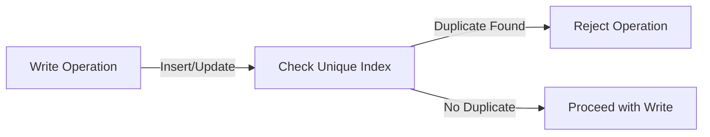

# MongoDB Unique Indexes

## Introduction

Unique indexes in MongoDB are special index structures that enforce the uniqueness of the indexed field(s) across all documents in a collection. They prevent applications from inserting or updating documents with duplicate values for the indexed fields, ensuring data integrity and consistency in your database.

Think of a unique index as a database constraint that helps you maintain clean, accurate data by rejecting duplicate values. For example, you might want to ensure that all users in your application have unique email addresses or unique usernames.

## Understanding Unique Indexes

### What is a Unique Index?

A unique index ensures that the indexed fields don't store duplicate values. MongoDB will reject any operation that would result in duplicate values in the unique index fields.

Key characteristics of unique indexes:

- They can be created on a single field or multiple fields (compound unique index)
- They prevent duplicate values across all documents in a collection
- MongoDB automatically creates a unique index on the `_id` field during collection creation
- They can include a "partial filter expression" to apply uniqueness only to documents matching specific criteria
- They can be sparse, meaning they won't include documents that don't have the indexed field

### Basic Syntax

To create a unique index in MongoDB, you use the `createIndex()` method with the `unique` option set to `true`:

```javascript
db.collection.createIndex({ fieldName: 1 }, { unique: true })
```

Where:
- `fieldName` is the name of the field to index
- `1` indicates ascending order (or `-1` for descending)
- `{ unique: true }` specifies that the index should enforce uniqueness

## Creating Unique Indexes

### Single Field Unique Index

Let's create a collection of users with a unique email address:

```javascript
// Connect to the database
use usersDB

// Create a unique index on the email field
db.users.createIndex({ email: 1 }, { unique: true })
```

The output will be something like:

```
{
  "createdCollectionAutomatically": false,
  "numIndexesBefore": 1,
  "numIndexesAfter": 2,
  "ok": 1
}
```

Now let's try to insert some documents:

```javascript
// First insertion works fine
db.users.insertOne({
  name: "John Doe",
  email: "john@example.com",
  age: 28
})

// This will be successful
// Output: { "acknowledged": true, "insertedId": ObjectId("...") }

// Try to insert a document with the same email
db.users.insertOne({
  name: "Jane Doe",
  email: "john@example.com", // Same email as before
  age: 25
})

// This will fail with a duplicate key error
```

The second insertion will fail with an error message similar to:

```
WriteError({
  "index": 0,
  "code": 11000,
  "errmsg": "E11000 duplicate key error collection: usersDB.users index: email_1 dup key: { email: \"john@example.com\" }",
  "op": {
    "name": "Jane Doe",
    "email": "john@example.com",
    "age": 25,
    "_id": ObjectId("...")
  }
})
```

### Compound Unique Index

You can create unique indexes on multiple fields to enforce uniqueness based on a combination of values:

```javascript
// Create a unique index on both city and zipcode fields
db.addresses.createIndex({ city: 1, zipcode: 1 }, { unique: true })
```

This means that the combination of `city` and `zipcode` must be unique, but the individual fields can have duplicate values in different documents:

```javascript
// These insertions work fine because the combinations are unique
db.addresses.insertOne({ city: "New York", zipcode: "10001", street: "Broadway" })
db.addresses.insertOne({ city: "New York", zipcode: "10002", street: "5th Avenue" })
db.addresses.insertOne({ city: "Boston", zipcode: "10001", street: "Main St" })

// This will fail - duplicate combination of city and zipcode
db.addresses.insertOne({ city: "New York", zipcode: "10001", street: "Park Avenue" })
```

## Special Types of Unique Indexes

### Sparse Unique Indexes

A sparse index only includes documents that have the indexed field. Combined with uniqueness, this allows for a single document with a null value while still enforcing uniqueness among documents that have the field:

```javascript
// Create a sparse unique index
db.products.createIndex(
  { productCode: 1 },
  { unique: true, sparse: true }
)
```

With this index:

```javascript
// These work fine because of the sparse option
db.products.insertOne({ name: "Widget", category: "Tools" }) // No productCode
db.products.insertOne({ name: "Gadget", category: "Electronics" }) // No productCode

// These work because the productCodes are unique
db.products.insertOne({ name: "Hammer", productCode: "TL-001" })
db.products.insertOne({ name: "Screwdriver", productCode: "TL-002" })

// This will fail - duplicate productCode
db.products.insertOne({ name: "Mallet", productCode: "TL-001" })
```

### Partial Unique Indexes

Partial unique indexes enforce uniqueness only on documents that match a specified filter expression:

```javascript
// Create a partial unique index for premium users only
db.users.createIndex(
  { email: 1 },
  {
    unique: true,
    partialFilterExpression: { accountType: "premium" }
  }
)
```

With this index:

```javascript
// Insert premium users - must have unique emails
db.users.insertOne({ name: "Alice", email: "alice@example.com", accountType: "premium" })

// This will fail - duplicate email for premium account
db.users.insertOne({ name: "Bob", email: "alice@example.com", accountType: "premium" })

// This works! The unique constraint only applies to premium accounts
db.users.insertOne({ name: "Charlie", email: "alice@example.com", accountType: "basic" })

// Another basic account with the same email - also works
db.users.insertOne({ name: "Dave", email: "alice@example.com", accountType: "basic" })
```

## Practical Use Cases

### User Registration System

For a user management system, you typically need to ensure unique usernames and email addresses:

```javascript
// Create unique indexes for user registration
db.users.createIndex({ username: 1 }, { unique: true })
db.users.createIndex({ email: 1 }, { unique: true })

// Now your application can insert users safely
try {
  db.users.insertOne({
    username: "johndoe",
    email: "john@example.com",
    name: "John Doe",
    createdAt: new Date()
  })
  // Success handling
} catch (error) {
  // Error handling for duplicate username/email
  if (error.code === 11000) {
    // Handle duplicate key error
    console.log("Username or email already exists")
  }
}
```

### Product Inventory System

For a product inventory system where each product must have a unique SKU (Stock Keeping Unit):

```javascript
// Create a unique index on the SKU field
db.inventory.createIndex({ sku: 1 }, { unique: true })

// Insert products with unique SKUs
db.inventory.insertOne({
  name: "Smartphone X",
  sku: "ELEC-SP-001",
  price: 899.99,
  category: "Electronics",
  inStock: 120
})

db.inventory.insertOne({
  name: "Wireless Earbuds",
  sku: "ELEC-EA-002",
  price: 149.99,
  category: "Electronics",
  inStock: 200
})
```

### Multi-tenant Application

For a multi-tenant application where emails should be unique within each organization but can be duplicated across different organizations:

```javascript
// Create a compound unique index on organization and email
db.members.createIndex(
  { organizationId: 1, email: 1 },
  { unique: true }
)

// Now users can have the same email in different organizations
db.members.insertOne({
  name: "John Smith",
  email: "john@example.com",
  organizationId: ObjectId("5f8d0f2b9d3f2a1d9c1e7b4a"),
  role: "admin"
})

db.members.insertOne({
  name: "John Smith",
  email: "john@example.com",
  organizationId: ObjectId("5f8d0f2b9d3f2a1d9c1e7b4b"),
  role: "user"
})
```

## Common Challenges and Solutions

### Handling Unique Index Errors

When your application encounters a duplicate key error (code 11000), you should handle it gracefully:

```javascript
try {
  // Attempt to insert a document that might violate uniqueness
  const result = await db.collection('users').insertOne({
    username: userInput.username,
    email: userInput.email
  });
  // Success path
  return { success: true, userId: result.insertedId };
} catch (error) {
  // Check for duplicate key error
  if (error.code === 11000) {
    // Determine which field caused the duplicate
    const keyPattern = error.keyPattern;
    
    if (keyPattern.username) {
      return { success: false, error: "Username already taken" };
    } else if (keyPattern.email) {
      return { success: false, error: "Email address already registered" };
    }
  }
  // Handle other errors
  return { success: false, error: "Unknown error occurred" };
}
```

### Case Sensitivity in Unique Indexes

MongoDB's unique indexes are case-sensitive by default. To create case-insensitive unique indexes, you can use a collation:

```javascript
// Create a case-insensitive unique index on email
db.users.createIndex(
  { email: 1 },
  {
    unique: true,
    collation: { locale: 'en', strength: 2 }
  }
)
```

With this index, "user@example.com" and "USER@example.com" would be considered duplicates.

### Working with Existing Data

If you try to create a unique index on a collection that already contains duplicate values, the operation will fail. You can handle this by:

1. Removing duplicates before creating the index:

```javascript
// Find duplicate emails
db.users.aggregate([
  { $group: { _id: "$email", count: { $sum: 1 } } },
  { $match: { count: { $gt: 1 } } }
])

// Process each duplicate set and decide which records to keep
```

2. Or using the `background` option to build the index in the background:

```javascript
db.users.createIndex(
  { email: 1 },
  { unique: true, background: true }
)
```

## Performance Considerations

1. **Index size**: Unique indexes consume storage space. Consider the trade-off between enforcing uniqueness and the additional storage requirements.

2. **Write performance**: Unique indexes require additional checks during write operations, which can slow down inserts and updates.

3. **Compound indexes**: When creating compound unique indexes, the order of fields matters for query performance.



## Summary

Unique indexes in MongoDB provide a powerful way to enforce data integrity by preventing duplicate values in specified fields. Key points to remember:

- Use unique indexes to ensure data uniqueness across documents
- They can be applied to single fields or combinations of fields
- Special types like sparse and partial unique indexes provide flexibility
- Always handle duplicate key errors gracefully in your application
- Consider case-sensitivity and performance implications

Unique indexes are especially useful in:
- User management systems (usernames, emails)
- Product catalogs (product codes, SKUs)
- Payment systems (transaction IDs)
- Any system where duplicates would cause data integrity problems

## Additional Resources

To deepen your understanding of MongoDB unique indexes, consider exploring:

- [MongoDB Official Documentation on Unique Indexes](https://docs.mongodb.com/manual/core/index-unique/)
- [Data Modeling Best Practices](https://www.mongodb.com/blog/post/building-with-patterns-the-unique-index-pattern)

## Practice Exercises

1. Create a collection for a library system with unique book ISBN numbers.
2. Implement a compound unique index for a school database that ensures no two students have the same combination of first name, last name, and date of birth.
3. Create a partial unique index that only enforces uniqueness for active products in an e-commerce system.
4. Build a user system with case-insensitive unique usernames using collation.

Happy indexing!