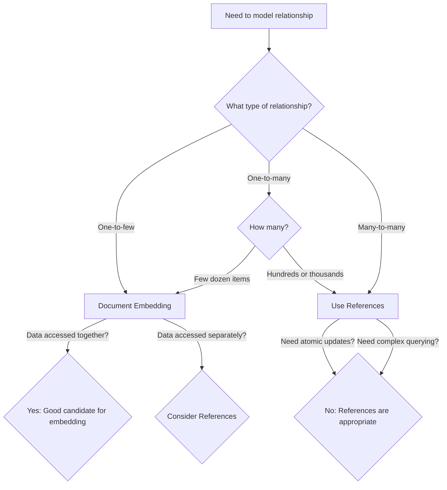

# MongoDB Embedding Documents

## Introduction

In the world of NoSQL databases, MongoDB's document model provides unique ways to structure and organize your data. One of the most powerful techniques in MongoDB data modeling is **document embedding**, which allows you to store related data together in a single document structure.

Unlike traditional relational databases that use tables and joins, MongoDB encourages a data model where related information can be nested within a parent document. This approach can simplify your queries, improve application performance, and better reflect the natural structure of your data.

In this guide, we'll explore document embedding in MongoDB, understand when to use it, learn its advantages and limitations, and examine real-world use cases to help you make informed decisions about your data models.

## What are Embedded Documents?

Embedded documents (also called nested documents or subdocuments) are MongoDB documents that are included inside other documents. They follow the same BSON structure as regular MongoDB documents but exist as fields within a parent document.

Here's a simple example:

```javascript
{
  _id: ObjectId("615f9a851df93f3c547c1234"),
  name: "John Smith",
  contact: {
    email: "john.smith@example.com",
    phone: "555-123-4567",
    address: {
      street: "123 Main St",
      city: "Anytown",
      state: "CA",
      zip: "12345"
    }
  }
}
```

In this example:
- The top-level document represents a person
- The `contact` field is an embedded document containing contact information
- The `address` field is another embedded document nested inside `contact`

## Why Use Document Embedding?

Embedding documents in MongoDB offers several important benefits:

1. **Improved Query Performance**: Retrieving related data requires only a single database operation
2. **Atomic Operations**: Updates to the parent document and its embedded documents happen in a single atomic transaction
3. **Simplified Application Logic**: Avoids complex join operations when retrieving related data
4. **Data Locality**: Keeps related data together on disk, improving read performance

## When to Use Document Embedding

Document embedding works best in the following scenarios:

### 1. One-to-Few Relationships

When a parent entity has a small number of child entities that are always accessed together, embedding is ideal.

**Example**: A user profile with a few addresses (home, work, billing)

```javascript
{
  _id: ObjectId("615f9a851df93f3c547c5678"),
  name: "Jane Doe",
  email: "jane.doe@example.com",
  addresses: [
    {
      type: "home",
      street: "456 Oak Ave",
      city: "Somewhere",
      state: "NY",
      zip: "54321"
    },
    {
      type: "work",
      street: "789 Corporate Blvd",
      city: "Somewhere",
      state: "NY",
      zip: "54321"
    }
  ]
}
```

### 2. Contained Relationships

When child entities make no sense on their own and only exist in the context of the parent.

**Example**: Comments embedded in a blog post document

```javascript
{
  _id: ObjectId("615f9a851df93f3c547c9012"),
  title: "Introduction to MongoDB",
  content: "MongoDB is a document database that offers high performance...",
  author: "MongoDB Expert",
  date: ISODate("2023-09-15T10:30:00Z"),
  comments: [
    {
      user: "beginner123",
      text: "This was very helpful!",
      date: ISODate("2023-09-15T14:25:00Z")
    },
    {
      user: "dataEnthusiast",
      text: "Could you explain indexing in more detail?",
      date: ISODate("2023-09-16T08:15:00Z")
    }
  ]
}
```

### 3. Denormalized Read-Optimization

When you want to optimize for read performance by reducing the need for additional queries.

## Document Embedding Patterns

Let's explore common patterns for embedding documents:

### 1. Simple Field Embedding

Embed a single document as a field in the parent document:

```javascript
{
  _id: ObjectId("615f9a851df93f3c547c3456"),
  name: "Product XYZ",
  price: 99.99,
  manufacturer: {
    name: "ABC Company",
    website: "https://www.abccompany.com",
    founded: 1985
  }
}
```

### 2. Array of Embedded Documents

Embed multiple related documents in an array field:

```javascript
{
  _id: ObjectId("615f9a851df93f3c547c7890"),
  name: "Software Development Course",
  instructor: "Ada Lovelace",
  modules: [
    {
      title: "Introduction to Programming",
      duration: "2 weeks",
      topics: ["Variables", "Control Flow", "Functions"]
    },
    {
      title: "Data Structures",
      duration: "3 weeks",
      topics: ["Arrays", "Linked Lists", "Trees"]
    },
    {
      title: "Algorithms",
      duration: "4 weeks",
      topics: ["Sorting", "Searching", "Dynamic Programming"]
    }
  ]
}
```

### 3. Nested Embedding

Embedding documents within embedded documents (multiple levels of nesting):

```javascript
{
  _id: ObjectId("615f9a851df93f3c547c2345"),
  name: "Online Store",
  details: {
    founded: 2020,
    locations: {
      headquarters: {
        city: "San Francisco",
        state: "CA"
      },
      warehouses: [
        {
          city: "Dallas",
          state: "TX",
          size: "50,000 sq ft"
        },
        {
          city: "Seattle",
          state: "WA",
          size: "35,000 sq ft"
        }
      ]
    }
  }
}
```

## Working with Embedded Documents

### Querying Embedded Documents

MongoDB provides dot notation to query fields within embedded documents:

```javascript
// Find all products manufactured by ABC Company
db.products.find({ "manufacturer.name": "ABC Company" })

// Find courses with a module on Data Structures
db.courses.find({ "modules.title": "Data Structures" })
```

### Updating Embedded Documents

You can update specific fields in embedded documents using dot notation:

```javascript
// Update the phone number in a contact embedded document
db.customers.updateOne(
  { _id: ObjectId("615f9a851df93f3c547c1234") },
  { $set: { "contact.phone": "555-987-6543" } }
)

// Add a new comment to a blog post
db.posts.updateOne(
  { _id: ObjectId("615f9a851df93f3c547c9012") },
  { 
    $push: { 
      comments: {
        user: "newUser",
        text: "Great article!",
        date: new Date()
      }
    }
  }
)
```

### Updating Documents in an Array

For updating embedded documents within arrays, you can use array update operators:

```javascript
// Update the duration of the "Data Structures" module
db.courses.updateOne(
  { "modules.title": "Data Structures" },
  { $set: { "modules.$.duration": "4 weeks" } }
)

// Add a new topic to the "Algorithms" module
db.courses.updateOne(
  { "modules.title": "Algorithms" },
  { $push: { "modules.$.topics": "Graph Algorithms" } }
)
```

## Practical Examples

Let's look at some real-world examples of document embedding:

### E-commerce Product Catalog

```javascript
{
  _id: ObjectId("615f9a851df93f3c547cabc1"),
  name: "Ultra HD Smart TV",
  price: 799.99,
  category: "Electronics",
  details: {
    brand: "TechVision",
    model: "UV55X",
    specifications: {
      screenSize: "55 inches",
      resolution: "3840 x 2160",
      refreshRate: "120Hz",
      connectivity: ["HDMI", "USB", "Bluetooth", "WiFi"]
    }
  },
  variants: [
    {
      size: "48 inches",
      price: 599.99,
      inStock: true
    },
    {
      size: "65 inches",
      price: 999.99,
      inStock: false
    }
  ],
  reviews: [
    {
      user: "techEnthusiast",
      rating: 5,
      comment: "Amazing picture quality!",
      date: ISODate("2023-08-05")
    },
    {
      user: "homeTheaterPro",
      rating: 4,
      comment: "Great TV but the smart interface is a bit slow.",
      date: ISODate("2023-07-22")
    }
  ]
}
```

This example shows nested embedding with the product's specifications, variants, and customer reviews all embedded within a single product document.

### Medical Patient Records

```javascript
{
  _id: ObjectId("615f9a851df93f3c547cdef0"),
  firstName: "Michael",
  lastName: "Johnson",
  dateOfBirth: ISODate("1975-03-15"),
  contact: {
    phone: "555-123-7890",
    email: "michael.j@example.com",
    emergency: {
      name: "Sarah Johnson",
      relationship: "Spouse",
      phone: "555-123-7891"
    }
  },
  insurance: {
    provider: "Health Shield",
    policyNumber: "HS-987654321",
    expiryDate: ISODate("2024-12-31")
  },
  medicalHistory: [
    {
      condition: "Appendectomy",
      date: ISODate("2010-06-12"),
      hospital: "City General Hospital",
      notes: "Routine procedure with no complications"
    },
    {
      condition: "Hypertension",
      diagnosedDate: ISODate("2018-03-10"),
      medications: [
        {
          name: "Lisinopril",
          dosage: "10mg",
          frequency: "Once daily",
          prescribed: ISODate("2022-05-18")
        }
      ]
    }
  ],
  appointments: [
    {
      date: ISODate("2023-10-15T14:30:00Z"),
      doctor: "Dr. Amanda Chen",
      department: "Cardiology",
      reason: "Annual checkup"
    },
    {
      date: ISODate("2023-11-05T10:00:00Z"),
      doctor: "Dr. Robert Smith",
      department: "General Practice",
      reason: "Flu vaccination"
    }
  ]
}
```

This patient record demonstrates how embedded documents can efficiently store complex, related information like contact details, insurance information, medical history, and scheduled appointments.

## Limitations and Considerations

While document embedding is powerful, it comes with some limitations to keep in mind:

1. **Document Size Limit**: MongoDB has a 16MB maximum document size. For collections with potentially large embedded arrays, this can be a constraint.

2. **Update Performance**: Very large documents with deeply nested structures might affect update performance.

3. **Duplicate Data**: Embedding often means duplicating some data, which can lead to inconsistencies if not managed properly.

4. **Query Flexibility**: Some complex queries might be harder to express with embedded documents.

## When to Avoid Embedding

Consider alternative approaches like references when:

1. **One-to-Many Relationships with Many Items**: If a parent could have hundreds or thousands of children (like a product with thousands of reviews)

2. **Many-to-Many Relationships**: Complex many-to-many relationships often work better with references

3. **Large Subdocuments**: When embedded documents are very large and might cause the parent document to approach the 16MB size limit

4. **Data that Often Changes Separately**: When embedded data changes frequently but independently of the parent document

## Document Embedding vs. References

Here's a simple comparison to help you decide between embedding and referencing:



## Best Practices for Document Embedding

1. **Keep Document Size Manageable**: Monitor the size of your documents, especially when embedding arrays that could grow.

2. **Balance Depth**: Avoid excessively deep nesting which can make queries and updates complex.

3. **Consider Access Patterns**: Design your schema based on how the data will be accessed, not just on the logical relationships.

4. **Use Array Limits**: When embedding arrays, consider establishing application-level limits on array sizes.

5. **Plan for Growth**: Design with future data growth in mind.

6. **Index Fields in Embedded Documents**: Create indexes on frequently queried fields within embedded documents.

```javascript
// Create an index on the email field in the contact embedded document
db.customers.createIndex({ "contact.email": 1 })
```

## Summary

Document embedding is a fundamental technique in MongoDB data modeling that allows for efficient storage and retrieval of related data. By storing connected data within a single document, you can achieve better performance, atomic operations, and a more natural representation of your domain objects.

Key points to remember:
- Embedding works best for one-to-few and contained relationships
- Use dot notation to query and update embedded documents
- Consider the 16MB document size limit when designing embedded structures
- Choose embedding when data is frequently accessed together
- Use references for large collections of related items or many-to-many relationships

By applying these principles and patterns, you can create MongoDB schemas that are both performant and reflective of your application's natural data structure.

## Additional Resources

- Practice identifying appropriate embedding scenarios in your existing projects
- Try converting a small relational database model to MongoDB using embedded documents
- Experiment with querying and updating embedded documents
- Benchmark the performance differences between embedded and referenced approaches

## Exercises

1. Design a MongoDB schema for a blog platform with posts, comments, and user information using embedded documents where appropriate.

2. Create a document structure for an online music library that includes artists, albums, and tracks.

3. Model a social media user profile with embedded documents for personal information, education history, and work experience.

4. Practice querying and updating embedded fields and arrays in the MongoDB shell.