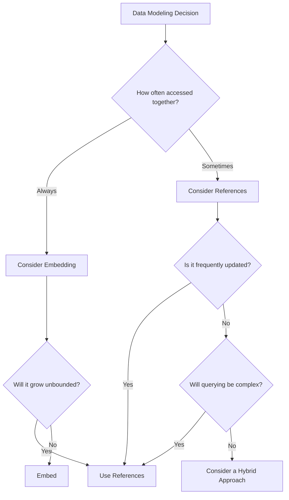

# MongoDB Anti-Patterns

In software development, an anti-pattern is a common but ineffective approach to solving a problem. MongoDB, with its flexible schema and document-oriented structure, gives developers a lot of freedom—but this freedom can lead to poor design choices if you're not careful. This guide explores common MongoDB anti-patterns and how to avoid them.

## Introduction

MongoDB's flexible document model offers significant advantages over traditional relational databases for many use cases. However, this flexibility can be a double-edged sword. Without a good understanding of MongoDB's strengths and limitations, developers can inadvertently create data models that perform poorly, are difficult to maintain, or don't scale well.

Understanding these anti-patterns will help you build more robust and efficient MongoDB applications.

## Common MongoDB Anti-Patterns

### 1. Massive Arrays

**Anti-Pattern:** Storing large arrays within documents that grow without bounds.

#### Problem

```javascript
// Document with an unbounded array that could grow indefinitely
{
  "_id": "user123",
  "username": "john_doe",
  "posts": [
    { "title": "Post 1", "content": "..." },
    { "title": "Post 2", "content": "..." },
    // Potentially thousands more posts
  ]
}
```

This approach causes several issues:
- Document growth can lead to expensive relocations in storage
- Reading the document means loading all array elements into memory
- Updates to any single array element require updating the entire document

#### Better Solution

```javascript
// User document
{
  "_id": "user123",
  "username": "john_doe"
}

// Separate posts collection
{
  "_id": "post1",
  "user_id": "user123",
  "title": "Post 1",
  "content": "..."
}

{
  "_id": "post2",
  "user_id": "user123",
  "title": "Post 2",
  "content": "..."
}
```

By separating large arrays into their own collections, you can:
- Query and update individual items more efficiently
- Avoid document size limits (16MB per document)
- Enable pagination and indexing on array elements

### 2. Deeply Nested Documents

**Anti-Pattern:** Creating complex, deeply nested document structures.

#### Problem

```javascript
{
  "_id": "order123",
  "customer": {
    "name": "Jane Smith",
    "address": {
      "street": "123 Main St",
      "city": "New York",
      "country": {
        "name": "United States",
        "code": "US",
        "region": {
          "name": "North America",
          "subregion": {
            // More nesting...
          }
        }
      }
    },
    "orders": [
      {
        "items": [
          {
            "product": {
              // Deep nesting continues...
            }
          }
        ]
      }
    ]
  }
}
```

Issues with deeply nested documents:
- Difficult to query specific nested fields
- Hard to update specific elements without loading the entire document
- Complex aggregation pipelines required for analysis
- Poor readability and maintainability

#### Better Solution

Flatten the structure and use references:

```javascript
// Customer document
{
  "_id": "customer456",
  "name": "Jane Smith",
  "address_id": "addr789",
  "country_id": "US"
}

// Address document
{
  "_id": "addr789",
  "customer_id": "customer456",
  "street": "123 Main St",
  "city": "New York"
}

// Country document
{
  "_id": "US",
  "name": "United States",
  "region_id": "na001"
}

// Order document
{
  "_id": "order123",
  "customer_id": "customer456",
  "items": ["item1", "item2"]
}
```

### 3. Inappropriate Indexing

**Anti-Pattern:** Either over-indexing or under-indexing your collections.

#### Problem

**Under-indexing:**
```javascript
// With millions of records and no index on 'email'
db.users.find({email: "user@example.com"})
```

**Over-indexing:**
```javascript
// Creating too many indexes
db.users.createIndex({firstName: 1})
db.users.createIndex({lastName: 1})
db.users.createIndex({email: 1})
db.users.createIndex({age: 1})
db.users.createIndex({city: 1})
db.users.createIndex({state: 1})
db.users.createIndex({zipCode: 1})
// And many more...
```

Issues:
- Under-indexing leads to full collection scans and slow queries
- Over-indexing slows down write operations and uses more storage
- Unused indexes waste resources

#### Better Solution

Create indexes based on actual query patterns:

```javascript
// If you frequently query by email
db.users.createIndex({email: 1})

// If you often search for users by name and filter by age
db.users.createIndex({lastName: 1, firstName: 1, age: 1})

// Use MongoDB's Index Statistics to identify unused indexes
db.users.aggregate([{$indexStats: {}}])
```

### 4. Schema-less but Not Planning-less

**Anti-Pattern:** Treating MongoDB's flexible schema as an excuse not to design your data model.

#### Problem

```javascript
// Inconsistent document structure
{
  "_id": "user1",
  "name": "John",
  "age": 30
}

{
  "_id": "user2",
  "userName": "Jane",
  "userAge": 28
}

{
  "_id": "user3",
  "user": {
    "name": "Bob",
    "years": 42
  }
}
```

This makes querying, indexing, and maintaining your application extremely difficult.

#### Better Solution

Even with a flexible schema, establish consistent document patterns:

```javascript
// Consistent structure with schema validation
db.createCollection("users", {
  validator: {
    $jsonSchema: {
      bsonType: "object",
      required: ["name", "age"],
      properties: {
        name: {
          bsonType: "string",
          description: "must be a string and is required"
        },
        age: {
          bsonType: "int",
          minimum: 0,
          description: "must be a positive integer and is required"
        }
      }
    }
  }
})
```

### 5. Inappropriately Modeling Relationships

**Anti-Pattern:** Always embedding related data or always using references, regardless of the use case.

#### Problem

Either always embedding:

```javascript
// Everything embedded - can cause large documents
{
  "_id": "store123",
  "name": "Grocery Store",
  "products": [
    {
      "name": "Milk",
      "price": 3.99,
      "reviews": [
        {
          "user": {
            "name": "John",
            "email": "john@example.com",
            // All user data embedded
          },
          "rating": 5,
          "comment": "Great product!"
        },
        // Potentially hundreds of reviews
      ]
    },
    // Potentially thousands of products
  ]
}
```

Or always using references:

```javascript
// Everything referenced - requires multiple queries
{
  "_id": "user123",
  "name": "John",
  "address_id": "addr456",
  "preferences_id": "pref789",
  "settings_id": "set101"
}
```

#### Better Solution

Use a hybrid approach based on:
- How often the data is accessed together
- Update frequency
- Data size
- The "belongs to" vs "has many" relationship

```javascript
// Example hybrid approach for a blog
{
  "_id": "post123",
  "title": "MongoDB Best Practices",
  "content": "...",
  "author": {
    "_id": "user456",
    "name": "Jane Smith"
    // Frequently accessed author info embedded
  },
  "comments": [
    {
      "user_id": "user789", // Reference to user
      "text": "Great article!"
    }
  ],
  "category_id": "cat001" // Reference to category
}
```

## Real-world Examples and Solutions

### Example 1: E-commerce Product Catalog

**Anti-pattern implementation:**

```javascript
// Anti-pattern: All product variations in a single document
{
  "_id": "tshirt1",
  "name": "Cotton T-Shirt",
  "description": "Comfortable cotton t-shirt",
  "variants": [
    {
      "color": "Red",
      "sizes": [
        {
          "size": "S",
          "inventory": 25,
          "price": 19.99
        },
        {
          "size": "M",
          "inventory": 30,
          "price": 19.99
        },
        // Many more size variations
      ]
    },
    {
      "color": "Blue",
      "sizes": [
        // Many more size variations
      ]
    },
    // Potentially dozens of color variations
  ]
}
```

**Problems:**
- Updating inventory requires updating the entire document
- Difficult to query for specific variants
- Document could grow beyond the 16MB limit with many variants

**Better solution:**

```javascript
// Main product document
{
  "_id": "tshirt1",
  "name": "Cotton T-Shirt",
  "description": "Comfortable cotton t-shirt",
  "basePrice": 19.99
}

// Separate variants collection
{
  "_id": "variant_red_s",
  "product_id": "tshirt1",
  "color": "Red",
  "size": "S",
  "inventory": 25,
  "price": 19.99
}

{
  "_id": "variant_red_m",
  "product_id": "tshirt1",
  "color": "Red",
  "size": "M",
  "inventory": 30,
  "price": 19.99
}
```

This approach allows:
- Atomic updates to inventory numbers
- Easy queries for specific variants
- Efficient indexing on product_id, color, and size

### Example 2: Social Media Feed

**Anti-pattern implementation:**

```javascript
// Anti-pattern: Storing all user posts in the user document
{
  "_id": "user123",
  "name": "John Doe",
  "posts": [
    {
      "id": "post1",
      "content": "Hello world!",
      "likes": 42,
      "comments": [
        {
          "user": "user456",
          "text": "Great post!",
          "timestamp": ISODate("2023-01-15T12:30:45Z")
        },
        // Potentially hundreds of comments
      ]
    },
    // Potentially thousands of posts
  ]
}
```

**Problems:**
- Document grows without bounds
- Loading the user profile loads all posts and comments
- Difficult to paginate through posts

**Better solution:**

```javascript
// User document
{
  "_id": "user123",
  "name": "John Doe",
  "profile": {
    "bio": "Software developer",
    "joinedDate": ISODate("2022-05-10")
  }
}

// Posts collection
{
  "_id": "post1",
  "user_id": "user123",
  "content": "Hello world!",
  "likes": 42,
  "timestamp": ISODate("2023-01-15T10:30:00Z")
}

// Comments collection
{
  "_id": "comment1",
  "post_id": "post1",
  "user_id": "user456",
  "text": "Great post!",
  "timestamp": ISODate("2023-01-15T12:30:45Z")
}
```

This allows:
- Efficient pagination of posts
- Loading only relevant data
- Atomic updates to likes count without loading all posts

## Data Modeling Decision Framework

When making data modeling decisions, consider these factors:



## Summary

MongoDB's flexibility is powerful but requires thoughtful design. By avoiding these common anti-patterns, you can create data models that are performant, maintainable, and scalable:

1. **Avoid unbounded arrays** - Split large arrays into separate collections when appropriate
2. **Minimize document nesting** - Flatten your schema when deep nesting becomes problematic
3. **Index thoughtfully** - Create indexes based on actual query patterns
4. **Plan your schema** - Even with flexibility, consistency matters
5. **Use the right relationship model** - Choose embedding or referencing based on access patterns

Remember that good MongoDB design is about understanding your data access patterns and making appropriate trade-offs.

## Additional Resources

- **MongoDB Documentation**: [Data Modeling Introduction](https://www.mongodb.com/docs/manual/core/data-modeling-introduction/)
- **Book**: "MongoDB: The Definitive Guide" by Kristina Chodorow
- **MongoDB University**: [M320: Data Modeling](https://university.mongodb.com/courses/M320/about)

## Exercises

1. Refactor the following blog post schema to avoid the massive array anti-pattern:
```javascript
{
  "_id": "blog123",
  "title": "My Blog",
  "posts": [
    // Imagine 1000+ blog posts here
  ]
}
```

2. Identify the anti-patterns in this e-commerce schema and propose a better solution:
```javascript
{
  "_id": "user123",
  "name": "Jane Smith",
  "addresses": [
    // Multiple addresses
  ],
  "orders": [
    {
      "date": ISODate("2023-01-05"),
      "items": [
        {
          "product": {
            "name": "Laptop",
            "description": "...",
            "specs": {
              // Deeply nested specs
            }
          },
          "quantity": 1
        }
      ]
    }
    // Potentially hundreds of orders
  ],
  "cart": [
    // Current shopping cart
  ],
  "wishlist": [
    // Wishlist items
  ]
}
```

3. Create a MongoDB schema for a library management system that avoids the anti-patterns discussed in this lesson.