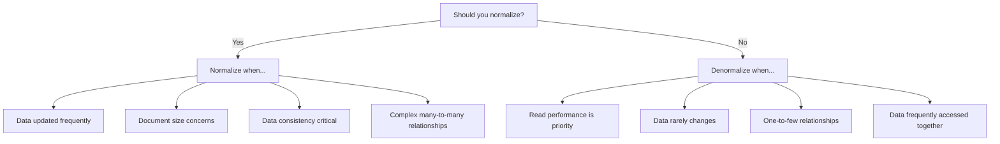

# MongoDB Normalization

## Introduction

Normalization is a database design technique originally developed for relational databases that aims to reduce data redundancy and improve data integrity. While MongoDB is a document-oriented NoSQL database that doesn't strictly adhere to the same normalization rules as relational databases, understanding and applying normalization principles can still lead to more efficient and maintainable MongoDB schemas.

In this tutorial, we'll explore how normalization concepts apply to MongoDB, when you should normalize your data, when denormalization might be a better approach, and provide practical examples to help you make informed design decisions.

## What is Normalization in MongoDB?

In relational databases, normalization involves organizing data into separate tables and defining relationships between them. In MongoDB, normalization means splitting related data into separate collections and using references between documents.

While MongoDB allows for rich, nested documents (denormalization), there are scenarios where normalizing your data provides significant advantages:

1. When data is updated frequently
2. When you want to avoid excessive duplication
3. When consistency is critical across multiple documents
4. When document size might exceed MongoDB's 16MB limit

## Basic Normalization in MongoDB

Let's look at how we can normalize data in MongoDB with a simple example. Consider an e-commerce application with customers and orders.

### Denormalized Approach (Embedded Documents)

```javascript
// A denormalized document with orders embedded within customer document
{
  "_id": ObjectId("5f8d0e2d5ab5c12345678901"),
  "name": "John Doe",
  "email": "john.doe@example.com",
  "address": {
    "street": "123 Main St",
    "city": "New York",
    "state": "NY",
    "zipCode": "10001"
  },
  "orders": [
    {
      "orderId": "ORD-001",
      "date": ISODate("2023-05-15T14:30:00Z"),
      "items": [
        {
          "productId": "P100",
          "productName": "Laptop",
          "price": 999.99,
          "quantity": 1
        },
        {
          "productId": "P200",
          "productName": "Mouse",
          "price": 24.99,
          "quantity": 2
        }
      ],
      "totalAmount": 1049.97
    },
    {
      "orderId": "ORD-002",
      "date": ISODate("2023-06-10T11:15:00Z"),
      "items": [
        {
          "productId": "P300",
          "productName": "Headphones",
          "price": 149.99,
          "quantity": 1
        }
      ],
      "totalAmount": 149.99
    }
  ]
}
```

### Normalized Approach (Separate Collections)

```javascript
// Customers collection
{
  "_id": ObjectId("5f8d0e2d5ab5c12345678901"),
  "name": "John Doe",
  "email": "john.doe@example.com",
  "address": {
    "street": "123 Main St",
    "city": "New York",
    "state": "NY",
    "zipCode": "10001"
  }
}

// Orders collection
{
  "_id": ObjectId("6a1b2c3d4e5f67890123456"),
  "orderId": "ORD-001",
  "customerId": ObjectId("5f8d0e2d5ab5c12345678901"),
  "date": ISODate("2023-05-15T14:30:00Z"),
  "totalAmount": 1049.97,
  "items": [
    {
      "productId": "P100", 
      "productName": "Laptop",
      "price": 999.99,
      "quantity": 1
    },
    {
      "productId": "P200",
      "productName": "Mouse",
      "price": 24.99,
      "quantity": 2
    }
  ]
}

{
  "_id": ObjectId("7a8b9c0d1e2f34567890abcd"),
  "orderId": "ORD-002",
  "customerId": ObjectId("5f8d0e2d5ab5c12345678901"),
  "date": ISODate("2023-06-10T11:15:00Z"),
  "totalAmount": 149.99,
  "items": [
    {
      "productId": "P300",
      "productName": "Headphones",
      "price": 149.99,
      "quantity": 1
    }
  ]
}

// Products collection (further normalization)
{
  "_id": "P100",
  "name": "Laptop",
  "description": "15-inch laptop with 16GB RAM",
  "price": 999.99,
  "category": "Electronics",
  "inStock": 45
}

{
  "_id": "P200",
  "name": "Mouse",
  "description": "Wireless ergonomic mouse",
  "price": 24.99,
  "category": "Accessories",
  "inStock": 156
}
```

## When to Normalize in MongoDB

Normalization is beneficial in the following scenarios:

### 1. When Data is Updated Frequently

If certain fields need to be updated frequently, it makes sense to store them in separate collections. This avoids updating the same information in multiple places.

**Example**: Product information (like price or stock) changes often. If product details are embedded in every order document, you would need to update all orders whenever the product information changes.

### 2. When Working with Large Documents

MongoDB has a 16MB document size limit. If your documents risk exceeding this limit, normalization is necessary.

**Example**: A social media application where users can have thousands of posts and comments. Storing all posts and comments within the user document would eventually hit the size limit.

### 3. When Data Consistency is Critical

If certain data must be consistent across the application, normalize to have a single source of truth.

**Example**: User profile information that appears in multiple places should be stored in one collection and referenced elsewhere.

### 4. When Many-to-Many Relationships Exist

For complex relationships between entities, normalization often provides a cleaner model.

## Practical Example: Library Management System

Let's look at a more complete example of normalization for a library management system.

### Denormalized Approach

```javascript
{
  "_id": ObjectId("5f8d0e2d5ab5c12345678901"),
  "title": "MongoDB: The Definitive Guide",
  "authors": [
    {
      "name": "Kristina Chodorow",
      "email": "kristina@example.com",
      "bio": "MongoDB expert and software engineer"
    },
    {
      "name": "Michael Dirolf",
      "email": "michael@example.com",
      "bio": "Former MongoDB employee and consultant"
    }
  ],
  "publisher": {
    "name": "O'Reilly Media",
    "address": "1005 Gravenstein Highway North, Sebastopol, CA",
    "phone": "707-827-7000"
  },
  "isbn": "978-1449344689",
  "pages": 416,
  "borrowers": [
    {
      "memberId": "MEM001",
      "name": "John Smith",
      "borrowDate": ISODate("2023-01-15T10:30:00Z"),
      "returnDate": ISODate("2023-01-30T09:45:00Z")
    },
    {
      "memberId": "MEM042",
      "name": "Sarah Johnson",
      "borrowDate": ISODate("2023-02-10T14:20:00Z"),
      "returnDate": ISODate("2023-02-24T11:10:00Z")
    }
  ],
  "category": "Programming",
  "location": "Shelf A3"
}
```

### Normalized Approach

```javascript
// Books collection
{
  "_id": ObjectId("5f8d0e2d5ab5c12345678901"),
  "title": "MongoDB: The Definitive Guide",
  "authorIds": [
    ObjectId("6a1b2c3d4e5f67890123456"),
    ObjectId("7a8b9c0d1e2f34567890abcd")
  ],
  "publisherId": ObjectId("8a9b0c1d2e3f45678901234"),
  "isbn": "978-1449344689",
  "pages": 416,
  "category": "Programming",
  "location": "Shelf A3"
}

// Authors collection
{
  "_id": ObjectId("6a1b2c3d4e5f67890123456"),
  "name": "Kristina Chodorow",
  "email": "kristina@example.com",
  "bio": "MongoDB expert and software engineer",
  "books": [
    ObjectId("5f8d0e2d5ab5c12345678901"),
    ObjectId("5f8d0e2d5ab5c12345678902")
  ]
}

{
  "_id": ObjectId("7a8b9c0d1e2f34567890abcd"),
  "name": "Michael Dirolf",
  "email": "michael@example.com",
  "bio": "Former MongoDB employee and consultant",
  "books": [
    ObjectId("5f8d0e2d5ab5c12345678901")
  ]
}

// Publishers collection
{
  "_id": ObjectId("8a9b0c1d2e3f45678901234"),
  "name": "O'Reilly Media",
  "address": "1005 Gravenstein Highway North, Sebastopol, CA",
  "phone": "707-827-7000",
  "books": [
    ObjectId("5f8d0e2d5ab5c12345678901"),
    // other book references
  ]
}

// Borrowing records collection
{
  "_id": ObjectId("9a0b1c2d3e4f56789012345"),
  "bookId": ObjectId("5f8d0e2d5ab5c12345678901"),
  "memberId": "MEM001",
  "memberName": "John Smith",
  "borrowDate": ISODate("2023-01-15T10:30:00Z"),
  "returnDate": ISODate("2023-01-30T09:45:00Z"),
  "status": "returned"
}

{
  "_id": ObjectId("0a1b2c3d4e5f67890123456"),
  "bookId": ObjectId("5f8d0e2d5ab5c12345678901"),
  "memberId": "MEM042",
  "memberName": "Sarah Johnson",
  "borrowDate": ISODate("2023-02-10T14:20:00Z"),
  "returnDate": ISODate("2023-02-24T11:10:00Z"),
  "status": "returned"
}
```

## Retrieving Normalized Data

When working with normalized data, you'll often need to join collections to retrieve related information. MongoDB provides several ways to do this:

### 1. Application-level Joins

You can perform multiple queries and join the data in your application code:

```javascript
// First, get the book
const book = await db.collection('books').findOne({ isbn: "978-1449344689" });

// Then, get the authors
const authors = await db.collection('authors')
  .find({ _id: { $in: book.authorIds } })
  .toArray();

// Combine the results
book.authors = authors;
```

### 2. Using the `$lookup` Aggregation Stage

MongoDB's aggregation framework provides the `$lookup` stage to perform a left outer join:

```javascript
db.books.aggregate([
  {
    $match: { isbn: "978-1449344689" }
  },
  {
    $lookup: {
      from: "authors",
      localField: "authorIds",
      foreignField: "_id",
      as: "authors"
    }
  },
  {
    $lookup: {
      from: "publishers",
      localField: "publisherId",
      foreignField: "_id",
      as: "publisher"
    }
  },
  {
    $unwind: "$publisher"
  }
]);
```

## Normalization vs. Denormalization

It's important to understand that MongoDB doesn't strictly require either approach. Often, the best schema design combines elements of both normalization and denormalization.

Here's a comparison to help you decide:



### Finding the Right Balance

Consider a blog application example:

```javascript
// Partially normalized approach
// Posts collection
{
  "_id": ObjectId("5f8d0e2d5ab5c12345678901"),
  "title": "Introduction to MongoDB Normalization",
  "content": "MongoDB normalization is...",
  "author": {
    "_id": ObjectId("6a1b2c3d4e5f67890123456"),
    "name": "Jane Developer",
    "username": "jane_dev"
    // Only essential author info embedded
  },
  "tags": ["mongodb", "database", "normalization"],
  "date": ISODate("2023-07-15T08:30:00Z"),
  "comments": [
    {
      "_id": ObjectId("7a8b9c0d1e2f34567890abcd"),
      "user": {
        "_id": ObjectId("8a9b0c1d2e3f45678901234"),
        "name": "Sam Reader",
        "username": "sam_r"
      },
      "text": "Great article!",
      "date": ISODate("2023-07-15T09:45:00Z")
    }
    // Recent comments embedded, older ones in separate collection
  ],
  "commentCount": 42  // Total comment count maintained
}

// Authors collection (complete profiles)
{
  "_id": ObjectId("6a1b2c3d4e5f67890123456"),
  "name": "Jane Developer",
  "username": "jane_dev",
  "email": "jane@example.com",
  "bio": "Full-stack developer with 5 years of experience",
  "social": {
    "twitter": "@jane_dev",
    "github": "janedev",
    "linkedin": "jane-developer"
  },
  "avatarUrl": "https://example.com/avatars/janedev.jpg"
}

// Historical comments collection (for older comments)
{
  "_id": ObjectId("9a0b1c2d3e4f56789012345"),
  "postId": ObjectId("5f8d0e2d5ab5c12345678901"),
  "user": {
    "_id": ObjectId("0a1b2c3d4e5f67890123456"),
    "name": "Alex Commenter",
    "username": "alex_c"
  },
  "text": "I have a question about...",
  "date": ISODate("2023-06-30T14:20:00Z"),
  "likes": 5
}
```

This hybrid approach:
- Embeds essential author information for quick post display
- Maintains full author profiles in a separate collection
- Embeds recent comments for fast loading
- Moves older comments to a separate collection to manage document size

## Best Practices for MongoDB Normalization

1. **Identify Access Patterns**: Understand how your data will be accessed before deciding on normalization strategy
2. **Consider Document Growth**: If documents will grow significantly over time, normalize to prevent exceeding the 16MB limit
3. **Balance Consistency Needs**: Determine where strong consistency is needed versus where eventual consistency is acceptable
4. **Use References Wisely**: Use DBRefs or manual references to connect related documents
5. **Index Properly**: Create indexes on fields used for joining collections
6. **Start Denormalized**: When in doubt, start more denormalized and normalize only when needed
7. **Test with Real Data**: Test your schema design with realistic data volumes and access patterns

## Summary

MongoDB normalization involves splitting data into separate collections and using references between them, similar to how relational databases use foreign keys. While MongoDB's flexible schema allows for deeply nested documents, normalization is beneficial when:

- Data is updated frequently
- Document size could exceed the 16MB limit
- Data consistency is critical across multiple documents
- Complex many-to-many relationships exist

However, unlike relational databases, MongoDB often performs best with a hybrid approach that combines both normalized and denormalized elements. The optimal schema design depends on your specific application requirements, access patterns, and scaling needs.

## Exercises

1. Take an existing relational database schema and convert it to a normalized MongoDB schema.
2. Design a hybrid schema for a social media application with users, posts, and comments.
3. Implement a normalized schema for an e-commerce system and write queries to retrieve product details with their categories.
4. Compare the performance of a normalized versus denormalized approach for a specific use case in your application.
5. Practice using the `$lookup` aggregation stage to join data from different collections.

## Additional Resources

- [MongoDB Data Modeling Documentation](https://www.mongodb.com/docs/manual/core/data-modeling-introduction/)
- [MongoDB Schema Design Best Practices](https://www.mongodb.com/developer/products/mongodb/schema-design-anti-pattern-massive-arrays/)
- [6 Rules of Thumb for MongoDB Schema Design](https://www.mongodb.com/blog/post/6-rules-of-thumb-for-mongodb-schema-design)
- [MongoDB University - Data Modeling Course](https://learn.mongodb.com/courses/m320-mongodb-data-modeling)