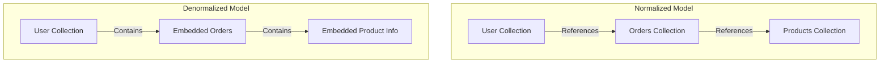

# MongoDB Denormalization

## Introduction

In the world of MongoDB and NoSQL databases, denormalization is a key data modeling technique that can significantly impact your application's performance. Unlike relational databases that emphasize normalization (organizing data to minimize redundancy), MongoDB often embraces denormalization—strategically duplicating data across documents to optimize read performance.

Denormalization represents a fundamental shift in thinking for developers coming from SQL backgrounds. Instead of spreading related data across multiple tables joined by relationships, MongoDB allows you to embed related data directly within documents or strategically duplicate information across collections to support specific access patterns.

In this guide, we'll explore:
- What denormalization means in MongoDB
- When to denormalize your data
- Common denormalization patterns
- Trade-offs and considerations
- Practical examples you can apply to your projects

## What is Denormalization?

**Denormalization** is the process of combining data from multiple entities into a single document or duplicating data across documents to minimize the need for complex queries, joins, or multiple database operations.

In MongoDB, denormalization primarily takes two forms:

1. **Embedded documents**: Nesting related data within a parent document
2. **Data duplication**: Copying specific fields across multiple documents or collections

Let's visualize the difference between normalized and denormalized approaches:



## When to Denormalize

Denormalization is not always the right approach. Here are situations where denormalization makes sense:

1. **Read-heavy workloads**: When your application reads data much more frequently than it writes or updates it
2. **Frequently accessed together**: When certain data fields are commonly queried together
3. **One-to-many relationships with finite growth**: When parent-child relationships won't grow unbounded
4. **Performance optimization**: When queries are too complex or slow with normalized data
5. **Avoiding joins**: When you need to minimize the number of queries to retrieve related data

## Common Denormalization Patterns

### 1. Embedding Documents

The most straightforward denormalization technique is embedding related data directly within a document.

#### Example: Blog Post with Comments

```javascript
// Normalized approach (two collections)
// posts collection
{
  "_id": ObjectId("5f8a76b9d1f2c723489d2f1a"),
  "title": "Introduction to MongoDB",
  "content": "MongoDB is a document database...",
  "author": "Jane Smith",
  "date": ISODate("2023-09-15")
}

// comments collection
{
  "_id": ObjectId("6a2c45d8e3f4g567823h1j2k"),
  "post_id": ObjectId("5f8a76b9d1f2c723489d2f1a"),
  "user": "Bob Johnson",
  "text": "Great introduction!",
  "date": ISODate("2023-09-16")
}
```

```javascript
// Denormalized approach (embedded documents)
{
  "_id": ObjectId("5f8a76b9d1f2c723489d2f1a"),
  "title": "Introduction to MongoDB",
  "content": "MongoDB is a document database...",
  "author": "Jane Smith",
  "date": ISODate("2023-09-15"),
  "comments": [
    {
      "user": "Bob Johnson",
      "text": "Great introduction!",
      "date": ISODate("2023-09-16")
    },
    {
      "user": "Alice Williams",
      "text": "This helped me understand the basics",
      "date": ISODate("2023-09-17")
    }
  ]
}
```

### 2. Duplication of Data

Sometimes you need to store the same data in multiple places to support different access patterns.

#### Example: E-commerce Product in Multiple Categories

```javascript
// products collection
{
  "_id": ObjectId("6a87c9d2e4f5123456789012"),
  "name": "Wireless Headphones",
  "price": 99.99,
  "description": "High-quality wireless headphones with noise cancellation",
  "categories": ["electronics", "audio", "accessories"]
}

// categories collection with denormalized product information
{
  "_id": "electronics",
  "description": "Electronic devices and gadgets",
  "products": [
    {
      "id": ObjectId("6a87c9d2e4f5123456789012"),
      "name": "Wireless Headphones",
      "price": 99.99,
      "thumbnail": "headphones_thumb.jpg"
    },
    // more products...
  ]
}
```

### 3. Computed Fields

Storing pre-computed values can significantly improve read performance at the cost of additional write complexity.

#### Example: Order with Calculated Totals

```javascript
// Without computed fields
{
  "_id": ObjectId("5f8a73b2d1f2c723489d2f7b"),
  "user_id": ObjectId("6a2c35d8e3f4g567823h6j8k"),
  "date": ISODate("2023-09-18"),
  "items": [
    { "product_id": ObjectId("5f8a76b9d1f2c723489d2f1a"), "quantity": 2, "price": 25.99 },
    { "product_id": ObjectId("5f8a76b9d1f2c723489d2f1b"), "quantity": 1, "price": 59.99 }
  ]
}
```

```javascript
// With computed fields
{
  "_id": ObjectId("5f8a73b2d1f2c723489d2f7b"),
  "user_id": ObjectId("6a2c35d8e3f4g567823h6j8k"),
  "date": ISODate("2023-09-18"),
  "items": [
    { "product_id": ObjectId("5f8a76b9d1f2c723489d2f1a"), "quantity": 2, "price": 25.99, "item_total": 51.98 },
    { "product_id": ObjectId("5f8a76b9d1f2c723489d2f1b"), "quantity": 1, "price": 59.99, "item_total": 59.99 }
  ],
  "subtotal": 111.97,
  "tax": 8.96,
  "shipping": 5.99,
  "total": 126.92
}
```

## Trade-offs and Considerations

### Advantages of Denormalization

1. **Improved read performance**: Data is available in a single query
2. **Reduced query complexity**: No need for complex joins or aggregations
3. **Better scalability**: Simpler queries are easier to distribute across shards

### Disadvantages of Denormalization

1. **Increased write complexity**: Updates may need to happen in multiple places
2. **Data consistency challenges**: Duplicated data must be kept in sync
3. **Increased storage requirements**: Duplicated data consumes more space
4. **Document size limits**: MongoDB documents have a 16MB size limit

## Practical Denormalization Example: Building a Social Media Platform

Let's walk through a real-world example of denormalizing data for a social media application.

### User Profile with Activity Feed

```javascript
// Normalized approach
// users collection
{
  "_id": ObjectId("5f8a76b9d1f2c723489d2f1a"),
  "username": "john_doe",
  "name": "John Doe",
  "email": "john@example.com",
  "profile_picture": "profile.jpg"
}

// posts collection
{
  "_id": ObjectId("6a2c45d8e3f4g567823h1j2k"),
  "user_id": ObjectId("5f8a76b9d1f2c723489d2f1a"),
  "content": "Just published my new article!",
  "timestamp": ISODate("2023-09-18T14:30:00Z"),
  "likes": 42
}
```

To display a user profile with recent posts, we'd need multiple queries or complex aggregation pipelines.

Instead, we could denormalize by embedding recent posts and maintaining a separate posts collection for historical data:

```javascript
// Denormalized approach
// users collection with embedded recent activity
{
  "_id": ObjectId("5f8a76b9d1f2c723489d2f1a"),
  "username": "john_doe",
  "name": "John Doe",
  "email": "john@example.com",
  "profile_picture": "profile.jpg",
  "recent_posts": [
    {
      "_id": ObjectId("6a2c45d8e3f4g567823h1j2k"),
      "content": "Just published my new article!",
      "timestamp": ISODate("2023-09-18T14:30:00Z"),
      "likes": 42
    },
    // more recent posts...
  ],
  "post_count": 137,
  "follower_count": 1024,
  "following_count": 325
}

// posts collection still maintains all posts for historical queries
```

This approach allows us to:
1. Display a user profile with recent activity in a single query
2. Show follower/following counts without counting
3. Still maintain the full post history in a separate collection

### Implementing this in Your Application

Here's how you might update the user document when a new post is created:

```javascript
// Create a new post
const newPost = {
  _id: new ObjectId(),
  user_id: userId,
  content: "Hello world!",
  timestamp: new Date(),
  likes: 0
};

// Insert into posts collection
await db.collection('posts').insertOne(newPost);

// Update the user document to include this post in recent_posts
await db.collection('users').updateOne(
  { _id: userId },
  { 
    $push: { 
      recent_posts: { 
        $each: [newPost],
        $sort: { timestamp: -1 },
        $slice: 10  // Keep only the 10 most recent posts
      } 
    },
    $inc: { post_count: 1 }
  }
);
```

## Best Practices for Denormalization

1. **Start with access patterns**: Design your data model based on how your application accesses data
2. **Consider write frequency**: Denormalize only when reads significantly outnumber writes
3. **Watch document size**: Be aware of the 16MB document size limit in MongoDB
4. **Plan for consistency**: Develop strategies to keep denormalized data in sync
5. **Use transactions when necessary**: For critical operations that update multiple documents
6. **Document your decisions**: Create clear documentation explaining your denormalization choices

## Summary

Denormalization in MongoDB is a powerful technique for optimizing data access patterns and improving application performance. By strategically embedding related data or duplicating information across documents, you can reduce query complexity and minimize the number of database operations required.

However, denormalization comes with trade-offs, particularly around write complexity and data consistency. The key is to understand your application's specific needs and design your data model to support your most frequent and critical operations.

Remember, effective data modeling in MongoDB is about balance—finding the right mix of normalized and denormalized structures to support your application's requirements while maintaining appropriate performance characteristics.

## Exercises

1. Take a simple blogging platform with users, posts, and comments. Design both normalized and denormalized data models, and explain the advantages of each approach.

2. Consider an e-commerce application where products can belong to multiple categories. How would you model this relationship to efficiently support:
   - Showing all products in a category
   - Showing all categories a product belongs to
   - Updating product information

3. Implement a function that keeps denormalized data in sync when the original data changes. For example, if a user changes their profile picture, update all references to that picture in denormalized locations.

## Additional Resources

- [MongoDB Data Modeling Documentation](https://www.mongodb.com/docs/manual/core/data-modeling-introduction/)
- [MongoDB Schema Design Patterns](https://www.mongodb.com/blog/post/building-with-patterns-a-summary)
- [MongoDB University: Data Modeling Course](https://learn.mongodb.com/courses/m320-mongodb-data-modeling)