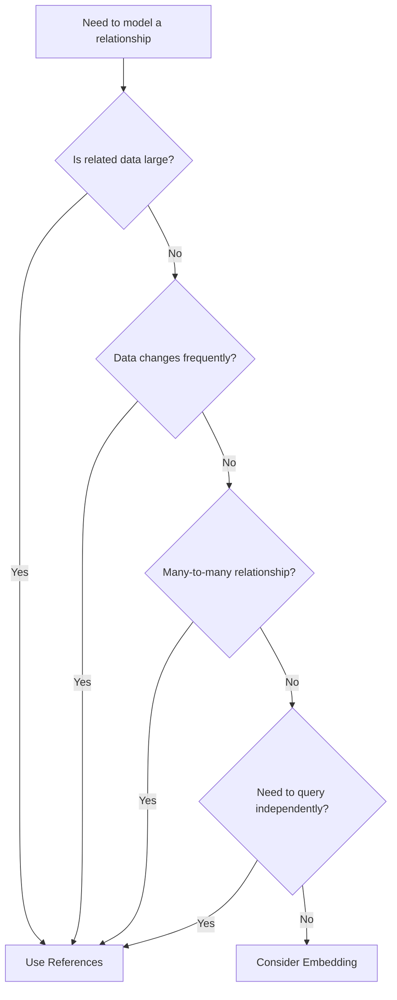

# MongoDB Document References

In MongoDB's document-oriented model, **document references** provide a way to establish relationships between data across multiple collections. Unlike traditional SQL joins, MongoDB handles relationships through references, where one document contains a link to another document—similar to foreign keys but with important differences.

## Introduction to Document References

When designing a MongoDB database, you'll often need to represent relationships between different types of data. For example, a blog application might have users, posts, and comments that are all related to each other. MongoDB offers two main approaches to handle these relationships:

1. **Embedding** - Where related data is nested directly within documents
2. **Referencing** - Where documents contain references (typically IDs) to other documents

This guide focuses on the referencing approach, which is essential when:
- The related data changes frequently
- The related data is large
- You need to access the related data independently
- You want to avoid excessive document growth

## Basic Document References

The simplest way to implement a reference is to store the ObjectId of one document in another document.

### Example: Blog Posts and Authors

Consider a blog with authors and posts:

```javascript
// Authors collection
db.authors.insertOne({
  _id: ObjectId("5f8d2d651fc5e4f83b2a9c1e"),
  name: "Maya Johnson",
  email: "maya@example.com",
  bio: "Tech writer with 10+ years of experience"
});

// Posts collection with reference to author
db.posts.insertOne({
  title: "Understanding MongoDB References",
  content: "MongoDB offers various ways to model relationships...",
  created_at: new Date(),
  author_id: ObjectId("5f8d2d651fc5e4f83b2a9c1e")  // Reference to the author document
});
```

To retrieve a post with its author information, you would need to perform two operations:

```javascript
// Step 1: Find the post
const post = db.posts.findOne({ title: "Understanding MongoDB References" });

// Step 2: Find the author using the reference
const author = db.authors.findOne({ _id: post.author_id });

// Result: Now you have both the post and its author
console.log("Post:", post.title);
console.log("Author:", author.name);
```

**Output:**
```
Post: Understanding MongoDB References
Author: Maya Johnson
```

## Types of References

MongoDB offers several ways to implement references:

### 1. Manual References

The example above uses manual references, where you explicitly store an identifier (typically the `_id` field) in another document and manage the relationship in your application code.

### 2. DBRefs

DBRefs provide a more structured way to reference documents from other collections by including the collection name:

```javascript
// Post with DBRef to author
db.posts.insertOne({
  title: "Advanced MongoDB Techniques",
  content: "Let's explore more advanced concepts...",
  author: {
    $ref: "authors",
    $id: ObjectId("5f8d2d651fc5e4f83b2a9c1e")
  }
});
```

To resolve a DBRef, you need to:

```javascript
// Find the post
const post = db.posts.findOne({ title: "Advanced MongoDB Techniques" });

// Extract the DBRef information
const authorRef = post.author;

// Use the reference to find the author
const author = db[authorRef.$ref].findOne({ _id: authorRef.$id });

console.log("Found author:", author.name);
```

### 3. Population in MongoDB Drivers

Many MongoDB drivers and ODMs (Object-Document Mappers) like Mongoose for Node.js provide "population" features that automatically resolve references:

```javascript
// Using Mongoose (Node.js example)
const Post = mongoose.model('Post', new Schema({
  title: String,
  content: String,
  author: { type: Schema.Types.ObjectId, ref: 'Author' }
}));

// Finding a post and populating the author reference
const post = await Post.findOne({ title: "Understanding MongoDB References" }).populate('author');
console.log(post.title, "by", post.author.name);
```

## Reference Patterns

### One-to-One Relationships

For one-to-one relationships, you can place the reference on either side of the relationship:

```javascript
// User document with a reference to a single address document
db.users.insertOne({
  name: "John Doe",
  email: "john@example.com",
  address_id: ObjectId("5f8d2ea61fc5e4f83b2a9c1f")
});
```

### One-to-Many Relationships

For one-to-many relationships, place the reference on the "many" side to avoid arrays that might grow indefinitely:

```javascript
// A product belongs to one category
db.products.insertOne({
  name: "MongoDB Cookbook",
  price: 29.99,
  category_id: ObjectId("5f8d2f121fc5e4f83b2a9c20")
});

// Find all products in a category
db.products.find({ category_id: ObjectId("5f8d2f121fc5e4f83b2a9c20") });
```

### Many-to-Many Relationships

For many-to-many relationships, you can either:
1. Use an array of references on both sides (if small and stable)
2. Create a separate collection to store the relationship (better for larger datasets)

```javascript
// Students collection
db.students.insertOne({
  name: "Alex Wong",
  courses: [
    ObjectId("5f8d30121fc5e4f83b2a9c21"),
    ObjectId("5f8d30121fc5e4f83b2a9c22")
  ]
});

// Alternatively, use a separate enrollments collection
db.enrollments.insertOne({
  student_id: ObjectId("5f8d30891fc5e4f83b2a9c23"),
  course_id: ObjectId("5f8d30121fc5e4f83b2a9c21"),
  enrolled_date: new Date(),
  grade: "A"
});
```

## Real-World Example: E-commerce Application

Let's model an e-commerce application with customers, orders, and products:

```javascript
// Create a customer
db.customers.insertOne({
  _id: ObjectId("6001f1d5fbb5d1aad731a3e1"),
  name: "Elena Martinez",
  email: "elena@example.com",
  address: {
    street: "123 Main St",
    city: "Austin",
    state: "TX",
    zip: "78701"
  },
  created_at: new Date()
});

// Create products
db.products.insertMany([
  {
    _id: ObjectId("6001f20bfbb5d1aad731a3e2"),
    name: "Smartphone X",
    price: 699.99,
    inventory: 120
  },
  {
    _id: ObjectId("6001f20bfbb5d1aad731a3e3"),
    name: "Wireless Headphones",
    price: 149.99,
    inventory: 75
  }
]);

// Create an order with references
db.orders.insertOne({
  order_id: "ORD-2023-12345",
  customer_id: ObjectId("6001f1d5fbb5d1aad731a3e1"),
  status: "processing",
  created_at: new Date(),
  items: [
    {
      product_id: ObjectId("6001f20bfbb5d1aad731a3e2"),
      quantity: 1,
      price: 699.99
    },
    {
      product_id: ObjectId("6001f20bfbb5d1aad731a3e3"),
      quantity: 1,
      price: 149.99
    }
  ],
  total: 849.98
});
```

To retrieve complete order information:

```javascript
// Find the order
const order = db.orders.findOne({ order_id: "ORD-2023-12345" });

// Find the customer
const customer = db.customers.findOne({ _id: order.customer_id });

// Find all products in the order
const productIds = order.items.map(item => item.product_id);
const products = db.products.find({ _id: { $in: productIds } }).toArray();

// Combine the data (in application code)
const orderDetails = {
  orderInfo: order,
  customer: customer,
  products: products
};

console.log("Order for:", customer.name);
console.log("Products:", products.map(p => p.name).join(", "));
```

## When to Use References vs. Embedding

Consider using references when:

1. **The referenced data is large**: Embedding large documents can hit MongoDB's document size limit (16MB)
2. **Data is shared across multiple documents**: To avoid duplication and inconsistencies
3. **Data changes frequently**: To avoid updating the same data in multiple places
4. **You need to query the referenced data directly**: For independent access patterns
5. **Many-to-many relationships**: Especially with large datasets



## Performance Considerations

While references provide flexibility, they require additional queries to fetch related data. Consider these strategies for optimization:

1. **Indexing**: Always create indexes on fields used for references
   ```javascript
   db.posts.createIndex({ author_id: 1 });
   ```

2. **Denormalization**: Strategically duplicate some data to reduce the need for lookups
   ```javascript
   // Include author name in posts for display purposes
   db.posts.insertOne({
     title: "MongoDB Tips",
     content: "Here are some useful tips...",
     author_id: ObjectId("5f8d2d651fc5e4f83b2a9c1e"),
     author_name: "Maya Johnson"  // Denormalized field
   });
   ```

3. **Application-side Joins**: Use MongoDB's `$lookup` aggregation stage (introduced in MongoDB 3.2) for server-side joins:

   ```javascript
   db.posts.aggregate([
     { $match: { title: "Understanding MongoDB References" } },
     { 
       $lookup: {
         from: "authors",
         localField: "author_id",
         foreignField: "_id",
         as: "author_details"
       }
     }
   ]);
   ```

## Summary

Document references in MongoDB provide a flexible way to model relationships between data stored in separate collections. Unlike SQL foreign keys, MongoDB references are managed at the application level, giving you control over how and when to load related data.

Key takeaways:
- Use references when dealing with large, frequently changing, or shared data
- Choose the appropriate reference pattern based on your relationship type
- Consider performance implications and use indexing
- Strategically denormalize data when it makes sense for your access patterns
- Take advantage of MongoDB drivers and aggregation features for efficient data retrieval

## Exercises

1. Model a blog system with users, posts, and comments using references.
2. Implement a movie database that includes references between movies, actors, and directors.
3. Design a social media platform's data model that handles user connections and content sharing.
4. Create an inventory management system with references between products, categories, and suppliers.
5. Practice using `$lookup` to join referenced collections in different scenarios.

## Additional Resources

- [MongoDB Documentation on Data Modeling](https://docs.mongodb.com/manual/core/data-modeling-introduction/)
- [MongoDB University Course: Data Modeling](https://university.mongodb.com/courses/M320/about)
- [The MongoDB Aggregation Framework](https://docs.mongodb.com/manual/core/aggregation-pipeline/)
- [6 Rules of Thumb for MongoDB Schema Design](https://www.mongodb.com/blog/post/6-rules-of-thumb-for-mongodb-schema-design)