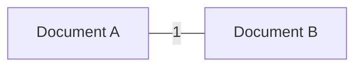

# MongoDB One-to-One Relationships

In the world of database design, understanding relationships between different data entities is crucial. One of the simplest but most important relationships is the **one-to-one** relationship. In this tutorial, we'll explore how MongoDB—a popular NoSQL database—handles one-to-one relationships, along with best practices and real-world examples.

## What is a One-to-One Relationship?

A one-to-one relationship occurs when exactly one document in collection A is related to exactly one document in collection B (or within the same collection).



Unlike in relational databases where these relationships are established through foreign keys, MongoDB provides several approaches to model one-to-one relationships.

## Methods to Implement One-to-One Relationships in MongoDB

There are two primary methods to implement one-to-one relationships in MongoDB:

1. **Embedded Documents**: Nesting one document inside another
2. **Document References**: Using references or links between documents

Let's explore both approaches with examples.

## Approach 1: Embedded Documents

The most straightforward way to represent a one-to-one relationship in MongoDB is by embedding one document within another. This is often the preferred approach for true one-to-one relationships.

### When to Use Embedded Documents

- When the embedded data is always accessed together with the parent document
- When the embedded data is not queried independently
- When the embedded data doesn't grow unbounded over time

### Example: User Profile

Consider a user and their profile information. A user has exactly one profile, and a profile belongs to exactly one user.

```javascript
// User document with embedded profile
{
  _id: ObjectId("507f1f77bcf86cd799439011"),
  name: "John Doe",
  email: "john.doe@example.com",
  profile: {
    bio: "Software developer with 5 years of experience",
    dateOfBirth: ISODate("1990-05-15"),
    address: {
      street: "123 Main St",
      city: "San Francisco",
      state: "CA",
      zipCode: "94123"
    },
    socialLinks: {
      twitter: "@johndoe",
      github: "johndoe",
      linkedin: "john-doe"
    }
  }
}
```

### Retrieving Data

Querying for embedded documents is straightforward:

```javascript
// Find a user and their profile
db.users.findOne({ name: "John Doe" });

// Query based on profile information
db.users.findOne({ "profile.address.city": "San Francisco" });
```

### Advantages of Embedding

1. **Single Query Efficiency**: Retrieving all information requires just one query
2. **Atomic Updates**: MongoDB ensures that updates to the document are atomic
3. **Better Data Locality**: Related data is stored together, improving read performance

## Approach 2: Document References

For some one-to-one relationships, you might want to keep the documents separate and use references between them. This approach is useful when the related document is large or when you need to access each entity independently.

### When to Use References

- When the referenced document is large and not always needed
- When the referenced document changes frequently
- When you need to query the referenced document separately

### Example: User and Medical Records

Consider a user and their medical records. Due to privacy concerns and the large size of medical data, you might want to store them separately.

```javascript
// User collection
{
  _id: ObjectId("507f1f77bcf86cd799439011"),
  name: "John Doe",
  email: "john.doe@example.com",
  medicalRecordId: ObjectId("507f1f77bcf86cd799439022")
}

// MedicalRecords collection
{
  _id: ObjectId("507f1f77bcf86cd799439022"),
  userId: ObjectId("507f1f77bcf86cd799439011"),
  bloodType: "O+",
  allergies: ["Penicillin", "Peanuts"],
  medicalHistory: [
    {
      condition: "Appendectomy",
      date: ISODate("2015-03-12"),
      notes: "Routine procedure, no complications"
    },
    {
      condition: "Fractured wrist",
      date: ISODate("2018-07-23"),
      notes: "Left wrist, clean break"
    }
  ],
  // Potentially large amounts of additional medical data
}
```

### Retrieving Referenced Data

To get the complete data, you'll need two queries or an aggregation:

```javascript
// Find the user
const user = db.users.findOne({ name: "John Doe" });

// Then find their medical record
const medicalRecord = db.medicalRecords.findOne({ _id: user.medicalRecordId });

// Using MongoDB's $lookup (similar to SQL JOIN)
db.users.aggregate([
  { $match: { name: "John Doe" } },
  {
    $lookup: {
      from: "medicalRecords",
      localField: "medicalRecordId",
      foreignField: "_id",
      as: "medicalRecord"
    }
  }
]);
```

### Advantages of References

1. **Smaller Documents**: Main documents stay smaller, improving performance
2. **Independent Access**: Each entity can be accessed and updated independently
3. **Better for Large Documents**: Prevents documents from exceeding MongoDB's size limit (16MB)

## Real-World Applications

Let's examine some real-world scenarios where one-to-one relationships are common:

### Example 1: E-commerce Product and Detailed Description

In an e-commerce platform, you might have basic product information and detailed descriptions:

```javascript
// Products collection
{
  _id: ObjectId("60a6f4d94569f41c9c7feb11"),
  name: "Professional Camera XYZ",
  price: 1299.99,
  category: "Electronics",
  inStock: 15,
  // Reference to detailed information
  detailsId: ObjectId("60a6f4d94569f41c9c7feb22")
}

// ProductDetails collection
{
  _id: ObjectId("60a6f4d94569f41c9c7feb22"),
  productId: ObjectId("60a6f4d94569f41c9c7feb11"),
  description: "Professional-grade digital camera with...",
  technicalSpecifications: {
    sensor: "Full-frame CMOS",
    megapixels: "24.2MP",
    iso: "100-25600 (expandable to 102400)",
    // More detailed specifications
  },
  dimensions: {
    width: "146mm",
    height: "124mm",
    depth: "78.5mm",
    weight: "880g"
  },
  videoReviews: [
    "https://example.com/video1",
    "https://example.com/video2"
  ],
  manualUrl: "https://example.com/manuals/camera-xyz.pdf"
}
```

This design keeps the basic product information (accessed frequently) separate from the detailed information (accessed only when viewing a specific product).

### Example 2: Blog Post and Analytics

For a blogging platform, you might want to separate post content from analytics data:

```javascript
// Posts collection
{
  _id: ObjectId("60d2f4d94569f41c9c7feb33"),
  title: "Understanding MongoDB Relationships",
  content: "MongoDB provides several ways to model relationships...",
  author: "Jane Smith",
  publishedDate: ISODate("2023-03-15"),
  tags: ["MongoDB", "NoSQL", "Databases"]
}

// PostAnalytics collection (embedded approach)
{
  _id: ObjectId("60d2f4d94569f41c9c7feb33"), // Same ID as post
  views: 4521,
  uniqueVisitors: 3842,
  averageReadTime: "4m 32s",
  bounceRate: 0.23,
  referrers: {
    "google.com": 1245,
    "twitter.com": 856,
    "facebook.com": 732,
    "linkedin.com": 412
  },
  geoDistribution: {
    "US": 1845,
    "India": 756,
    "UK": 423,
    // More countries
  },
  deviceBreakdown: {
    "Mobile": 2356,
    "Desktop": 1876,
    "Tablet": 289
  }
}
```

In this case, we use the same `_id` for both documents (called "extended reference pattern"), which makes it easy to fetch the analytics when needed.

## Best Practices

When deciding between embedded documents and references for one-to-one relationships, consider these guidelines:

1. **Document Size**: If the combined document might approach MongoDB's 16MB limit, use references
2. **Access Patterns**: If you always need both documents together, embedding is usually better
3. **Update Frequency**: If one part changes frequently and the other rarely, consider separating them
4. **Query Patterns**: If you need to query against the embedded document frequently, embedding might improve performance
5. **Document Growth**: If the embedded part might grow significantly over time, use references

## Comparison: Embedding vs. References

Here's a quick reference to help you decide which approach to use:

| Factor | Embedding | References |
|--------|-----------|------------|
| Read Performance | ✅ Better (single query) | ❌ Requires multiple queries |
| Write Performance | ❌ Updates entire document | ✅ Updates only relevant document |
| Document Size | ❌ May hit 16MB limit | ✅ Splits data across documents |
| Query Flexibility | ✅ Easy to query embedded fields | ❌ Requires joins ($lookup) |
| Atomic Operations | ✅ Guaranteed for one document | ❌ Not guaranteed across documents |
| Development Complexity | ✅ Simpler to implement | ❌ More complex with references |

## Summary

MongoDB's flexible schema allows for different approaches to modeling one-to-one relationships:

- **Embedded documents** are ideal for true one-to-one relationships where data is always accessed together and doesn't grow too large.
- **Document references** are better for large documents or when you need to access and update components independently.

Understanding these patterns lets you make informed decisions about your data model, balancing factors like performance, maintenance, and future growth.

## Exercises

1. Design a one-to-one relationship between a `Student` and a `StudentID` document. Consider what fields would be appropriate for each document and whether to use embedding or references.
2. Implement a one-to-one relationship for a social media platform between `User` and `PrivacySettings`. Think about access patterns and which approach would be most efficient.
3. Refactor an embedded document model into a referenced model. Consider a `Car` document with embedded `EngineDetails` and convert it to use references.

## Further Reading

- MongoDB Documentation on [Data Modeling Patterns](https://docs.mongodb.com/manual/applications/data-models/)
- MongoDB University's free courses on data modeling
- The "MongoDB: The Definitive Guide" book by Shannon Bradshaw and Kristina Chodorow

Remember that the best data model depends heavily on your application's specific requirements, especially query patterns and update frequency. MongoDB's flexibility gives you the freedom to choose the most appropriate design for your needs.