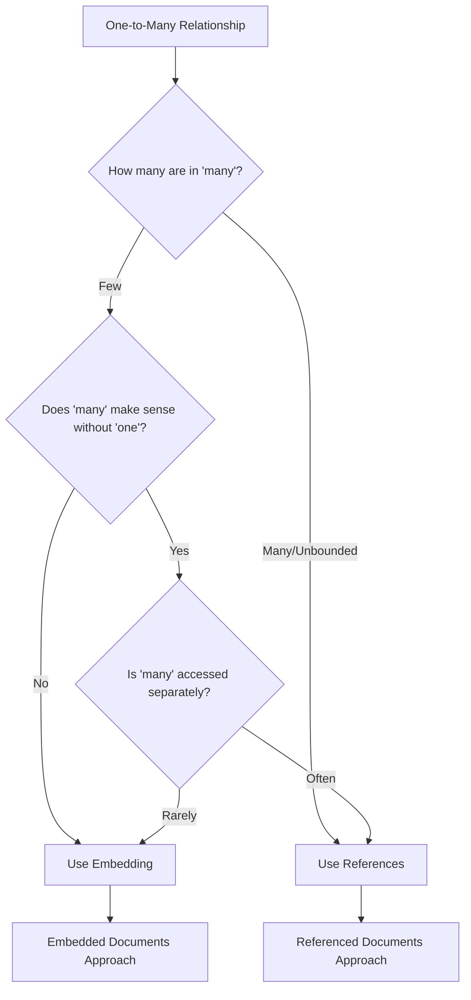

# MongoDB One-to-Many Relationships

One-to-many relationships are among the most common data relationships you'll encounter when designing database schemas. In traditional relational databases, these relationships are typically handled through foreign keys. However, MongoDB, being a document-oriented database, provides more flexible options for modeling one-to-many relationships.

## Introduction to One-to-Many Relationships

A one-to-many relationship occurs when a single entity is associated with multiple instances of another entity. For example:

- One author writes many books
- One customer places many orders
- One department has many employees

In MongoDB, there are primarily two approaches to model these relationships:

1. **Embedded Documents** - where related data is nested within the parent document
2. **Document References** - where related data is kept in separate collections and referenced

Let's explore both approaches with examples.

## Embedded Documents Approach

Embedding documents is a natural way to model one-to-many relationships in MongoDB when the "many" side belongs exclusively to the "one" side and is typically accessed together.

### When to Use Embedded Documents

- The "many" objects always appear within the context of their parent
- The number of child documents is small and has controlled growth
- Deep and frequent querying of the embedded data is required
- You need to atomically update the entire document

### Example: Author and Books

Consider an author who has written several books:

```javascript
// An author document with embedded books
db.authors.insertOne({
  name: "J.K. Rowling",
  country: "United Kingdom",
  birthDate: new Date("1965-07-31"),
  books: [
    {
      title: "Harry Potter and the Philosopher's Stone",
      publishedYear: 1997,
      pages: 223,
      genres: ["Fantasy", "Young Adult"]
    },
    {
      title: "Harry Potter and the Chamber of Secrets",
      publishedYear: 1998,
      pages: 251,
      genres: ["Fantasy", "Young Adult"]
    },
    {
      title: "The Casual Vacancy",
      publishedYear: 2012,
      pages: 503,
      genres: ["Drama", "Fiction"]
    }
  ]
});
```

### Querying Embedded Documents

To find an author with a specific book:

```javascript
db.authors.find({ "books.title": "The Casual Vacancy" });
```

To find all authors who have published books in the "Fantasy" genre:

```javascript
db.authors.find({ "books.genres": "Fantasy" });
```

### Updating Embedded Documents

Adding a new book to an author's list:

```javascript
db.authors.updateOne(
  { name: "J.K. Rowling" },
  {
    $push: {
      books: {
        title: "Harry Potter and the Prisoner of Azkaban",
        publishedYear: 1999,
        pages: 317,
        genres: ["Fantasy", "Young Adult"]
      }
    }
  }
);
```

## Document References Approach

For larger or more complex relationships, referencing documents across collections may be more appropriate.

### When to Use Document References

- The "many" objects can exist independently of the "one" object
- The number of child documents is large or unbounded
- The child documents are frequently accessed directly without loading the parent
- The child documents are shared between multiple parent documents
- The overall document would be too large with embedded data

### Example: Department and Employees

Consider a department with multiple employees:

```javascript
// First, create the departments
db.departments.insertOne({
  _id: ObjectId("5f8d0c91f2f2e8a2b9c6a1d3"),
  name: "Engineering",
  location: "Building A",
  budget: 500000
});

// Then create employees that reference their department
db.employees.insertMany([
  {
    name: "Alice Johnson",
    title: "Software Engineer",
    hireDate: new Date("2019-03-15"),
    department_id: ObjectId("5f8d0c91f2f2e8a2b9c6a1d3"),
    skills: ["JavaScript", "MongoDB", "Node.js"]
  },
  {
    name: "Bob Smith",
    title: "Senior Developer",
    hireDate: new Date("2017-11-05"),
    department_id: ObjectId("5f8d0c91f2f2e8a2b9c6a1d3"),
    skills: ["Python", "AWS", "System Design"]
  },
  {
    name: "Carol Williams",
    title: "DevOps Engineer",
    hireDate: new Date("2020-01-12"),
    department_id: ObjectId("5f8d0c91f2f2e8a2b9c6a1d3"),
    skills: ["Docker", "Kubernetes", "CI/CD"]
  }
]);
```

### Querying Referenced Documents

To find all employees in a specific department:

```javascript
db.employees.find({ department_id: ObjectId("5f8d0c91f2f2e8a2b9c6a1d3") });
```

### Using Aggregation for Joins

MongoDB's aggregation framework allows you to join data across collections:

```javascript
db.employees.aggregate([
  {
    $match: {
      name: "Alice Johnson"
    }
  },
  {
    $lookup: {
      from: "departments",
      localField: "department_id",
      foreignField: "_id",
      as: "department"
    }
  },
  {
    $unwind: "$department"
  }
]);
```

This returns the employee document with their department information included.

## Real-world Application: E-commerce Platform

Let's model a more complex real-world example of an e-commerce platform where customers can place multiple orders.

### Customer and Orders Model

Since orders are business-critical documents that may need to be queried independently and can grow significantly, we'll use the referenced approach:

```javascript
// Create a customer
db.customers.insertOne({
  _id: ObjectId("6052f9e5d67c4a8d12b5c123"),
  name: "John Doe",
  email: "john.doe@example.com",
  address: {
    street: "123 Main St",
    city: "Boston",
    state: "MA",
    zipCode: "02108"
  },
  phone: "+1-555-123-4567",
  dateCreated: new Date("2020-10-15")
});

// Create multiple orders for this customer
db.orders.insertMany([
  {
    customer_id: ObjectId("6052f9e5d67c4a8d12b5c123"),
    orderNumber: "ORD-2021-001",
    orderDate: new Date("2021-01-10"),
    status: "Delivered",
    shippingAddress: {
      street: "123 Main St",
      city: "Boston",
      state: "MA",
      zipCode: "02108"
    },
    totalAmount: 125.99,
    items: [
      { product: "Wireless Headphones", quantity: 1, price: 89.99 },
      { product: "Phone Case", quantity: 2, price: 18.00 }
    ]
  },
  {
    customer_id: ObjectId("6052f9e5d67c4a8d12b5c123"),
    orderNumber: "ORD-2021-008",
    orderDate: new Date("2021-02-22"),
    status: "Processing",
    shippingAddress: {
      street: "123 Main St",
      city: "Boston",
      state: "MA",
      zipCode: "02108"
    },
    totalAmount: 349.95,
    items: [
      { product: "Smart Watch", quantity: 1, price: 299.95 },
      { product: "Watch Band", quantity: 1, price: 50.00 }
    ]
  }
]);
```

Notice how we've embedded the order items within the orders, while keeping orders separate from customers. This is a hybrid approach that's common in real-world applications.

### Finding a Customer's Orders

```javascript
// Find all orders for a specific customer
db.orders.find({ customer_id: ObjectId("6052f9e5d67c4a8d12b5c123") });
```

### Getting Customer with Their Orders

```javascript
db.customers.aggregate([
  {
    $match: {
      _id: ObjectId("6052f9e5d67c4a8d12b5c123")
    }
  },
  {
    $lookup: {
      from: "orders",
      localField: "_id",
      foreignField: "customer_id",
      as: "customerOrders"
    }
  }
]);
```

## Choosing Between Embedding and Referencing

Here's a decision flowchart to help you choose the right approach:



## Best Practices for One-to-Many Relationships

1. **Performance Considerations**:
   - Embedded documents provide better read performance (single query)
   - Referenced documents provide better scalability for large datasets

2. **Document Size Limits**:
   - Remember MongoDB's 16MB document size limit
   - Use references when embedded arrays might grow significantly

3. **Data Consistency**:
   - Embedded documents ensure atomic updates
   - Referenced documents require additional logic for consistency

4. **Denormalization Strategy**:
   - Consider selectively duplicating important fields for query performance
   - Update these duplicated fields with appropriate write concern levels

## Summary

MongoDB offers flexible ways to model one-to-many relationships:

- **Embedded documents** are ideal when the "many" side is closely related to the "one" side, relatively small in size, and typically queried together.
  
- **Referenced documents** are better when the "many" side is large, can exist independently, or is shared across multiple parent documents.

In real-world applications, you might often use a hybrid approach where some data is embedded and some is referenced based on access patterns and scalability requirements.

Remember that the right data modeling choice depends on:
- Your specific application requirements
- How the data will be queried
- The expected growth of the data
- The relationships between different entities

## Exercises

1. Model a blog platform where each user can have multiple posts, and each post can have multiple comments.

2. Design a library database where books can belong to multiple categories and can have multiple borrowing records.

3. Create a school management system where courses have many students enrolled, and students can enroll in multiple courses.

## Additional Resources

- [MongoDB Data Modeling Documentation](https://docs.mongodb.com/manual/core/data-model-design/)
- [MongoDB Schema Design Patterns](https://www.mongodb.com/blog/post/building-with-patterns-a-summary)
- [MongoDB University: Data Modeling Course](https://university.mongodb.com/courses/M320/about)