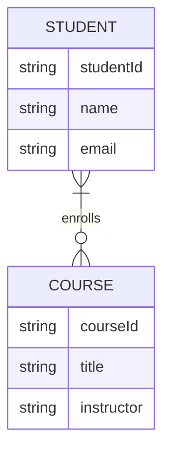

# MongoDB Many-to-Many Relationships

In database design, a many-to-many relationship occurs when multiple records in one collection can be related to multiple records in another collection. Unlike relational databases, MongoDB doesn't have built-in support for joins or foreign keys, but it offers flexible ways to model these relationships.

## Understanding Many-to-Many Relationships

A many-to-many relationship connects multiple entities from both sides. Let's understand this with an example:

- Students can enroll in multiple courses
- Each course can have multiple students enrolled



In a relational database, you'd typically create a junction table to manage this relationship. In MongoDB, you have multiple approaches to model this relationship.

## Approaches to Model Many-to-Many Relationships

### 1. Embedded Documents (Denormalized Approach)

This approach involves embedding related data within each document. It works well when:
- The embedded data doesn't change frequently
- You frequently need to retrieve related data together
- The embedded array won't grow too large

#### Example: Students with Embedded Courses

```javascript
// Student Collection
{
  _id: "s1",
  name: "John Doe",
  email: "john@example.com",
  courses: [
    {
      courseId: "c1",
      title: "MongoDB Basics",
      instructor: "Jane Smith"
    },
    {
      courseId: "c2",
      title: "Advanced NoSQL",
      instructor: "Mike Johnson"
    }
  ]
}
```

#### Example: Courses with Embedded Students

```javascript
// Course Collection
{
  _id: "c1",
  title: "MongoDB Basics",
  instructor: "Jane Smith",
  students: [
    {
      studentId: "s1",
      name: "John Doe",
      email: "john@example.com"
    },
    {
      studentId: "s2",
      name: "Sarah Williams",
      email: "sarah@example.com"
    }
  ]
}
```

#### Pros and Cons

**Advantages:**
- Fast reads - all data is retrieved in a single query
- No need for additional queries to fetch related data

**Disadvantages:**
- Data duplication
- Updating related data requires updates in multiple places
- Document size limit (16MB in MongoDB)
- Performance issues with large arrays

### 2. References (Normalized Approach)

This approach uses references (similar to foreign keys) to connect related documents. It works well when:
- Related data changes frequently
- You need to access related entities independently
- The relationship involves many documents

#### Example: Students with Course References

```javascript
// Student Collection
{
  _id: "s1",
  name: "John Doe",
  email: "john@example.com",
  courses: ["c1", "c2", "c3"]
}

// Course Collection
{
  _id: "c1",
  title: "MongoDB Basics",
  instructor: "Jane Smith"
}
```

#### Example: Courses with Student References

```javascript
// Course Collection
{
  _id: "c1",
  title: "MongoDB Basics",
  instructor: "Jane Smith",
  students: ["s1", "s2", "s10"]
}

// Student Collection
{
  _id: "s1",
  name: "John Doe",
  email: "john@example.com"
}
```

#### Pros and Cons

**Advantages:**
- No data duplication
- Easier to update common data
- Smaller document sizes

**Disadvantages:**
- Requires multiple queries to fetch complete related data
- More complex application logic

### 3. Intermediate Collection (Junction Collection)

This approach mimics the junction table pattern from relational databases.

```javascript
// Student Collection
{
  _id: "s1",
  name: "John Doe",
  email: "john@example.com"
}

// Course Collection
{
  _id: "c1",
  title: "MongoDB Basics",
  instructor: "Jane Smith"
}

// Enrollment Collection (Junction)
{
  _id: ObjectId("..."),
  studentId: "s1",
  courseId: "c1",
  enrolledDate: ISODate("2023-01-15"),
  grade: "A"
}
```

This approach is ideal when:
- The relationship itself has attributes (enrollment date, grade)
- You need to track the history of relationships
- The many-to-many relationship is complex

## Working with Many-to-Many Relationships in MongoDB

### Querying Embedded Documents

Retrieving students enrolled in a specific course:

```javascript
// Find all students enrolled in "MongoDB Basics"
db.students.find({
  "courses.title": "MongoDB Basics"
})
```

### Querying with References

Retrieving complete course data for a student using references:

```javascript
// Step 1: Find a student
const student = db.students.findOne({ _id: "s1" });

// Step 2: Query courses referenced by the student
const courses = db.courses.find({
  _id: { $in: student.courses }
}).toArray();
```

### Using MongoDB's Aggregation Framework

The aggregation framework provides a more powerful way to work with related data:

```javascript
// Find students and their courses using the $lookup stage
db.students.aggregate([
  {
    $match: { name: "John Doe" }
  },
  {
    $lookup: {
      from: "courses",
      localField: "courses",
      foreignField: "_id",
      as: "enrolledCourses"
    }
  }
])
```

## Real-World Example: Blog Platform

Let's model a blog platform where:
- Posts can have multiple tags
- Each tag can be applied to multiple posts

### Approach 1: Embedding Tags in Posts

```javascript
// Posts collection
{
  _id: ObjectId("60a8c4e85e953d8e1cf478b2"),
  title: "Getting Started with MongoDB",
  content: "MongoDB is a document database...",
  author: "author123",
  tags: [
    { _id: "t1", name: "mongodb" },
    { _id: "t2", name: "database" },
    { _id: "t3", name: "nosql" }
  ],
  created: ISODate("2023-05-21T14:31:00Z")
}
```

**Querying posts with a specific tag:**

```javascript
db.posts.find({ "tags.name": "mongodb" })
```

### Approach 2: Using References

```javascript
// Posts collection
{
  _id: ObjectId("60a8c4e85e953d8e1cf478b2"),
  title: "Getting Started with MongoDB",
  content: "MongoDB is a document database...",
  author: "author123",
  tags: ["t1", "t2", "t3"],
  created: ISODate("2023-05-21T14:31:00Z")
}

// Tags collection
{
  _id: "t1",
  name: "mongodb",
  description: "Posts about MongoDB"
}
```

**Finding all posts with a specific tag:**

```javascript
// First find the tag
const tag = db.tags.findOne({ name: "mongodb" });

// Then find all posts with this tag
const posts = db.posts.find({ tags: tag._id }).toArray();
```

### Approach 3: Junction Collection

```javascript
// Posts collection
{
  _id: ObjectId("60a8c4e85e953d8e1cf478b2"),
  title: "Getting Started with MongoDB",
  content: "MongoDB is a document database...",
  author: "author123",
  created: ISODate("2023-05-21T14:31:00Z")
}

// Tags collection
{
  _id: "t1",
  name: "mongodb",
  description: "Posts about MongoDB"
}

// PostTags collection (junction)
{
  _id: ObjectId("60b91c5e0e1d792a3c9b4567"),
  postId: ObjectId("60a8c4e85e953d8e1cf478b2"),
  tagId: "t1",
  addedBy: "editor123",
  addedOn: ISODate("2023-05-21T15:00:00Z")
}
```

**Finding all posts with a specific tag using aggregation:**

```javascript
db.postTags.aggregate([
  {
    $match: { tagId: "t1" }
  },
  {
    $lookup: {
      from: "posts",
      localField: "postId",
      foreignField: "_id",
      as: "postDetails"
    }
  },
  {
    $unwind: "$postDetails"
  },
  {
    $project: {
      _id: "$postDetails._id",
      title: "$postDetails.title",
      content: "$postDetails.content",
      author: "$postDetails.author",
      created: "$postDetails.created"
    }
  }
])
```

## Best Practices for Managing Many-to-Many Relationships

1. **Consider Access Patterns**: Design your data model based on how your application will access the data.

2. **Document Size Limit**: Remember MongoDB's 16MB document size limit when embedding documents.

3. **Balance Between Reads and Writes**: 
   - If your application is read-heavy, favor embedding
   - If it's write-heavy with frequent updates to related data, use references

4. **Use Indexes**: Always create appropriate indexes on fields used in queries, especially reference fields.

5. **Avoid Deep Nesting**: Keep document structures relatively flat to maintain performance.

6. **Consider Document Growth**: If a relationship could result in unbounded growth, use references instead of embedding.

7. **Use Aggregation Framework**: For complex relationship queries, leverage MongoDB's aggregation framework.

## Summary

MongoDB offers several approaches to implement many-to-many relationships:

1. **Embedded documents**: Fast reads but duplicated data
2. **References**: Normalized structure requiring multiple queries
3. **Junction collections**: Great for relationships with additional attributes

Each approach has its advantages and trade-offs. The best choice depends on:
- Your application's read/write patterns
- The size and growth of your data
- How often related data changes
- Query complexity requirements

## Exercises

1. Model a many-to-many relationship between "Movies" and "Actors" using all three approaches discussed.
2. Implement a system for "Products" and "Categories" where a product can belong to multiple categories.
3. Design a data model for a university database where students can enroll in multiple courses and courses can have multiple students.

## Additional Resources

- [MongoDB Data Modeling Documentation](https://docs.mongodb.com/manual/core/data-model-design/)
- [MongoDB Schema Design Patterns](https://www.mongodb.com/blog/post/building-with-patterns-a-summary)
- [Working with MongoDB Relationships](https://www.mongodb.com/blog/post/6-rules-of-thumb-for-mongodb-schema-design)

By understanding these modeling techniques, you can design efficient and scalable database models for applications with complex relationships. Remember that there's no one-size-fits-all solution—each approach has its place depending on your application's specific needs.