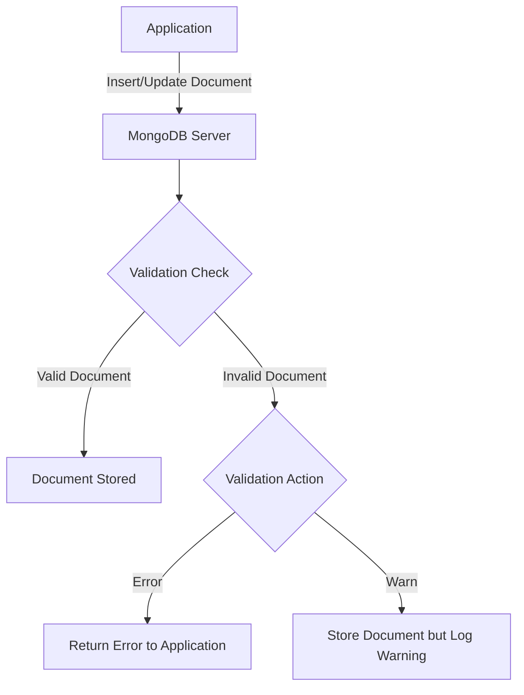

# MongoDB Schema Validation

## Introduction

In traditional relational databases, schemas strictly define the structure of your data. MongoDB, being a NoSQL database, offers flexibility with its schema-less design. While this flexibility is powerful, it can also lead to inconsistent data structures that complicate application development and data maintenance.

MongoDB's Schema Validation feature provides the best of both worlds - the flexibility of a document database with the option to enforce data integrity rules when needed. This capability allows you to define validation rules that documents must satisfy before being inserted or updated in a collection.

## Why Use Schema Validation?

Schema validation in MongoDB helps you:

1. Maintain data consistency across documents
2. Prevent invalid data from entering your collections
3. Document your data structure for other developers
4. Enforce business rules at the database level
5. Reduce application-level validation code

## Understanding Schema Validation

Schema validation in MongoDB works by defining a set of rules that documents must satisfy to be accepted into a collection. These rules are specified when creating or modifying a collection.

### Validation Levels

MongoDB offers three validation levels:

- **strict**: All inserts and updates are checked against the validation rules
- **moderate**: Updates to existing valid documents are allowed, even if they violate validation rules
- **off**: All validation rules are disabled

### Validation Actions

MongoDB provides two validation actions:

- **error**: MongoDB rejects any document that violates validation rules
- **warn**: MongoDB allows invalid documents but logs warnings to the MongoDB log

## Implementing Schema Validation

### JSON Schema Validation

The most common way to implement schema validation is using JSON Schema, a vocabulary that allows you to annotate and validate JSON documents.

Let's create a collection with schema validation:

```javascript
db.createCollection("products", {
  validator: {
    $jsonSchema: {
      bsonType: "object",
      required: ["name", "price", "category"],
      properties: {
        name: {
          bsonType: "string",
          description: "must be a string and is required"
        },
        price: {
          bsonType: "number",
          minimum: 0,
          description: "must be a positive number and is required"
        },
        category: {
          bsonType: "string",
          description: "must be a string and is required"
        },
        description: {
          bsonType: "string",
          description: "must be a string if the field exists"
        },
        inStock: {
          bsonType: "bool",
          description: "must be a boolean if the field exists"
        }
      }
    }
  },
  validationLevel: "strict",
  validationAction: "error"
})
```

In this example, we're creating a "products" collection with validation rules that require:
- A product name (string)
- A price (positive number)
- A category (string)
- Optional description (string)
- Optional inStock status (boolean)

### Testing the Schema Validation

Let's see what happens when we try to insert valid and invalid documents:

#### Valid Document:

```javascript
db.products.insertOne({
  name: "Laptop",
  price: 999.99,
  category: "Electronics",
  description: "Powerful laptop with 16GB RAM",
  inStock: true
})

// Output:
// {
//   "acknowledged": true,
//   "insertedId": ObjectId("...")
// }
```

This document passes validation as it contains all required fields with correct data types.

#### Invalid Document (Missing Required Field):

```javascript
db.products.insertOne({
  name: "Keyboard",
  price: 59.99
  // Missing category field
})

// Output:
// MongoServerError: Document failed validation
// Details: { ... validation errors ... }
```

This insert fails because the "category" field is missing.

#### Invalid Document (Wrong Data Type):

```javascript
db.products.insertOne({
  name: "Mouse",
  price: "29.99", // String instead of number
  category: "Computer Accessories"
})

// Output:
// MongoServerError: Document failed validation
// Details: { ... validation errors ... }
```

This insert fails because the "price" field is a string instead of a number.

## Advanced Schema Validation

### Nested Objects Validation

You can validate nested objects by defining schema rules for subdocuments:

```javascript
db.createCollection("customers", {
  validator: {
    $jsonSchema: {
      bsonType: "object",
      required: ["name", "email", "address"],
      properties: {
        name: {
          bsonType: "string"
        },
        email: {
          bsonType: "string",
          pattern: "^[a-zA-Z0-9._%+-]+@[a-zA-Z0-9.-]+\\.[a-zA-Z]{2,}$"
        },
        address: {
          bsonType: "object",
          required: ["city", "zipCode"],
          properties: {
            street: {
              bsonType: "string"
            },
            city: {
              bsonType: "string"
            },
            state: {
              bsonType: "string"
            },
            zipCode: {
              bsonType: "string",
              pattern: "^[0-9]{5}(?:-[0-9]{4})?$"
            }
          }
        }
      }
    }
  }
})
```

### Array Validation

You can also enforce rules for arrays and their items:

```javascript
db.createCollection("blogs", {
  validator: {
    $jsonSchema: {
      bsonType: "object",
      required: ["title", "content", "tags", "author"],
      properties: {
        title: {
          bsonType: "string",
          minLength: 5,
          maxLength: 100
        },
        content: {
          bsonType: "string"
        },
        tags: {
          bsonType: "array",
          minItems: 1,
          uniqueItems: true,
          items: {
            bsonType: "string"
          }
        },
        author: {
          bsonType: "object",
          required: ["name", "email"],
          properties: {
            name: {
              bsonType: "string"
            },
            email: {
              bsonType: "string",
              pattern: "^[a-zA-Z0-9._%+-]+@[a-zA-Z0-9.-]+\\.[a-zA-Z]{2,}$"
            }
          }
        }
      }
    }
  }
})
```

## Modifying Validation Rules

You can add or modify validation rules for existing collections using the `collMod` command:

```javascript
db.runCommand({
  collMod: "products",
  validator: {
    $jsonSchema: {
      bsonType: "object",
      required: ["name", "price", "category", "inStock"], // Added inStock as required
      properties: {
        name: {
          bsonType: "string",
          description: "must be a string and is required"
        },
        price: {
          bsonType: "number",
          minimum: 0,
          description: "must be a positive number and is required"
        },
        category: {
          bsonType: "string",
          description: "must be a string and is required"
        },
        description: {
          bsonType: "string",
          description: "must be a string if the field exists"
        },
        inStock: {
          bsonType: "bool",
          description: "must be a boolean and is now required"
        }
      }
    }
  },
  validationLevel: "moderate"
})
```

Notice that we changed the `validationLevel` to "moderate", allowing existing documents to remain valid even if they don't have the newly required `inStock` field.

## Query Expressions for Validation

While JSON Schema is the recommended approach for validation, MongoDB also supports using query operators for simple validations:

```javascript
db.createCollection("simpleProducts", {
  validator: {
    $and: [
      { price: { $gt: 0 } },
      { name: { $type: "string" } },
      { category: { $exists: true } }
    ]
  }
})
```

This validation ensures:
- The price is greater than 0
- The name is a string
- The category field exists

## Real-World Example: User Registration System

Let's implement schema validation for a user collection in a registration system:

```javascript
db.createCollection("users", {
  validator: {
    $jsonSchema: {
      bsonType: "object",
      required: ["username", "email", "password", "registrationDate"],
      properties: {
        username: {
          bsonType: "string",
          minLength: 3,
          maxLength: 20,
          description: "Username must be between 3 and 20 characters"
        },
        email: {
          bsonType: "string",
          pattern: "^[a-zA-Z0-9._%+-]+@[a-zA-Z0-9.-]+\\.[a-zA-Z]{2,}$",
          description: "Email must be a valid email address"
        },
        password: {
          bsonType: "string",
          minLength: 8,
          description: "Password must be at least 8 characters"
        },
        profile: {
          bsonType: "object",
          properties: {
            fullName: {
              bsonType: "string"
            },
            bio: {
              bsonType: "string",
              maxLength: 200
            },
            birthday: {
              bsonType: "date"
            },
            location: {
              bsonType: "string"
            }
          }
        },
        roles: {
          bsonType: "array",
          items: {
            enum: ["user", "admin", "moderator"]
          }
        },
        registrationDate: {
          bsonType: "date"
        },
        lastLogin: {
          bsonType: "date"
        },
        active: {
          bsonType: "bool",
          description: "Indicates if the account is active"
        }
      }
    }
  }
})
```

Let's register a valid user:

```javascript
db.users.insertOne({
  username: "johndoe",
  email: "john.doe@example.com",
  password: "securePassword123", // In practice, this would be hashed
  profile: {
    fullName: "John Doe",
    bio: "Software developer interested in MongoDB",
    birthday: new Date("1990-01-15"),
    location: "New York"
  },
  roles: ["user"],
  registrationDate: new Date(),
  lastLogin: new Date(),
  active: true
})

// Output:
// {
//   "acknowledged": true,
//   "insertedId": ObjectId("...")
// }
```

## Schema Validation Workflow

Here's a workflow diagram showing how schema validation works in MongoDB:



## Best Practices for Schema Validation

1. **Start with looser validation rules**: Begin with minimal validation and gradually increase constraints as your application matures.

2. **Use validationLevel: "moderate"**: When modifying validation rules for existing collections, use moderate validation level to avoid breaking existing documents.

3. **Document your schema**: Include descriptions in your schema to help other developers understand the purpose of each field.

4. **Consider performance**: Complex validation rules can impact write performance. Keep your validation rules efficient.

5. **Layer your validation**: Use database validation for critical data integrity rules, but also implement application-level validation for complex business logic.

6. **Plan for schema evolution**: Design your validation with future changes in mind, focusing on required fields that are unlikely to change.

7. **Test your validation rules**: Before deploying to production, thoroughly test your validation rules with both valid and invalid documents.

## Summary

MongoDB Schema Validation provides a powerful mechanism for ensuring data integrity and consistency in your collections while maintaining the flexibility that makes MongoDB so appealing. By implementing schema validation, you can:

- Define required fields and data types
- Set constraints on field values
- Enforce complex validation rules with JSON Schema
- Adapt validation to your specific needs with validation levels and actions
- Evolve your schema over time

With schema validation, MongoDB gives you the best of both worlds: the flexibility of a document database with the data integrity controls of a relational database.

## Additional Resources

- [MongoDB Official Documentation on Schema Validation](https://docs.mongodb.com/manual/core/schema-validation/)
- [JSON Schema Specification](https://json-schema.org/)
- [MongoDB University - Data Modeling Course](https://university.mongodb.com/)

## Practice Exercises

1. Create a schema validation for a "movies" collection that requires a title, release year (must be a number between 1900 and current year), and an array of genre strings.

2. Modify an existing collection to add schema validation without invalidating existing documents.

3. Design a schema validation for a complex e-commerce order collection that includes nested customer information, an array of ordered products, payment details, and shipping information.