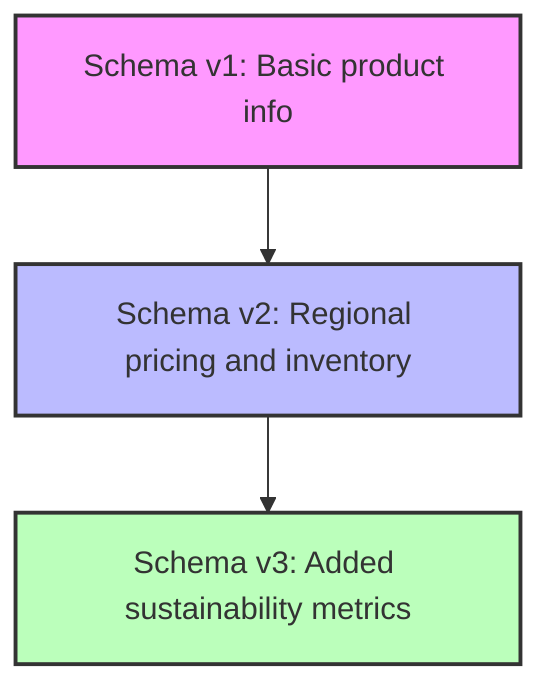

# MongoDB Schema Evolution

In traditional relational databases, changing your schema often requires complex migrations and downtime. One of MongoDB's greatest strengths is its flexible schema, which allows documents in a collection to have different structures. This flexibility makes schema evolution easier, but it still requires careful planning and strategy to execute properly.

## Understanding Schema Evolution

Schema evolution refers to the process of changing your data model over time as your application requirements change. In MongoDB, this can happen without requiring a strict migration of all documents at once.

### Why Schema Evolution Matters

As applications grow and requirements change, your data model needs to adapt. Common reasons for schema evolution include:

- Adding new features requiring additional fields
- Improving performance by restructuring data
- Fixing design flaws in the original schema
- Combining or splitting fields for better organization
- Adapting to changing business requirements

## Schema Evolution Strategies in MongoDB

MongoDB offers several strategies for evolving your schema without disrupting your application.

### 1. Schema Versioning

A common approach is to include a version field in your documents to track which schema version they conform to.

```javascript
// Original schema (version 1)
{
  "_id": ObjectId("5f8d5a4e7b9e7a1c8c8b4567"),
  "name": "John Doe",
  "email": "john@example.com",
  "schemaVersion": 1
}

// Updated schema (version 2)
{
  "_id": ObjectId("5f8d5a4e7b9e7a1c8c8b4568"),
  "name": "Jane Smith",
  "email": "jane@example.com",
  "contactInfo": {
    "email": "jane@example.com",
    "phone": "555-123-4567"
  },
  "schemaVersion": 2
}
```

Your application code can then handle different schema versions appropriately:

```javascript
function getContactInfo(user) {
  if (user.schemaVersion === 1) {
    return { email: user.email };
  } else if (user.schemaVersion === 2) {
    return user.contactInfo;
  }
}
```

### 2. The Schema Migration Pattern

For larger changes, you might need to perform a migration. This can be done gradually in the background:

```javascript
// Migration script to update from v1 to v2
db.users.find({ schemaVersion: 1 }).forEach(function(user) {
  db.users.updateOne(
    { _id: user._id },
    {
      $set: {
        contactInfo: { email: user.email },
        schemaVersion: 2
      },
      $unset: { email: "" }
    }
  );
});
```

### 3. Dual-Write Pattern

During a transition period, your application can write to both old and new fields:

```javascript
// When updating a user's email
function updateUserEmail(userId, newEmail) {
  return db.users.updateOne(
    { _id: userId },
    {
      $set: {
        email: newEmail,                    // For v1 schema compatibility
        "contactInfo.email": newEmail       // For v2 schema
      }
    }
  );
}
```

### 4. On-Demand Migration

Convert documents only when they're accessed:

```javascript
async function getUser(userId) {
  const user = await db.users.findOne({ _id: userId });
  
  // If it's an old version, update it when we read it
  if (user.schemaVersion === 1) {
    await db.users.updateOne(
      { _id: user._id },
      {
        $set: {
          contactInfo: { email: user.email },
          schemaVersion: 2
        },
        $unset: { email: "" }
      }
    );
    user.contactInfo = { email: user.email };
    user.schemaVersion = 2;
    delete user.email;
  }
  
  return user;
}
```

## Real-World Example: E-commerce Product Catalog

Let's walk through a real-world example of evolving a product catalog schema over time.

### Initial Schema (v1)

```javascript
{
  "_id": ObjectId("5f8d5a4e7b9e7a1c8c8b4567"),
  "name": "Wireless Headphones",
  "price": 79.99,
  "category": "Electronics",
  "inStock": true,
  "schemaVersion": 1
}
```

### Business Requirements Change

The business now needs to:
1. Support multiple price points based on region
2. Track inventory counts instead of a simple boolean
3. Support product variants (color, size)

### Updated Schema (v2)

```javascript
{
  "_id": ObjectId("5f8d5a4e7b9e7a1c8c8b4567"),
  "name": "Wireless Headphones",
  "pricing": {
    "US": 79.99,
    "EU": 89.99,
    "Asia": 75.99
  },
  "category": "Electronics",
  "inventory": {
    "total": 328,
    "warehouses": {
      "east": 122,
      "west": 206
    }
  },
  "variants": [
    {
      "color": "Black",
      "sku": "WH-BLK-001"
    },
    {
      "color": "White",
      "sku": "WH-WHT-001"
    }
  ],
  "schemaVersion": 2
}
```

### Migration Approach

Here's how we might handle this migration:

1. Update the application to handle both schema versions
2. Create a background migration task:

```javascript
// Migration function
async function migrateProductsToV2() {
  const cursor = db.products.find({ schemaVersion: 1 });
  
  let migratedCount = 0;
  await cursor.forEach(product => {
    const update = {
      $set: {
        pricing: { 
          US: product.price,
          EU: parseFloat((product.price * 1.1).toFixed(2)),
          Asia: parseFloat((product.price * 0.95).toFixed(2))
        },
        inventory: {
          total: product.inStock ? Math.floor(Math.random() * 500) + 100 : 0,
          warehouses: {
            east: 0,
            west: 0
          }
        },
        variants: [{
          color: "Standard",
          sku: `${product.name.substring(0,2).toUpperCase()}-STD-001`
        }],
        schemaVersion: 2
      },
      $unset: { 
        price: "",
        inStock: ""
      }
    };
    
    db.products.updateOne({ _id: product._id }, update);
    migratedCount++;
    
    if (migratedCount % 1000 === 0) {
      console.log(`Migrated ${migratedCount} products...`);
    }
  });
  
  console.log(`Migration complete. Total migrated: ${migratedCount}`);
}
```

### Client Application Update

The client application code also needs to be updated to handle both schema versions:

```javascript
function getProductPrice(product, region = 'US') {
  if (product.schemaVersion === 1) {
    return product.price;
  } else {
    return product.pricing[region] || product.pricing.US;
  }
}

function isProductAvailable(product) {
  if (product.schemaVersion === 1) {
    return product.inStock;
  } else {
    return product.inventory.total > 0;
  }
}
```

## Best Practices for Schema Evolution

### 1. Plan for Future Changes

From the beginning, anticipate fields that might need to be expanded or restructured:

```javascript
// Instead of:
{ "address": "123 Main St, New York, NY 10001" }

// Consider:
{ 
  "address": {
    "street": "123 Main St",
    "city": "New York",
    "state": "NY",
    "zipCode": "10001"
  }
}
```

### 2. Use Embedded Documents for Related Fields

Group related fields in embedded documents to make future changes easier:

```javascript
// Instead of:
{ 
  "firstName": "John",
  "lastName": "Doe",
  "phoneNumber": "555-123-4567",
  "email": "john@example.com"
}

// Consider:
{ 
  "name": {
    "first": "John",
    "last": "Doe"
  },
  "contactInfo": {
    "phone": "555-123-4567",
    "email": "john@example.com"
  }
}
```

### 3. Implement Schema Validation

Use MongoDB schema validation to enforce new schema requirements while allowing older documents:

```javascript
db.runCommand({
  collMod: "products",
  validator: {
    $jsonSchema: {
      bsonType: "object",
      required: ["name", "schemaVersion"],
      properties: {
        name: {
          bsonType: "string",
          description: "must be a string and is required"
        },
        schemaVersion: {
          bsonType: "int",
          minimum: 1,
          maximum: 2,
          description: "must be 1 or 2 and is required"
        },
        price: {
          bsonType: "double",
          description: "must be a double if the field exists"
        },
        pricing: {
          bsonType: "object",
          description: "pricing object for version 2"
        }
      }
    }
  },
  validationLevel: "moderate"
})
```

### 4. Perform Migrations in Batches

For large collections, process documents in smaller batches to minimize database impact:

```javascript
async function migrateBatch(batchSize = 1000) {
  const cursor = db.products
    .find({ schemaVersion: 1 })
    .limit(batchSize);
  
  const products = await cursor.toArray();
  
  if (products.length === 0) {
    console.log("Migration complete!");
    return false;
  }
  
  const operations = products.map(product => ({
    updateOne: {
      filter: { _id: product._id },
      update: {
        $set: {
          // transformation logic
          schemaVersion: 2
        },
        $unset: {
          // fields to remove
        }
      }
    }
  }));
  
  await db.products.bulkWrite(operations);
  console.log(`Migrated batch of ${products.length} documents`);
  return true;
}

// Run migration in batches
async function migrateAll() {
  let hasMore = true;
  while (hasMore) {
    hasMore = await migrateBatch(1000);
    // Optional: add a delay between batches
    await new Promise(resolve => setTimeout(resolve, 1000));
  }
}
```

### 5. Document Your Schema Changes

Keep a changelog of schema versions and their differences:



## Common Schema Evolution Patterns

### Converting a Simple Field to an Object

```javascript
// Before
{
  "address": "123 Main St, New York, NY 10001"
}

// After
{
  "address": {
    "full": "123 Main St, New York, NY 10001", // Keep original for backward compatibility
    "street": "123 Main St",
    "city": "New York",
    "state": "NY",
    "zipCode": "10001"
  }
}
```

### Moving Fields to Nested Structures

```javascript
// Before
{
  "userId": "user123",
  "orderTotal": 99.99,
  "shippingAddress": "...",
  "shippingMethod": "express",
  "shippingCost": 9.99
}

// After
{
  "userId": "user123",
  "orderTotal": 99.99,
  "shipping": {
    "address": "...",
    "method": "express",
    "cost": 9.99
  }
}
```

### Adding Array Elements to Existing Documents

```javascript
// Before
{
  "productId": "prod123",
  "name": "Widget"
}

// After
{
  "productId": "prod123",
  "name": "Widget",
  "tags": ["electronics", "gadget"]
}
```

## Summary

MongoDB's flexible schema design gives it a significant advantage when it comes to schema evolution compared to traditional relational databases. However, this flexibility doesn't eliminate the need for careful planning and strategy.

Key takeaways:

- Use schema versioning to track document structure changes
- Choose the right migration strategy for your use case: background migration, on-demand migration, or dual-write
- Plan for future expansion by using embedded documents and arrays
- Implement schema validation to enforce new requirements while allowing older formats
- Perform migrations in batches for large collections
- Document your schema changes for future reference

By following these best practices, you can evolve your MongoDB schemas with minimal disruption to your applications while still maintaining data integrity and backward compatibility.

## Additional Resources and Exercises

### Exercises

1. **Schema Versioning**: Create a collection with a mixture of documents from two different schema versions, then write code that can handle both versions smoothly.

2. **Migration Script**: Write a script that migrates a collection of user documents from having separate `firstName` and `lastName` fields to having a nested `name` object.

3. **Schema Validation**: Set up schema validation rules for a collection that allows both old and new schema versions to exist simultaneously.

4. **Performance Testing**: Compare the performance of queries that need to handle multiple schema versions versus those operating on a uniform schema.

### Further Reading

- MongoDB Documentation: [Schema Design](https://docs.mongodb.com/manual/core/data-modeling-introduction/)
- MongoDB Documentation: [Schema Validation](https://docs.mongodb.com/manual/core/schema-validation/)
- MongoDB Blog: [Building with Patterns](https://www.mongodb.com/blog/post/building-with-patterns-a-summary)