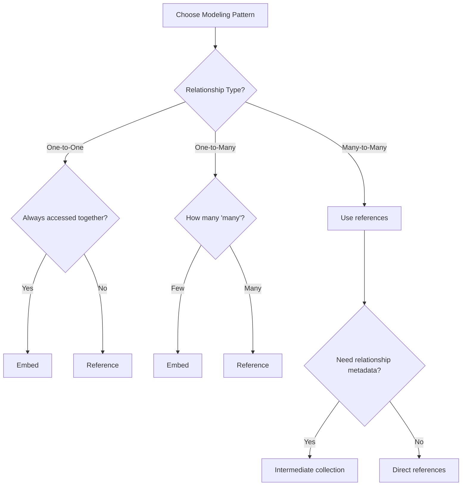

# MongoDB Modeling Patterns

MongoDB's flexible document model offers various approaches to structure your data. Understanding common modeling patterns helps you design efficient schemas that meet your application's requirements while maximizing MongoDB's strengths.

## Introduction to MongoDB Modeling Patterns

Unlike relational databases with rigid tables and schemas, MongoDB allows for flexible, schema-less documents that can evolve over time. This flexibility offers tremendous power but also requires understanding different modeling patterns to make the right design choices.

In this guide, we'll explore common MongoDB modeling patterns that help you:

- Structure your data effectively
- Optimize for common query patterns
- Balance between read and write performance
- Scale your application efficiently

## Basic Document Modeling Patterns

### Embedding vs. Referencing

The two fundamental approaches to modeling relationships in MongoDB are:

#### 1. Embedding (Denormalization)

Embedding means storing related data in the same document. This approach optimizes for read performance as all the information is retrieved in a single query.

```javascript
// Embedded document pattern - User with embedded address
{
  _id: ObjectId("507f1f77bcf86cd799439011"),
  name: "John Smith",
  email: "john@example.com",
  address: {
    street: "123 Main St",
    city: "New York",
    state: "NY",
    zip: "10001"
  }
}
```

**Advantages:**
- Single query retrieves all related data
- Atomic updates on the entire document
- Better read performance

**Disadvantages:**
- Documents can grow too large
- Data duplication if embedded in multiple places

#### 2. Referencing (Normalization)

Referencing involves storing a reference (usually the `_id`) to other documents instead of embedding them directly.

```javascript
// User document
{
  _id: ObjectId("507f1f77bcf86cd799439011"),
  name: "John Smith",
  email: "john@example.com",
  address_id: ObjectId("507f1f77bcf86cd799439012")
}

// Address document
{
  _id: ObjectId("507f1f77bcf86cd799439012"),
  user_id: ObjectId("507f1f77bcf86cd799439011"),
  street: "123 Main St",
  city: "New York",
  state: "NY",
  zip: "10001"
}
```

**Advantages:**
- Avoids duplication of data
- Smaller document sizes
- Better for data that changes frequently

**Disadvantages:**
- Requires multiple queries to fetch related data
- No atomic updates across documents

## Relationship Patterns

### One-to-One Relationships

For one-to-one relationships, you have two options:

#### Embedded Approach

```javascript
{
  _id: ObjectId("5099803df3f4948bd2f98391"),
  name: "Joe Smith",
  contact_info: {
    phone: "555-555-5555",
    email: "joe@example.com",
    preferred_contact: "email"
  }
}
```

#### Reference Approach

```javascript
// Person document
{
  _id: ObjectId("5099803df3f4948bd2f98391"),
  name: "Joe Smith",
  contact_info_id: ObjectId("5099803df3f4948bd2f98392")
}

// ContactInfo document
{
  _id: ObjectId("5099803df3f4948bd2f98392"),
  person_id: ObjectId("5099803df3f4948bd2f98391"),
  phone: "555-555-5555",
  email: "joe@example.com",
  preferred_contact: "email"
}
```

**When to use which?**
- Use embedding when the related object is always loaded with the parent object
- Use references when the related object is large or rarely accessed

### One-to-Many Relationships

MongoDB offers three main patterns for one-to-many relationships:

#### 1. Array of Embedded Documents

Ideal for a limited number of "child" documents that don't change often.

```javascript
// Blog post with embedded comments
{
  _id: ObjectId("5099803df3f4948bd2f98391"),
  title: "Introduction to MongoDB",
  content: "MongoDB is a NoSQL database...",
  author: "John Doe",
  created_at: ISODate("2021-05-20T10:30:00Z"),
  comments: [
    {
      user: "Alice",
      message: "Great post!",
      created_at: ISODate("2021-05-20T11:30:00Z")
    },
    {
      user: "Bob",
      message: "Thanks for sharing.",
      created_at: ISODate("2021-05-20T12:15:00Z")
    }
    // More comments...
  ]
}
```

**Best for:** Small, stable arrays that won't grow indefinitely (like comments on a blog post).

#### 2. Array of References

When you have a moderate number of related documents:

```javascript
// Book document
{
  _id: ObjectId("50a8240b927d5d8b5891743c"),
  title: "MongoDB: The Definitive Guide",
  author: "Shannon Bradshaw",
  // References to chapters
  chapters: [
    ObjectId("50a8240b927d5d8b5891743d"),
    ObjectId("50a8240b927d5d8b5891743e"),
    ObjectId("50a8240b927d5d8b5891743f")
  ]
}

// Chapter documents
{
  _id: ObjectId("50a8240b927d5d8b5891743d"),
  book_id: ObjectId("50a8240b927d5d8b5891743c"),
  title: "Introduction to MongoDB",
  content: "MongoDB is a document database..."
}
```

**Best for:** When you need flexibility in querying and updating related documents individually.

#### 3. Parent References

The child documents reference the parent:

```javascript
// Parent document (City)
{
  _id: ObjectId("50a8240b927d5d8b5891743c"),
  name: "New York",
  country: "USA"
}

// Child documents (People)
{
  _id: ObjectId("50a8240b927d5d8b5891743d"),
  name: "John Smith",
  city_id: ObjectId("50a8240b927d5d8b5891743c")
}
{
  _id: ObjectId("50a8240b927d5d8b5891743e"),
  name: "Jane Doe",
  city_id: ObjectId("50a8240b927d5d8b5891743c")
}
```

**Best for:** When there are many child documents (thousands or millions) that would make arrays impractical.

### Many-to-Many Relationships

Many-to-many relationships can be modeled in several ways:

#### Two-Way Embedding

```javascript
// Students with embedded courses
{
  _id: ObjectId("50a8240b927d5d8b5891743c"),
  name: "Alice",
  courses: [
    { 
      course_id: ObjectId("507f191e810c19729de860ea"),
      name: "MongoDB Basics",
      instructor: "Professor Smith"
    },
    {
      course_id: ObjectId("507f191e810c19729de860eb"),
      name: "Web Development",
      instructor: "Professor Johnson"
    }
  ]
}

// Courses with embedded students
{
  _id: ObjectId("507f191e810c19729de860ea"),
  name: "MongoDB Basics",
  instructor: "Professor Smith",
  students: [
    {
      student_id: ObjectId("50a8240b927d5d8b5891743c"),
      name: "Alice"
    },
    {
      student_id: ObjectId("50a8240b927d5d8b5891743d"),
      name: "Bob"
    }
  ]
}
```

**Note:** This approach creates data duplication.

#### Two-Way References

```javascript
// Student document
{
  _id: ObjectId("50a8240b927d5d8b5891743c"),
  name: "Alice",
  courses: [
    ObjectId("507f191e810c19729de860ea"),
    ObjectId("507f191e810c19729de860eb")
  ]
}

// Course document
{
  _id: ObjectId("507f191e810c19729de860ea"),
  name: "MongoDB Basics",
  instructor: "Professor Smith",
  students: [
    ObjectId("50a8240b927d5d8b5891743c"),
    ObjectId("50a8240b927d5d8b5891743d")
  ]
}
```

#### Intermediate Collection Pattern

Using a separate collection to manage the relationship:

```javascript
// Student document
{
  _id: ObjectId("50a8240b927d5d8b5891743c"),
  name: "Alice"
}

// Course document
{
  _id: ObjectId("507f191e810c19729de860ea"),
  name: "MongoDB Basics",
  instructor: "Professor Smith"
}

// Enrollment collection (joining students and courses)
{
  _id: ObjectId("507f191e810c19729de860ec"),
  student_id: ObjectId("50a8240b927d5d8b5891743c"),
  course_id: ObjectId("507f191e810c19729de860ea"),
  enrolled_date: ISODate("2023-01-15"),
  grade: "A"
}
```

This approach works well when you need to store additional information about the relationship.

## Advanced Modeling Patterns

### Computed Pattern

Store computed values in documents when they're frequently needed but expensive to calculate:

```javascript
// Product with pre-calculated statistics
{
  _id: ObjectId("507f191e810c19729de860ea"),
  name: "MongoDB Coffee Mug",
  price: 12.99,
  category: "merchandise",
  stats: {
    avg_rating: 4.8,
    review_count: 127,
    monthly_sales: 350
  }
}
```

### Bucket Pattern

Group related items into "buckets" for time-series or logging data:

```javascript
// IoT sensor readings grouped by hour
{
  _id: ObjectId("507f191e810c19729de860ea"),
  device_id: "temperature_sensor_01",
  date: ISODate("2023-09-01T00:00:00Z"),
  hour: 12,
  readings: [
    { time: ISODate("2023-09-01T12:00:00Z"), value: 22.5 },
    { time: ISODate("2023-09-01T12:05:00Z"), value: 22.7 },
    // More readings...
  ],
  metadata: {
    count: 12,
    min_value: 22.1,
    max_value: 23.4,
    avg_value: 22.8
  }
}
```

### Schema Versioning Pattern

Manage schema evolution by tracking document versions:

```javascript
// Document with schema version
{
  _id: ObjectId("507f191e810c19729de860ea"),
  schema_version: 2,
  name: "John Smith",
  contact: {
    email: "john@example.com",
    phone: "555-123-4567"
  }
  // In version 1, contact was a string field
}
```

### Subset Pattern

Store a subset of data to avoid loading large documents:

```javascript
// Full product document
{
  _id: ObjectId("507f191e810c19729de860ea"),
  name: "Ergonomic Chair",
  price: 199.99,
  description: "Long detailed description...",
  specifications: { /* detailed specs... */ },
  reviews: [ /* hundreds of reviews... */ ],
  images: [ /* high-resolution image URLs */ ]
}

// Product summary for listings
{
  _id: ObjectId("507f191e810c19729de860ea"),
  name: "Ergonomic Chair",
  price: 199.99,
  avg_rating: 4.7,
  thumbnail: "chair_thumb.jpg",
  category: "office"
}
```

## Real-World Application Examples

### E-commerce Product Catalog

```javascript
// Category document
{
  _id: ObjectId("507f191e810c19729de860ea"),
  name: "Electronics",
  slug: "electronics",
  parent_id: null
}

// Product document
{
  _id: ObjectId("507f191e810c19729de860eb"),
  name: "Wireless Headphones",
  slug: "wireless-headphones",
  sku: "WH-1000XM4",
  price: 349.99,
  category_id: ObjectId("507f191e810c19729de860ea"),
  attributes: {
    brand: "Sony",
    color: "Black",
    features: ["Noise cancelling", "Bluetooth 5.0", "30h battery"]
  },
  inventory: {
    in_stock: 42,
    warehouse_location: "A-123"
  },
  // Denormalized for quick display
  category_path: ["Electronics", "Audio", "Headphones"]
}

// Product variant
{
  _id: ObjectId("507f191e810c19729de860ec"),
  parent_id: ObjectId("507f191e810c19729de860eb"),
  name: "Wireless Headphones - Silver",
  sku: "WH-1000XM4-S",
  price: 349.99,
  attributes: {
    color: "Silver"
  },
  inventory: {
    in_stock: 18,
    warehouse_location: "A-124"
  }
}
```

### Social Media Feed

```javascript
// User profile
{
  _id: ObjectId("507f191e810c19729de860ea"),
  username: "jane_doe",
  name: "Jane Doe",
  bio: "Software developer and coffee enthusiast",
  profile_image: "jane_profile.jpg",
  follower_count: 1420,
  following_count: 350
}

// Post document
{
  _id: ObjectId("507f191e810c19729de860eb"),
  user_id: ObjectId("507f191e810c19729de860ea"),
  // Denormalized user data for display
  user: {
    username: "jane_doe",
    name: "Jane Doe",
    profile_image: "jane_profile.jpg"
  },
  content: "Just launched my new MongoDB course!",
  media: ["course_banner.jpg"],
  created_at: ISODate("2023-09-01T14:30:15Z"),
  like_count: 42,
  comment_count: 7,
  // First few comments embedded for quick display
  top_comments: [
    {
      user_id: ObjectId("507f191e810c19729de860ec"),
      username: "dev_mike",
      content: "Looks great! Can't wait to check it out.",
      created_at: ISODate("2023-09-01T14:35:20Z")
    }
  ]
}

// Separate comments collection for all comments
{
  _id: ObjectId("507f191e810c19729de860ed"),
  post_id: ObjectId("507f191e810c19729de860eb"),
  user_id: ObjectId("507f191e810c19729de860ec"),
  username: "dev_mike",
  content: "Looks great! Can't wait to check it out.",
  created_at: ISODate("2023-09-01T14:35:20Z")
}
```

## Best Practices for Choosing Modeling Patterns

When deciding which pattern to use, consider:

1. **Access patterns**: How will the data be queried and updated?
   
2. **Document growth**: Will embedded arrays grow unbounded?
   
3. **Read vs. Write optimization**: Which operation is more critical for your application?
   
4. **Data consistency**: Do you need atomic updates across related data?
   
5. **Document size limits**: MongoDB has a 16MB document size limit.



## Common Pitfalls to Avoid

1. **Deeply nested documents**: These become hard to update and can hit document size limits.

2. **Unbounded array growth**: Arrays that grow without limits can degrade performance.

3. **Excessive joins**: Too many references requiring multiple queries defeats MongoDB's advantages.

4. **Overusing denormalization**: Duplicating data everywhere makes updates complex and error-prone.

5. **Ignoring document size limits**: MongoDB documents are limited to 16MB.

## Summary

MongoDB's document model offers tremendous flexibility in how you structure your data. The key modeling patterns we covered include:

- Embedding vs. Referencing
- One-to-One, One-to-Many, and Many-to-Many relationship patterns
- Advanced patterns: Computed, Bucket, Schema Versioning, and Subset patterns

The right pattern depends on your specific use case, query patterns, and scalability requirements. Often, a combination of patterns yields the best results.

## Additional Resources and Exercises

### Practice Exercises

1. **Exercise 1**: Design a schema for a blog platform with users, posts, comments, and categories.

2. **Exercise 2**: Model a schema for an e-commerce site with products, categories, customers, orders, and reviews.

3. **Exercise 3**: Design a schema for a simplified social network with users, posts, friends, and likes.

### Further Reading

- [MongoDB Documentation on Schema Design](https://docs.mongodb.com/manual/core/data-modeling-introduction/)
- [MongoDB University - Data Modeling Course](https://university.mongodb.com/)
- "MongoDB: The Definitive Guide" by Shannon Bradshaw and Kristina Chodorow

By understanding and applying these modeling patterns, you'll be well on your way to designing efficient, scalable MongoDB schemas for your applications.