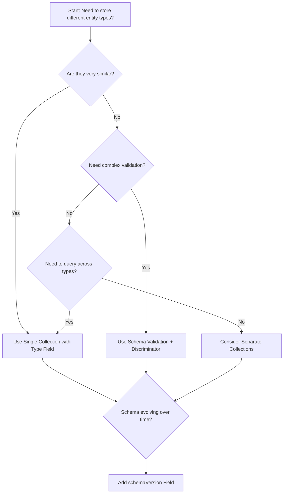

# MongoDB Polymorphic Patterns

When designing MongoDB schemas, you'll often encounter situations where you need to store different types of entities that share some common attributes but also have their unique properties. This is where polymorphic patterns come into play. Polymorphism in MongoDB allows you to model diverse entity types within a single collection while maintaining data integrity and query efficiency.

## What is Polymorphism in MongoDB?

Polymorphism refers to the ability to store multiple types of documents in a single collection. Unlike relational databases that require strict table schemas, MongoDB's flexible document model naturally supports polymorphic data structures.

The concept is similar to object-oriented programming, where different classes can inherit from a base class while extending it with their specific attributes and behaviors.

## Common Polymorphic Patterns in MongoDB

Let's explore the most common patterns you can use to implement polymorphism in your MongoDB applications.

### 1. Single Collection with Type Field Pattern

This is the simplest polymorphic pattern where all entities share a collection but include a "type" field to differentiate them.

#### How it works:

1. Store all documents in one collection
2. Add a type field to indicate the document type
3. Include both common and type-specific fields in each document

#### Code Example:

```javascript
// Example documents in a "media" collection

// Book document
{
  _id: ObjectId("5f8a7b6e1c5e7f1d2c3b4a5b"),
  type: "book",
  title: "MongoDB: The Definitive Guide",
  author: "Shannon Bradshaw",
  pages: 514,
  isbn: "978-1491954461",
  publishedDate: ISODate("2019-12-01")
}

// Movie document
{
  _id: ObjectId("5f8a7b6e1c5e7f1d2c3b4a5c"),
  type: "movie",
  title: "The Social Network",
  director: "David Fincher",
  duration: 120,
  rating: "PG-13",
  releaseDate: ISODate("2010-10-01")
}

// Music document
{
  _id: ObjectId("5f8a7b6e1c5e7f1d2c3b4a5d"),
  type: "music",
  title: "Thriller",
  artist: "Michael Jackson",
  duration: 42,
  tracks: 9,
  releaseDate: ISODate("1982-11-30")
}
```

#### Querying by type:

```javascript
// Find all books
db.media.find({ type: "book" })

// Find all media released after 2000
db.media.find({ releaseDate: { $gte: ISODate("2000-01-01") } })
```

#### Advantages:
- Simple to implement
- Easy to query across all types
- Good for collections with a small number of types

#### Disadvantages:
- No schema validation for type-specific fields
- Queries may return fields irrelevant to certain types
- Indexes may be less efficient

### 2. Schema Versioning Pattern

When your data model evolves over time, you can use a schema version field to track different document structures.

```javascript
// User schema v1
{
  _id: ObjectId("5f8a7b6e1c5e7f1d2c3b4a5e"),
  schemaVersion: 1,
  name: "John Doe",
  email: "john@example.com"
}

// User schema v2 with additional fields
{
  _id: ObjectId("5f8a7b6e1c5e7f1d2c3b4a5f"),
  schemaVersion: 2,
  name: "Jane Smith",
  email: "jane@example.com",
  profile: {
    bio: "Software Engineer",
    links: ["github.com/janesmith", "linkedin.com/in/janesmith"]
  }
}
```

#### Migration code example:

```javascript
// Migrate documents from version 1 to version 2
db.users.updateMany(
  { schemaVersion: 1 },
  { 
    $set: { 
      schemaVersion: 2,
      profile: { bio: "", links: [] } 
    } 
  }
)
```

### 3. Discriminator Pattern (Field Polymorphism)

A more structured approach that uses a discriminator field to determine the document's structure and behavior.

```javascript
// Event collection with different event types

// Conference event
{
  _id: ObjectId("5f8a7b6e1c5e7f1d2c3b4a60"),
  eventType: "conference",
  name: "MongoDB World",
  description: "Annual MongoDB conference",
  venue: {
    name: "Convention Center",
    address: "123 Main St, New York, NY"
  },
  startDate: ISODate("2023-06-01"),
  endDate: ISODate("2023-06-03"),
  speakers: [
    { name: "John Doe", topic: "Scaling MongoDB" },
    { name: "Jane Smith", topic: "Advanced Aggregation" }
  ]
}

// Webinar event
{
  _id: ObjectId("5f8a7b6e1c5e7f1d2c3b4a61"),
  eventType: "webinar",
  name: "Getting Started with MongoDB",
  description: "Learn MongoDB basics",
  platform: "Zoom",
  startDate: ISODate("2023-05-15T14:00:00Z"),
  duration: 60,
  presenter: "Mike Johnson",
  registrationLink: "https://example.com/register"
}
```

#### Using the discriminator pattern with MongoDB's schema validation:

```javascript
db.createCollection("events", {
  validator: {
    $or: [
      {
        $and: [
          { eventType: { $eq: "conference" } },
          { name: { $type: "string" } },
          { venue: { $type: "object" } },
          { startDate: { $type: "date" } },
          { endDate: { $type: "date" } },
          { speakers: { $type: "array" } }
        ]
      },
      {
        $and: [
          { eventType: { $eq: "webinar" } },
          { name: { $type: "string" } },
          { platform: { $type: "string" } },
          { startDate: { $type: "date" } },
          { duration: { $type: "int" } },
          { presenter: { $type: "string" } }
        ]
      }
    ]
  }
})
```

## Real-World Example: Content Management System

Let's look at a practical example of implementing polymorphic patterns in a content management system (CMS) where different content types share common properties but have unique fields:

```javascript
// Base content properties present in all content types
const commonContentFields = {
  _id: ObjectId(),
  createdAt: new Date(),
  updatedAt: new Date(),
  title: "Sample Content",
  slug: "sample-content",
  status: "draft", // draft, published, archived
  author: ObjectId("user_id"),
  tags: ["mongodb", "database"],
  metadata: {
    views: 0,
    likes: 0
  }
};

// Blog post content type
const blogPost = {
  ...commonContentFields,
  contentType: "blog",
  featuredImage: "/images/blog/featured.jpg",
  content: "# Blog Post Content\n\nThis is a markdown content...",
  excerpt: "A short summary of the blog post",
  estimatedReadTime: 5, // minutes
  categories: ["Technology", "Database"]
};

// Video content type
const video = {
  ...commonContentFields,
  contentType: "video",
  videoUrl: "https://example.com/video.mp4",
  thumbnail: "/images/videos/thumbnail.jpg",
  duration: 360, // seconds
  transcript: "Video transcript content here..."
};

// Product content type
const product = {
  ...commonContentFields,
  contentType: "product",
  price: 99.99,
  images: ["/images/products/1.jpg", "/images/products/2.jpg"],
  inventory: 150,
  specifications: {
    weight: "2.5kg",
    dimensions: "10x15x2 cm",
    color: "Silver"
  }
};
```

### Implementing CRUD Operations:

```javascript
// Create a new content item (in Node.js with MongoDB driver)
async function createContent(contentData) {
  const result = await db.collection('content').insertOne({
    ...contentData,
    createdAt: new Date(),
    updatedAt: new Date()
  });
  return result.insertedId;
}

// Get all content of a specific type
async function getContentByType(type) {
  return await db.collection('content')
    .find({ contentType: type })
    .sort({ createdAt: -1 })
    .toArray();
}

// Get featured blog posts
async function getFeaturedBlogPosts() {
  return await db.collection('content')
    .find({ 
      contentType: "blog", 
      status: "published",
      tags: "featured"
    })
    .project({
      title: 1,
      slug: 1,
      featuredImage: 1,
      excerpt: 1,
      createdAt: 1,
      author: 1
    })
    .sort({ createdAt: -1 })
    .limit(5)
    .toArray();
}
```

## Design Decision Chart

When should you use each pattern? The following diagram can help you decide:



## Best Practices for Polymorphic Patterns

1. **Use descriptive type fields**: Choose clear, meaningful names for your type discriminator fields (e.g., `contentType`, `entityType`).

2. **Be consistent with common fields**: Ensure all document types share the same field names for common properties.

3. **Document your schema**: Maintain clear documentation of the different types and their specific fields.

4. **Consider validation**: Use MongoDB's schema validation to enforce type-specific field requirements.

5. **Index strategically**: Create indexes that account for common query patterns across document types.

6. **Use projection**: When querying, use projection to limit the fields returned to only what's needed.

7. **Consider denormalization carefully**: Balance between embedding related data and using references based on your access patterns.

## Challenges and Considerations

While polymorphic patterns offer flexibility, they come with challenges:

1. **Schema drift**: Without proper governance, documents may deviate from intended structures.

2. **Query complexity**: Writing queries that work correctly across different types can be challenging.

3. **Index inefficiency**: Indexes on fields that only exist in some documents may be less efficient.

4. **Application complexity**: Your application code needs to handle different document structures.

5. **Evolution management**: As your schema evolves, you need strategies to migrate older documents.

## Summary

Polymorphic patterns in MongoDB provide a powerful way to model heterogeneous data within a single collection. By using discriminator fields, schema versioning, and validation rules, you can create flexible yet structured data models that accommodate different entity types while maintaining query efficiency.

The choice of pattern depends on your specific requirements, including:
- How similar your entity types are
- Your query patterns
- Your validation needs
- How frequently your schema evolves

By following the best practices outlined in this guide, you can design polymorphic data models that are both flexible and maintainable.

## Exercises

1. Design a polymorphic schema for a social media application that needs to store different types of posts (text posts, image posts, and video posts).

2. Implement schema validation rules for a polymorphic "notification" collection that stores different types of notifications (system alerts, friend requests, and message notifications).

3. Write a MongoDB query that retrieves the 10 most recent content items across all content types, sorted by creation date.

4. Design a migration strategy to update documents from version 1 to version 2 of your schema when adding new required fields.

## Additional Resources

- [MongoDB Schema Design Patterns](https://www.mongodb.com/blog/post/building-with-patterns-the-polymorphic-pattern)
- [MongoDB Schema Validation](https://docs.mongodb.com/manual/core/schema-validation/)
- [MongoDB University Course: Data Modeling](https://university.mongodb.com/courses/M320/about)
- [MongoDB Realm Schema Evolution](https://docs.mongodb.com/realm/schemas/schema-evolution/)