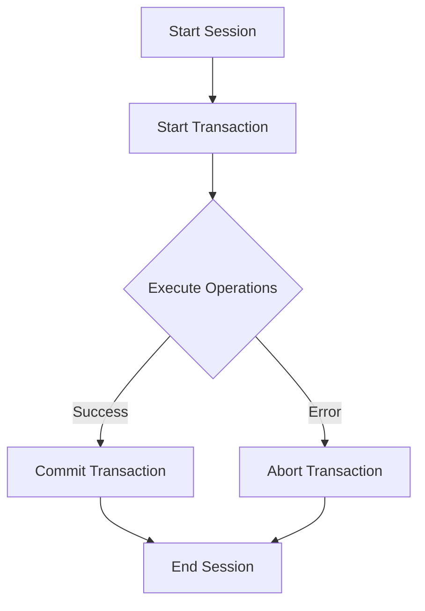

# MongoDB Transactions Introduction

## What are MongoDB Transactions?

In database systems, a transaction is a sequence of operations performed as a single logical unit of work. MongoDB's transactions ensure that multiple operations on multiple documents are executed atomically - either all operations succeed or none of them are applied at all. This helps maintain data integrity even in the event of errors or system failures.

Since MongoDB 4.0, multi-document transactions have been available for replica sets, and MongoDB 4.2 extended this capability to sharded clusters. This was a significant advancement for MongoDB, which had previously only supported atomic operations at the single-document level.

## Why Transactions Matter

Without transactions, you might face scenarios where:

1. Half of your operations succeed while others fail, leaving your data in an inconsistent state
2. Concurrent operations interfere with each other, causing data corruption
3. Complex business operations that span multiple documents can't guarantee consistency

Let's illustrate the problem with a simple example: transferring money between two bank accounts.

```javascript
// WITHOUT transactions (dangerous approach)
// Deduct amount from source account
db.accounts.updateOne(
  { _id: sourceAccountId },
  { $inc: { balance: -amount } }
);

// If there's a system failure here, money disappears!

// Add amount to destination account
db.accounts.updateOne(
  { _id: destinationAccountId },
  { $inc: { balance: amount } }
);
```

If the system fails after the first operation but before the second, the money would simply vanish from the source account without being added to the destination account. Transactions solve this problem by ensuring both operations succeed or none at all.

## ACID Properties in MongoDB Transactions

MongoDB transactions support the four key ACID properties:

- **Atomicity**: All operations in a transaction either complete successfully or have no effect.
- **Consistency**: Transactions bring the database from one valid state to another.
- **Isolation**: Until a transaction is committed, its changes are not visible to other operations.
- **Durability**: Once a transaction is committed, its changes are permanent.

## Basic Transaction Syntax

The basic structure of a MongoDB transaction looks like this:

```javascript
// Start a session
const session = db.getMongo().startSession();

// Start a transaction
session.startTransaction();

try {
  // Operations go here
  const accountsCollection = session.getDatabase("finance").getCollection("accounts");
  
  // Deduct from source account
  accountsCollection.updateOne(
    { _id: sourceAccountId },
    { $inc: { balance: -amount } }
  );
  
  // Add to destination account  
  accountsCollection.updateOne(
    { _id: destinationAccountId },
    { $inc: { balance: amount } }
  );

  // If everything went well, commit the transaction
  session.commitTransaction();
  console.log("Transaction successfully committed.");
} catch (error) {
  // If an error occurred, abort the transaction
  session.abortTransaction();
  console.log("Transaction aborted due to an error:", error);
} finally {
  // End the session
  session.endSession();
}
```

## Implementing Your First Transaction

Let's create a complete example for a money transfer between two accounts:

```javascript
// Create test data
db.accounts.insertMany([
  { _id: "account1", owner: "Alice", balance: 1000 },
  { _id: "account2", owner: "Bob", balance: 500 }
]);

// Define the transfer function
function transferMoney(sourceId, destinationId, amount) {
  // Start a session
  const session = db.getMongo().startSession();
  
  // Start transaction
  session.startTransaction();
  
  try {
    const accounts = session.getDatabase("test").accounts;
    
    // Check if source account has enough funds
    const sourceAccount = accounts.findOne({ _id: sourceId }, { session });
    if (sourceAccount.balance < amount) {
      throw new Error("Insufficient funds!");
    }
    
    // Deduct from source account
    accounts.updateOne(
      { _id: sourceId },
      { $inc: { balance: -amount } },
      { session }
    );
    
    // Add to destination account
    accounts.updateOne(
      { _id: destinationId },
      { $inc: { balance: amount } },
      { session }
    );
    
    // Commit the transaction
    session.commitTransaction();
    return { success: true, message: "Transfer completed successfully" };
  } catch (error) {
    // Abort the transaction on error
    session.abortTransaction();
    return { success: false, message: error.message };
  } finally {
    session.endSession();
  }
}

// Execute the transfer
const result = transferMoney("account1", "account2", 200);
printjson(result);

// Check the updated balances
db.accounts.find().pretty();
```

**Expected Output:**

```json
// Transfer result
{
  "success": true,
  "message": "Transfer completed successfully"
}

// Updated account balances
{
  "_id": "account1",
  "owner": "Alice",
  "balance": 800
}
{
  "_id": "account2",
  "owner": "Bob",
  "balance": 700
}
```

## Transaction Lifecycle

A MongoDB transaction follows this lifecycle:



Each stage is important:

1. **Start a session**: Creates a server session to maintain the transaction context.
2. **Start transaction**: Marks the beginning of a transaction block.
3. **Execute operations**: Perform your read/write operations within the transaction.
4. **Commit or abort**: Finalize the transaction by committing successful operations or aborting on errors.
5. **End session**: Clean up the session resources.

## Read Concerns and Write Concerns in Transactions

Transactions in MongoDB allow you to specify both read and write concerns:

- **Read Concern**: Defines what data consistency level you want for reads (`local`, `available`, `majority`, `linearizable`, or `snapshot`).
- **Write Concern**: Ensures that writes are acknowledged by a certain number of replica set members.

```javascript
// Starting a transaction with specific read and write concerns
session.startTransaction({
  readConcern: { level: "snapshot" },
  writeConcern: { w: "majority" }
});
```

In this example:
- `readConcern: "snapshot"` ensures you get a consistent view of the data at the start of the transaction
- `writeConcern: "majority"` ensures the transaction is acknowledged by a majority of replica set members

## Real-World Use Case: Order Processing System

Let's implement a more complex real-world example: an order processing system that must update inventory, create an order, and update customer points—all atomically.

```javascript
// Set up test data
db.inventory.insertMany([
  { _id: "product1", name: "Laptop", quantity: 10, price: 1200 },
  { _id: "product2", name: "Phone", quantity: 20, price: 800 }
]);

db.customers.insertOne({
  _id: "customer1", 
  name: "John Doe", 
  email: "john@example.com",
  loyaltyPoints: 100
});

db.orders.createIndex({ orderNumber: 1 }, { unique: true });

// Order processing function
function processOrder(customerId, items, paymentMethod) {
  const session = db.getMongo().startSession();
  session.startTransaction();
  
  try {
    const db = session.getDatabase("test");
    const orderNumber = new Date().getTime(); // Simple order number generation
    const orderItems = [];
    let totalAmount = 0;
    
    // Check inventory and update quantities
    for (const item of items) {
      const product = db.inventory.findOne(
        { _id: item.productId, quantity: { $gte: item.quantity } },
        { session }
      );
      
      if (!product) {
        throw new Error(`Not enough inventory for product ${item.productId}`);
      }
      
      // Update inventory
      db.inventory.updateOne(
        { _id: item.productId },
        { $inc: { quantity: -item.quantity } },
        { session }
      );
      
      // Add to order items
      orderItems.push({
        productId: item.productId,
        productName: product.name,
        quantity: item.quantity,
        unitPrice: product.price,
        subtotal: product.price * item.quantity
      });
      
      totalAmount += product.price * item.quantity;
    }
    
    // Create the order
    db.orders.insertOne({
      orderNumber: orderNumber,
      customerId: customerId,
      items: orderItems,
      totalAmount: totalAmount,
      paymentMethod: paymentMethod,
      status: "confirmed",
      createdAt: new Date()
    }, { session });
    
    // Update customer loyalty points (1 point per $10 spent)
    const pointsEarned = Math.floor(totalAmount / 10);
    db.customers.updateOne(
      { _id: customerId },
      { $inc: { loyaltyPoints: pointsEarned } },
      { session }
    );
    
    // Commit the transaction
    session.commitTransaction();
    return {
      success: true,
      orderNumber: orderNumber,
      totalAmount: totalAmount,
      pointsEarned: pointsEarned
    };
  } catch (error) {
    // Abort the transaction
    session.abortTransaction();
    return {
      success: false,
      message: error.message
    };
  } finally {
    session.endSession();
  }
}

// Execute the order processing
const orderResult = processOrder(
  "customer1", 
  [
    { productId: "product1", quantity: 1 },
    { productId: "product2", quantity: 2 }
  ], 
  "credit card"
);

printjson(orderResult);

// Check the results
db.inventory.find().pretty();
db.orders.find().pretty();
db.customers.findOne({ _id: "customer1" });
```

**Expected Output:**

```json
// Order processing result
{
  "success": true,
  "orderNumber": 1634567890123,
  "totalAmount": 2800,
  "pointsEarned": 280
}

// Updated inventory
{
  "_id": "product1",
  "name": "Laptop",
  "quantity": 9,
  "price": 1200
}
{
  "_id": "product2",
  "name": "Phone",
  "quantity": 18,
  "price": 800
}

// Created order
{
  "_id": ObjectId("..."),
  "orderNumber": 1634567890123,
  "customerId": "customer1",
  "items": [
    {
      "productId": "product1",
      "productName": "Laptop",
      "quantity": 1,
      "unitPrice": 1200,
      "subtotal": 1200
    },
    {
      "productId": "product2",
      "productName": "Phone",
      "quantity": 2,
      "unitPrice": 800,
      "subtotal": 1600
    }
  ],
  "totalAmount": 2800,
  "paymentMethod": "credit card",
  "status": "confirmed",
  "createdAt": ISODate("2023-10-18T...")
}

// Updated customer with loyalty points
{
  "_id": "customer1",
  "name": "John Doe",
  "email": "john@example.com",
  "loyaltyPoints": 380
}
```

## Best Practices for MongoDB Transactions

To use MongoDB transactions effectively:

1. **Keep transactions short**: Long-running transactions can block other operations and lead to performance issues.

2. **Limit transaction size**: Avoid including too many operations in a single transaction.

3. **Prepare your data model**: Design your schema with transactions in mind, keeping related data that will be modified together in the same collection when possible.

4. **Handle errors properly**: Always include proper error handling and ensure transactions are either committed or aborted.

5. **Use appropriate read/write concerns**: Choose the appropriate read and write concerns based on your consistency and durability requirements.

6. **Consider performance implications**: Transactions have overhead, so only use them when necessary for data consistency.

7. **Set timeouts wisely**: Configure transaction timeouts to avoid having transactions hang indefinitely.

```javascript
// Setting a transaction timeout
session.startTransaction({
  readConcern: { level: "snapshot" },
  writeConcern: { w: "majority" },
  maxTimeMS: 5000 // 5 second timeout
});
```

## Transactions Restrictions

Be aware of these limitations when working with MongoDB transactions:

- Maximum transaction runtime: 60 seconds by default
- Maximum transaction size: 16MB (combined size of all documents)
- Cannot create collections or indexes within a transaction
- Cannot write to capped collections
- Cannot use geospatial operations in certain ways
- Cannot access system.* collections

## Debugging Transactions

If you need to debug transactions, MongoDB provides several ways to monitor them:

```javascript
// View current transactions
db.adminCommand({ currentOp: true, "transaction": true });

// Kill a long-running transaction
db.adminCommand({ killOp: 1, op: <operationId> });
```

You can also check transaction metrics in MongoDB Atlas or using MongoDB Compass.

## Summary

MongoDB transactions provide a powerful way to ensure data consistency across multiple operations and documents. Key takeaways from this introduction:

- Transactions ensure that multiple operations are executed atomically
- They follow ACID properties to maintain data integrity
- The transaction workflow includes starting a session, beginning a transaction, performing operations, and finally committing or aborting
- Real-world applications like financial systems and order processing benefit from transactions
- There are performance considerations and best practices to follow

Transactions add a significant capability to MongoDB, allowing it to handle complex business scenarios that require strong data consistency guarantees.

## Exercise: Build Your Own Transaction

### Exercise 1: Implement a User Registration System

Create a transaction that:
1. Creates a new user document
2. Creates a user profile document
3. Adds the user to a 'new users' collection for onboarding
4. Ensures all operations succeed or fail together

### Exercise 2: Inventory Management

Implement a transaction that handles:
1. Product reservations for an e-commerce site
2. Updating inventory levels
3. Creating a reservation record
4. Adding the reservation to a processing queue

## Additional Resources

- [Official MongoDB Transactions Documentation](https://www.mongodb.com/docs/manual/core/transactions/)
- [MongoDB University Course on Transactions](https://learn.mongodb.com/)
- [Driver-specific Transaction Examples](https://www.mongodb.com/docs/drivers/)
- [MongoDB Transactions Performance Best Practices](https://www.mongodb.com/blog/post/performance-best-practices-transactions-and-read-write-concerns)