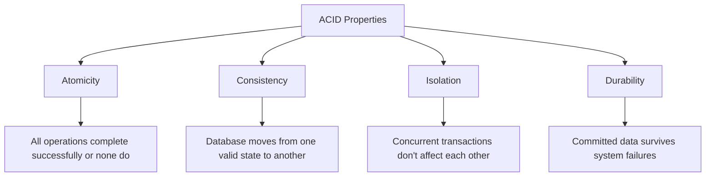
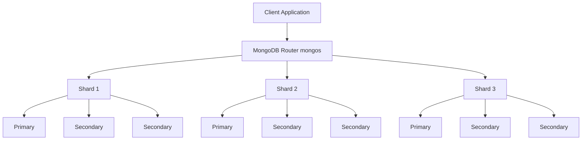

# MongoDB ACID Properties

## Introduction

Database transactions must ensure data reliability and consistency, which is where ACID properties come into play. ACID is an acronym that stands for **Atomicity**, **Consistency**, **Isolation**, and **Durability** - four crucial properties that guarantee valid data states even in the event of errors, power failures, or other mishaps.

In this guide, we'll explore how MongoDB, a popular NoSQL database, implements ACID properties through its transactions system and why this matters for your applications.

## ACID Properties Overview

Before diving into MongoDB's implementation, let's understand what each ACID property means:



## MongoDB and ACID Support

Historically, MongoDB was known for providing eventual consistency rather than full ACID compliance. However, since version 4.0 (and enhanced in 4.2), MongoDB introduced multi-document transactions, bringing full ACID properties support to the NoSQL world.

Let's examine each ACID property in MongoDB:

### 1. Atomicity in MongoDB

**Atomicity** ensures that all operations in a transaction are treated as a single unit - either all succeed or all fail.

#### How MongoDB Implements Atomicity:

MongoDB's transactions allow you to group multiple operations, ensuring they all succeed or fail together without partial completion.

#### Example:

```javascript
// Start a session
const session = db.getMongo().startSession();
session.startTransaction();

try {
  // Perform multiple operations
  const accounts = session.getDatabase("bankDB").accounts;
  
  // Withdraw from account A
  accounts.updateOne(
    { accountId: "A123" },
    { $inc: { balance: -100 } }
  );
  
  // Deposit to account B
  accounts.updateOne(
    { accountId: "B456" },
    { $inc: { balance: 100 } }
  );
  
  // If we get here without errors, commit the transaction
  session.commitTransaction();
  console.log("Transaction committed successfully");
} catch (error) {
  // Any error will abort the transaction, rolling back all operations
  session.abortTransaction();
  console.log("Transaction aborted due to error:", error);
} finally {
  session.endSession();
}
```

In this example, if either the withdrawal or deposit operation fails, the entire transaction is aborted, maintaining account balance integrity.

### 2. Consistency in MongoDB

**Consistency** ensures that a transaction brings the database from one valid state to another, following all defined rules and constraints.

#### How MongoDB Implements Consistency:

MongoDB enforces consistency through:
- Schema validation
- Unique indexes
- Transaction validations

#### Example - Schema Validation:

```javascript
// Define a validation schema for a collection
db.runCommand({
  collMod: "customers",
  validator: {
    $jsonSchema: {
      bsonType: "object",
      required: ["name", "email", "status"],
      properties: {
        name: {
          bsonType: "string",
          description: "must be a string and is required"
        },
        email: {
          bsonType: "string",
          pattern: "^.+@.+$",
          description: "must be a valid email address"
        },
        status: {
          enum: ["Active", "Pending", "Inactive"],
          description: "can only be one of the enum values"
        }
      }
    }
  },
  validationLevel: "moderate"
});

// Now in a transaction, attempted violations will cause failure
const session = db.getMongo().startSession();
session.startTransaction();

try {
  const customers = session.getDatabase("storeDB").customers;
  
  // This will fail due to missing required fields
  customers.insertOne({ name: "John Doe" }); 
  
  session.commitTransaction();
} catch (error) {
  session.abortTransaction();
  console.log("Transaction aborted: Invalid data");
} finally {
  session.endSession();
}
```

### 3. Isolation in MongoDB

**Isolation** ensures that concurrent transactions don't interfere with each other, maintaining the illusion that each transaction is executing in isolation.

#### How MongoDB Implements Isolation:

MongoDB uses snapshot isolation through its WiredTiger storage engine. This means transactions operate on a consistent snapshot of data, unaffected by concurrent operations.

#### Isolation Levels:

MongoDB supports two transaction isolation levels:
- **Read Uncommitted**: Default for read operations outside transactions
- **Snapshot**: Used within transactions

#### Example - Preventing Dirty Reads:

```javascript
// Session A starts a transaction and modifies data
const sessionA = db.getMongo().startSession();
sessionA.startTransaction();
const productsA = sessionA.getDatabase("inventory").products;
productsA.updateOne(
  { sku: "ABC123" },
  { $set: { stock: 0 } }
);

// Session B starts a transaction and reads the same data
const sessionB = db.getMongo().startSession();
sessionB.startTransaction();
const productsB = sessionB.getDatabase("inventory").products;

// Session B will see the original value, not the uncommitted change from Session A
const item = productsB.findOne({ sku: "ABC123" });
console.log("Stock level seen by Session B:", item.stock);  // Still shows original stock level

// Now session A commits
sessionA.commitTransaction();
sessionA.endSession();

// Session B still sees original value until it commits or aborts its own transaction
const itemAfterCommit = productsB.findOne({ sku: "ABC123" });
console.log("Stock level seen by Session B after A commits:", itemAfterCommit.stock);  // Still original value

// End session B
sessionB.abortTransaction();
sessionB.endSession();
```

### 4. Durability in MongoDB

**Durability** guarantees that once a transaction is committed, it will remain committed even in the event of a system failure.

#### How MongoDB Implements Durability:

MongoDB ensures durability through:
- Write-ahead logging (WAL)
- Journaling
- Replica sets for redundancy

#### Example - Write Concern for Enhanced Durability:

```javascript
// Start session with increased write concern for durability
const session = db.getMongo().startSession();
session.startTransaction({
  readConcern: { level: "snapshot" },
  writeConcern: { w: "majority", j: true }
  // w: "majority" ensures write to majority of replica set members
  // j: true ensures write to journal before acknowledging
});

try {
  const orders = session.getDatabase("sales").orders;
  orders.insertOne({
    orderId: "ORD-12345",
    customer: "CUST-789",
    items: ["product1", "product2"],
    total: 129.99,
    date: new Date()
  });
  
  // Commit with high durability guarantees
  session.commitTransaction();
  console.log("Order safely recorded and durable");
} catch (error) {
  session.abortTransaction();
  console.log("Transaction failed:", error);
} finally {
  session.endSession();
}
```

## Real-World Application: E-Commerce Order Processing

Let's examine a practical e-commerce scenario where ACID properties are essential for maintaining data integrity:

```javascript
// Function to process a new order with ACID guarantees
async function processOrder(userId, cartItems) {
  const session = db.getMongo().startSession();
  session.startTransaction();
  
  try {
    const db = session.getDatabase("ecommerce");
    const orders = db.orders;
    const inventory = db.inventory;
    const users = db.users;
    
    // 1. Check inventory availability
    for (const item of cartItems) {
      const product = await inventory.findOne({ productId: item.productId });
      if (!product || product.stock < item.quantity) {
        throw new Error(`Insufficient stock for product ${item.productId}`);
      }
    }
    
    // 2. Create the order
    const orderResult = await orders.insertOne({
      userId: userId,
      items: cartItems,
      status: "processing",
      createdAt: new Date()
    });
    const orderId = orderResult.insertedId;
    
    // 3. Update inventory levels
    for (const item of cartItems) {
      await inventory.updateOne(
        { productId: item.productId },
        { $inc: { stock: -item.quantity } }
      );
    }
    
    // 4. Update user's order history
    await users.updateOne(
      { userId: userId },
      { $push: { orderHistory: orderId } }
    );
    
    // All operations succeeded, commit the transaction
    await session.commitTransaction();
    return { success: true, orderId: orderId };
    
  } catch (error) {
    // Any error will cause all operations to roll back
    await session.abortTransaction();
    return { success: false, error: error.message };
    
  } finally {
    session.endSession();
  }
}

// Usage example
const result = await processOrder("user123", [
  { productId: "prod-5678", quantity: 2, price: 29.99 },
  { productId: "prod-9012", quantity: 1, price: 49.99 }
]);

console.log(result);
// Output if successful: { success: true, orderId: ObjectId("...") }
// Output if failed: { success: false, error: "Insufficient stock for product prod-5678" }
```

This example demonstrates how ACID properties protect against common e-commerce issues:
- **Atomicity**: Prevents partial orders if inventory is unavailable
- **Consistency**: Maintains correct inventory levels
- **Isolation**: Prevents multiple users from buying the same last item
- **Durability**: Ensures orders are not lost even if the system crashes

## ACID Properties in Distributed MongoDB Deployments

MongoDB's distributed architecture adds complexity to ACID compliance. Here's how MongoDB handles this:

### Replica Sets and ACID

In replica set configurations, MongoDB extends ACID guarantees across nodes:

```javascript
// Configure a transaction with strong consistency across the replica set
const session = db.getMongo().startSession();
session.startTransaction({
  readConcern: { level: "snapshot" },
  writeConcern: { w: "majority" }
});

try {
  // Transaction operations...
  
  // This will only succeed if a majority of nodes acknowledge the write
  session.commitTransaction();
} catch (error) {
  session.abortTransaction();
} finally {
  session.endSession();
}
```

### Sharded Clusters and ACID

Starting with MongoDB 4.2, transactions can span multiple shards, but have additional considerations:



When working with sharded clusters:
- Multi-shard transactions have higher latency
- They require careful shard key selection
- Session and transaction timeout limits become more important

## Performance Considerations

While ACID properties provide data integrity, they come with performance costs:

1. **Transaction overhead**: Transactions require additional CPU and memory resources
2. **Locking**: Can reduce concurrency and throughput
3. **Write concern levels**: Higher durability guarantees can increase operation time

### Best Practices for ACID Transactions in MongoDB:

- Keep transactions short and limited to necessary operations
- Use appropriate read/write concerns based on your requirements
- Ensure proper indexing to speed up operations within transactions
- Monitor transaction performance and adjust timeout parameters as needed

```javascript
// Example of limiting transaction scope for better performance
async function transferFunds(fromAccount, toAccount, amount) {
  const session = db.getMongo().startSession();
  session.startTransaction();
  
  try {
    const accounts = session.getDatabase("bank").accounts;
    
    // Only include critical operations in the transaction
    await accounts.updateOne(
      { accountId: fromAccount, balance: { $gte: amount } },
      { $inc: { balance: -amount } }
    );
    
    await accounts.updateOne(
      { accountId: toAccount },
      { $inc: { balance: amount } }
    );
    
    await session.commitTransaction();
    return true;
  } catch (error) {
    await session.abortTransaction();
    throw error;
  } finally {
    session.endSession();
  }
  
  // Non-critical operations outside the transaction
  await db.transactionLogs.insertOne({
    fromAccount,
    toAccount,
    amount,
    timestamp: new Date()
  });
}
```

## Summary

MongoDB's support for ACID properties through transactions brings traditional relational database guarantees to the NoSQL world:

- **Atomicity**: All-or-nothing operation groups
- **Consistency**: Database always reflects a valid state
- **Isolation**: Concurrent operations don't interfere with each other
- **Durability**: Committed data survives system failures

These properties make MongoDB suitable for use cases requiring high data integrity, such as financial systems, e-commerce platforms, and other critical applications.

Remember that while transactions provide strong guarantees, they should be used judiciously to maintain MongoDB's performance advantages. The key is finding the right balance between data integrity needs and system performance for your specific application requirements.

## Additional Resources

- [MongoDB Transactions Documentation](https://www.mongodb.com/docs/manual/core/transactions/)
- [MongoDB Transaction Limits](https://www.mongodb.com/docs/manual/core/transactions-limits/)
- [Multi-Document Transaction Examples](https://www.mongodb.com/docs/manual/core/transactions-operations-examples/)

## Exercises

1. Create a MongoDB transaction that transfers funds between two accounts, ensuring the source account has sufficient funds.
2. Implement a transaction that updates a product inventory and creates an order record, with appropriate error handling.
3. Write a function that uses transactions to implement a simple voting system where each user can vote only once.
4. Extend the e-commerce example to include payment processing with appropriate isolation levels.
5. Implement a transaction with custom timeout parameters and explore how different write concerns affect performance and durability.