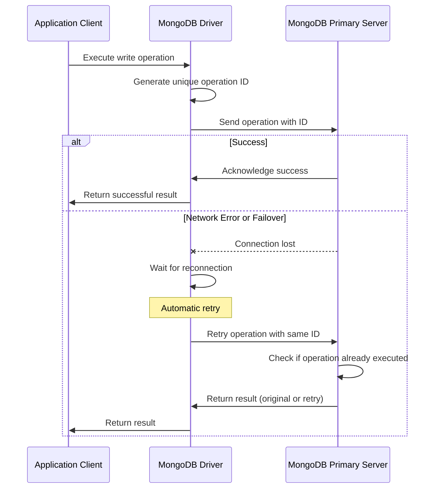

# MongoDB Retryable Writes

In a distributed database system like MongoDB, network issues, failovers, or other temporary problems can sometimes interrupt write operations. MongoDB's retryable writes feature addresses this challenge by automatically retrying certain write operations when they fail due to these transient issues, helping ensure data consistency without requiring manual intervention.

## What are Retryable Writes?

Retryable writes allow MongoDB to automatically retry specific write operations if they fail due to network errors or primary replica set failovers. This feature helps maintain application reliability without requiring developers to implement complex retry logic in their code.

When a write operation is marked as retryable:

1. MongoDB drivers assign a unique identifier to the operation
2. If the operation fails due to network issues or failover, the driver attempts to retry it once
3. The server uses the operation ID to prevent executing the same operation multiple times

## Prerequisites for Retryable Writes

Before we dive into examples, let's understand the requirements for using retryable writes:

- MongoDB 3.6 or later
- A replica set or sharded cluster deployment (not supported on standalone instances)
- Using the MongoDB drivers that support retryable writes
- Write operations must use the WiredTiger storage engine

## Enabling Retryable Writes

Retryable writes are **enabled by default** in MongoDB 4.2 and later. For MongoDB 3.6 and 4.0, you need to explicitly enable them.

### Connection String Method

You can enable retryable writes by adding the `retryWrites=true` parameter to your connection string:

```javascript
const { MongoClient } = require('mongodb');

// Explicitly enabling retryable writes in the connection string
const uri = "mongodb://localhost:27017/mydb?retryWrites=true";
const client = new MongoClient(uri);

async function run() {
  try {
    await client.connect();
    console.log("Connected successfully to MongoDB server");
    // Perform database operations here
  } finally {
    await client.close();
  }
}

run().catch(console.dir);
```

### Client Options Method

Alternatively, you can enable retryable writes using client options:

```javascript
const { MongoClient } = require('mongodb');

// Enabling retryable writes via client options
const uri = "mongodb://localhost:27017/mydb";
const client = new MongoClient(uri, { retryWrites: true });

async function run() {
  try {
    await client.connect();
    console.log("Connected successfully to MongoDB server");
    // Perform database operations here
  } finally {
    await client.close();
  }
}

run().catch(console.dir);
```

## Supported Operations

Not all MongoDB operations are retryable. Here's a list of operations that support the retryable writes feature:

- `insertOne()` and `insertMany()` (with ordered: true)
- `updateOne()` and `updateMany()`
- `deleteOne()` and `deleteMany()`
- `findOneAndUpdate()`
- `findOneAndDelete()`
- `findOneAndReplace()`
- `bulkWrite()` (for supported operations)

Example of a retryable update operation:

```javascript
const { MongoClient } = require('mongodb');

const uri = "mongodb://localhost:27017/mydb";
const client = new MongoClient(uri, { retryWrites: true });

async function updateUserScore() {
  try {
    await client.connect();
    const database = client.db("gameDatabase");
    const users = database.collection("users");

    // This update operation is automatically retryable
    const result = await users.updateOne(
      { username: "player123" },
      { $inc: { score: 10 } }
    );

    console.log(`Modified ${result.modifiedCount} document(s)`);
  } finally {
    await client.close();
  }
}

updateUserScore().catch(console.error);
```

## How Retryable Writes Work

To better understand the retryable writes mechanism, let's look at what happens behind the scenes:



## Real-World Example: Order Processing System

Let's walk through a practical example of how retryable writes can help in a real-world e-commerce order processing system:

```javascript
const { MongoClient } = require('mongodb');

// Connection URI with retryable writes enabled
const uri = "mongodb://localhost:27017?retryWrites=true";
const client = new MongoClient(uri);

async function processOrder(orderId, items, customerInfo) {
  try {
    await client.connect();
    const database = client.db("ecommerce");
    const orders = database.collection("orders");
    const inventory = database.collection("inventory");
    
    // Step 1: Create the order - if network issues occur, this will be retried
    const orderResult = await orders.insertOne({
      _id: orderId,
      items: items,
      customer: customerInfo,
      status: "processing",
      createdAt: new Date()
    });
    console.log(`Order created with ID: ${orderResult.insertedId}`);
    
    // Step 2: Update inventory for each item
    for (const item of items) {
      // This will also be retried automatically if needed
      const inventoryResult = await inventory.updateOne(
        { sku: item.sku },
        { $inc: { stockCount: -item.quantity } }
      );
      
      console.log(`Updated inventory for ${item.sku}: ${inventoryResult.modifiedCount} document modified`);
    }
    
    // Step 3: Update order status
    await orders.updateOne(
      { _id: orderId },
      { $set: { status: "confirmed" } }
    );
    
    return { success: true, orderId: orderId };
  } catch (error) {
    console.error("Error processing order:", error);
    return { success: false, error: error.message };
  }
}

// Example usage
const orderItems = [
  { sku: "SHIRT-123", quantity: 2, price: 29.99 },
  { sku: "HAT-456", quantity: 1, price: 19.99 }
];

const customer = {
  id: "cust-9876",
  name: "Jane Smith",
  email: "jane@example.com"
};

processOrder("ORD-12345", orderItems, customer)
  .then(result => console.log(result))
  .catch(console.error)
  .finally(() => client.close());
```

In this example, if a network issue occurs during the order insertion or inventory update, MongoDB will automatically retry the operation, helping to ensure that orders are properly processed without duplicates or missing data.

## When Retryable Writes Are Especially Useful

Retryable writes are particularly beneficial in scenarios such as:

1. **Microservices environments** where network issues between services are common
2. **Cloud deployments** where network partitions may occur
3. **Mobile applications** where users may experience unstable connections
4. **Mission-critical systems** where data consistency is paramount

## Limitations and Considerations

While retryable writes provide significant benefits, there are some important limitations to consider:

1. **Not supported on standalone MongoDB instances** - you must use a replica set or sharded cluster
2. **Multi-document transactions** have their own retry mechanism and should be used for operations that must be atomic across multiple documents
3. **Only one retry attempt** is made - if both the original operation and retry fail, the error is returned to the application
4. **Performance impact** is minimal but exists due to the tracking of operation IDs

## Disabling Retryable Writes

There might be situations where you want to disable retryable writes, especially if you're implementing your own retry logic:

```javascript
const { MongoClient } = require('mongodb');

// Explicitly disable retryable writes
const uri = "mongodb://localhost:27017/mydb";
const client = new MongoClient(uri, { retryWrites: false });

async function run() {
  try {
    await client.connect();
    console.log("Connected without retryable writes");
    // Perform operations with custom retry logic
  } finally {
    await client.close();
  }
}

run().catch(console.dir);
```

## Retryable Writes vs. Transactions

It's important to understand the difference between retryable writes and transactions:

| Feature | Retryable Writes | Transactions |
|---------|------------------|-------------|
| Purpose | Automatically retry write operations | Group multiple operations into an atomic unit |
| Scope | Individual write operations | Multiple operations across collections/documents |
| Default | Enabled in MongoDB 4.2+ | Must be explicitly started |
| When to use | For basic write reliability | When operations must succeed or fail as a group |

## Summary

MongoDB's retryable writes feature significantly improves application reliability by automating the retry process for write operations that fail due to transient issues. By enabling this feature, developers can:

- Reduce the need for custom retry logic
- Improve application resilience against network issues
- Minimize the risk of data inconsistency during failover events
- Focus more on business logic instead of error handling

Remember that retryable writes are enabled by default in MongoDB 4.2 and later versions, and they work best in replica sets and sharded clusters. For operations that need to be atomic across multiple documents, consider using MongoDB transactions alongside retryable writes.

## Additional Resources

- [MongoDB Retryable Writes Official Documentation](https://www.mongodb.com/docs/manual/core/retryable-writes/)
- [MongoDB Node.js Driver Documentation](https://www.mongodb.com/docs/drivers/node/current/)

## Exercise

**Challenge 1**: Create a program that inserts multiple documents with retryable writes and implement logging to track any retry attempts.

**Challenge 2**: Build a simple inventory management system that uses retryable writes to handle product quantity updates, ensuring accurate inventory counts even when network issues occur.

**Challenge 3**: Compare the behavior of your application with retryable writes enabled versus disabled during a simulated network partition or replica set election.