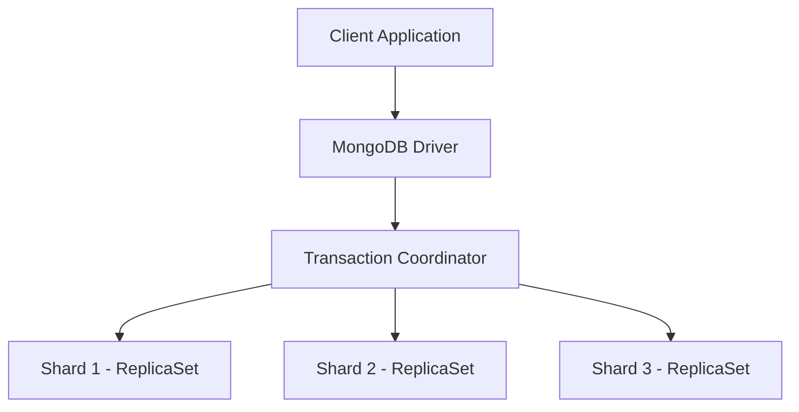

# MongoDB Distributed Transactions

## Introduction

In modern applications, data often spans across multiple servers or even data centers to ensure scalability and availability. MongoDB's distributed transactions enable you to maintain data integrity across multiple documents, collections, and even database servers—providing ACID guarantees in a distributed environment.

Distributed transactions in MongoDB build upon the single-replica-set transaction capabilities but extend them to operate across multiple shards in a sharded cluster or across multiple replica sets. This is particularly valuable when your application needs to make related changes to data that is spread across your MongoDB infrastructure.

## Prerequisites

Before diving into distributed transactions, ensure you have:

- MongoDB 4.2 or later
- A basic understanding of MongoDB transactions
- Familiarity with MongoDB sharding concepts

## Understanding Distributed Transactions in MongoDB

### What Makes Transactions "Distributed"?

A transaction becomes "distributed" when it spans:

1. Multiple shards in a sharded cluster
2. Multiple replica sets that aren't part of a sharding configuration



### How Distributed Transactions Work

Distributed transactions in MongoDB implement a two-phase commit protocol:

1. **Prepare Phase**: The transaction coordinator asks all participants to prepare for commit
2. **Commit Phase**: If all participants agree, the coordinator commits the changes

This ensures either all operations succeed together or none of them do, maintaining data consistency across your distributed system.

## Configuring Your Environment for Distributed Transactions

### Replica Set Configuration Requirements

For distributed transactions to work properly, all replica sets must:

```javascript
// Ensure your replica set has proper write concern configuration
{
  writeConcern: {
    w: "majority",
    j: true
  }
}
```

### Connection String Setup

To enable transactions in a distributed environment, your connection string should include the `replicaSet`, `w=majority`, and `readConcernLevel=majority` parameters:

```javascript
const uri = "mongodb://hostname1:27017,hostname2:27017,hostname3:27017/?replicaSet=myReplSetName&w=majority&readConcernLevel=majority";
```

## Implementing Distributed Transactions

### Basic Structure

The structure of a distributed transaction is similar to a regular MongoDB transaction:

```javascript
// Start a session
const session = client.startSession();

try {
  // Start a transaction
  session.startTransaction();
  
  // Perform operations across different shards/replica sets
  // For example, operations on different databases or collections
  const db1 = client.db("database1");
  const db2 = client.db("database2");
  
  await db1.collection("collection1").insertOne({ name: "Document in DB1" }, { session });
  await db2.collection("collection2").insertOne({ name: "Document in DB2" }, { session });
  
  // Commit the transaction
  await session.commitTransaction();
  console.log("Transaction successfully committed.");
} catch (error) {
  // If an error occurred, abort the transaction
  await session.abortTransaction();
  console.log("Transaction aborted due to an error:");
  console.log(error);
} finally {
  // End the session
  session.endSession();
}
```

### Example: Bank Transfer Across Sharded Clusters

Let's consider a practical example where we transfer money between accounts that are stored on different shards:

```javascript
const { MongoClient } = require("mongodb");
const uri = "mongodb://mongos1:27017,mongos2:27017/";
const client = new MongoClient(uri);

async function transferMoney(fromAccountId, toAccountId, amount) {
  const session = client.startSession();
  
  try {
    session.startTransaction({
      readConcern: { level: "snapshot" },
      writeConcern: { w: "majority" },
      readPreference: "primary"
    });
    
    const accountsCollection = client.db("banking").collection("accounts");
    
    // Check if source account has sufficient funds
    const sourceAccount = await accountsCollection.findOne(
      { _id: fromAccountId },
      { session }
    );
    
    if (!sourceAccount || sourceAccount.balance < amount) {
      throw new Error("Insufficient funds or account not found");
    }
    
    // Debit source account
    await accountsCollection.updateOne(
      { _id: fromAccountId },
      { $inc: { balance: -amount } },
      { session }
    );
    
    // Credit destination account
    await accountsCollection.updateOne(
      { _id: toAccountId },
      { $inc: { balance: amount } },
      { session }
    );
    
    // Commit the transaction
    await session.commitTransaction();
    console.log(`Successfully transferred $${amount} from account ${fromAccountId} to ${toAccountId}`);
    return true;
  } catch (error) {
    // Abort transaction on error
    await session.abortTransaction();
    console.error("Transaction failed:", error);
    return false;
  } finally {
    session.endSession();
  }
}

// Usage
async function run() {
  try {
    await client.connect();
    const result = await transferMoney("account123", "account456", 500);
    if (result) {
      console.log("Transfer completed successfully");
    } else {
      console.log("Transfer failed");
    }
  } finally {
    await client.close();
  }
}

run().catch(console.error);
```

## Best Practices for Distributed Transactions

### 1. Keep Transactions Short

Distributed transactions involve coordinating across multiple servers, so they should be:

- Brief in duration
- Limited in the number of operations
- Focused on essential changes

### 2. Handle Retry Logic

Network partitions or temporary failures can occur in distributed systems. Implement retry logic to handle transient errors:

```javascript
async function executeTransactionWithRetry(txnFunc, maxRetries = 5) {
  for (let retry = 0; retry < maxRetries; retry++) {
    try {
      await txnFunc();
      return;  // Success! Exit the function
    } catch (error) {
      if (error.hasErrorLabel("TransientTransactionError") && retry < maxRetries - 1) {
        console.log(`Transaction failed with transient error, retrying (attempt ${retry + 1} of ${maxRetries})...`);
        // Wait a bit before retrying
        await new Promise(resolve => setTimeout(resolve, 100 * Math.pow(2, retry)));
      } else {
        throw error;  // Not a transient error or max retries exceeded
      }
    }
  }
}

// Usage
await executeTransactionWithRetry(async () => {
  const session = client.startSession();
  try {
    session.startTransaction();
    // Transaction operations
    await session.commitTransaction();
  } catch (error) {
    await session.abortTransaction();
    throw error; // Re-throw for the retry handler
  } finally {
    session.endSession();
  }
});
```

### 3. Use Appropriate Read and Write Concerns

For distributed transactions, use appropriate read and write concerns to match your application's durability needs:

```javascript
session.startTransaction({
  readConcern: { level: "snapshot" },
  writeConcern: { w: "majority" },
  readPreference: "primary"
});
```

### 4. Monitor Transaction Performance

Use MongoDB's built-in tools to monitor transaction performance:

```javascript
db.adminCommand({
  currentOp: true,
  $or: [
    { "transaction": { $exists: true } },
    { "transaction_id": { $exists: true } }
  ]
});
```

## Real-World Application: E-commerce Order Processing

Consider an e-commerce application where product inventory and customer orders are stored on different shards:

```javascript
async function processOrder(userId, items) {
  const session = client.startSession();
  
  try {
    session.startTransaction();
    
    const ordersCollection = client.db("ecommerce").collection("orders");
    const productsCollection = client.db("ecommerce").collection("products");
    const usersCollection = client.db("ecommerce").collection("users");
    
    // Create new order
    const order = {
      userId: userId,
      items: items,
      status: "processing",
      created: new Date()
    };
    
    const orderResult = await ordersCollection.insertOne(order, { session });
    const orderId = orderResult.insertedId;
    
    // Check inventory and update product quantities
    for (const item of items) {
      const product = await productsCollection.findOne(
        { _id: item.productId, stock: { $gte: item.quantity } },
        { session }
      );
      
      if (!product) {
        throw new Error(`Insufficient stock for product ${item.productId}`);
      }
      
      await productsCollection.updateOne(
        { _id: item.productId },
        { $inc: { stock: -item.quantity } },
        { session }
      );
    }
    
    // Update user's order history
    await usersCollection.updateOne(
      { _id: userId },
      { $push: { orderIds: orderId } },
      { session }
    );
    
    // Commit transaction
    await session.commitTransaction();
    return { success: true, orderId: orderId };
  } catch (error) {
    await session.abortTransaction();
    console.error("Order processing failed:", error);
    return { success: false, error: error.message };
  } finally {
    session.endSession();
  }
}

// Usage
const orderItems = [
  { productId: "prod123", quantity: 2, price: 19.99 },
  { productId: "prod456", quantity: 1, price: 29.99 }
];

async function placeOrder() {
  try {
    const result = await processOrder("user789", orderItems);
    if (result.success) {
      console.log(`Order placed successfully with ID: ${result.orderId}`);
    } else {
      console.log(`Failed to place order: ${result.error}`);
    }
  } catch (error) {
    console.error("Error placing order:", error);
  }
}
```

## Limitations and Considerations

Despite their power, distributed transactions come with some limitations:

1. **Performance Impact**: Distributed transactions are more expensive than single-document operations or even single-replica-set transactions.

2. **Max Execution Time**: By default, transactions must complete within 60 seconds (configurable up to 24 hours).

3. **Operation Limits**: A transaction cannot include operations that affect the database catalog, such as creating or dropping collections.

4. **Size Limitations**: The total size of changes within a transaction must be under 16MB.

5. **Resource Requirements**: Distributed transactions require more memory and CPU resources than regular operations.

## Troubleshooting Common Issues

### Transaction Timeouts

If your transactions are timing out:

```javascript
// Increase transaction timeout from default 60 seconds
session.startTransaction({
  readConcern: { level: "snapshot" },
  writeConcern: { w: "majority" },
  readPreference: "primary",
  maxTransactionLockRequestTimeoutMillis: 5000, // 5 seconds
  maxCommitTimeMS: 60000 // 60 seconds
});
```

### Error: Transaction numbers are only allowed on a replica set member or mongos

This error occurs when you try to use transactions on a standalone MongoDB instance. Ensure you're connected to a replica set or sharded cluster.

### Error: ReadConcern "snapshot" is not supported in sharded transactions

Use an appropriate read concern level like `"majority"` for sharded transactions.

## Summary

MongoDB distributed transactions provide a powerful way to maintain data consistency across multiple shards or replica sets. They use a two-phase commit protocol to ensure that either all operations succeed or none of them do, preserving the ACID properties of your transactions even in a distributed environment.

Key points to remember:

- Distributed transactions require MongoDB 4.2 or later
- They work across sharded clusters or multiple replica sets
- Follow a two-phase commit protocol to ensure consistency
- Follow best practices like keeping transactions short and implementing retry logic
- Consider performance implications and resource requirements

By using distributed transactions properly, you can build robust applications that maintain data integrity across your entire MongoDB infrastructure, regardless of how your data is distributed.

## Additional Resources

- MongoDB Documentation: [Distributed Transactions](https://www.mongodb.com/docs/manual/core/transactions-sharded-clusters/)
- MongoDB University: [M121: The MongoDB Aggregation Framework](https://university.mongodb.com/courses/M121/about)
- MongoDB Blog: [Multi-Document ACID Transactions in MongoDB](https://www.mongodb.com/blog/post/mongodb-multi-document-acid-transactions-general-availability)

## Exercises

1. Set up a sharded MongoDB cluster locally using Docker and practice implementing distributed transactions.
2. Extend the bank transfer example to include transaction history recording on a separate shard.
3. Implement a retry mechanism with exponential backoff for handling transient transaction errors.
4. Create a distributed transaction that conditionally executes different operations based on data from multiple shards.
5. Build a simple microservice architecture where two separate services coordinate their data changes using MongoDB distributed transactions.