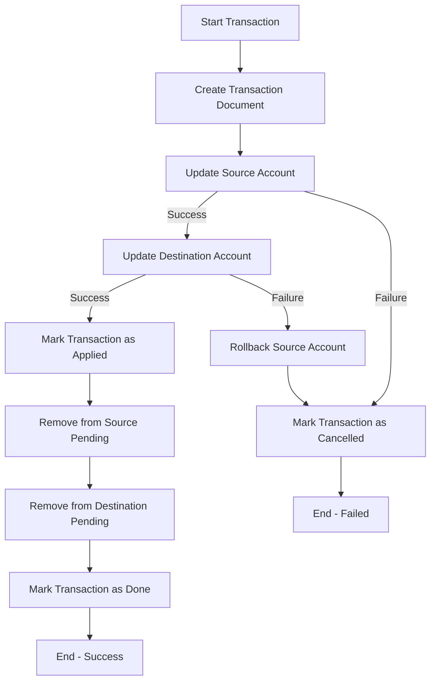

# MongoDB Two-Phase Commit

## Introduction

When working with MongoDB, especially in versions prior to 4.0 or in situations where multi-document ACID transactions aren't available (like in sharded clusters in older versions), ensuring data consistency across multiple documents or collections can be challenging. This is where the "two-phase commit" pattern becomes essential.

The two-phase commit is a database pattern that helps maintain data integrity across multiple documents when atomic transactions aren't supported. It's a way to simulate transactions by tracking the state of an operation as it progresses through different phases.

In this tutorial, we'll explore:
- What a two-phase commit is and why it's needed
- How to implement the pattern in MongoDB
- Common challenges and solutions
- Real-world applications of two-phase commits

## Understanding Two-Phase Commit

### What is Two-Phase Commit?

A two-phase commit is a pattern that breaks a transaction into two phases:

1. **Preparation Phase**: All participants in the transaction prepare to commit and report their readiness.
2. **Commit Phase**: After confirming all participants are ready, the actual changes are committed.

This approach provides a way to ensure that either all operations complete successfully or none of them do, maintaining data consistency.

### Why Use Two-Phase Commit in MongoDB?

Prior to MongoDB 4.0, there was no built-in support for multi-document transactions. Even in newer versions, certain deployment types or operations might not support transactions. In these scenarios, the two-phase commit pattern helps maintain data consistency across related documents.

## Implementation of Two-Phase Commit in MongoDB

Let's implement a two-phase commit for a typical banking scenario: transferring funds from one account to another.

### Schema Design

First, let's define our account schema:

```javascript
// Account document structure
{
  _id: ObjectId,
  accountId: String,
  username: String,
  balance: Number,
  pendingTransactions: Array
}
```

We'll also need a transaction collection to track the state of each transaction:

```javascript
// Transaction document structure
{
  _id: ObjectId,
  sourceAccountId: String,
  destAccountId: String,
  amount: Number,
  state: String,  // "initial", "pending", "applied", "done", "cancelled"
  lastModified: Date
}
```

### Step-by-Step Implementation

#### 1. Initialize the Transaction

First, we create a transaction document in the "initial" state:

```javascript
db.transactions.insertOne({
  sourceAccountId: "account1",
  destAccountId: "account2",
  amount: 100,
  state: "initial",
  lastModified: new Date()
});
```

#### 2. Update Source Account (Preparation Phase)

Next, we update the source account by adding this transaction to its `pendingTransactions` array:

```javascript
db.accounts.updateOne(
  { 
    accountId: "account1", 
    balance: { $gte: 100 } // Ensure sufficient funds
  },
  { 
    $push: { pendingTransactions: transactionId },
    $inc: { balance: -100 } // Reduce balance
  }
);
```

If this update fails (insufficient funds or account doesn't exist), we mark the transaction as "cancelled" and stop.

#### 3. Update Destination Account (Preparation Phase)

Now, we update the destination account:

```javascript
db.accounts.updateOne(
  { accountId: "account2" },
  { 
    $push: { pendingTransactions: transactionId },
    $inc: { balance: 100 } // Increase balance
  }
);
```

If this update fails, we need to roll back the changes to the source account and cancel the transaction.

#### 4. Update Transaction State (Commit Phase)

After both accounts have been updated, we update the transaction state to "applied":

```javascript
db.transactions.updateOne(
  { _id: transactionId },
  { 
    $set: { 
      state: "applied",
      lastModified: new Date()
    }
  }
);
```

#### 5. Clean Up (Commit Phase)

Finally, we remove the transaction from the pending lists of both accounts:

```javascript
// Remove from source account's pending transactions
db.accounts.updateOne(
  { accountId: "account1" },
  { $pull: { pendingTransactions: transactionId } }
);

// Remove from destination account's pending transactions
db.accounts.updateOne(
  { accountId: "account2" },
  { $pull: { pendingTransactions: transactionId } }
);

// Mark transaction as completed
db.transactions.updateOne(
  { _id: transactionId },
  { 
    $set: { 
      state: "done",
      lastModified: new Date()
    }
  }
);
```

### Complete Example: Fund Transfer Function

Let's put it all together in a single function:

```javascript
function transferFunds(sourceAccountId, destAccountId, amount) {
  // Step 1: Initialize the transaction
  const transactionId = db.transactions.insertOne({
    sourceAccountId: sourceAccountId,
    destAccountId: destAccountId,
    amount: amount,
    state: "initial",
    lastModified: new Date()
  }).insertedId;
  
  try {
    // Step 2: Update source account
    const sourceResult = db.accounts.updateOne(
      { 
        accountId: sourceAccountId, 
        balance: { $gte: amount } 
      },
      { 
        $push: { pendingTransactions: transactionId },
        $inc: { balance: -amount }
      }
    );
    
    if (sourceResult.modifiedCount === 0) {
      // Source account doesn't exist or insufficient funds
      db.transactions.updateOne(
        { _id: transactionId },
        { 
          $set: { 
            state: "cancelled", 
            lastModified: new Date() 
          } 
        }
      );
      return { success: false, message: "Source account not found or insufficient funds" };
    }
    
    // Step 3: Update destination account
    const destResult = db.accounts.updateOne(
      { accountId: destAccountId },
      { 
        $push: { pendingTransactions: transactionId },
        $inc: { balance: amount }
      }
    );
    
    if (destResult.modifiedCount === 0) {
      // Destination account doesn't exist, rollback source account
      db.accounts.updateOne(
        { accountId: sourceAccountId },
        { 
          $pull: { pendingTransactions: transactionId },
          $inc: { balance: amount }
        }
      );
      
      db.transactions.updateOne(
        { _id: transactionId },
        { 
          $set: { 
            state: "cancelled", 
            lastModified: new Date() 
          } 
        }
      );
      return { success: false, message: "Destination account not found" };
    }
    
    // Step 4: Mark transaction as applied
    db.transactions.updateOne(
      { _id: transactionId },
      { 
        $set: { 
          state: "applied",
          lastModified: new Date()
        }
      }
    );
    
    // Step 5: Clean up (remove from pending lists)
    db.accounts.updateOne(
      { accountId: sourceAccountId },
      { $pull: { pendingTransactions: transactionId } }
    );
    
    db.accounts.updateOne(
      { accountId: destAccountId },
      { $pull: { pendingTransactions: transactionId } }
    );
    
    // Mark transaction as done
    db.transactions.updateOne(
      { _id: transactionId },
      { 
        $set: { 
          state: "done",
          lastModified: new Date()
        }
      }
    );
    
    return { success: true, message: "Transfer completed successfully" };
    
  } catch (error) {
    // If any exception occurs, mark the transaction for manual review
    db.transactions.updateOne(
      { _id: transactionId },
      { 
        $set: { 
          state: "error", 
          error: error.toString(),
          lastModified: new Date() 
        } 
      }
    );
    return { success: false, message: "An error occurred", error: error.toString() };
  }
}
```

## Handling Failure Scenarios

The two-phase commit pattern must account for various failure scenarios:

### 1. Application Crashes

If the application crashes during the process, we can implement a recovery mechanism:

```javascript
function recoverInProgressTransactions() {
  // Find transactions that aren't in a terminal state
  const pendingTransactions = db.transactions.find({
    state: { $in: ["initial", "pending", "applied"] },
    lastModified: { $lt: new Date(Date.now() - 30 * 60 * 1000) } // Older than 30 minutes
  }).toArray();
  
  for (const transaction of pendingTransactions) {
    // For each transaction, check its state and take appropriate action
    switch(transaction.state) {
      case "initial":
        // Transaction never started, mark as cancelled
        db.transactions.updateOne(
          { _id: transaction._id },
          { $set: { state: "cancelled", lastModified: new Date() } }
        );
        break;
        
      case "pending":
        // Check if source was updated but not destination
        // Roll back or continue based on what we find
        // ...
        break;
        
      case "applied":
        // Just needs cleanup, complete the transaction
        // ...
        break;
    }
  }
}
```

### 2. Network Partition

Network partitions can leave the system in an inconsistent state. Regular checks can identify and address these issues:

```javascript
function validateAccountBalances() {
  const accounts = db.accounts.find({
    pendingTransactions: { $exists: true, $ne: [] }
  }).toArray();
  
  for (const account of accounts) {
    // Check if any pending transactions are actually completed or cancelled
    for (const txnId of account.pendingTransactions) {
      const transaction = db.transactions.findOne({ _id: txnId });
      if (transaction.state === "done" || transaction.state === "cancelled") {
        // Remove from pending list
        db.accounts.updateOne(
          { _id: account._id },
          { $pull: { pendingTransactions: txnId } }
        );
      }
    }
  }
}
```

## Visualizing the Two-Phase Commit Process

Here's a flowchart illustrating the two-phase commit process:



## Real-World Application: E-commerce Order Processing

Let's consider an e-commerce application where we need to:
1. Update inventory
2. Process payment
3. Create order

### Implementation Example

```javascript
function processOrder(userId, items, paymentInfo) {
  // Step 1: Initialize the transaction
  const transactionId = db.orderTransactions.insertOne({
    userId: userId,
    items: items,
    paymentInfo: paymentInfo,
    state: "initial",
    lastModified: new Date()
  }).insertedId;
  
  try {
    // Step 2: Check and update inventory
    for (const item of items) {
      const inventoryResult = db.inventory.updateOne(
        { 
          itemId: item.itemId, 
          quantity: { $gte: item.quantity } 
        },
        { 
          $inc: { quantity: -item.quantity },
          $push: { pendingOrders: transactionId }
        }
      );
      
      if (inventoryResult.modifiedCount === 0) {
        // Item not in stock, rollback and cancel
        rollbackInventoryChanges(items, transactionId);
        db.orderTransactions.updateOne(
          { _id: transactionId },
          { 
            $set: { 
              state: "cancelled", 
              reason: "Insufficient inventory",
              lastModified: new Date() 
            } 
          }
        );
        return { success: false, message: "Item out of stock" };
      }
    }
    
    // Step 3: Process payment
    const paymentResult = processPayment(paymentInfo, calculateTotal(items));
    if (!paymentResult.success) {
      // Payment failed, rollback inventory
      rollbackInventoryChanges(items, transactionId);
      db.orderTransactions.updateOne(
        { _id: transactionId },
        { 
          $set: { 
            state: "cancelled", 
            reason: "Payment failed",
            lastModified: new Date() 
          } 
        }
      );
      return { success: false, message: "Payment processing failed" };
    }
    
    // Step 4: Create order
    const order = {
      userId: userId,
      items: items,
      paymentId: paymentResult.paymentId,
      status: "processing",
      createdAt: new Date(),
      transactionId: transactionId
    };
    
    const orderId = db.orders.insertOne(order).insertedId;
    
    // Step 5: Mark transaction as applied
    db.orderTransactions.updateOne(
      { _id: transactionId },
      { 
        $set: { 
          state: "applied",
          orderId: orderId,
          lastModified: new Date()
        }
      }
    );
    
    // Step 6: Clean up - remove pending flags from inventory
    for (const item of items) {
      db.inventory.updateOne(
        { itemId: item.itemId },
        { $pull: { pendingOrders: transactionId } }
      );
    }
    
    // Mark transaction as done
    db.orderTransactions.updateOne(
      { _id: transactionId },
      { 
        $set: { 
          state: "done",
          lastModified: new Date()
        }
      }
    );
    
    return { 
      success: true, 
      message: "Order processed successfully", 
      orderId: orderId 
    };
    
  } catch (error) {
    // If any exception occurs, attempt rollback and mark for review
    try {
      rollbackInventoryChanges(items, transactionId);
    } catch (rollbackError) {
      // Log rollback error
    }
    
    db.orderTransactions.updateOne(
      { _id: transactionId },
      { 
        $set: { 
          state: "error", 
          error: error.toString(),
          lastModified: new Date() 
        } 
      }
    );
    
    return { success: false, message: "An error occurred", error: error.toString() };
  }
}

function rollbackInventoryChanges(items, transactionId) {
  for (const item of items) {
    db.inventory.updateOne(
      { itemId: item.itemId, pendingOrders: transactionId },
      { 
        $inc: { quantity: item.quantity },
        $pull: { pendingOrders: transactionId }
      }
    );
  }
}
```

## Performance Considerations

The two-phase commit pattern adds overhead compared to native transactions, so keep these tips in mind:

1. **Minimize transaction scope**: Include only necessary operations
2. **Set timeouts**: Add timestamps and timeouts to prevent orphaned transactions
3. **Implement recovery processes**: Create background jobs that recover or rollback "stuck" transactions
4. **Use indexes effectively**: Ensure all queries in the process use proper indexes

## When to Use Two-Phase Commit vs. Native Transactions

Since MongoDB 4.0, multi-document ACID transactions have been available for replica sets, and since MongoDB 4.2 for sharded clusters. Consider:

1. **Use native transactions when**:
   - Using MongoDB 4.0+ with replica sets or 4.2+ with sharded clusters
   - Operations span multiple documents/collections but are limited in scope
   - You need stronger consistency guarantees

2. **Use two-phase commit when**:
   - Working with older MongoDB versions
   - In distributed systems where operations span multiple databases
   - For long-running operations that exceed transaction time limits
   - When transactions aren't supported in your deployment type

## Summary

The two-phase commit pattern is a powerful technique for maintaining data integrity in MongoDB when native transactions aren't available or suitable. By breaking operations into preparation and commit phases and carefully tracking state, you can ensure consistency across document updates.

Key points:
- Two-phase commits provide a way to maintain data integrity across multiple documents
- They require explicit tracking of transaction state and handling of failure scenarios
- Recovery mechanisms are essential for handling crashes or network issues
- While more complex than native transactions, they offer flexibility in scenarios where transactions aren't supported

## Exercise: Implement a Two-Phase Commit

Try implementing a two-phase commit for a scenario where a user is registering for multiple courses simultaneously:

1. Create a user document
2. Update multiple course documents to add the user
3. Only commit if the user can be added to all courses (some might have limited capacity)
4. Implement proper error handling and rollback procedures

## Further Reading

- [MongoDB Documentation on Two-Phase Commits](https://www.mongodb.com/docs/manual/tutorial/perform-two-phase-commits/)
- [ACID Properties in Database Systems](https://www.mongodb.com/basics/acid-transactions)
- [MongoDB Transactions Documentation](https://www.mongodb.com/docs/manual/core/transactions/)
- [Distributed Systems Patterns](https://martinfowler.com/articles/patterns-of-distributed-systems/)

Happy coding with MongoDB and two-phase commits!