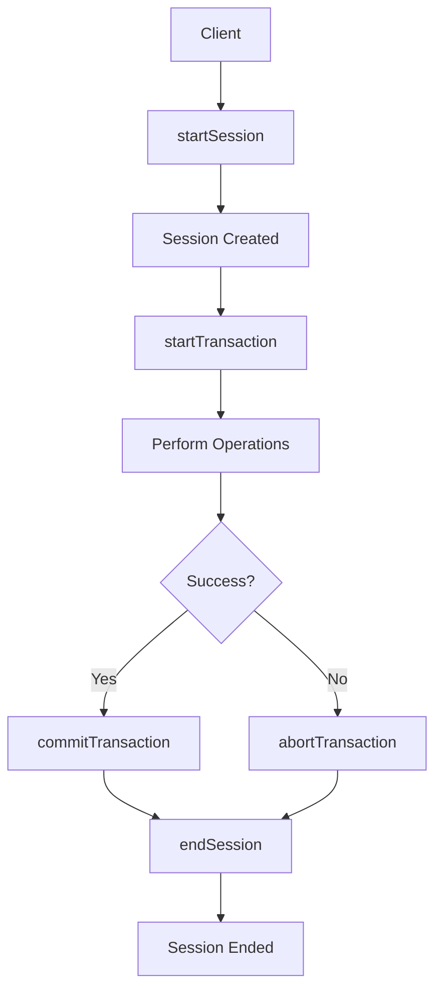

# MongoDB startSession

## Introduction

In MongoDB, transactions provide the ability to perform multiple operations as a single atomic unit, ensuring data consistency. The first step in working with MongoDB transactions is creating a session using the `startSession()` method. 

A session represents a logical grouping of operations that are executed together within the same context. Think of a session as a conversation between your application and the MongoDB server where related operations are grouped together.

In this guide, you'll learn how to:
- Create and configure sessions in MongoDB
- Understand session options
- Use sessions with transactions
- Apply best practices when working with sessions

## Session Basics

### What is a Session?

A MongoDB session is an object that maintains a connection to the server and provides the context for operations that should be part of a transaction. Sessions track causally related operations and are required for executing multi-document transactions.

### Creating a Simple Session

Here's how to create a basic session:

```javascript
const { MongoClient } = require('mongodb');

async function createBasicSession() {
  const uri = 'mongodb://localhost:27017';
  const client = new MongoClient(uri);
  
  try {
    await client.connect();
    
    // Start a new session
    const session = client.startSession();
    console.log('Session created successfully');
    
    // Always end your session when done
    session.endSession();
  } catch (error) {
    console.error('Error occurred:', error);
  } finally {
    await client.close();
  }
}

createBasicSession();
```

When you run this code, you'll see:

```
Session created successfully
```

## Session Options

The `startSession()` method accepts an options object that allows you to customize the session's behavior:

```javascript
const sessionOptions = {
  causalConsistency: true,
  defaultTransactionOptions: {
    readConcern: { level: 'majority' },
    writeConcern: { w: 'majority' },
    readPreference: 'primary'
  }
};

const session = client.startSession(sessionOptions);
```

Let's examine these options:

### causalConsistency

The `causalConsistency` option (default: `true`) ensures that operations within a session are causally ordered. This means each operation sees the effects of all prior operations in that session.

### defaultTransactionOptions

This object configures the default options for transactions started within this session:

- **readConcern**: Controls the consistency and isolation properties of data read within a transaction
- **writeConcern**: Controls the acknowledgment level for write operations
- **readPreference**: Determines which replica set members receive read operations

## Using Sessions with Transactions

Sessions are particularly useful when working with transactions. Here's how to use a session to execute a transaction:

```javascript
const { MongoClient } = require('mongodb');

async function executeTransaction() {
  const uri = 'mongodb://localhost:27017';
  const client = new MongoClient(uri);
  
  try {
    await client.connect();
    const database = client.db('bankDB');
    const accounts = database.collection('accounts');
    
    // Start a session
    const session = client.startSession();
    
    try {
      // Start a transaction
      session.startTransaction();
      
      // Perform operations within the transaction
      await accounts.updateOne(
        { accountId: 'account1' },
        { $inc: { balance: -100 } },
        { session }
      );
      
      await accounts.updateOne(
        { accountId: 'account2' },
        { $inc: { balance: 100 } },
        { session }
      );
      
      // Commit the transaction
      await session.commitTransaction();
      console.log('Transaction committed successfully');
    } catch (error) {
      // If an error occurred, abort the transaction
      await session.abortTransaction();
      console.error('Transaction aborted due to error:', error);
    } finally {
      // End the session
      session.endSession();
    }
  } finally {
    await client.close();
  }
}

executeTransaction();
```

Notice how we pass the `session` object to each operation we want to include in the transaction. This tells MongoDB to execute these operations within the context of that session.

## Practical Example: Money Transfer System

Let's build a more complete example of a money transfer system using MongoDB transactions:

```javascript
const { MongoClient } = require('mongodb');

async function transferMoney(fromAccountId, toAccountId, amount) {
  const uri = 'mongodb://localhost:27017';
  const client = new MongoClient(uri);
  
  try {
    await client.connect();
    const database = client.db('bankDB');
    const accounts = database.collection('accounts');
    
    // Start a session
    const session = client.startSession();
    
    try {
      // Start a transaction
      session.startTransaction();
      
      // Check if sender has sufficient funds
      const senderAccount = await accounts.findOne(
        { accountId: fromAccountId },
        { session }
      );
      
      if (!senderAccount || senderAccount.balance < amount) {
        throw new Error('Insufficient funds or account not found');
      }
      
      // Deduct from sender
      await accounts.updateOne(
        { accountId: fromAccountId },
        { $inc: { balance: -amount } },
        { session }
      );
      
      // Add to receiver
      await accounts.updateOne(
        { accountId: toAccountId },
        { $inc: { balance: amount } },
        { session }
      );
      
      // Record the transaction in a separate collection
      await database.collection('transactions').insertOne({
        fromAccount: fromAccountId,
        toAccount: toAccountId,
        amount: amount,
        timestamp: new Date()
      }, { session });
      
      // Commit the transaction
      await session.commitTransaction();
      console.log(`Successfully transferred $${amount} from ${fromAccountId} to ${toAccountId}`);
      return true;
    } catch (error) {
      // Abort the transaction on error
      await session.abortTransaction();
      console.error('Transaction failed:', error);
      return false;
    } finally {
      session.endSession();
    }
  } finally {
    await client.close();
  }
}

// Example usage
async function run() {
  const result = await transferMoney('account1', 'account2', 500);
  console.log(`Transaction ${result ? 'succeeded' : 'failed'}`);
}

run();
```

This example demonstrates:
1. Creating a session
2. Starting a transaction
3. Executing multiple operations (read and write) within the transaction
4. Properly handling errors with `abortTransaction()`
5. Committing the transaction when successful
6. Always ending the session

## Session Lifecycle Diagram

Here's a visual representation of a MongoDB session lifecycle:



## Session Management Best Practices

When working with MongoDB sessions, follow these best practices:

1. **Always end sessions**: Use `session.endSession()` when you're done with a session to free up resources.

2. **Use try/catch/finally blocks**: Properly handle errors and ensure sessions are properly closed.

3. **Pass the session to all operations**: For operations to be part of the same transaction, pass the session object to each operation.

4. **Keep transactions short**: Long-running transactions can decrease database performance.

5. **Handle retryable writes**: Network issues can occur during transactions. Use MongoDB's retryable writes feature:

```javascript
const client = new MongoClient(uri, { retryWrites: true });
```

6. **Set appropriate timeout values**: For long operations, adjust the transaction timeout:

```javascript
const session = client.startSession();
const transactionOptions = {
  readConcern: { level: 'majority' },
  writeConcern: { w: 'majority' },
  readPreference: 'primary',
  maxCommitTimeMS: 1000 // 1 second timeout
};

session.startTransaction(transactionOptions);
```

## Common Errors and Troubleshooting

### TransactionInProgress Error

If you encounter a "TransactionInProgress" error, it means you're trying to start a new transaction before committing or aborting the current one:

```javascript
// Wrong:
session.startTransaction();
// ... do some operations ...
session.startTransaction(); // Error: Transaction already in progress

// Correct:
session.startTransaction();
// ... do some operations ...
await session.commitTransaction();
session.startTransaction(); // Now this is okay
```

### Session Expired Error

If a session remains inactive for too long, it might expire:

```javascript
const session = client.startSession();
// ... wait for a long time ...
await accounts.findOne({}, { session }); // Might cause "Session expired" error
```

To avoid this, create sessions when you need them and end them promptly.

## Summary

The `startSession()` method is your entry point into MongoDB's transaction capabilities. In this guide, you've learned:

- How to create a session with `startSession()`
- How to configure session options
- How to use sessions with transactions
- Best practices for session management
- How to handle common errors

Sessions are fundamental to working with transactions in MongoDB and understanding how to use them effectively is crucial for building reliable applications that maintain data integrity.

## Additional Resources

- [MongoDB Official Documentation on Transactions](https://docs.mongodb.com/manual/core/transactions/)
- [MongoDB Node.js Driver API Documentation](https://mongodb.github.io/node-mongodb-native/4.0/classes/MongoClient.html#startSession)

## Exercises

1. Create a simple banking application that allows users to transfer money between accounts using MongoDB transactions.

2. Implement a shopping cart checkout process where inventory is updated and orders are created atomically.

3. Modify the money transfer example to include retry logic for handling transient network errors.

4. Create a function that uses a session to perform bulk operations on multiple collections, ensuring they all succeed or fail together.

5. Build a user registration system that creates user records in multiple collections within a single transaction.