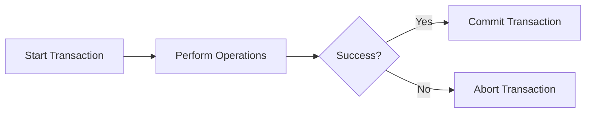

# MongoDB startTransaction

## Introduction

MongoDB transactions allow you to perform multiple operations as a single atomic unit of work. If one operation fails, all operations within the transaction are rolled back, ensuring data consistency. The `startTransaction()` method is the entry point for initiating a transaction in MongoDB.

In this guide, we'll explore how to use `startTransaction()`, understand its options, and see practical examples of transactions in real-world applications.

## Prerequisites

Before you start working with MongoDB transactions, ensure that:

- You're using MongoDB 4.0 or later
- Your database deployment supports transactions (replica sets or sharded clusters)
- You understand basic MongoDB CRUD operations

## Understanding MongoDB Transactions

Transactions in MongoDB follow a pattern similar to other database systems:

1. Start a transaction with `startTransaction()`
2. Perform operations
3. Commit the transaction with `commitTransaction()` or abort it with `abortTransaction()`



## Basic Syntax

Here's the basic syntax for starting a transaction:

```javascript
const session = client.startSession();
try {
  session.startTransaction(options);
  
  // Perform operations within the transaction
  
  await session.commitTransaction();
} catch (error) {
  await session.abortTransaction();
  console.error('Transaction aborted:', error);
} finally {
  session.endSession();
}
```

## The startTransaction Method

The `startTransaction()` method is a function called on a session object to initiate a transaction. Here's a breakdown:

### Syntax

```javascript
session.startTransaction(options)
```

### Parameters

The `options` parameter is an optional object that can contain the following properties:

| Option | Type | Description |
|--------|------|-------------|
| `readConcern` | Object | Specifies the read concern for the transaction |
| `writeConcern` | Object | Specifies the write concern for the transaction |
| `readPreference` | Object | Specifies the read preference for the transaction |
| `maxCommitTimeMS` | Number | Maximum time in milliseconds to allow for commit operations |

## Basic Example

Let's look at a basic example of starting and completing a transaction:

```javascript
const { MongoClient } = require('mongodb');

async function transferMoney(from, to, amount) {
  const uri = 'mongodb://localhost:27017';
  const client = new MongoClient(uri);
  
  try {
    await client.connect();
    const database = client.db('banking');
    const accounts = database.collection('accounts');
    
    // Start a session
    const session = client.startSession();
    
    try {
      // Start a transaction
      session.startTransaction();
      
      // Withdraw money from the first account
      const withdrawResult = await accounts.updateOne(
        { _id: from },
        { $inc: { balance: -amount } },
        { session }
      );
      
      if (withdrawResult.modifiedCount !== 1) {
        throw new Error('Failed to withdraw money');
      }
      
      // Deposit money to the second account
      const depositResult = await accounts.updateOne(
        { _id: to },
        { $inc: { balance: amount } },
        { session }
      );
      
      if (depositResult.modifiedCount !== 1) {
        throw new Error('Failed to deposit money');
      }
      
      // Commit the transaction
      await session.commitTransaction();
      console.log('Transaction committed successfully');
    } catch (error) {
      // Abort the transaction in case of error
      await session.abortTransaction();
      console.error('Transaction aborted:', error);
      throw error;
    } finally {
      // End the session
      session.endSession();
    }
  } finally {
    // Close the client
    await client.close();
  }
}

// Example usage
transferMoney('account1', 'account2', 100)
  .then(() => console.log('Transfer completed'))
  .catch(error => console.error('Transfer failed:', error));
```

### Output:

If successful:
```
Transaction committed successfully
Transfer completed
```

If there's an error:
```
Transaction aborted: Error: Failed to withdraw money
Transfer failed: Error: Failed to withdraw money
```

## Using Transaction Options

You can customize your transaction's behavior using the options parameter:

```javascript
session.startTransaction({
  readConcern: { level: 'snapshot' },
  writeConcern: { w: 'majority' },
  readPreference: { mode: 'primary' },
  maxCommitTimeMS: 5000
});
```

### Common Read Concern Levels

- `'local'`: Returns data from the current replica set member without guarantee of durability
- `'majority'`: Returns data that has been acknowledged by a majority of the replica set members
- `'snapshot'`: Returns data from a snapshot of majority-committed data

## Error Handling in Transactions

Proper error handling is crucial for transactions. Here's an enhanced example showing detailed error handling:

```javascript
async function updateMultipleDocuments() {
  const session = client.startSession();
  
  try {
    session.startTransaction();
    
    try {
      // First operation
      const result1 = await collection.updateOne(
        { _id: 'doc1' },
        { $set: { status: 'updated' } },
        { session }
      );
      
      // Check if the first operation succeeded
      if (result1.matchedCount === 0) {
        throw new Error('Document doc1 not found');
      }
      
      // Second operation
      const result2 = await collection.updateOne(
        { _id: 'doc2' },
        { $set: { status: 'updated' } },
        { session }
      );
      
      // Check if the second operation succeeded
      if (result2.matchedCount === 0) {
        throw new Error('Document doc2 not found');
      }
      
      // Commit transaction
      await session.commitTransaction();
      return { success: true, message: 'Both documents updated' };
    } catch (operationError) {
      // Application-level error handling
      await session.abortTransaction();
      return { 
        success: false, 
        message: 'Operation failed', 
        error: operationError.message 
      };
    }
  } catch (transactionError) {
    // Transaction-level error handling (network issues, etc.)
    return { 
      success: false, 
      message: 'Transaction failed', 
      error: transactionError.message 
    };
  } finally {
    session.endSession();
  }
}
```

## Real-World Use Cases

### 1. E-commerce Order Processing

In an e-commerce application, processing an order requires multiple changes to the database:

```javascript
async function processOrder(orderId, userId, items) {
  const session = client.startSession();
  
  try {
    session.startTransaction();
    
    // 1. Create a new order document
    const order = {
      _id: orderId,
      userId,
      items,
      total: items.reduce((sum, item) => sum + item.price * item.quantity, 0),
      status: 'pending',
      createdAt: new Date()
    };
    
    await ordersCollection.insertOne(order, { session });
    
    // 2. Update inventory for each item
    for (const item of items) {
      const inventoryResult = await inventoryCollection.updateOne(
        { _id: item.productId, stock: { $gte: item.quantity } },
        { $inc: { stock: -item.quantity } },
        { session }
      );
      
      if (inventoryResult.modifiedCount === 0) {
        throw new Error(`Not enough stock for product ${item.productId}`);
      }
    }
    
    // 3. Record the transaction in the user's history
    await userCollection.updateOne(
      { _id: userId },
      { $push: { orderHistory: orderId } },
      { session }
    );
    
    // Commit the transaction if all operations succeed
    await session.commitTransaction();
    return { success: true, orderId };
  } catch (error) {
    await session.abortTransaction();
    return { success: false, error: error.message };
  } finally {
    session.endSession();
  }
}
```

### 2. Data Migration with Validation

When migrating data between collections, you can use transactions to ensure consistency:

```javascript
async function migrateUserData(userId) {
  const session = client.startSession();
  
  try {
    session.startTransaction();
    
    // 1. Get the user's data from the old collection
    const userData = await oldUsersCollection.findOne(
      { _id: userId },
      { session }
    );
    
    if (!userData) {
      throw new Error('User not found in old collection');
    }
    
    // 2. Transform the data for the new schema
    const newUserData = {
      _id: userData._id,
      fullName: `${userData.firstName} ${userData.lastName}`,
      email: userData.email,
      // Add any new fields or transformations
      profileUpdated: true,
      migratedAt: new Date()
    };
    
    // 3. Insert into the new collection
    await newUsersCollection.insertOne(newUserData, { session });
    
    // 4. Mark as migrated in the old collection
    await oldUsersCollection.updateOne(
      { _id: userId },
      { $set: { migrated: true } },
      { session }
    );
    
    await session.commitTransaction();
    return { success: true, userId };
  } catch (error) {
    await session.abortTransaction();
    return { success: false, error: error.message };
  } finally {
    session.endSession();
  }
}
```

## Best Practices for MongoDB Transactions

1. **Keep Transactions Short**: Long-running transactions can cause performance issues and increase the likelihood of conflicts.

2. **Limit Transaction Size**: Try to limit the number of operations in a single transaction to improve performance.

3. **Handle Network Issues**: Implement proper retry logic for transient errors.

4. **Always Include Error Handling**: Every transaction should have proper error handling and cleanup.

5. **Use Session Timeout**: Be aware of the session timeout (default is 30 minutes).

6. **Avoid Operations That Cannot Be Part of a Transaction**:
   - Creating collections
   - Creating indexes
   - Operations on the `config`, `admin`, and `local` databases

## Common Errors and Solutions

### TransactionNotStartedError

This occurs when you try to commit or abort a transaction that hasn't been started.

```javascript
// Incorrect
const session = client.startSession();
await session.commitTransaction(); // Error: TransactionNotStartedError

// Correct
const session = client.startSession();
session.startTransaction();
await session.commitTransaction();
```

### Transaction Already in Progress

This happens when you try to start a transaction on a session that already has an active transaction.

```javascript
// Incorrect
session.startTransaction();
session.startTransaction(); // Error: Transaction already in progress

// Correct
session.startTransaction();
await session.commitTransaction();
session.startTransaction(); // Start a new transaction
```

### Write Concern Errors

If your write concern requires acknowledgment from a certain number of replicas, but that condition isn't met:

```javascript
try {
  session.startTransaction({
    writeConcern: { w: 'majority', wtimeout: 5000 }
  });
  
  // Operations...
  
  await session.commitTransaction();
} catch (error) {
  if (error.codeName === 'WriteConcernFailed') {
    console.error('Write concern failed:', error);
  }
  await session.abortTransaction();
}
```

## Summary

MongoDB's `startTransaction()` method is the gateway to using transactions in your applications, allowing you to maintain data consistency across multiple operations. In this guide, we've covered:

- The basic syntax and parameters of `startTransaction()`
- How to structure a transaction with proper error handling
- Real-world examples of using transactions
- Best practices for MongoDB transactions
- Common errors and their solutions

When used correctly, transactions can significantly improve the reliability of your MongoDB applications, especially when dealing with complex multi-document operations.

## Additional Resources

- [MongoDB Official Documentation on Transactions](https://docs.mongodb.com/manual/core/transactions/)
- [MongoDB Node.js Driver Documentation](https://mongodb.github.io/node-mongodb-native/api-generated/mongoclientsession.html)
- [MongoDB University Course on Transactions](https://university.mongodb.com/)

## Practice Exercises

1. **Bank Account Transfer**: Create a function that transfers money between accounts, ensuring that the sender has sufficient funds.

2. **User Registration Flow**: Implement a transaction that creates a user account, a default profile, and initial settings all together.

3. **Shopping Cart Checkout**: Build a transaction that processes a cart checkout, updating inventory, order history, and customer account balance.

4. **Retry Logic**: Enhance one of the examples with retry logic for handling transient errors.

5. **Transaction with Read Concern**: Implement a transaction that reads data with different read concern levels and compare the results.