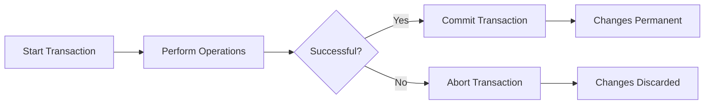

# MongoDB commitTransaction

## Introduction

In MongoDB, transactions provide the ability to execute multiple operations in a logical unit, ensuring that either all operations succeed or none of them take effect. The `commitTransaction()` method is a crucial part of the transaction process, as it confirms and makes permanent all changes made during a transaction.

This guide will teach you how to properly commit transactions in MongoDB, understand the mechanics behind transaction commits, and learn best practices for implementing them in your applications.

## Transaction Basics Review

Before we dive into `commitTransaction()`, let's quickly review the transaction lifecycle in MongoDB:

1. **Start a transaction** - Begin a sequence of operations
2. **Perform operations** - Execute read or write operations within the transaction
3. **Commit the transaction** - Make all changes permanent
4. **Abort the transaction** - (Optional) Cancel the transaction if needed



## The commitTransaction Method

The `commitTransaction()` method is called on a session object to make all operations performed during a transaction permanent. After a successful commit, the changes become visible to other operations and sessions.

### Syntax

```javascript
session.commitTransaction()
```

This method returns a promise that resolves when the commit is successful or rejects with an error if the commit fails.

## Basic Example: Committing a Transaction

Let's look at a basic example of committing a transaction in MongoDB:

```javascript
// Connect to MongoDB
const { MongoClient } = require('mongodb');

async function transferMoney(fromAccount, toAccount, amount) {
  const uri = "mongodb://localhost:27017";
  const client = new MongoClient(uri);
  
  try {
    await client.connect();
    const database = client.db("bank");
    const accounts = database.collection("accounts");
    
    // Start a session
    const session = client.startSession();
    
    try {
      // Start a transaction
      session.startTransaction();
      
      // Deduct from source account
      const sourceResult = await accounts.updateOne(
        { accountId: fromAccount },
        { $inc: { balance: -amount } },
        { session }
      );
      
      if (sourceResult.modifiedCount !== 1) {
        throw new Error("Failed to update source account");
      }
      
      // Add to destination account
      const destResult = await accounts.updateOne(
        { accountId: toAccount },
        { $inc: { balance: amount } },
        { session }
      );
      
      if (destResult.modifiedCount !== 1) {
        throw new Error("Failed to update destination account");
      }
      
      // Commit the transaction
      await session.commitTransaction();
      console.log("Transaction successfully committed.");
      
    } catch (e) {
      // If an error occurred, abort the transaction
      await session.abortTransaction();
      console.error("Transaction aborted due to error:", e);
      throw e;
    } finally {
      // End the session
      session.endSession();
    }
    
  } finally {
    // Close the connection
    await client.close();
  }
}

// Example usage
transferMoney("ACC123", "ACC456", 100)
  .then(() => console.log("Money transferred successfully"))
  .catch(err => console.error("Failed to transfer money:", err));
```

In this example, we're transferring money between two accounts. The transaction ensures that either both accounts are updated or neither is updated.

## Return Values and Retry Logic

When you call `commitTransaction()`, it can return various results:

- **Success**: The transaction was successfully committed
- **TransientTransactionError**: The transaction was valid but couldn't be committed due to a temporary issue
- **UnknownTransactionCommitResult**: It's unclear if the commit was successful
- **Other errors**: Various errors related to validation failures, etc.

### Handling Commit Errors

It's essential to implement proper retry logic for `commitTransaction()` calls, as they may sometimes fail due to temporary issues:

```javascript
async function commitWithRetry(session) {
  while (true) {
    try {
      await session.commitTransaction();
      console.log("Transaction committed.");
      break;
    } catch (error) {
      // If transient error, retry the commit operation
      if (error.errorLabels && error.errorLabels.includes("TransientTransactionError")) {
        console.log("TransientTransactionError, retrying commit operation...");
        continue;
      } else {
        console.log("Error during commit...");
        throw error;
      }
    }
  }
}

async function runTransactionWithRetry(txnFunc) {
  const client = new MongoClient("mongodb://localhost:27017");
  await client.connect();
  
  const session = client.startSession();
  
  try {
    while (true) {
      try {
        session.startTransaction();
        await txnFunc(client, session);
        await commitWithRetry(session);
        break;
      } catch (error) {
        if (error.errorLabels && error.errorLabels.includes("TransientTransactionError")) {
          console.log("TransientTransactionError, retrying transaction...");
          continue;
        } else {
          throw error;
        }
      }
    }
  } finally {
    session.endSession();
    await client.close();
  }
}
```

## Real-world Application: E-commerce Order Processing

Let's look at a practical example of using transactions in an e-commerce application:

```javascript
async function processOrder(orderId, userId, items) {
  const client = new MongoClient("mongodb://localhost:27017");
  
  try {
    await client.connect();
    const db = client.db("ecommerce");
    const session = client.startSession();
    
    try {
      session.startTransaction();
      
      // 1. Check inventory availability
      const inventory = db.collection("inventory");
      
      // Check if all items are in stock
      for (const item of items) {
        const inventoryItem = await inventory.findOne(
          { itemId: item.id, quantity: { $gte: item.quantity } },
          { session }
        );
        
        if (!inventoryItem) {
          throw new Error(`Item ${item.id} is out of stock or has insufficient quantity`);
        }
      }
      
      // 2. Update inventory (decrease quantities)
      for (const item of items) {
        await inventory.updateOne(
          { itemId: item.id },
          { $inc: { quantity: -item.quantity } },
          { session }
        );
      }
      
      // 3. Create order document
      const orderTotal = items.reduce((total, item) => total + (item.price * item.quantity), 0);
      const orders = db.collection("orders");
      
      await orders.insertOne({
        orderId,
        userId,
        items,
        total: orderTotal,
        status: "processing",
        createdAt: new Date()
      }, { session });
      
      // 4. Update user's order history
      const users = db.collection("users");
      
      await users.updateOne(
        { userId },
        { 
          $push: { 
            orderHistory: { 
              orderId, 
              total: orderTotal, 
              date: new Date() 
            } 
          } 
        },
        { session }
      );
      
      // Commit the transaction
      await session.commitTransaction();
      console.log(`Order ${orderId} processed successfully`);
      
      return { success: true, orderId };
      
    } catch (error) {
      // If any operation fails, abort the transaction
      await session.abortTransaction();
      console.error("Order processing failed:", error);
      throw error;
    } finally {
      session.endSession();
    }
    
  } finally {
    await client.close();
  }
}

// Example usage
const orderItems = [
  { id: "product123", quantity: 2, price: 29.99 },
  { id: "product456", quantity: 1, price: 49.99 }
];

processOrder("ORD-12345", "user789", orderItems)
  .then(result => console.log("Order result:", result))
  .catch(err => console.error("Order failed:", err));
```

In this example, we use a transaction to ensure that multiple operations related to order processing either all succeed or all fail. This includes checking inventory, updating stock levels, creating an order record, and updating the user's order history.

## Common Errors and Troubleshooting

Here are some common errors you might encounter when working with `commitTransaction()` and how to handle them:

### 1. WriteConflict Error

This happens when multiple transactions try to modify the same document.

```javascript
// To handle this, you can implement retry logic:
try {
  await session.commitTransaction();
} catch (error) {
  if (error.message.includes("WriteConflict")) {
    // Implement a backoff strategy and retry
    console.log("Write conflict detected, retrying...");
    // Retry logic here
  } else {
    throw error;
  }
}
```

### 2. Transaction Timeout

MongoDB has default timeout settings for transactions (default is 60 seconds).

```javascript
// You can set a custom transaction timeout:
session.startTransaction({
  readConcern: { level: "snapshot" },
  writeConcern: { w: "majority" },
  maxTimeMS: 30000  // 30 seconds
});
```

### 3. TransientTransactionError

These are temporary errors that might be resolved by retrying the transaction.

```javascript
// Example handling as shown in the retry logic section
if (error.errorLabels && error.errorLabels.includes("TransientTransactionError")) {
  console.log("Transient error, retrying transaction...");
  // Retry logic
}
```

## Best Practices for Using commitTransaction

1. **Always use try-catch blocks** around your transaction logic
2. **Implement retry logic** for handling transient errors
3. **Keep transactions short** to avoid timeouts and minimize resource usage
4. **Ensure proper session management** by always ending sessions with `session.endSession()`
5. **Use appropriate read and write concerns** based on your application requirements
6. **Consider monitoring transaction performance** to identify bottlenecks

## Performance Considerations

Transactions in MongoDB come with some performance overhead:

1. **Performance Impact**: Transactions require additional coordination and resources compared to single operations
2. **Read Concerns**: Using higher read concerns like "snapshot" can impact performance
3. **Write Concerns**: Using "majority" write concern ensures durability but increases latency

```javascript
// Balance between performance and reliability
session.startTransaction({
  readConcern: { level: "local" },  // Faster but less isolation
  writeConcern: { w: 1 }  // Faster but less durable
});

// More reliable but slower
session.startTransaction({
  readConcern: { level: "snapshot" },
  writeConcern: { w: "majority" }
});
```

## Summary

In this guide, we've explored MongoDB's `commitTransaction()` method in depth:

- We learned how to properly commit transactions in MongoDB applications
- We explored the importance of error handling and retry logic
- We implemented a real-world example showing transactions in e-commerce order processing
- We reviewed best practices and performance considerations

The `commitTransaction()` method is a critical part of transaction management in MongoDB that lets you ensure data consistency across multiple operations. By properly implementing transactions with appropriate error handling, you can build robust applications that maintain data integrity even when operations span multiple documents or collections.

## Additional Resources

- [MongoDB Transactions Documentation](https://www.mongodb.com/docs/manual/core/transactions/)
- [MongoDB Node.js Driver Documentation](https://mongodb.github.io/node-mongodb-native/4.1/classes/MongoClient.html)
- [MongoDB University: Transactions Course](https://university.mongodb.com/)

## Practice Exercises

1. Implement a banking transfer system with proper transaction handling and retry logic
2. Create a blog application where publishing a post involves updating multiple collections atomically
3. Implement an inventory management system that processes orders with transaction support
4. Add detailed logging to track transaction performance in a high-volume application

Remember that transactions in MongoDB are powerful but should be used judiciously. For many use cases, atomic single-document operations may be sufficient and more performant.