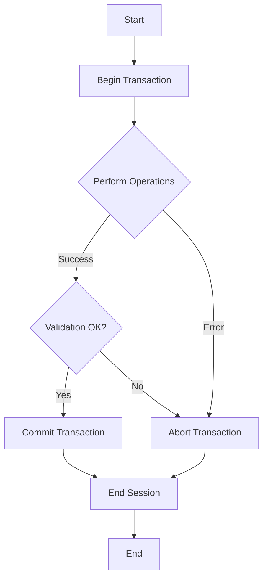

# MongoDB abortTransaction

## Introduction

When working with MongoDB transactions, sometimes things don't go as planned. A validation might fail, business logic could detect an inconsistency, or an unexpected error might occur. In these scenarios, you need a way to cancel the transaction and revert any changes that have been made. This is where the `abortTransaction()` method comes into play.

In this tutorial, we'll explore how to use MongoDB's `abortTransaction()` method to safely cancel transactions, understand when you should use it, and see practical examples of handling transaction failures.

## What is abortTransaction?

The `abortTransaction()` method is a critical part of MongoDB's transaction API that allows you to explicitly cancel a transaction, reverting all operations performed within it. When you abort a transaction:

- All changes made within the transaction are discarded
- The database returns to the state it was in before the transaction started
- Resources allocated for the transaction are released
- No data modifications from the transaction persist in the database

## Basic Syntax

```javascript
// Start a session
const session = client.startSession();

try {
  // Start a transaction
  session.startTransaction();
  
  // Perform some operations...
  // ...
  
  // If something goes wrong, abort the transaction
  await session.abortTransaction();
} finally {
  // End the session
  await session.endSession();
}
```

## When to Use abortTransaction

You should use `abortTransaction()` when:

1. **Error Detection**: Your application detects an error or exception during transaction execution
2. **Business Rule Violations**: Business rules or constraints are violated during the transaction
3. **Validation Failures**: Data validation fails for any operation within the transaction
4. **Timeout Issues**: Transaction takes too long and you want to cancel it
5. **Manual Cancellation**: User or system explicitly requests cancellation of an operation

## Error Handling with abortTransaction

Let's look at a typical pattern for handling transactions with proper error management:

```javascript
const { MongoClient } = require('mongodb');

async function transferMoney(fromAccountId, toAccountId, amount) {
  const uri = 'mongodb://localhost:27017';
  const client = new MongoClient(uri);
  const session = client.startSession();
  
  try {
    session.startTransaction();
    
    const accounts = client.db('bankDB').collection('accounts');
    
    // Debit from source account
    const fromAccount = await accounts.findOne(
      { _id: fromAccountId },
      { session }
    );
    
    if (fromAccount.balance < amount) {
      // Insufficient funds - abort transaction
      await session.abortTransaction();
      console.log('Transaction aborted: Insufficient funds');
      return { success: false, message: 'Insufficient funds' };
    }
    
    await accounts.updateOne(
      { _id: fromAccountId },
      { $inc: { balance: -amount } },
      { session }
    );
    
    // Credit to target account
    await accounts.updateOne(
      { _id: toAccountId },
      { $inc: { balance: amount } },
      { session }
    );
    
    // If we got here, commit the transaction
    await session.commitTransaction();
    return { success: true, message: 'Transfer completed' };
  } catch (error) {
    // Any error will trigger an abort
    await session.abortTransaction();
    console.error('Transaction aborted due to error:', error);
    return { success: false, message: 'An error occurred' };
  } finally {
    await session.endSession();
    await client.close();
  }
}

// Usage
transferMoney('account1', 'account2', 100)
  .then(result => console.log(result))
  .catch(err => console.error('Error:', err));
```

In this example, we abort the transaction in two scenarios:
1. When there are insufficient funds (a business rule violation)
2. When any unexpected error occurs during transaction execution

## Transaction Flow Visualization

Here's a visual representation of the transaction flow including the abort path:



## Common Scenarios for Using abortTransaction

### Scenario 1: Multi-document Updates with Validation

In this scenario, we need to update multiple documents but only if certain conditions are met:

```javascript
async function updateInventoryLevels(productUpdates) {
  const session = client.startSession();
  
  try {
    session.startTransaction();
    
    const inventory = client.db('store').collection('inventory');
    const operations = client.db('store').collection('operations');
    
    for (const update of productUpdates) {
      const product = await inventory.findOne(
        { productId: update.productId },
        { session }
      );
      
      // Validation check
      if (!product || product.quantity < update.decreaseBy) {
        // Not enough inventory, abort the entire transaction
        await session.abortTransaction();
        return { success: false, message: `Insufficient quantity for product ${update.productId}` };
      }
      
      // Update inventory
      await inventory.updateOne(
        { productId: update.productId },
        { $inc: { quantity: -update.decreaseBy } },
        { session }
      );
      
      // Log operation
      await operations.insertOne(
        {
          productId: update.productId,
          operation: 'decrease',
          quantity: update.decreaseBy,
          timestamp: new Date()
        },
        { session }
      );
    }
    
    // All updates successful, commit the transaction
    await session.commitTransaction();
    return { success: true, message: 'Inventory updated successfully' };
  } catch (error) {
    await session.abortTransaction();
    return { success: false, message: 'Error updating inventory', error };
  } finally {
    await session.endSession();
  }
}

// Example usage
const updates = [
  { productId: 'p1', decreaseBy: 5 },
  { productId: 'p2', decreaseBy: 3 }
];

updateInventoryLevels(updates)
  .then(result => console.log(result))
  .catch(err => console.error(err));
```

### Scenario 2: Handling External API Calls Within Transactions

When a transaction involves external API calls, you may need to abort if the external call fails:

```javascript
async function processOrder(orderId, paymentDetails) {
  const session = client.startSession();
  
  try {
    session.startTransaction();
    
    // 1. Update order status to 'processing'
    const orders = client.db('shop').collection('orders');
    await orders.updateOne(
      { _id: orderId },
      { $set: { status: 'processing' } },
      { session }
    );
    
    // 2. Process payment (external API call)
    let paymentResult;
    try {
      paymentResult = await processPaymentWithExternalAPI(paymentDetails);
    } catch (paymentError) {
      // Payment processing failed, abort the transaction
      await session.abortTransaction();
      return { success: false, message: 'Payment processing failed', error: paymentError };
    }
    
    if (!paymentResult.success) {
      // Payment was declined
      await session.abortTransaction();
      return { success: false, message: 'Payment was declined', details: paymentResult };
    }
    
    // 3. Update inventory
    const inventory = client.db('shop').collection('inventory');
    const order = await orders.findOne({ _id: orderId }, { session });
    
    for (const item of order.items) {
      await inventory.updateOne(
        { _id: item.productId },
        { $inc: { stock: -item.quantity } },
        { session }
      );
    }
    
    // 4. Update order status to 'paid'
    await orders.updateOne(
      { _id: orderId },
      { 
        $set: { 
          status: 'paid',
          paymentId: paymentResult.paymentId,
          paidAt: new Date()
        }
      },
      { session }
    );
    
    // All operations successful, commit the transaction
    await session.commitTransaction();
    return { success: true, message: 'Order processed successfully', paymentId: paymentResult.paymentId };
  } catch (error) {
    // Something went wrong, abort the transaction
    await session.abortTransaction();
    return { success: false, message: 'Error processing order', error };
  } finally {
    await session.endSession();
  }
}

// Mock function for external payment API
async function processPaymentWithExternalAPI(details) {
  // Simulate API call
  return new Promise((resolve) => {
    setTimeout(() => {
      if (details.cardNumber.startsWith('4')) {
        resolve({ success: true, paymentId: 'pmt_' + Math.random().toString(36).substring(2, 15) });
      } else {
        resolve({ success: false, reason: 'Card declined' });
      }
    }, 500);
  });
}
```

## Best Practices for Using abortTransaction

1. **Always Use Try/Catch/Finally**: Wrap transactions in try/catch blocks and always include a finally block to end the session.

2. **Explicit Error Handling**: Handle specific errors differently if needed, but always abort the transaction if an error occurs.

3. **Validate Before Writing**: When possible, validate data before making writes to reduce unnecessary aborts.

4. **Log Aborted Transactions**: Keep track of aborted transactions for debugging and monitoring purposes.

5. **Check Session Status**: Before aborting, check if the session is still active and if the transaction is in progress.

   ```javascript
   if (session.inTransaction()) {
     await session.abortTransaction();
   }
   ```

6. **Consider Retries**: For transient errors, consider implementing a retry mechanism:

   ```javascript
   async function executeTransactionWithRetry(txnFunc, maxRetries = 3) {
     const session = client.startSession();
     let retryCount = 0;
     
     while (retryCount < maxRetries) {
       try {
         session.startTransaction();
         const result = await txnFunc(session);
         await session.commitTransaction();
         return result;
       } catch (error) {
         // Determine if this error should trigger a retry
         if (isTransientError(error) && retryCount < maxRetries - 1) {
           await session.abortTransaction();
           retryCount++;
           console.log(`Retrying transaction, attempt ${retryCount + 1}`);
         } else {
           await session.abortTransaction();
           throw error;
         }
       } finally {
         if (retryCount >= maxRetries) {
           await session.endSession();
         }
       }
     }
   }
   
   function isTransientError(error) {
     // Check if error is transient (network issue, timeout, etc.)
     return error.code === 'TransientTransactionError' || 
            error.code === 'WriteConcernError';
   }
   ```

## Common Issues and Troubleshooting

### 1. Transaction Already Aborted

If you try to abort a transaction that has already been aborted or committed, you'll get an error:

```javascript
// This will throw an error if transaction is already aborted
try {
  await session.abortTransaction();
} catch (error) {
  console.log('Could not abort transaction:', error);
}
```

To avoid this, check if the transaction is still active:

```javascript
if (session.inTransaction()) {
  await session.abortTransaction();
}
```

### 2. Session Timeout

If a session times out, your attempt to abort may fail:

```javascript
// If session times out before this is called, it will throw an error
try {
  await session.abortTransaction();
} catch (error) {
  console.log('Session may have timed out:', error);
} finally {
  await session.endSession();
}
```

### 3. Network Issues During Abort

```javascript
try {
  await session.abortTransaction();
} catch (error) {
  console.log('Network issue during abort:', error);
  // The transaction may still be aborted on the server, but we couldn't confirm
}
```

## Summary

MongoDB's `abortTransaction()` method is an essential tool for maintaining data integrity in applications that use transactions. It allows you to safely cancel a transaction when errors occur or conditions aren't met, ensuring that your database remains in a consistent state.

Key points to remember:

- Always wrap transactions in try/catch/finally blocks
- Use `abortTransaction()` when errors occur or validation fails
- Check if a transaction is active before aborting it
- End the session after the transaction completes or aborts
- Consider implementing retry logic for transient errors

By implementing proper transaction handling with `abortTransaction()`, you can build more robust applications that gracefully handle errors and maintain data integrity.

## Additional Resources

- [MongoDB Transactions Documentation](https://docs.mongodb.com/manual/core/transactions/)
- [Node.js MongoDB Driver API](https://mongodb.github.io/node-mongodb-native/4.0/classes/MongoClient.html)
- [MongoDB Transactions Error Handling](https://docs.mongodb.com/manual/core/transactions-production-consideration/)

## Practice Exercises

1. Implement a transaction that updates a user's profile and address, but aborts if either operation fails.
2. Create a batch processing function that aborts the entire batch if any item validation fails.
3. Implement a transaction with retry logic that handles transient errors.
4. Build a shopping cart checkout process that aborts if payment fails or if any item is no longer in stock.

Happy coding!