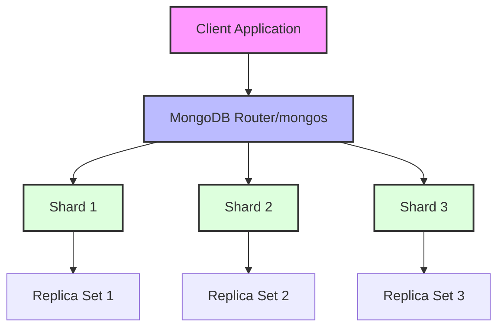

# MongoDB Transaction Guarantees

## Introduction

MongoDB transactions provide a set of guarantees that ensure your data remains consistent even when multiple operations are bundled together. These guarantees are often referred to as ACID properties - Atomicity, Consistency, Isolation, and Durability. When working with critical data in your applications, understanding these transaction guarantees becomes essential for maintaining data integrity.

In this guide, we'll explore each of these guarantees in detail, understand how MongoDB implements them, and learn how to leverage them effectively in your applications.

## Understanding ACID Properties in MongoDB

MongoDB transactions follow the ACID properties which are the foundation of reliable transaction processing:

### Atomicity

Atomicity ensures that all operations within a transaction either complete successfully as a unit or have no effect at all if any operation fails.

#### How MongoDB Implements Atomicity

When you start a transaction in MongoDB, you're creating an "all-or-nothing" set of operations:

```javascript
// Start a session
const session = client.startSession();

try {
  // Start a transaction
  session.startTransaction();

  // Perform multiple operations
  await collection1.updateOne({ _id: "user1" }, { $inc: { balance: -100 } }, { session });
  await collection2.updateOne({ _id: "user2" }, { $inc: { balance: 100 } }, { session });

  // Commit the transaction
  await session.commitTransaction();
  console.log("Transaction committed successfully");
} catch (error) {
  // If any operation fails, the entire transaction is aborted
  await session.abortTransaction();
  console.error("Transaction aborted:", error);
} finally {
  // End the session
  session.endSession();
}
```

If any operation within the transaction fails (for example, if `user1` doesn't have sufficient balance), the entire transaction is rolled back, and neither account's balance changes. This atomicity prevents inconsistent states like money disappearing from one account without appearing in another.

### Consistency

Consistency ensures that a transaction brings the database from one valid state to another, maintaining all predefined rules and constraints.

#### Enforcing Consistency in MongoDB

MongoDB ensures consistency through:

1. **Schema Validation**: Define JSON Schema validation rules to ensure documents conform to a specific structure.

```javascript
db.createCollection("accounts", {
  validator: {
    $jsonSchema: {
      bsonType: "object",
      required: ["owner", "balance"],
      properties: {
        owner: {
          bsonType: "string",
          description: "must be a string and is required"
        },
        balance: {
          bsonType: "number",
          minimum: 0,
          description: "must be a non-negative number and is required"
        }
      }
    }
  }
});
```

2. **Invariant Constraints**: Use transactions to maintain business rules that span multiple documents.

```javascript
// Ensuring the sum of balances remains constant during a transfer
const session = client.startSession();

try {
  session.startTransaction();

  // Get initial sum for verification
  const initialSum = await getTotalBalance(session);
  
  // Perform the transfer
  await collection.updateOne(
    { _id: "account1" }, 
    { $inc: { balance: -50 } }, 
    { session }
  );
  await collection.updateOne(
    { _id: "account2" }, 
    { $inc: { balance: 50 } }, 
    { session }
  );

  // Verify consistency rule: total balance should remain the same
  const finalSum = await getTotalBalance(session);
  if (initialSum !== finalSum) {
    throw new Error("Balance consistency violation");
  }

  await session.commitTransaction();
} catch (error) {
  await session.abortTransaction();
  console.error(error);
} finally {
  session.endSession();
}
```

### Isolation

Isolation ensures that concurrent transactions don't interfere with each other. MongoDB offers different isolation levels that determine how changes made by one transaction are visible to others.

#### MongoDB's Isolation Levels

MongoDB uses snapshot isolation for transactions, which means a transaction sees a consistent snapshot of the data as it existed at the time the transaction started.

```javascript
// Two concurrent transactions
async function transaction1() {
  const session1 = client.startSession();
  try {
    session1.startTransaction({ readConcern: { level: 'snapshot' } });
    // Read the document
    const doc = await collection.findOne({ _id: 'item1' }, { session: session1 });
    console.log('Transaction 1 reads:', doc);
    
    // Wait a bit to simulate overlapping transactions
    await new Promise(resolve => setTimeout(resolve, 1000));
    
    // Update the document
    await collection.updateOne(
      { _id: 'item1' }, 
      { $set: { value: 'updated by transaction 1' } }, 
      { session: session1 }
    );
    
    await session1.commitTransaction();
  } catch (error) {
    await session1.abortTransaction();
    throw error;
  } finally {
    session1.endSession();
  }
}

async function transaction2() {
  const session2 = client.startSession();
  try {
    session2.startTransaction({ readConcern: { level: 'snapshot' } });
    
    // Update the same document
    await collection.updateOne(
      { _id: 'item1' }, 
      { $set: { value: 'updated by transaction 2' } }, 
      { session: session2 }
    );
    
    await session2.commitTransaction();
  } catch (error) {
    await session2.abortTransaction();
    throw error;
  } finally {
    session2.endSession();
  }
}
```

In this example, if both transactions try to modify the same document, one will succeed and one will get a write conflict error, which ensures that changes are properly isolated.

### Durability

Durability guarantees that once a transaction is committed, it remains committed even in the case of system failures like crashes or power outages.

#### How MongoDB Ensures Durability

MongoDB ensures durability through:

1. **Write Concern**: Specify how many replicas must acknowledge writes before considering them successful.

```javascript
// Ensure transaction is written to majority of replicas
const session = client.startSession();
try {
  session.startTransaction({
    readConcern: { level: 'snapshot' },
    writeConcern: { w: 'majority' }
  });
  
  await collection.updateOne({ _id: "doc1" }, { $set: { status: "processed" } }, { session });
  
  await session.commitTransaction();
  console.log("Transaction committed and durably stored");
} catch (error) {
  await session.abortTransaction();
  console.error(error);
} finally {
  session.endSession();
}
```

2. **Journal**: MongoDB maintains a write-ahead log (journal) that ensures operations can be recovered after a crash.

## Transaction Guarantees and Read/Write Concerns

MongoDB allows you to tune the balance between performance and reliability using read and write concerns within transactions.

### Read Concerns

Read concerns determine what data your transaction can see:

```javascript
// Local read concern: fastest but may read uncommitted data
session.startTransaction({ readConcern: { level: 'local' } });

// Majority read concern: reads data that has been acknowledged by majority of replicas
session.startTransaction({ readConcern: { level: 'majority' } });

// Snapshot read concern: consistent view of data at a point in time
session.startTransaction({ readConcern: { level: 'snapshot' } });
```

### Write Concerns

Write concerns determine the level of acknowledgment required for writes:

```javascript
// Write to primary only
session.startTransaction({ writeConcern: { w: 1 } });

// Write to majority of replicas
session.startTransaction({ writeConcern: { w: 'majority' } });

// Write to all replicas with timeout
session.startTransaction({ 
  writeConcern: { 
    w: 'majority', 
    j: true,  // Wait for write to journal
    wtimeout: 1000  // Timeout in milliseconds
  } 
});
```

## Real-World Example: Banking Transfer System

Let's implement a simple bank transfer system that demonstrates all four ACID properties:

```javascript
async function transferMoney(fromAccount, toAccount, amount) {
  const session = client.startSession();
  
  try {
    session.startTransaction({
      readConcern: { level: 'snapshot' },
      writeConcern: { w: 'majority' }
    });
    
    // Check if sender has sufficient funds
    const sender = await accounts.findOne(
      { accountId: fromAccount, balance: { $gte: amount } },
      { session }
    );
    
    if (!sender) {
      throw new Error("Insufficient funds or account doesn't exist");
    }
    
    // Check if recipient account exists
    const recipient = await accounts.findOne(
      { accountId: toAccount },
      { session }
    );
    
    if (!recipient) {
      throw new Error("Recipient account doesn't exist");
    }
    
    // Perform the transfer
    await accounts.updateOne(
      { accountId: fromAccount },
      { $inc: { balance: -amount } },
      { session }
    );
    
    await accounts.updateOne(
      { accountId: toAccount },
      { $inc: { balance: amount } },
      { session }
    );
    
    // Record the transaction
    await transactions.insertOne({
      fromAccount,
      toAccount,
      amount,
      timestamp: new Date()
    }, { session });
    
    // Commit the transaction
    await session.commitTransaction();
    return { success: true, message: "Transfer completed successfully" };
    
  } catch (error) {
    // Abort on error
    await session.abortTransaction();
    return { success: false, message: error.message };
  } finally {
    session.endSession();
  }
}
```

This example demonstrates:

1. **Atomicity**: All operations (debit, credit, and transaction logging) either complete together or none at all
2. **Consistency**: We verify funds are available before transfer and maintain account validity
3. **Isolation**: Using snapshot isolation ensures other operations don't interfere during the transfer
4. **Durability**: Using majority write concern ensures the transfer persists even if some nodes fail

## Transaction Guarantees in a Sharded Cluster

In MongoDB's sharded clusters, transactions that span multiple shards have additional considerations:



Multi-shard transactions maintain the same ACID guarantees but require careful consideration:

1. They have a maximum runtime limit of 60 seconds by default
2. They should be used sparingly as they introduce coordination overhead
3. Data distribution matters - transactions that frequently touch data across many shards will perform worse

```javascript
// Multi-shard transaction example
async function createOrderWithInventoryUpdate() {
  const session = client.startSession();
  
  try {
    session.startTransaction();
    
    // Create order in orders collection (might be on Shard 1)
    const order = await orders.insertOne({
      products: ["product1", "product2"],
      totalAmount: 100,
      status: "pending"
    }, { session });
    
    // Update inventory in products collection (might be on Shard 2)
    await products.updateOne(
      { _id: "product1" },
      { $inc: { stock: -1 } },
      { session }
    );
    
    await products.updateOne(
      { _id: "product2" },
      { $inc: { stock: -1 } },
      { session }
    );
    
    await session.commitTransaction();
    return { success: true, orderId: order.insertedId };
  } catch (error) {
    await session.abortTransaction();
    return { success: false, error: error.message };
  } finally {
    session.endSession();
  }
}
```

## MongoDB Transaction Guarantees Limitations

While MongoDB transactions provide strong guarantees, there are some limitations to be aware of:

1. **Performance Impact**: Transactions introduce overhead, especially across shards
2. **Time Limits**: Transactions have time limits (default 60 seconds in multi-document)
3. **Specific Operations**: Some operations can't be used in transactions (e.g., creating collections)
4. **Compatibility**: Requires MongoDB 4.0+ for replica sets, 4.2+ for sharded clusters

## Best Practices for MongoDB Transaction Guarantees

To make the most of MongoDB transaction guarantees:

1. **Keep transactions short and simple**
   ```javascript
   // Good: Small, focused transaction
   async function incrementUserPoints(userId, points) {
     const session = client.startSession();
     try {
       session.startTransaction();
       await users.updateOne({ _id: userId }, { $inc: { points } }, { session });
       await pointsHistory.insertOne({ userId, points, date: new Date() }, { session });
       await session.commitTransaction();
     } catch (error) {
       await session.abortTransaction();
       throw error;
     } finally {
       session.endSession();
     }
   }
   ```

2. **Choose appropriate read/write concerns based on your needs**

3. **Implement proper error handling and retries**
   ```javascript
   async function executeTransactionWithRetry(txnFunc, maxRetries = 3) {
     let retryCount = 0;
     while (true) {
       try {
         return await txnFunc();
       } catch (error) {
         if (retryCount >= maxRetries || !isTransientError(error)) {
           throw error;
         }
         retryCount++;
         await sleep(100 * Math.pow(2, retryCount)); // Exponential backoff
       }
     }
   }
   
   function isTransientError(error) {
     // Check if error is a transient error that can be retried
     return error.code === 112 || // WriteConflict
            error.code === 251;   // NoSuchTransaction
   }
   
   function sleep(ms) {
     return new Promise(resolve => setTimeout(resolve, ms));
   }
   ```

4. **Design your data model to minimize cross-shard transactions**

## Summary

MongoDB transaction guarantees provide the ACID properties needed for reliable data operations in modern applications:

- **Atomicity**: All-or-nothing execution of multiple operations
- **Consistency**: Database remains in a valid state before and after transactions
- **Isolation**: Transactions are isolated from each other using snapshot isolation
- **Durability**: Committed changes persist even through system failures

By leveraging these guarantees with appropriate read and write concerns, you can build robust applications that maintain data integrity even under demanding conditions. Remember that while transactions provide strong guarantees, they come with performance considerations that should be balanced against your application's needs.

## Additional Resources

- [MongoDB Transactions Documentation](https://www.mongodb.com/docs/manual/core/transactions/)
- [MongoDB University Course on Transactions](https://university.mongodb.com/)
- [ACID Properties in Database Systems](https://en.wikipedia.org/wiki/ACID)

## Exercises

1. Implement a small inventory management system that uses transactions to ensure stock levels are accurately maintained when processing multiple simultaneous orders.

2. Create a transaction that involves three different collections and handles potential write conflicts with proper retry logic.

3. Benchmark the performance difference between using individual operations and using a transaction for a sequence of related operations.

4. Implement a transaction with different read concerns and observe how each affects visibility of data modified by concurrent operations.