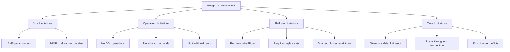

# MongoDB Transaction Limitations

While MongoDB transactions provide powerful ACID guarantees for your operations, they come with specific limitations and constraints that developers need to understand. This article explores these limitations to help you use transactions effectively in your applications.

## Introduction to MongoDB Transaction Limitations

MongoDB introduced multi-document transactions in version 4.0 for replica sets and in version 4.2 for sharded clusters. Although transactions offer significant benefits for data integrity, they aren't suitable for all scenarios and have important restrictions you should be aware of.

Understanding these limitations will help you:
- Design more efficient database operations
- Avoid common transaction pitfalls
- Know when transactions are appropriate or when to use alternatives

## Core Transaction Limitations

### Cluster Configuration Requirements

Transactions in MongoDB have specific deployment requirements:

- **Replica Sets**: Transactions require a replica set deployment with at least one primary and one secondary node
- **Storage Engine**: Must use the WiredTiger storage engine (the default since MongoDB 3.2)
- **Sharded Clusters**: Full support only available from MongoDB 4.2+

```javascript
// Check if your deployment supports transactions
db.adminCommand({ getParameter: 1, featureCompatibilityVersion: 1 })
```

Output:
```json
{
  "featureCompatibilityVersion": {
    "version": "4.4"
  },
  "ok": 1
}
```

If your feature compatibility version is below 4.0, you won't be able to use transactions.

### Document Size and Operation Limits

MongoDB transactions have specific size limitations:

- **16MB Document Size Limit**: Individual documents cannot exceed 16MB (same as regular MongoDB operations)
- **Maximum Transaction Size**: Default limit of 16MB total for all operations in a transaction
- **Operation Count**: No hard limit on number of operations, but practical limits due to size and time constraints

```javascript
// This function simulates inserting a collection of large documents in a transaction
function insertLargeDocumentsInTransaction(count, sizeInBytes) {
  // Start a session
  const session = db.getMongo().startSession();
  
  try {
    session.startTransaction();
    
    const largeString = "X".repeat(sizeInBytes);
    
    for (let i = 0; i < count; i++) {
      db.largeDocuments.insertOne(
        { _id: i, data: largeString },
        { session }
      );
    }
    
    session.commitTransaction();
    return "Transaction committed successfully";
  } catch (error) {
    session.abortTransaction();
    return `Error: ${error.message}`;
  } finally {
    session.endSession();
  }
}

// Try with multiple large documents that exceed transaction size limit
insertLargeDocumentsInTransaction(5, 4 * 1024 * 1024);
```

Output:
```
Error: Transaction exceeded the 16MB size limit for all operations in the transaction
```

### Time Limits and Locks

Transactions have built-in timeouts to prevent long-running operations from impacting system performance:

- **Default Transaction Timeout**: 60 seconds (can be configured)
- **Lock Limitations**: Transactions hold locks throughout their duration, potentially blocking other operations
- **Write Conflicts**: Concurrent operations may cause transaction abort due to conflicts

You can modify the default timeout when starting a transaction:

```javascript
// Starting a session with custom transaction options
const session = db.getMongo().startSession();
session.startTransaction({
  readConcern: { level: "snapshot" },
  writeConcern: { w: "majority" },
  maxTimeMS: 30000  // 30 second timeout
});

// Operations here...

session.commitTransaction();
session.endSession();
```

## Unsupported Operations in Transactions

Not all MongoDB operations can be executed within a transaction. Here are key operations that cannot be part of transactions:

### DDL Operations (Data Definition Language)

```javascript
// These operations cannot be included in a transaction
db.createCollection("newCollection")      // Cannot create collections
db.collection.drop()                      // Cannot drop collections
db.collection.createIndex()               // Cannot create indexes
db.adminCommand({ shardCollection: "..." }) // Cannot shard collections
```

### Administrative Commands

```javascript
// Administrative commands cannot be part of transactions
db.adminCommand({ serverStatus: 1 })
db.runCommand({ createUser: "..." })
db.runCommand({ dropUser: "..." })
```

### Count Limitations

The traditional `count()` method is not supported in transactions. Use `countDocuments()` instead:

```javascript
// INCORRECT in transactions
session.startTransaction();
const count = db.products.count({ category: "electronics" });  // Will fail

// CORRECT way to count in transactions
session.startTransaction();
const count = db.products.countDocuments({ category: "electronics" });
```

## Platform-Specific Limitations

### Sharded Cluster Limitations

When using transactions in a sharded environment:

- **Shard Key Requirement**: Operations affecting multiple documents require documents to share the same shard key value
- **Cross-Shard Distributed Transactions**: Available from MongoDB 4.2+, but come with performance overhead
- **Chunk Migrations**: Transactions can conflict with ongoing chunk migrations

### Operational Limitations

- **Oplog Size**: Large transactions may strain the oplog size, especially in high write environments
- **Replica Set Elections**: If a primary node fails during a transaction, the transaction will be aborted
- **Read Preference**: Transactions are only supported on primary nodes; cannot use secondary read preference

## Performance Considerations

Transactions impact performance in several ways:

1. **Increased Resource Usage**: Transactions require more memory and CPU compared to individual operations
2. **Lock Contention**: Long-running transactions can cause lock contention with other operations
3. **Write Conflicts**: Increase in concurrent access may lead to more transaction aborts due to conflicts

### Monitoring Transaction Performance

You can monitor transaction performance using MongoDB's built-in commands:

```javascript
// Check current operations, including transactions
db.currentOp({ "transaction": true })

// Get transaction statistics
db.serverStatus().transactions
```

Example output of transaction statistics:

```json
{
  "transactions": {
    "currentActive": 3,
    "currentInactive": 0,
    "totalAborted": 7,
    "totalCommitted": 42,
    "totalStarted": 49,
    "currentOpen": 3
  }
}
```

## Best Practices to Overcome Limitations

### Use Transactions Judiciously

Transactions should not be the default approach for all operations. Consider these alternatives:

1. **Single Document Updates**: Use atomic operations on single documents when possible
2. **Denormalization**: Structure data to minimize multi-document operations
3. **Two-Phase Commits**: For operations that can't use transactions due to limitations

### Optimize Transaction Performance

```javascript
// Keep transactions short and focused
const session = db.getMongo().startSession();
try {
  session.startTransaction();
  
  // Group related operations together
  db.orders.insertOne({ _id: 123, status: "new" }, { session });
  db.inventory.updateOne(
    { productId: "ABC" },
    { $inc: { quantity: -1 } },
    { session }
  );
  
  session.commitTransaction();
} catch (error) {
  session.abortTransaction();
  console.error("Transaction failed:", error);
} finally {
  session.endSession();
}
```

### Implement Retry Logic

Due to transient errors and write conflicts, implement proper retry logic:

```javascript
function runTransactionWithRetry(txnFunc, maxRetries = 5) {
  const session = db.getMongo().startSession();
  let retryCount = 0;
  
  while (retryCount < maxRetries) {
    try {
      session.startTransaction();
      
      // Execute the transaction function
      txnFunc(session);
      
      // Commit the transaction
      session.commitTransaction();
      console.log("Transaction committed successfully");
      break;
    } catch (error) {
      // Abort the transaction
      session.abortTransaction();
      
      // If error is a transient error, retry
      if (error.hasOwnProperty("errorLabels") && 
          error.errorLabels.includes("TransientTransactionError")) {
        retryCount++;
        console.log(`Transient error, retrying transaction (${retryCount}/${maxRetries})...`);
      } else {
        console.error("Non-transient error occurred:", error);
        break;
      }
    } finally {
      if (retryCount >= maxRetries) {
        console.error(`Transaction failed after ${maxRetries} retries`);
      }
      session.endSession();
    }
  }
}

// Usage
runTransactionWithRetry((session) => {
  db.accounts.updateOne(
    { _id: "account1" },
    { $inc: { balance: -100 } },
    { session }
  );
  db.accounts.updateOne(
    { _id: "account2" },
    { $inc: { balance: 100 } },
    { session }
  );
});
```

## Real-World Examples

### E-commerce Order Processing

This example demonstrates how to handle order creation while taking transaction limitations into account:

```javascript
function createOrder(userId, productIds, quantities) {
  // Check if product IDs and quantities match
  if (productIds.length !== quantities.length) {
    throw new Error("Product IDs and quantities must match");
  }

  const session = db.getMongo().startSession();
  
  try {
    session.startTransaction({
      readConcern: { level: "snapshot" },
      writeConcern: { w: "majority" },
      maxTimeMS: 10000  // 10 seconds max
    });
    
    // Step 1: Create the order
    const order = {
      userId: userId,
      createdAt: new Date(),
      status: "pending",
      items: productIds.map((id, index) => ({
        productId: id,
        quantity: quantities[index]
      }))
    };
    
    const orderResult = db.orders.insertOne(order, { session });
    const orderId = orderResult.insertedId;
    
    // Step 2: Update inventory (with a limit on operations)
    if (productIds.length > 100) {
      throw new Error("Transaction cannot handle more than 100 products at once");
    }
    
    for (let i = 0; i < productIds.length; i++) {
      const updateResult = db.inventory.updateOne(
        { 
          productId: productIds[i], 
          available: { $gte: quantities[i] } 
        },
        { 
          $inc: { available: -quantities[i] } 
        },
        { session }
      );
      
      if (updateResult.modifiedCount === 0) {
        throw new Error(`Insufficient inventory for product ${productIds[i]}`);
      }
    }
    
    // Step 3: Add to user's order history
    db.userProfiles.updateOne(
      { userId: userId },
      { $push: { orderIds: orderId } },
      { session }
    );
    
    // Commit the transaction
    session.commitTransaction();
    return { success: true, orderId: orderId };
  } catch (error) {
    // Abort the transaction on error
    session.abortTransaction();
    return { success: false, error: error.message };
  } finally {
    session.endSession();
  }
}

// Example usage
const result = createOrder(
  "user123",
  ["product1", "product2"],
  [2, 1]
);
console.log(result);
```

### Banking Transfer with Limitations Handling

A banking transfer example that handles transaction size limitations:

```javascript
function transferFunds(fromAccountId, toAccountId, amount) {
  // Validate inputs
  if (amount <= 0) {
    return { success: false, error: "Amount must be positive" };
  }
  
  // Check transaction size limit
  if (amount > 1000000000) {
    // For very large transfers, use a two-phase approach instead of a transaction
    return performLargeTransfer(fromAccountId, toAccountId, amount);
  }
  
  const session = db.getMongo().startSession();
  
  try {
    session.startTransaction();
    
    // Deduct from source account
    const fromAccount = db.accounts.findOneAndUpdate(
      { _id: fromAccountId, balance: { $gte: amount } },
      { $inc: { balance: -amount } },
      { session, returnDocument: "after" }
    );
    
    if (!fromAccount) {
      throw new Error("Insufficient funds or account not found");
    }
    
    // Add to destination account
    const toAccount = db.accounts.findOneAndUpdate(
      { _id: toAccountId },
      { $inc: { balance: amount } },
      { session, returnDocument: "after" }
    );
    
    if (!toAccount) {
      throw new Error("Destination account not found");
    }
    
    // Create transaction record
    db.transactions.insertOne({
      fromAccount: fromAccountId,
      toAccount: toAccountId,
      amount: amount,
      timestamp: new Date(),
      type: "transfer"
    }, { session });
    
    session.commitTransaction();
    return { 
      success: true,
      fromBalance: fromAccount.balance,
      toBalance: toAccount.balance
    };
  } catch (error) {
    session.abortTransaction();
    return { success: false, error: error.message };
  } finally {
    session.endSession();
  }
}

// Function to handle transfers that exceed transaction limits
function performLargeTransfer(fromAccountId, toAccountId, amount) {
  // Instead of transactions, use a state-based approach
  const transferId = ObjectId();
  
  // Step 1: Create a pending transfer record
  db.largeTransfers.insertOne({
    _id: transferId,
    fromAccount: fromAccountId,
    toAccount: toAccountId,
    amount: amount,
    status: "pending",
    createdAt: new Date()
  });
  
  // Step 2: Place a hold on the funds
  const holdResult = db.accounts.updateOne(
    { _id: fromAccountId, balance: { $gte: amount } },
    { 
      $inc: { balance: -amount },
      $push: { holds: { transferId, amount } } 
    }
  );
  
  if (holdResult.modifiedCount === 0) {
    db.largeTransfers.updateOne(
      { _id: transferId },
      { $set: { status: "failed", reason: "Insufficient funds" } }
    );
    return { success: false, error: "Insufficient funds" };
  }
  
  // Step 3: Complete the transfer (in a real system, this might be a separate process)
  db.accounts.updateOne(
    { _id: toAccountId },
    { $inc: { balance: amount } }
  );
  
  // Step 4: Update transfer status
  db.largeTransfers.updateOne(
    { _id: transferId },
    { $set: { status: "completed", completedAt: new Date() } }
  );
  
  // Step 5: Remove the hold
  db.accounts.updateOne(
    { _id: fromAccountId },
    { $pull: { holds: { transferId } } }
  );
  
  return { success: true, transferId };
}
```

## Visualizing Transaction Limitations

Here's a diagram showing the key limitations of MongoDB transactions:



## Summary

MongoDB transactions provide ACID guarantees but come with important limitations:

1. **Size constraints**: 16MB document size limit and 16MB overall transaction size
2. **Operation restrictions**: Cannot include DDL operations, administrative commands, or certain query operations
3. **Platform requirements**: Need specific MongoDB deployment configurations
4. **Performance impact**: Increased resource usage, potential for lock contention and write conflicts
5. **Time limitations**: Default 60-second transaction timeout

Understanding these limitations allows you to:
- Design your data model to minimize the need for complex transactions
- Implement proper error handling and retry logic
- Use alternative patterns when transactions aren't suitable
- Optimize transaction performance through careful design

By working within these constraints and following best practices, you can effectively use MongoDB transactions while avoiding common pitfalls.

## Additional Resources and Exercises

### Resources for Further Learning

- [MongoDB Transactions Official Documentation](https://www.mongodb.com/docs/manual/core/transactions/)
- [MongoDB Transaction API Reference](https://www.mongodb.com/docs/manual/reference/method/Session.startTransaction/)

### Exercises

1. **Transaction Retry Pattern Implementation**
   - Implement a transaction retry pattern that handles different types of transaction errors appropriately
   - Test with simulated network failures and write conflicts

2. **Transaction Size Limit Testing**
   - Create a test that gradually increases transaction size until it hits the 16MB limit
   - Measure performance at different sizes

3. **Alternative to Transactions**
   - For a given multi-document update scenario, implement both a transaction-based solution and a two-phase commit pattern
   - Compare the robustness and performance of each approach

4. **Transaction Monitoring Tool**
   - Build a simple monitoring tool that tracks transaction metrics like success rate, duration, and abort reasons
   - Use MongoDB's serverStatus() command to collect metrics

By understanding MongoDB transaction limitations and working within them, you can build robust applications that maintain data integrity while achieving good performance.