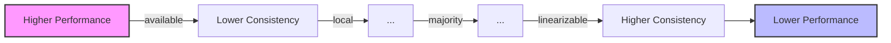

# MongoDB Read Concerns

## Introduction

When working with MongoDB, especially in applications that require transactions, understanding **read concerns** is crucial. Read concerns determine the level of consistency and isolation for data reads from a MongoDB database. They represent a balance between having the most up-to-date data and optimizing performance.

In this guide, we'll explore what read concerns are, the different types available in MongoDB, and how to use them effectively in your applications. By the end, you'll have a solid understanding of how read concerns can help you build more reliable and robust MongoDB-based applications.

## What are Read Concerns?

A read concern determines what data you can read from replica sets and replica set shards. In simple terms, a read concern lets you control the consistency and isolation properties of the data you read from MongoDB.

Think of read concerns as a way to answer the question: "What version of the data should I read?"

## Types of Read Concerns in MongoDB

MongoDB offers several read concern levels, each with different guarantees regarding data consistency:

1. **local** - Default read concern
2. **available** - Lowest consistency but highest availability
3. **majority** - Data acknowledged by a majority of replica set members
4. **linearizable** - Strongest consistency guarantee
5. **snapshot** - Used in multi-document transactions

Let's explore each of these in detail.

### 1. `local` Read Concern

The `local` read concern returns the most recent data available on the instance, but with no guarantee that the data has been committed to a majority of the replica set.

#### When to use:
- Default option for reads from standalone instances
- When you need the fastest possible read operations
- For data where eventual consistency is acceptable

#### Example:

```javascript
db.collection.find({}).readConcern("local");
```

Using with the MongoDB driver:

```javascript
const result = await collection.find({})
  .readConcern({ level: 'local' })
  .toArray();
```

### 2. `available` Read Concern

The `available` read concern provides the lowest consistency guarantee but the lowest latency reads. It's primarily used with sharded clusters.

#### When to use:
- For sharded clusters when you need the lowest latency reads
- When data availability is more important than consistency
- For scenarios where stale reads are acceptable

#### Example:

```javascript
db.collection.find({}).readConcern("available");
```

Using with a driver:

```javascript
const result = await collection.find({})
  .readConcern({ level: 'available' })
  .toArray();
```

### 3. `majority` Read Concern

The `majority` read concern returns data that has been acknowledged by a majority of the replica set members. This ensures that the data you read cannot be rolled back.

#### When to use:
- When you need to read data that won't be rolled back
- For consistent reads after writes with `w: "majority"`
- For critical operations that require stronger consistency guarantees

#### Example:

```javascript
db.collection.find({}).readConcern("majority");
```

Using with a driver:

```javascript
const result = await collection.find({})
  .readConcern({ level: 'majority' })
  .toArray();
```

### 4. `linearizable` Read Concern

The `linearizable` read concern provides the strongest consistency guarantee. It ensures that reads reflect all successful writes that completed before the start of the read operation.

#### When to use:
- For operations that require the most up-to-date data
- When you need to read your own writes immediately
- For strict consistency requirements

#### Important notes:
- Only works for read operations on a single document
- Can have higher latency compared to other read concerns
- Requires majority write concern

#### Example:

```javascript
db.collection.find({ _id: ObjectId("507f1f77bcf86cd799439011") })
  .readConcern("linearizable");
```

Using with a driver:

```javascript
const result = await collection.findOne(
  { _id: ObjectId("507f1f77bcf86cd799439011") },
  { readConcern: { level: 'linearizable' } }
);
```

### 5. `snapshot` Read Concern

The `snapshot` read concern is specifically designed for multi-document transactions. It provides a consistent snapshot of the data at the time the transaction starts.

#### When to use:
- Within multi-document transactions
- When you need point-in-time consistency across multiple documents
- For operations that need to see a consistent database state

#### Example within a transaction:

```javascript
// Start a session
const session = client.startSession();

// Start a transaction with snapshot read concern
session.startTransaction({
  readConcern: { level: "snapshot" },
  writeConcern: { w: "majority" }
});

try {
  const customers = await db.collection('customers')
    .find({}, { session }).toArray();
  
  const orders = await db.collection('orders')
    .find({}, { session }).toArray();
    
  // Both reads see a consistent snapshot of the data
  
  await session.commitTransaction();
} catch (error) {
  await session.abortTransaction();
  throw error;
} finally {
  await session.endSession();
}
```

## Visual Representation of Read Concerns

Here's a diagram showing the relationship between consistency and performance for different read concern levels:



## Practical Example: E-commerce Inventory System

Let's consider an e-commerce application with different consistency requirements for different operations:

1. **Product Browsing** - When users are browsing products, some slight inconsistency is acceptable.
2. **Inventory Check** - When checking if an item is in stock before purchase, we need accurate data.
3. **Order Processing** - When processing payments and orders, we need strong consistency.

Here's how we might implement these using different read concerns:

```javascript
// Product browsing - optimize for performance
async function getProductCatalog() {
  return await productsCollection
    .find({})
    .readConcern("local") // Fast reads are acceptable
    .toArray();
}

// Inventory check - need accurate data 
async function checkInventory(productId) {
  return await inventoryCollection
    .findOne({ _id: productId })
    .readConcern("majority") // Ensure data won't be rolled back
    .projection({ quantity: 1 });
}

// Order processing - need strong consistency
async function processOrder(orderId) {
  const session = client.startSession();
  
  try {
    session.startTransaction({
      readConcern: { level: "snapshot" }, // Consistent view across collections
      writeConcern: { w: "majority" }
    });
    
    const order = await ordersCollection
      .findOne({ _id: orderId }, { session });
      
    const inventory = await inventoryCollection
      .findOne({ _id: order.productId }, { session });
      
    // Process the order...
    
    await session.commitTransaction();
    return { success: true };
  } catch (error) {
    await session.abortTransaction();
    return { success: false, error: error.message };
  } finally {
    await session.endSession();
  }
}
```

## Important Considerations

When choosing a read concern level, consider:

1. **Performance Trade-offs** - Stronger consistency typically means higher latency. Choose the weakest read concern that meets your requirements.

2. **Hardware Requirements** - Some read concerns have specific requirements:
   - `majority` reads require a replica set with at least three voting members
   - `linearizable` requires majority write concern

3. **Read Your Own Writes** - If you need to immediately read data you've written, consider:
   - Using `majority` or `linearizable` read concern
   - Using sessions and causal consistency

4. **Impact of Network Partitions** - During network partitions:
   - `majority` reads might be unavailable if a majority of nodes can't be reached
   - `local` and `available` reads will continue to work but might return stale data

## Read Concerns in Production Environments

For production environments, consider these best practices:

1. **Default to `local`** - Use `local` read concern for most operations unless you need stronger guarantees.

2. **Use `majority` for Critical Operations** - For operations where consistency is critical, use `majority`.

3. **Use Transactions with `snapshot`** - For operations spanning multiple documents that need consistency, use transactions with the `snapshot` read concern.

4. **Avoid `linearizable` for High-Volume Operations** - Due to its performance impact, use `linearizable` sparingly.

## Code Example: Implementation with Node.js and MongoDB Driver

Here's a more complete example showing how to use different read concerns in a Node.js application:

```javascript
const { MongoClient } = require('mongodb');

async function demoReadConcerns() {
  const uri = 'mongodb://localhost:27017';
  const client = new MongoClient(uri);
  
  try {
    await client.connect();
    console.log('Connected to MongoDB');
    
    const database = client.db('inventory_demo');
    const products = database.collection('products');
    
    // Insert a product for demo
    await products.insertOne({
      name: "Smartphone",
      price: 699.99,
      stock: 50
    });
    
    // Local read concern (default)
    const localResult = await products.findOne(
      { name: "Smartphone" }
    );
    console.log('Local read concern result:', localResult);
    
    // Majority read concern
    const majorityResult = await products.findOne(
      { name: "Smartphone" },
      { readConcern: { level: 'majority' } }
    );
    console.log('Majority read concern result:', majorityResult);
    
    // Linearizable read concern (on a specific document)
    const linearizableResult = await products.findOne(
      { _id: majorityResult._id },
      { readConcern: { level: 'linearizable' }, maxTimeMS: 10000 }
    );
    console.log('Linearizable read concern result:', linearizableResult);
    
    // Available read concern (mainly used with sharded clusters)
    const availableResult = await products.findOne(
      { name: "Smartphone" },
      { readConcern: { level: 'available' } }
    );
    console.log('Available read concern result:', availableResult);
    
    // Transaction with snapshot read concern
    const session = client.startSession();
    try {
      session.startTransaction({ readConcern: { level: 'snapshot' } });
      
      const snapshotResult = await products.findOne(
        { name: "Smartphone" },
        { session }
      );
      console.log('Snapshot read concern in transaction:', snapshotResult);
      
      await session.commitTransaction();
    } catch (error) {
      await session.abortTransaction();
      console.error('Transaction aborted:', error);
    } finally {
      await session.endSession();
    }
    
  } finally {
    await client.close();
    console.log('Connection closed');
  }
}

demoReadConcerns().catch(console.error);
```

## Summary

MongoDB read concerns allow you to control the consistency and isolation properties of your read operations. By understanding the different read concern levels and their trade-offs, you can design applications that balance consistency needs with performance requirements.

- **local** - Default option, returns data from the local instance
- **available** - Lowest consistency, highest performance, for sharded clusters
- **majority** - Returns data that has been acknowledged by a majority of nodes
- **linearizable** - Strongest consistency guarantee for single-document reads
- **snapshot** - Provides a consistent view across multiple documents in transactions

Choose the appropriate read concern based on your application's specific requirements, considering factors like the importance of data consistency, performance needs, and the nature of your operations.

## Additional Resources and Practice Exercises

### Resources
- [MongoDB Official Documentation on Read Concerns](https://www.mongodb.com/docs/manual/reference/read-concern/)
- [MongoDB University: M201 MongoDB Performance](https://learn.mongodb.com/)

### Practice Exercises

1. **Basic Exercise**: Create a MongoDB replica set locally and experiment with different read concerns. Observe the behavior when you introduce network delays.

2. **Intermediate Exercise**: Build a small application that implements a shopping cart system using different read concerns for different operations (browsing, inventory check, checkout).

3. **Advanced Exercise**: Create a scenario that simulates a network partition in a replica set and observe how different read concerns behave during the partition.

By mastering MongoDB read concerns, you'll be better equipped to build robust, high-performance applications that meet your specific data consistency requirements.