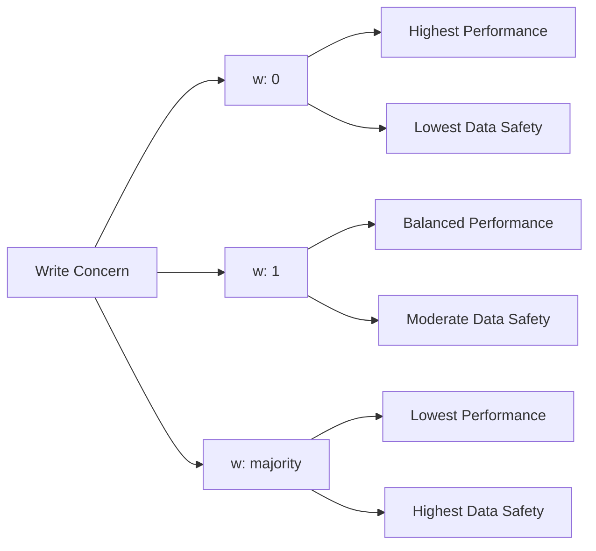

# MongoDB Write Concerns

## Introduction

When working with databases, ensuring your data is properly stored is crucial. MongoDB's write concerns provide a mechanism to control the level of acknowledgment you receive when writing data to your database. This feature is essential for balancing performance, data consistency, and durability in your applications.

In this tutorial, we'll explore MongoDB write concerns, understand their significance in transactions, and learn how to implement them effectively in your applications.

## What Are Write Concerns?

A write concern in MongoDB determines the level of acknowledgment requested from MongoDB for write operations. It specifies how many MongoDB instances must acknowledge the write before the operation is considered successful.

Write concerns answer a fundamental question: **"How sure do you want to be that your data was written successfully?"**

## Write Concern Components

A write concern consists of several components:

1. **w**: The number of nodes that must acknowledge the write
2. **j**: Whether the write should be journaled (written to the on-disk journal)
3. **wtimeout**: How long to wait for the required acknowledgments before timing out

Let's examine each component in detail.

### The "w" Option

The `w` option specifies the number of members that must acknowledge the write operation:

- `w: 0` - No acknowledgment required (fire and forget)
- `w: 1` - Acknowledge from the primary only (default)
- `w: 2` or higher - Acknowledge from the primary and one or more secondaries
- `w: "majority"` - Acknowledge from a majority of the replica set members
- `w: "<tag>"` - Acknowledge from a tagged set of servers

### The "j" Option

The `j` option determines whether the write operation will be committed to the journal before acknowledging:

- `j: false` - No journal commit required (default)
- `j: true` - Write operation must be committed to the journal before acknowledging

### The "wtimeout" Option

The `wtimeout` option defines how long MongoDB will wait for the required write concern to be satisfied before returning an error:

- Specified in milliseconds
- Prevents operations from blocking indefinitely

## Basic Write Concern Examples

Here's how to specify different write concerns in the MongoDB shell:

### Default Write Concern (w: 1, j: false)

```javascript
db.products.insertOne(
  { name: "Laptop", price: 999.99 },
  { writeConcern: { w: 1 } }
)
```

Output:
```
{
  "acknowledged": true,
  "insertedId": ObjectId("5f7b1f2b8d9a6b3c4d5e6f7a")
}
```

### Write Concern with Journaling

```javascript
db.products.insertOne(
  { name: "Smartphone", price: 699.99 },
  { writeConcern: { w: 1, j: true } }
)
```

Output:
```
{
  "acknowledged": true,
  "insertedId": ObjectId("5f7b1f2b8d9a6b3c4d5e6f7b")
}
```

### Majority Write Concern

```javascript
db.products.insertOne(
  { name: "Headphones", price: 149.99 },
  { writeConcern: { w: "majority", wtimeout: 5000 } }
)
```

Output:
```
{
  "acknowledged": true,
  "insertedId": ObjectId("5f7b1f2b8d9a6b3c4d5e6f7c")
}
```

## Write Concerns in Transactions

Write concerns are particularly important in transactions. When working with multi-document transactions in MongoDB, you need to consider the write concern at two levels:

1. **Session level** - Set for all operations within a transaction
2. **Transaction level** - Set when committing the transaction

### Example: Configuring Write Concerns in a Transaction

```javascript
// Start a session with write concern
const session = db.getMongo().startSession({
  defaultTransactionOptions: {
    readConcern: { level: "local" },
    writeConcern: { w: "majority" }
  }
});

// Start a transaction
session.startTransaction();

try {
  // Perform operations in the transaction
  const ordersCollection = session.getDatabase("store").orders;
  const inventoryCollection = session.getDatabase("store").inventory;
  
  // Insert order
  ordersCollection.insertOne({ 
    customer: "John Doe",
    product: "Laptop",
    price: 999.99
  });
  
  // Update inventory
  inventoryCollection.updateOne(
    { product: "Laptop" },
    { $inc: { stock: -1 } }
  );
  
  // Commit with specific write concern
  session.commitTransaction();
  console.log("Transaction committed successfully");
} catch (error) {
  // Abort the transaction on error
  session.abortTransaction();
  console.error("Transaction aborted:", error);
} finally {
  // End the session
  session.endSession();
}
```

## Understanding Write Concern Trade-offs

When choosing a write concern, you're making a trade-off between:

1. **Performance** - Lower write concerns are faster but less safe
2. **Data safety** - Higher write concerns are safer but slower
3. **Availability** - Stricter write concerns may fail during network partitions

Let's visualize these trade-offs:



## Real-World Scenarios and Recommendations

Let's look at some common scenarios and the recommended write concerns:

### Scenario 1: Logging Application

For non-critical data like logs:

```javascript
db.logs.insertOne(
  { level: "INFO", message: "User logged in", timestamp: new Date() },
  { writeConcern: { w: 0 } }
)
```

This "fire and forget" approach offers maximum performance for non-critical data.

### Scenario 2: E-commerce Order Processing

For financial transactions:

```javascript
db.orders.insertOne(
  {
    orderId: "ORD-12345",
    customer: "John Doe",
    total: 999.99,
    items: [{ product: "Laptop", qty: 1, price: 999.99 }],
    status: "Pending"
  },
  { writeConcern: { w: "majority", j: true, wtimeout: 5000 } }
)
```

This ensures that the order is durably written to a majority of servers before confirming to the customer.

### Scenario 3: User Settings Update

For user preferences:

```javascript
db.userSettings.updateOne(
  { userId: "user123" },
  { $set: { theme: "dark", notifications: true } },
  { writeConcern: { w: 1, j: true } }
)
```

This balances performance with reasonable data safety for user settings.

## Setting Default Write Concerns

You can configure default write concerns at different levels:

### MongoDB Client Level

```javascript
// Node.js MongoDB driver example
const client = new MongoClient(uri, {
  writeConcern: {
    w: "majority",
    j: true,
    wtimeout: 2500
  }
});
```

### Collection Level

```javascript
db.createCollection("critical_data", {
  writeConcern: { w: "majority", j: true }
});
```

### Database Level

```javascript
db.adminCommand({
  setDefaultRWConcern: 1,
  defaultWriteConcern: { w: "majority" }
});
```

## Best Practices for Write Concerns

1. **Match the write concern to your use case**:
   - Use `w: "majority"` for financial or critical data
   - Use `w: 1` for typical applications
   - Use `w: 0` only for non-critical data where loss is acceptable

2. **Always set a wtimeout**:
   - Prevents operations from hanging indefinitely
   - Typically 2000-5000ms is reasonable

3. **Consider enabling journaling (`j: true`) for critical data**:
   - Ensures data is written to disk
   - Trades some performance for safety

4. **Test performance impact**:
   - More strict write concerns have higher latency
   - Benchmark with your actual workload

5. **Use transactions with appropriate write concerns for multi-document operations**:
   - Match the write concern to the importance of the transaction

## Advanced Topics: Write Concern Errors

When a write concern cannot be satisfied, MongoDB returns a write concern error. This doesn't mean the write failed—it means MongoDB couldn't confirm it met your durability requirements.

### Example: Write Concern Error

```javascript
try {
  // Try to write with an impossible write concern (more nodes than exist)
  db.collection.insertOne(
    { test: "data" },
    { writeConcern: { w: 10, wtimeout: 1000 } }
  );
} catch (error) {
  console.error("Write concern error:", error.writeConcernError);
  // The write may have succeeded, but didn't meet the requested durability
}
```

## Monitoring Write Concerns

You can monitor write concern performance using the MongoDB database profiler:

```javascript
// Enable profiling for slow operations
db.setProfilingLevel(1, { slowms: 100 });

// Query the system.profile collection to find slow writes
db.system.profile.find({ 
  op: "insert", 
  millis: { $gt: 100 }
}).pretty();
```

## Summary

MongoDB write concerns give you fine-grained control over the trade-offs between performance and data durability. They allow you to:

- Choose the right balance between performance and data safety
- Ensure critical data is properly stored
- Configure different durability levels for different types of data
- Prevent data loss in distributed systems

By understanding and properly configuring write concerns, you can ensure your MongoDB deployment meets your application's specific requirements for data consistency and durability.

## Additional Resources

- [MongoDB Official Documentation on Write Concerns](https://docs.mongodb.com/manual/reference/write-concern/)
- [MongoDB University Course on Data Modeling](https://university.mongodb.com/)
- [MongoDB Blog: Write Concerns in Distributed Systems](https://www.mongodb.com/blog)

## Exercises

1. Configure a MongoDB replica set locally and experiment with different write concerns. Measure the performance impact of each setting.

2. Write a simple application that uses transactions with different write concerns and test failure scenarios.

3. Design a write concern strategy for a hypothetical application with three types of data: user profiles, financial transactions, and analytics logs.

4. Create a test that simulates network partition and observe how different write concerns behave.