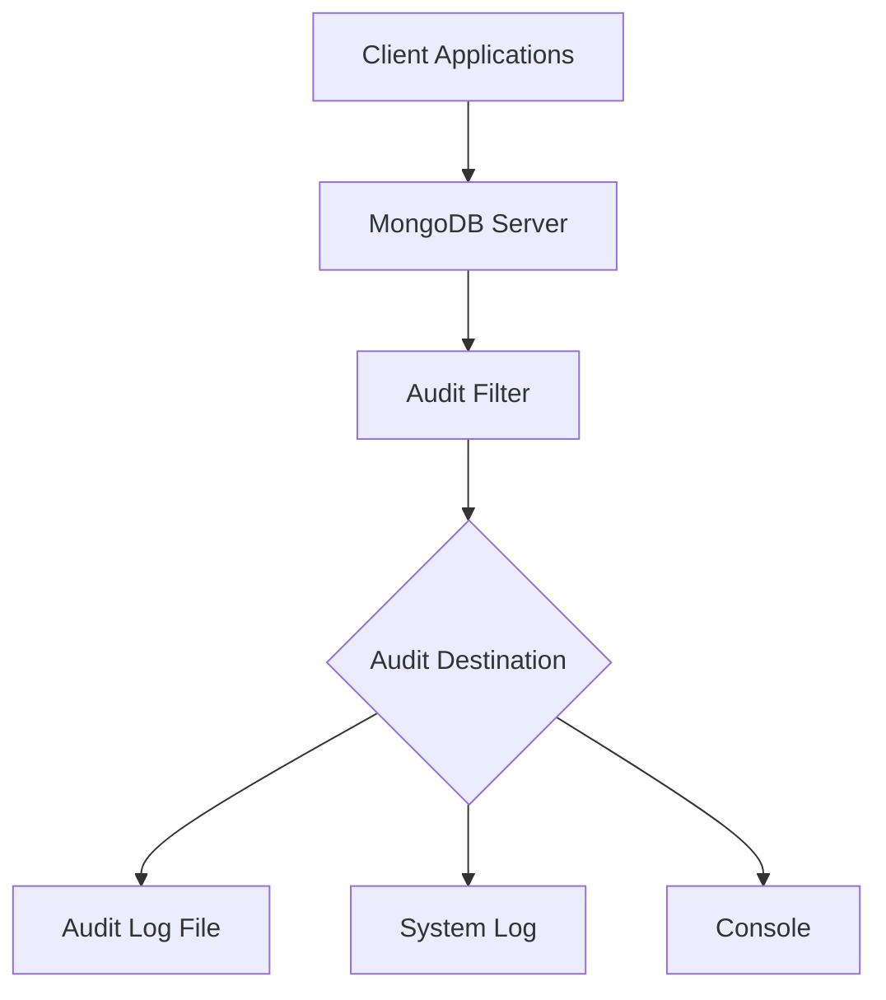

# MongoDB Auditing

## Introduction

MongoDB auditing is a powerful security feature that allows database administrators to track and record database activities. By maintaining a record of events and operations, auditing helps organizations meet security compliance requirements, investigate suspicious activities, and understand how their databases are being used. 

Auditing is especially important in environments where data security and compliance with regulations like GDPR, HIPAA, or SOX is required. This feature is available in MongoDB Enterprise Edition and MongoDB Atlas, providing organizations with the visibility they need to ensure their database activities align with security policies and regulatory requirements.

## Why You Need MongoDB Auditing

Before diving into the implementation details, let's understand why auditing is crucial for your MongoDB deployment:

1. **Regulatory Compliance**: Many industries require organizations to track who accessed what data and when.
2. **Security Incident Investigation**: Helps in analyzing security breaches by providing detailed logs.
3. **User Accountability**: Creates a trail of user actions for accountability purposes.
4. **System Troubleshooting**: Helps identify the cause of unexpected system behavior.
5. **Access Pattern Analysis**: Understanding how your database is being accessed can help optimize performance.

## Auditing Architecture in MongoDB

MongoDB's auditing architecture captures events at the MongoDB server level. When enabled, the audit system creates detailed logs of operations such as:

- Authentication and authorization attempts
- CRUD operations on collections
- Index and schema modifications
- Database administrative commands

These events are recorded to a destination you specify (file, console, or syslog) and can be filtered to capture only the events relevant to your needs.



## Enabling Auditing in MongoDB

### Prerequisites

To use MongoDB auditing, you need:
- MongoDB Enterprise Edition or MongoDB Atlas
- Administrative privileges to configure the server

### Configuration Options

#### Method 1: Command Line Configuration

When starting MongoDB with the `mongod` command, you can enable auditing using the following options:

```bash
mongod --dbpath /path/to/data --auditDestination file --auditFormat JSON --auditPath /path/to/audit/log.json
```

This command:
- Sets the audit destination to a file
- Specifies JSON as the output format
- Defines the path where the audit log will be stored

#### Method 2: Configuration File

For a more permanent setup, add auditing options to your MongoDB configuration file (`mongod.conf`):

```yaml
auditLog:
   destination: file
   format: JSON
   path: /path/to/audit/log.json
   filter: '{ atype: { $in: ["authenticate", "authCheck"] } }'
```

The above configuration:
- Sets the audit destination to a file
- Uses JSON format for logging
- Specifies the log file path
- Adds a filter to only log authentication events

### Verifying Audit Configuration

After enabling auditing, you can verify your configuration using the `getParameter` command:

```javascript
db.adminCommand( { getParameter: 1, auditLog: 1 } )
```

Example output:

```javascript
{
  "auditLog": {
    "filter": "{ atype: { $in: [\"authenticate\", \"authCheck\"] } }",
    "destination": "file",
    "format": "JSON",
    "path": "/path/to/audit/log.json"
  },
  "ok": 1
}
```

## Auditing Operations and Filter Expressions

### Types of Operations You Can Audit

MongoDB can audit a wide range of operations, including:

| Operation Type | Description | Example Events |
|--------------|-------------|---------------|
| Authentication | User login attempts | `authenticate`, `authCheck` |
| User Management | User creation, modification | `createUser`, `dropUser`, `grantRole` |
| Database Operations | CRUD operations | `insert`, `update`, `delete`, `find` |
| Schema Changes | Collection and index modifications | `createCollection`, `createIndex`, `dropIndex` |
| Administrative | Server management commands | `shutdown`, `replSetReconfig` |

### Filtering Audit Events

To reduce the performance impact and focus on specific events, you can apply filters to your audit configuration:

```javascript
{
  atype: { $in: ["authenticate", "authCheck"] },
  "param.db": "sensitive_database"
}
```

This filter will only log authentication events for the "sensitive_database".

### Common Filter Expressions

Here are some useful filter expressions for different scenarios:

#### Audit Failed Authentication Attempts

```javascript
{ atype: "authenticate", "param.result": 0 }
```

#### Audit All Administrative Operations

```javascript
{ 
  atype: { 
    $in: ["createUser", "dropUser", "dropAllUsersFromDatabase", 
          "grantRolesToUser", "revokeRolesFromUser", 
          "updateUser", "dropCollection", "dropDatabase"] 
  } 
}
```

#### Audit Operations by a Specific User

```javascript
{ "param.user": "adminUser" }
```

## Reading and Analyzing Audit Logs

### JSON Format Audit Log Example

When using JSON as the audit format, each entry will look similar to this:

```json
{
  "atype": "authenticate",
  "ts": { "$date": "2023-05-15T10:25:30.123Z" },
  "local": { "ip": "127.0.0.1", "port": 27017 },
  "remote": { "ip": "192.168.1.100", "port": 56789 },
  "users": [{ "user": "admin", "db": "admin" }],
  "roles": [{ "role": "root", "db": "admin" }],
  "param": { "user": "admin", "db": "admin", "mechanism": "SCRAM-SHA-256" },
  "result": 0
}
```

### Key Fields in Audit Logs

- **atype**: The type of operation being audited
- **ts**: Timestamp when the event occurred
- **local**: Local IP and port of the MongoDB server
- **remote**: Client IP and port that initiated the operation
- **users**: The authenticated user who performed the action
- **roles**: Roles assigned to the user
- **param**: Operation-specific parameters
- **result**: Result code (0 typically means success)

### Analyzing Audit Logs with MongoDB Tools

You can use MongoDB's tools to analyze audit logs. For instance, to find all failed authentication attempts:

```bash
mongosh --quiet --eval "JSON.parse(cat('/path/to/audit/log.json').split('\n').filter(Boolean).join(','))" | jq '.[] | select(.atype == "authenticate" and .result != 0)'
```

### Creating Custom Analysis Scripts

Here's a simple Node.js script to analyze authentication events in your audit logs:

```javascript
const fs = require('fs');
const readline = require('readline');

async function analyzeAuditLog(filePath) {
  const fileStream = fs.createReadStream(filePath);
  const rl = readline.createInterface({
    input: fileStream,
    crlfDelay: Infinity
  });

  let failedAuth = 0;
  let successAuth = 0;

  for await (const line of rl) {
    try {
      const event = JSON.parse(line);
      if (event.atype === 'authenticate') {
        if (event.result === 0) {
          successAuth++;
        } else {
          failedAuth++;
          console.log(`Failed authentication from IP: ${event.remote.ip} for user: ${event.param.user}`);
        }
      }
    } catch (e) {
      // Handle potential JSON parsing errors
      continue;
    }
  }

  console.log(`Authentication Summary:`);
  console.log(`- Successful attempts: ${successAuth}`);
  console.log(`- Failed attempts: ${failedAuth}`);
}

analyzeAuditLog('/path/to/audit/log.json');
```

## Performance Considerations

Auditing can have a performance impact on your MongoDB deployment. Here are some considerations:

1. **Be Selective**: Only audit operations that are necessary for your compliance or security requirements.
2. **Use Filters**: Implement filters to reduce the volume of audit events.
3. **Storage Planning**: Audit logs can grow large. Plan for adequate storage and rotation policies.
4. **Separate Disk**: Store audit logs on a separate disk to minimize I/O contention.

In general, you can expect a performance overhead of approximately 5-15% with auditing enabled, depending on your workload and filtering configuration.

## Real-World Use Cases

### Case Study 1: Healthcare Application

A healthcare provider needs to track who accessed patient records to comply with HIPAA regulations:

```javascript
// Audit filter for monitoring access to patient data
{
  atype: { $in: ["find", "insert", "update", "delete"] },
  "param.ns": "hospitalDB.patientRecords"
}
```

This filter tracks all CRUD operations on the patient records collection, enabling the organization to prove compliance during audits.

### Case Study 2: Financial System Security

A financial institution wants to detect and investigate unauthorized access attempts:

```javascript
// Audit all failed authentication attempts and role modifications
{
  $or: [
    { atype: "authenticate", result: { $ne: 0 } },
    { atype: { $in: ["grantRolesToUser", "revokeRolesFromUser", "updateRole", "dropRole"] } }
  ]
}
```

This filter helps security teams detect potential unauthorized access or privilege escalation attempts.

### Case Study 3: Audit Trail for Regulatory Compliance

An e-commerce platform must maintain an audit trail for all changes to sensitive customer data:

```javascript
// Monitor all operations on customer financial data
{
  atype: { $in: ["insert", "update", "delete"] },
  "param.ns": { $in: ["ecommerce.customers", "ecommerce.payments"] }
}
```

This configuration helps the company demonstrate compliance with data protection regulations.

## Best Practices for MongoDB Auditing

1. **Plan your auditing strategy** before implementation to ensure you capture necessary events without excessive performance impact.

2. **Review audit logs regularly** as part of your security procedures, not just when investigating incidents.

3. **Implement log rotation** to manage disk space and maintain log file performance:
   ```bash
   # Example logrotate configuration for MongoDB audit logs
   /path/to/audit/log.json {
       daily
       rotate 30
       compress
       delaycompress
       notifempty
       create 0640 mongod mongod
       postrotate
           /usr/bin/killall -SIGUSR1 mongod
       endscript
   }
   ```

4. **Monitor the size of audit logs** and adjust filters if they're growing too quickly.

5. **Use automated alerting** for suspicious events in your audit logs.

6. **Document your audit configuration** as part of your security policies and procedures.

## Troubleshooting Auditing

### Common Issues and Solutions

**Problem**: Auditing is not capturing expected events.
**Solution**: Verify your filter expressions. Test them with simple cases first before adding complexity.

**Problem**: Performance degradation after enabling auditing.
**Solution**: Refine your filters to be more selective, or consider upgrading your hardware.

**Problem**: Audit logs filling disk space too quickly.
**Solution**: Implement log rotation, more selective filtering, or increase available storage.

### Verifying Audit Filter Effectiveness

To test if your audit filters are working properly, you can perform representative operations and then check the audit logs:

```javascript
// 1. Set up a test filter for a specific collection
db.adminCommand({
  setParameter: 1,
  auditAuthorizationSuccess: true,
  auditFilter: '{ "param.ns": "testDB.auditTest" }'
})

// 2. Perform operations on that collection
use testDB
db.auditTest.insertOne({ test: "audit entry" })
db.auditTest.find().pretty()
db.auditTest.updateOne({ test: "audit entry" }, { $set: { updated: true } })
db.auditTest.deleteOne({ test: "audit entry" })

// 3. Check the audit log to confirm events were captured
```

## Summary

MongoDB auditing is a crucial security feature for organizations that need to track database activities for compliance, security, and operational purposes. In this guide, we've covered:

- The fundamentals of MongoDB auditing and its importance
- How to enable and configure auditing in MongoDB
- Filtering techniques to focus on specific events
- How to read and analyze audit logs
- Performance considerations and best practices
- Real-world use cases and troubleshooting tips

By implementing auditing in your MongoDB deployment, you create accountability, enhance security, and ensure compliance with regulatory requirements.

## Additional Resources

- Practice creating different audit filters for specific use cases
- Set up log rotation for your MongoDB audit logs
- Create a simple script to analyze audit logs for security events
- Implement a monitoring solution that includes alerts for suspicious audit events

Remember that auditing is just one component of a comprehensive MongoDB security strategy. It should be combined with other security features like authentication, authorization, encryption, and network security for a robust defense-in-depth approach.