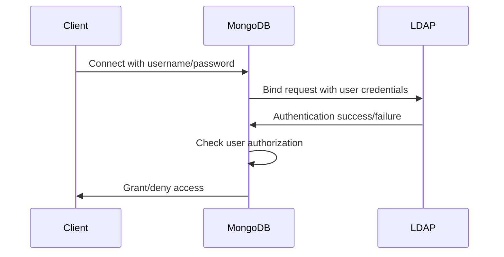

# MongoDB LDAP Integration

## Introduction

Lightweight Directory Access Protocol (LDAP) is a widely used protocol for accessing and maintaining distributed directory information services. In enterprise environments, LDAP is commonly used for centralized authentication and user management. MongoDB's LDAP integration allows organizations to leverage their existing LDAP infrastructure for authenticating and authorizing MongoDB users.

In this tutorial, we'll explore how MongoDB integrates with LDAP, the benefits of this integration, and step-by-step instructions to set up and configure LDAP authentication and authorization in your MongoDB environment.

## Why Use LDAP with MongoDB?

Before diving into configuration details, let's understand why you might want to integrate MongoDB with LDAP:

- **Centralized User Management**: Maintain user credentials in one place for multiple systems
- **Consistent Security Policies**: Apply uniform access controls across your organization
- **Simplified Administration**: Add or remove user access without modifying MongoDB directly
- **Enterprise Compliance**: Meet organizational security requirements for centralized authentication

## Prerequisites

- MongoDB Enterprise Server (LDAP integration is an Enterprise feature)
- A running LDAP server (like OpenLDAP or Active Directory)
- Basic knowledge of LDAP concepts and MongoDB security

## LDAP Integration Options

MongoDB supports two main types of LDAP integration:

1. **LDAP Authentication**: Verifies user credentials against an LDAP server
2. **LDAP Authorization**: Uses LDAP to determine what actions users can perform in MongoDB

Let's explore both options in detail.

## Setting up LDAP Authentication

LDAP authentication allows MongoDB to verify user credentials against your LDAP directory.

### Step 1: Update MongoDB Configuration

Edit your MongoDB configuration file (typically `mongod.conf`) to include LDAP authentication settings:

```yaml
security:
  authorization: "enabled"
  ldap:
    servers: "ldap.example.com"
    transportSecurity: "tls"
    userToDNMapping:
      '[
        {
          match: "(.+)",
          ldapQuery: "ou=Users,dc=example,dc=com??sub?(uid={0})"
        }
      ]'
    bind:
      queryUser: "cn=mongodb,dc=example,dc=com"
      queryPassword: "secret_password"
```

Let's break down this configuration:

- `servers`: Your LDAP server's address
- `transportSecurity`: Secures the connection with TLS
- `userToDNMapping`: Maps MongoDB usernames to LDAP Distinguished Names (DNs)
- `bind`: Credentials MongoDB uses to query the LDAP server

### Step 2: Restart MongoDB Service

After updating the configuration, restart your MongoDB service:

```bash
sudo systemctl restart mongod
```

### Step 3: Create MongoDB Users with LDAP Authentication

Now, create MongoDB users that will authenticate via LDAP:

```javascript
use admin
db.createUser({
  user: "john.doe",
  roles: [
    { role: "readWrite", db: "sales" }
  ],
  mechanisms: ["PLAIN"]
})
```

Note that we specify `"PLAIN"` as the authentication mechanism because LDAP authentication uses it.

### Step 4: Connect Using LDAP Authentication

Users can now connect using their LDAP credentials:

```bash
mongosh --host mongodb.example.com --authenticationMechanism PLAIN \
  --authenticationDatabase '$external' -u john.doe -p
```

After entering their LDAP password, MongoDB will authenticate against the LDAP server and grant access according to their roles.

## Setting up LDAP Authorization

LDAP authorization takes integration further by determining user permissions based on LDAP group membership.

### Step 1: Update MongoDB Configuration

Extend your configuration to include authorization settings:

```yaml
security:
  authorization: "enabled"
  ldap:
    servers: "ldap.example.com"
    transportSecurity: "tls"
    userToDNMapping:
      '[
        {
          match: "(.+)",
          ldapQuery: "ou=Users,dc=example,dc=com??sub?(uid={0})"
        }
      ]'
    authz:
      queryTemplate: "ou=Groups,dc=example,dc=com??sub?(&(objectClass=groupOfNames)(member={USER}))"
```

The `authz.queryTemplate` specifies how MongoDB retrieves a user's LDAP groups.

### Step 2: Map LDAP Groups to MongoDB Roles

Create a role mapping file (`ldap-roles.json`) to map LDAP groups to MongoDB roles:

```json
{
  "roles": [
    {
      "role": "readWrite",
      "db": "sales",
      "ldapGroups": ["cn=sales_users,ou=Groups,dc=example,dc=com"]
    },
    {
      "role": "dbAdmin",
      "db": "sales",
      "ldapGroups": ["cn=sales_admins,ou=Groups,dc=example,dc=com"]
    }
  ]
}
```

### Step 3: Configure MongoDB to Use the Role Mapping File

Update your MongoDB configuration:

```yaml
security:
  ldap:
    authz:
      roleMapping: "/etc/mongodb/ldap-roles.json"
```

### Step 4: Restart MongoDB Service

Restart your MongoDB service to apply the new configuration:

```bash
sudo systemctl restart mongod
```

Now, when users authenticate via LDAP, their permissions will be determined by their LDAP group memberships.

## Authentication Process Visualization

Here's a diagram showing how the LDAP authentication flow works with MongoDB:



## Real-World Example: Enterprise Multi-Team Setup

Let's walk through a practical example for a company with different departments using MongoDB.

### Scenario:

- **Marketing Team**: Needs read-only access to the `marketing` database
- **Analytics Team**: Needs read/write access to the `analytics` database
- **Platform Team**: Needs admin access to all databases

### LDAP Structure:

```
dc=example,dc=com
├── ou=Users
│   ├── uid=mark.user
│   ├── uid=anna.analyst
│   └── uid=paul.admin
└── ou=Groups
    ├── cn=marketing_readers
    ├── cn=analytics_users
    └── cn=platform_admins
```

### Configuration:

```yaml
security:
  authorization: "enabled"
  ldap:
    servers: "ldap.example.com"
    transportSecurity: "tls"
    userToDNMapping:
      '[
        {
          match: "(.+)",
          ldapQuery: "ou=Users,dc=example,dc=com??sub?(uid={0})"
        }
      ]'
    bind:
      queryUser: "cn=mongodb,dc=example,dc=com"
      queryPassword: "secret_password"
    authz:
      queryTemplate: "ou=Groups,dc=example,dc=com??sub?(&(objectClass=groupOfNames)(member={USER}))"
      roleMapping: "/etc/mongodb/ldap-roles.json"
```

### Role Mapping File (`ldap-roles.json`):

```json
{
  "roles": [
    {
      "role": "read",
      "db": "marketing",
      "ldapGroups": ["cn=marketing_readers,ou=Groups,dc=example,dc=com"]
    },
    {
      "role": "readWrite",
      "db": "analytics",
      "ldapGroups": ["cn=analytics_users,ou=Groups,dc=example,dc=com"]
    },
    {
      "role": "root",
      "db": "admin",
      "ldapGroups": ["cn=platform_admins,ou=Groups,dc=example,dc=com"]
    }
  ]
}
```

With this setup:
1. Marketing users like Mark can only read from the marketing database
2. Analytics users like Anna can read and write to the analytics database
3. Platform admins like Paul have full access to all databases

## Troubleshooting LDAP Integration

When setting up LDAP integration with MongoDB, you might encounter some common issues:

### 1. Connection Issues

If MongoDB can't connect to your LDAP server:

```bash
# Test LDAP connectivity from MongoDB server
ldapsearch -H ldap://ldap.example.com -D "cn=mongodb,dc=example,dc=com" -W -b "dc=example,dc=com"
```

### 2. Authentication Failures

Check the MongoDB logs for detailed error messages:

```
tail -f /var/log/mongodb/mongod.log | grep LDAP
```

### 3. Role Mapping Issues

Ensure your LDAP groups match exactly what's in the role mapping file:

```bash
# Verify LDAP group membership for a user
ldapsearch -H ldap://ldap.example.com -D "cn=mongodb,dc=example,dc=com" -W \
  -b "ou=Groups,dc=example,dc=com" "(&(objectClass=groupOfNames)(member=uid=john.doe,ou=Users,dc=example,dc=com))"
```

## Best Practices

1. **Use TLS/SSL**: Always secure the connection between MongoDB and your LDAP server
2. **Dedicated Bind Account**: Create a service account in LDAP specifically for MongoDB
3. **Least Privilege**: Grant minimal necessary permissions to LDAP users and groups
4. **Regular Audits**: Periodically review LDAP groups and role mappings
5. **Monitor Logs**: Set up alerts for failed authentication attempts

## Summary

MongoDB's LDAP integration provides a powerful way to centralize user authentication and authorization in enterprise environments. By leveraging your existing LDAP infrastructure, you can:

- Authenticate users against your central directory
- Determine MongoDB access permissions based on LDAP group membership
- Simplify user management across your organization

This integration is particularly valuable for organizations with strict compliance requirements or those managing access for many users across multiple systems.

## Additional Resources

- [MongoDB Enterprise LDAP Documentation](https://www.mongodb.com/docs/manual/core/security-ldap/)
- [LDAP RFC 4511](https://tools.ietf.org/html/rfc4511)
- [OpenLDAP Documentation](https://www.openldap.org/doc/)

## Exercises

1. Set up a test LDAP server (like OpenLDAP in Docker) and configure MongoDB to authenticate against it.
2. Create a role mapping file that grants different permissions to different LDAP groups.
3. Configure MongoDB to use both LDAP authentication and authorization.
4. Write a script to audit which MongoDB users have access to which databases based on LDAP groups.
5. Implement a monitoring solution that alerts on failed LDAP authentication attempts.

By completing these exercises, you'll gain hands-on experience with MongoDB's LDAP integration and be better prepared to implement it in production environments.