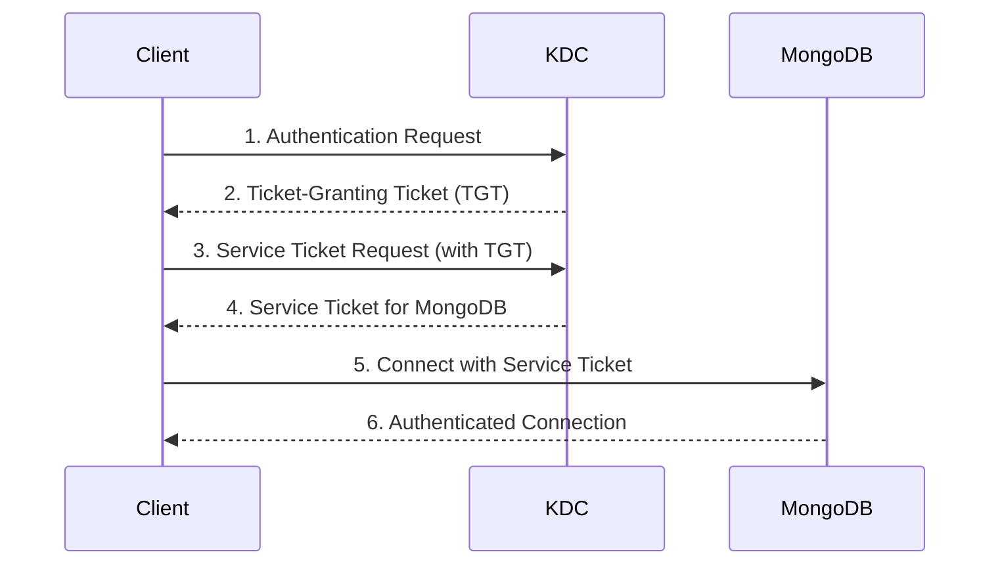

# MongoDB Kerberos Authentication

## Introduction

Kerberos authentication is an advanced security protocol that provides a robust way to authenticate users in MongoDB deployments. It's particularly valuable in enterprise environments where centralized authentication is essential. Unlike simple username and password authentication, Kerberos uses a ticket-based system that allows for Single Sign-On (SSO) capabilities across services and applications.

In this tutorial, you'll learn how to configure and use Kerberos authentication with MongoDB, understand its key components, and explore real-world implementation scenarios.

## What is Kerberos?

Kerberos is a network authentication protocol designed to provide strong authentication for client/server applications using secret-key cryptography. It was developed at MIT and named after the three-headed dog from Greek mythology that guards the gates of Hades, symbolizing the three parts of authentication: the client, the server, and the Key Distribution Center (KDC).

### Key Components of Kerberos

1. **Key Distribution Center (KDC)**: Central authentication server that includes:
   - Authentication Server (AS): Validates initial user requests
   - Ticket Granting Server (TGS): Issues tickets for specific services

2. **Principals**: Identifiers for users and services (e.g., `mongo/db.example.com@REALM.COM`)

3. **Tickets**: Encrypted data that authenticates a principal to a service



## Prerequisites

Before setting up Kerberos authentication for MongoDB, ensure you have:

1. A properly configured Kerberos infrastructure (KDC)
2. MongoDB Enterprise Edition (Kerberos is not available in the Community Edition)
3. Administrative access to both the Kerberos environment and MongoDB servers
4. Required Kerberos client libraries installed:
   - On Linux: `libkrb5-dev` or `krb5-devel`
   - On Windows: MIT Kerberos for Windows or Active Directory

## Setting Up MongoDB with Kerberos Authentication

### Step 1: Create Service Principal

First, create a service principal for your MongoDB server in your Kerberos realm. You'll need to use the `kadmin` utility or equivalent administration tool for your Kerberos implementation.

```bash
kadmin
> addprinc -randkey mongodb/mongodb-server.example.com@EXAMPLE.COM
```

### Step 2: Generate Keytab File

Next, generate a keytab file that MongoDB will use to authenticate itself to the KDC:

```bash
kadmin
> ktadd -k /path/to/mongodb.keytab mongodb/mongodb-server.example.com@EXAMPLE.COM
```

### Step 3: Configure MongoDB Server

Update your MongoDB configuration file (`mongod.conf`) to enable Kerberos:

```yaml
security:
  authorization: enabled
  authorization: enabled
  sasl:
    hostName: mongodb-server.example.com
    serviceName: mongodb
    saslauthdPath: /var/run/saslauthd/mux
  authenticationMechanisms:
    - GSSAPI
setParameter:
  authenticationMechanisms: GSSAPI
```

Make sure to set the proper permissions for the keytab file:

```bash
chown mongodb:mongodb /path/to/mongodb.keytab
chmod 400 /path/to/mongodb.keytab
```

### Step 4: Set Environment Variables

Set the `KRB5_KTNAME` environment variable to point to the keytab file:

```bash
export KRB5_KTNAME=/path/to/mongodb.keytab
```

For a permanent setting, add this to your MongoDB service file or startup script.

### Step 5: Start MongoDB with Kerberos Support

Start or restart the MongoDB service:

```bash
sudo systemctl restart mongod
```

## Connecting to MongoDB Using Kerberos Authentication

### Using the MongoDB Shell

To connect to a MongoDB instance using Kerberos authentication, you first need a valid Kerberos ticket. Obtain one using the `kinit` command:

```bash
kinit user@EXAMPLE.COM
```

Then connect to MongoDB using the `mongo` shell with the GSSAPI mechanism:

```bash
mongo --host mongodb-server.example.com --authenticationMechanism=GSSAPI --authenticationDatabase='$external' --gssapiServiceName=mongodb
```

### Using the MongoDB Node.js Driver

Here's how to connect using Kerberos authentication in a Node.js application:

```javascript
const { MongoClient } = require('mongodb');

async function connectWithKerberos() {
  try {
    const uri = 'mongodb://mongodb-server.example.com:27017/admin';
    const client = new MongoClient(uri, {
      authMechanism: 'GSSAPI',
      authSource: '$external',
      gssapiServiceName: 'mongodb'
    });
    
    await client.connect();
    console.log('Connected to MongoDB using Kerberos authentication');
    
    // Your database operations here
    const adminDB = client.db('admin');
    const result = await adminDB.command({ serverStatus: 1 });
    console.log('Server status:', result);
    
    await client.close();
  } catch (err) {
    console.error('Error connecting to MongoDB:', err);
  }
}

connectWithKerberos();
```

### Using the MongoDB Python Driver (PyMongo)

Here's how to connect using Kerberos authentication in Python:

```python
import pymongo
from pymongo.auth import GSSAPI

# Make sure you've already run 'kinit' to get a Kerberos ticket
client = pymongo.MongoClient(
    'mongodb://mongodb-server.example.com:27017/',
    authMechanism='GSSAPI',
    authSource='$external',
    authMechanismProperties={'SERVICE_NAME': 'mongodb'}
)

# Test the connection
print(client.admin.command('ping'))
```

## Real-World Example: Implementing Kerberos in an Enterprise Application

Let's look at a practical example of integrating Kerberos authentication in an enterprise application that manages employee records.

### Scenario

Your company has an existing HR application that needs to securely access MongoDB while leveraging the company's Active Directory (which uses Kerberos) for authentication.

### Implementation Steps

1. **Configure Service Principal in Active Directory**

   Work with your AD administrators to create a service principal for your MongoDB server.

2. **Set Up Delegation (if needed)**

   If your application servers need to delegate credentials, configure constrained delegation in AD.

3. **Update Application Code**

```javascript
// employee-service.js
const { MongoClient } = require('mongodb');
const config = require('./config');

class EmployeeService {
  constructor() {
    this.client = null;
    this.db = null;
  }
  
  async connect() {
    try {
      this.client = new MongoClient(config.mongoUri, {
        authMechanism: 'GSSAPI',
        authSource: '$external',
        gssapiServiceName: 'mongodb'
      });
      
      await this.client.connect();
      this.db = this.client.db('hr');
      console.log('Connected to HR database using Kerberos authentication');
      return true;
    } catch (error) {
      console.error('Failed to connect to MongoDB:', error);
      return false;
    }
  }
  
  async getEmployeeById(id) {
    if (!this.db) await this.connect();
    
    try {
      return await this.db.collection('employees').findOne({ employeeId: id });
    } catch (error) {
      console.error(`Error fetching employee ${id}:`, error);
      throw error;
    }
  }
  
  async updateEmployeeStatus(id, status) {
    if (!this.db) await this.connect();
    
    try {
      const result = await this.db.collection('employees').updateOne(
        { employeeId: id },
        { $set: { status: status, updatedAt: new Date() } }
      );
      
      return result.modifiedCount > 0;
    } catch (error) {
      console.error(`Error updating employee ${id} status:`, error);
      throw error;
    }
  }
  
  async close() {
    if (this.client) {
      await this.client.close();
      this.client = null;
      this.db = null;
    }
  }
}

module.exports = new EmployeeService();
```

4. **Integrate with Express API**

```javascript
// employee-routes.js
const express = require('express');
const router = express.Router();
const employeeService = require('./employee-service');

router.get('/employee/:id', async (req, res) => {
  try {
    const employee = await employeeService.getEmployeeById(req.params.id);
    
    if (employee) {
      res.json(employee);
    } else {
      res.status(404).json({ error: 'Employee not found' });
    }
  } catch (error) {
    res.status(500).json({ error: 'Internal server error' });
  }
});

router.put('/employee/:id/status', async (req, res) => {
  try {
    const { status } = req.body;
    
    if (!status) {
      return res.status(400).json({ error: 'Status is required' });
    }
    
    const success = await employeeService.updateEmployeeStatus(
      req.params.id,
      status
    );
    
    if (success) {
      res.json({ success: true, message: 'Employee status updated' });
    } else {
      res.status(404).json({ error: 'Employee not found' });
    }
  } catch (error) {
    res.status(500).json({ error: 'Internal server error' });
  }
});

module.exports = router;
```

5. **Configure the Web Server Environment**

Ensure your web server processes have access to the Kerberos credentials by setting up the keytab file and environment variables in your deployment scripts or container configuration.

## Common Issues and Troubleshooting

### Clock Skew Problems

Kerberos is sensitive to time differences between servers. Ensure all servers have synchronized time using NTP.

```bash
# Check current time synchronization status
timedatectl status

# Enable NTP synchronization
sudo timedatectl set-ntp true
```

### Debugging Kerberos Issues

Enable additional logging to diagnose Kerberos problems:

```bash
# Set environment variable for Kerberos debugging
export KRB5_TRACE=/tmp/krb5_trace.log

# Check ticket cache
klist

# Try to acquire a new ticket to verify KDC communication
kinit -v username@REALM.COM
```

### SELinux or Firewall Issues

Ensure that SELinux policies allow MongoDB to access the keytab file:

```bash
# Check if SELinux is blocking access
ausearch -m avc -ts recent

# Create a custom SELinux policy if needed
sudo semanage fcontext -a -t mongod_var_lib_t "/path/to/mongodb.keytab"
sudo restorecon -v "/path/to/mongodb.keytab"
```

## Best Practices for Kerberos Authentication with MongoDB

1. **Rotate Keytab Files Regularly**: Update your keytab files periodically as part of your security protocols.

2. **Use Dedicated Service Accounts**: Create specific service principals for different applications accessing MongoDB.

3. **Implement Ticket Cache Management**: For long-running applications, implement logic to renew Kerberos tickets before they expire.

4. **Monitor Authentication Failures**: Set up alerts for repeated Kerberos authentication failures as they might indicate an attack attempt.

5. **Combine with TLS/SSL**: Use TLS/SSL encryption along with Kerberos for comprehensive security.

6. **Implement Principle of Least Privilege**: Assign minimal required permissions to each Kerberos principal accessing MongoDB.

## Summary

Kerberos authentication provides a robust, enterprise-grade security solution for MongoDB deployments. It offers centralized authentication management, single sign-on capabilities, and strong security through its ticketing system.

In this tutorial, you've learned:
- The fundamental concepts of Kerberos authentication
- How to configure MongoDB to use Kerberos authentication
- Methods to connect to MongoDB using Kerberos from different programming languages
- A real-world implementation example
- Troubleshooting techniques and best practices

While setting up Kerberos authentication requires more initial effort than basic authentication methods, its security benefits and integration with enterprise identity management systems make it an excellent choice for professional and enterprise MongoDB deployments.

## Additional Resources

- [MongoDB Official Documentation on Kerberos Authentication](https://www.mongodb.com/docs/manual/core/kerberos/)
- [MIT Kerberos Documentation](https://web.mit.edu/kerberos/)
- [MongoDB Enterprise Advanced](https://www.mongodb.com/products/mongodb-enterprise-advanced)

## Exercises

1. Set up a test environment with a KDC and MongoDB server to practice Kerberos authentication.
2. Create a simple application that connects to MongoDB using Kerberos authentication and performs CRUD operations.
3. Configure Kerberos authentication with MongoDB Atlas (MongoDB's cloud service) using your organization's identity provider.
4. Implement a ticket renewal strategy for a long-running application that uses Kerberos authentication.
5. Add monitoring and alerting for Kerberos authentication failures in your MongoDB deployment.