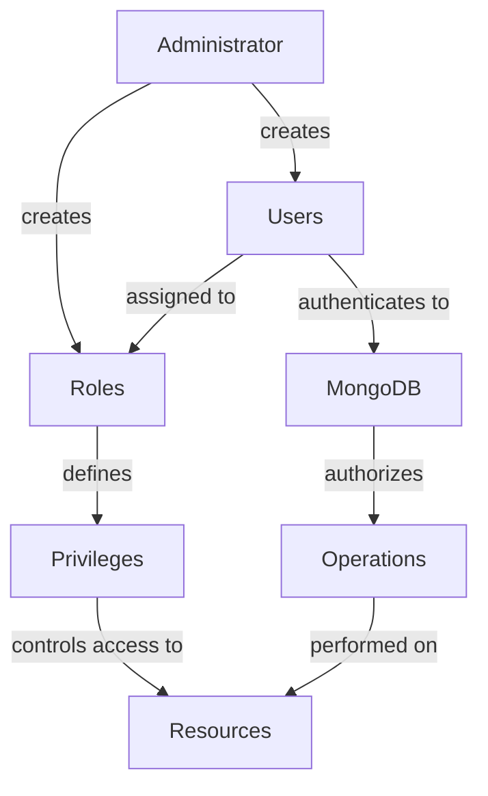

# MongoDB Role-Based Access Control

In MongoDB, securing your data isn't just about protecting it from external threats; it's also about controlling who within your organization can access what data and what operations they can perform. This is where Role-Based Access Control (RBAC) comes in. RBAC allows you to define specific roles with specific permissions and assign these roles to users, giving you fine-grained control over database access.

## Introduction to RBAC in MongoDB

Role-Based Access Control is a security approach that restricts system access to authorized users based on their role within an organization. MongoDB's RBAC implementation allows administrators to:

- Define roles with specific privileges
- Assign roles to users
- Control access to databases, collections, and operations
- Implement the principle of least privilege, ensuring users have only the permissions they need

Let's dive into how MongoDB implements this crucial security feature.

## Enabling Authentication in MongoDB

Before using RBAC, you need to enable authentication in MongoDB. By default, a fresh MongoDB installation has no access control enabled.

### Step 1: Start MongoDB with Access Control

Create an admin user first by starting MongoDB without access control:

```javascript
// Connect to MongoDB
mongosh
```

Then create your admin user:

```javascript
use admin
db.createUser(
  {
    user: "adminUser",
    pwd: "securePassword",
    roles: [ { role: "userAdminAnyDatabase", db: "admin" } ]
  }
)
```

Restart MongoDB with access control enabled:

```bash
mongod --auth
```

Now authentication is required for all connections.

## Understanding MongoDB Roles

MongoDB has built-in roles that provide different levels of access to resources. These roles can be categorized into:

### Database User Roles

- `read`: Read data from all non-system collections
- `readWrite`: Read and modify data in all non-system collections

### Database Administration Roles

- `dbAdmin`: Perform administrative operations
- `userAdmin`: Create and modify users and roles
- `dbOwner`: Perform any administrative action on the database

### Cluster Administration Roles

- `clusterAdmin`: Provides greatest administrative access
- `clusterManager`: Management and monitoring operations
- `clusterMonitor`: Read-only monitoring operations
- `hostManager`: To monitor and manage servers

### Backup and Restoration Roles

- `backup`: Sufficient privileges to back up data
- `restore`: Privileges to restore data from backups

## Creating Custom Roles

While built-in roles cover many common scenarios, you often need to create custom roles for specific requirements.

### Step-by-Step Custom Role Creation

Let's create a custom role that allows a user to read from specific collections but write only to designated collections:

```javascript
use admin
db.createRole(
   {
     role: "readWriteSpecificCollections",
     privileges: [
       { 
         resource: { db: "inventory", collection: "products" }, 
         actions: [ "find" ] 
       },
       { 
         resource: { db: "inventory", collection: "orders" }, 
         actions: [ "find", "insert", "update" ] 
       }
     ],
     roles: []
   }
)
```

This custom role grants:
- Read-only access to the `products` collection
- Read and write access to the `orders` collection
- Both collections are in the `inventory` database

## Creating Users with Specific Roles

Now let's create users and assign roles to them:

### Creating a Read-Only User

```javascript
use admin
db.createUser(
  {
    user: "readOnlyUser",
    pwd: "password123",
    roles: [
      { role: "read", db: "inventory" }
    ]
  }
)
```

### Creating a User with Custom Role

```javascript
use admin
db.createUser(
  {
    user: "orderProcessor",
    pwd: "securePassword456",
    roles: [
      { role: "readWriteSpecificCollections", db: "admin" }
    ]
  }
)
```

### Creating an Admin User

```javascript
use admin
db.createUser(
  {
    user: "dbAdmin",
    pwd: "adminPass789",
    roles: [
      { role: "userAdmin", db: "inventory" },
      { role: "dbAdmin", db: "inventory" }
    ]
  }
)
```

## Managing Roles and Users

Once you've created roles and users, you'll need to know how to manage them effectively.

### Viewing Existing Roles

```javascript
use admin
db.getRoles({ showPrivileges: true })
```

To view a specific role:

```javascript
use admin
db.getRole("readWriteSpecificCollections", { showPrivileges: true })
```

### Viewing Existing Users

```javascript
use admin
db.getUsers()
```

To view a specific user:

```javascript
use admin
db.getUser("orderProcessor")
```

### Modifying User Roles

To add a role to an existing user:

```javascript
use admin
db.grantRolesToUser(
  "orderProcessor",
  [{ role: "read", db: "reporting" }]
)
```

To remove a role:

```javascript
use admin
db.revokeRolesFromUser(
  "orderProcessor",
  [{ role: "read", db: "reporting" }]
)
```

### Updating User Password

```javascript
use admin
db.changeUserPassword("orderProcessor", "newSecurePassword")
```

### Removing a User

```javascript
use admin
db.dropUser("orderProcessor")
```

## Real-World RBAC Implementation Example

Let's implement a comprehensive RBAC system for an e-commerce application. This example demonstrates how roles would be structured in a production environment.

### E-commerce Application Roles

First, let's create database-specific roles:

```javascript
// Create product catalog role
use admin
db.createRole(
   {
     role: "catalogManager",
     privileges: [
       { 
         resource: { db: "ecommerce", collection: "products" }, 
         actions: [ "find", "insert", "update" ] 
       },
       { 
         resource: { db: "ecommerce", collection: "categories" }, 
         actions: [ "find", "insert", "update" ] 
       }
     ],
     roles: []
   }
)

// Create order processing role
db.createRole(
   {
     role: "orderProcessor",
     privileges: [
       { 
         resource: { db: "ecommerce", collection: "orders" }, 
         actions: [ "find", "insert", "update" ] 
       },
       { 
         resource: { db: "ecommerce", collection: "customers" }, 
         actions: [ "find" ] 
       }
     ],
     roles: []
   }
)

// Create customer support role
db.createRole(
   {
     role: "customerSupport",
     privileges: [
       { 
         resource: { db: "ecommerce", collection: "customers" }, 
         actions: [ "find", "update" ] 
       },
       { 
         resource: { db: "ecommerce", collection: "orders" }, 
         actions: [ "find" ] 
       }
     ],
     roles: []
   }
)
```

Now, let's create users for different departments:

```javascript
// Product team member
use admin
db.createUser(
  {
    user: "productManager",
    pwd: "pm@secure123",
    roles: [
      { role: "catalogManager", db: "admin" }
    ]
  }
)

// Order fulfillment team member
db.createUser(
  {
    user: "orderClerk",
    pwd: "oc@secure456",
    roles: [
      { role: "orderProcessor", db: "admin" }
    ]
  }
)

// Customer service representative
db.createUser(
  {
    user: "supportRep",
    pwd: "sr@secure789",
    roles: [
      { role: "customerSupport", db: "admin" }
    ]
  }
)

// Database administrator
db.createUser(
  {
    user: "databaseAdmin",
    pwd: "da@secure000",
    roles: [
      { role: "dbAdmin", db: "ecommerce" },
      { role: "userAdmin", db: "ecommerce" }
    ]
  }
)
```

### Testing Access Control

Let's verify our RBAC implementation by connecting with different users:

Product Manager connection:
```javascript
mongosh -u productManager -p pm@secure123 --authenticationDatabase admin

// This should work
use ecommerce
db.products.find()
db.products.insertOne({name: "New Product", price: 29.99})

// This should fail
db.orders.find()  // Unauthorized
```

Order Clerk connection:
```javascript
mongosh -u orderClerk -p oc@secure456 --authenticationDatabase admin

// This should work
use ecommerce
db.orders.find()
db.customers.find({email: "customer@example.com"})  // Read-only

// This should fail
db.customers.updateOne(
  {_id: ObjectId("60d5ec9af682fbd12a694b32")}, 
  {$set: {name: "Updated Name"}}
)  // Unauthorized
```

## Best Practices for MongoDB RBAC

1. **Follow the Principle of Least Privilege**
   
   Always assign the minimum permissions necessary for users to perform their duties.

2. **Use Built-in Roles When Possible**
   
   MongoDB's built-in roles cover most common use cases and are well-tested.

3. **Separate Administrative Responsibilities**
   
   Divide database administration responsibilities among multiple roles.

4. **Regularly Audit Roles and Permissions**
   
   Periodically review and clean up user roles and permissions.

5. **Use Role Inheritance Wisely**
   
   Build complex roles by inheriting from simpler roles to maintain consistency.

6. **Document Your RBAC Structure**
   
   Keep clear documentation of your role hierarchy and the privileges each role has.

7. **Rotate Credentials Regularly**
   
   Change passwords for database users on a regular schedule.

## RBAC Workflow Visualization

Here's a diagram showing the RBAC workflow in MongoDB:



## Troubleshooting RBAC Issues

### Common Issues and Solutions

1. **Authentication Failed**
   
   ```
   Error: Authentication failed
   ```
   
   Solution: Verify username, password, and authentication database.

2. **Authorization Failed**
   
   ```
   Error: not authorized on [database] to execute command
   ```
   
   Solution: Check if the user has the appropriate role for the operation.

3. **Unable to Create Role**
   
   Solution: Ensure you're authenticated as a user with `userAdmin` role on the target database.

4. **Role Not Taking Effect**
   
   Solution: Roles are evaluated at login time. Log out and log back in after role changes.

## Summary

MongoDB's Role-Based Access Control provides a powerful way to secure your database by ensuring that users have access only to the data and operations they need. By implementing RBAC correctly, you can:

- Protect sensitive data from unauthorized access
- Separate duties according to user roles
- Reduce the risk of accidental or malicious data modifications
- Comply with security regulations and standards

RBAC is a fundamental part of a comprehensive MongoDB security strategy, working alongside other security measures like network isolation, encryption, and auditing to provide defense in depth for your MongoDB deployments.

## Additional Resources and Exercises

### Exercises

1. **Basic Role Creation**
   
   Create a role that allows read access to a `products` collection and read/write access to a `reviews` collection.

2. **User Management**
   
   Create three users with different roles and test their access to various collections.

3. **Role Hierarchy**
   
   Design a role hierarchy for a social media application with users, posts, comments, and admin functionality.

### Further Learning Resources

- [MongoDB Security Documentation](https://www.mongodb.com/docs/manual/security/)
- [MongoDB University Security Course](https://university.mongodb.com/)
- [MongoDB Role-Based Access Control Webinar](https://www.mongodb.com/presentations)

Remember that proper security configuration is critical for production MongoDB deployments. Always test your RBAC implementation thoroughly and seek expert guidance for complex security requirements.