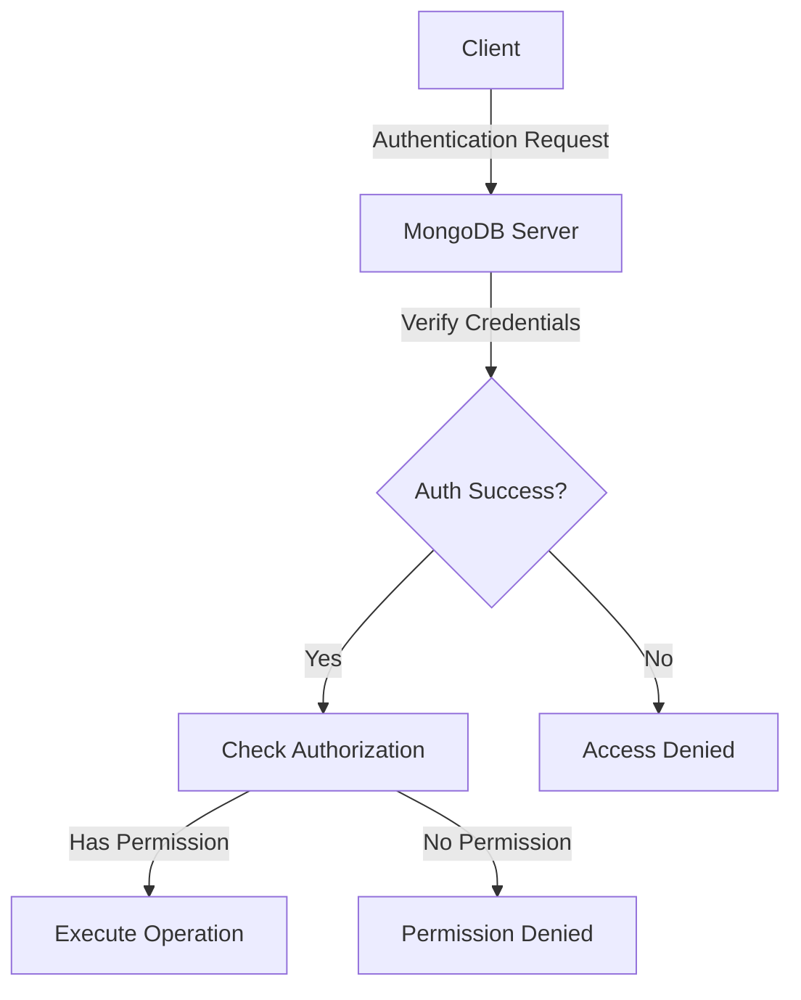

# MongoDB User Management

## Introduction

User management is a crucial aspect of MongoDB security that allows you to control who can access your database and what actions they can perform. Proper user management helps prevent unauthorized access, data breaches, and ensures that users only have the permissions necessary for their specific tasks.

In this guide, we'll explore MongoDB's user management capabilities including creating users, assigning roles, authentication mechanisms, and best practices to maintain a secure database environment. By the end of this tutorial, you'll have a solid foundation in setting up and managing users in MongoDB.

## Prerequisites

Before diving into MongoDB user management, make sure you have:

- MongoDB installed (version 4.0 or later recommended)
- Basic understanding of MongoDB concepts
- Access to a MongoDB shell (`mongosh`)

## Understanding MongoDB Authentication

Authentication in MongoDB verifies the identity of a client attempting to connect to your database. By default, MongoDB starts without authentication enabled, which means anyone with network access to your database can connect and perform operations. This is convenient for development but extremely unsafe for production environments.

## Enabling Authentication

Before creating users, let's first enable authentication in MongoDB:

1. Start MongoDB with authentication by adding the following to your MongoDB configuration file (`mongod.conf`):

```yaml
security:
  authorization: enabled
```

2. Restart your MongoDB server to apply the changes:

```bash
sudo systemctl restart mongod
```

## Creating Your First User Administrator

Before you can create regular users, you need to create a user administrator who has privileges to manage other users.

Connect to MongoDB without authentication for this initial setup:

```bash
mongosh
```

Create the admin user:

```javascript
use admin
db.createUser({
  user: "adminUser",
  pwd: "securePassword123",
  roles: [{ role: "userAdminAnyDatabase", db: "admin" }]
})
```

Output:
```
{
  ok: 1,
  ...
}
```

After creating the admin user, exit and reconnect with authentication:

```bash
mongosh -u adminUser -p securePassword123 --authenticationDatabase admin
```

## Understanding MongoDB Roles

MongoDB uses a role-based access control (RBAC) system. Roles define what actions a user can perform and on which databases.

### Built-in Roles

MongoDB provides several built-in roles:

1. **Database User Roles**:
   - `read`: Read-only access to specified database
   - `readWrite`: Read and write access to specified database

2. **Database Administration Roles**:
   - `dbAdmin`: Administrative tasks without data access
   - `dbOwner`: Combines `readWrite`, `dbAdmin`, and `userAdmin` roles

3. **Cluster Administration Roles**:
   - `clusterAdmin`: Highest cluster management access
   - `clusterManager`: Management and monitoring operations
   - `clusterMonitor`: Read-only monitoring access

4. **Backup and Restoration Roles**:
   - `backup`: Ability to backup data
   - `restore`: Ability to restore data

5. **User Administration Roles**:
   - `userAdmin`: Create and modify users and roles on specific database

6. **Super User Roles**:
   - `root`: Access to all operations on all resources

## Creating Different Types of Users

### Creating a Regular Database User

Let's create a user with read and write access to a specific database:

```javascript
use myApplication
db.createUser({
  user: "appUser",
  pwd: "app123secure",
  roles: [{ role: "readWrite", db: "myApplication" }]
})
```

Output:
```
{
  ok: 1,
  ...
}
```

### Creating a Read-Only User

```javascript
use reporting
db.createUser({
  user: "reportUser",
  pwd: "report456secure",
  roles: [{ role: "read", db: "reporting" }]
})
```

### Creating a User with Multiple Database Access

```javascript
use admin
db.createUser({
  user: "devUser",
  pwd: "dev789secure",
  roles: [
    { role: "readWrite", db: "development" },
    { role: "read", db: "testing" }
  ]
})
```

## Managing Existing Users

### Viewing Users

To view all users in a database:

```javascript
use myApplication
db.getUsers()
```

Output:
```
{
  users: [
    {
      _id: 'myApplication.appUser',
      userId: UUID('...'),
      user: 'appUser',
      db: 'myApplication',
      roles: [ { role: 'readWrite', db: 'myApplication' } ],
      mechanisms: [ 'SCRAM-SHA-1', 'SCRAM-SHA-256' ]
    }
  ],
  ok: 1
}
```

### Updating User Roles

To grant additional roles to an existing user:

```javascript
use admin
db.grantRolesToUser("devUser", [{ role: "readWrite", db: "testing" }])
```

To revoke roles:

```javascript
use admin
db.revokeRolesFromUser("devUser", [{ role: "readWrite", db: "development" }])
```

### Changing User Password

```javascript
use admin
db.changeUserPassword("appUser", "newSecurePassword456")
```

### Removing a User

```javascript
use myApplication
db.dropUser("reportUser")
```

## Creating Custom Roles

Sometimes the built-in roles don't match your requirements. MongoDB allows you to create custom roles:

```javascript
use admin
db.createRole({
  role: "analyticsRole",
  privileges: [
    { 
      resource: { db: "reporting", collection: "metrics" }, 
      actions: ["find", "update"] 
    }
  ],
  roles: [
    { role: "read", db: "reporting" }
  ]
})
```

Now you can assign this custom role to users:

```javascript
use admin
db.createUser({
  user: "analyticsUser",
  pwd: "analytics123secure",
  roles: [{ role: "analyticsRole", db: "admin" }]
})
```

## Authentication Mechanisms

MongoDB supports several authentication mechanisms:

1. **SCRAM (Default)**: Secure, challenge-response authentication mechanism
2. **X.509 Certificate Authentication**: Uses SSL/TLS certificates for authentication
3. **LDAP Authentication**: Enterprise feature that integrates with LDAP servers
4. **Kerberos Authentication**: Enterprise feature for Kerberos integration

### Using SCRAM Authentication (Default)

SCRAM (Salted Challenge Response Authentication Mechanism) is the default authentication method. Users created as shown earlier automatically use SCRAM.

### Using X.509 Certificate Authentication

For certificate-based authentication, first set up TLS/SSL for your MongoDB deployment, then create a user with the X.509 authentication mechanism:

```javascript
use $external
db.createUser({
  user: "CN=myClient,OU=myOrgUnit,O=myOrg,L=myLocality,ST=myState,C=myCountry",
  roles: [
    { role: "readWrite", db: "myApplication" }
  ]
})
```

Connect using the certificate:

```bash
mongosh --tls --tlsCertificateKeyFile client.pem --tlsCAFile ca.pem
```

## Real-World Examples

### Example 1: Setting Up Users for a Web Application

For a typical web application, you might create these users:

```javascript
// Admin user for overall management
use admin
db.createUser({
  user: "dbAdmin",
  pwd: "superSecureAdminPass123",
  roles: [
    { role: "userAdminAnyDatabase", db: "admin" },
    { role: "dbAdminAnyDatabase", db: "admin" },
    { role: "readWriteAnyDatabase", db: "admin" }
  ]
})

// Application service user with limited access
use productionApp
db.createUser({
  user: "appServiceUser",
  pwd: "serviceUserPass456",
  roles: [{ role: "readWrite", db: "productionApp" }]
})

// Read-only user for reporting
use productionApp
db.createUser({
  user: "reportingService",
  pwd: "reportingPass789",
  roles: [{ role: "read", db: "productionApp" }]
})
```

### Example 2: Database Migration Script

When setting up automation for database migrations:

```javascript
// Create a migration user with temporary elevated privileges
use admin
db.createUser({
  user: "migrationUser",
  pwd: "tempMigrationPass",
  roles: [
    { role: "readWrite", db: "productionApp" },
    { role: "dbAdmin", db: "productionApp" }
  ],
  // Optional: Set a TTL for this user account
  authenticationRestrictions: [
    {
      clientSource: ["192.168.1.0/24"],  // Restrict from which IP range this user can connect
      serverAddress: ["192.168.1.100"]   // Restrict to which server address this user can connect
    }
  ]
})
```

After migration:

```javascript
use admin
db.dropUser("migrationUser")
```

## Best Practices for MongoDB User Management

1. **Use the Principle of Least Privilege**:
   Grant users only the permissions they need to perform their tasks.

2. **Never Use the Root User for Applications**:
   Create specific users for each application with limited roles.

3. **Use Strong Passwords**:
   Implement a strong password policy, using long and complex passwords.

4. **Regularly Audit User Access**:
   Periodically review user accounts and their roles.

5. **Remove Unused Users**:
   Delete users that are no longer needed.

6. **Implement Role Separation**:
   Separate database administration from application access.

7. **Use Authentication Restrictions**:
   Limit from which IP addresses users can connect.

8. **Rotate Credentials**:
   Change passwords regularly, especially for privileged accounts.

9. **Use Environment Variables**:
   Store connection strings and credentials in environment variables, not in code.

10. **Monitor Authentication Attempts**:
    Track failed login attempts and suspicious activities.

## Common Issues and Troubleshooting

### Authentication Failed

If you get authentication errors:

1. Verify the username and password are correct
2. Make sure you're connecting to the correct authentication database:

```javascript
// Wrong way
mongosh -u appUser -p app123secure

// Correct way - specify the authentication database
mongosh -u appUser -p app123secure --authenticationDatabase myApplication
```

### Access Denied Errors

If a user has authentication but gets an "access denied" error:

1. Check the user's roles:
```javascript
use admin
db.getUser("appUser")
```

2. Grant necessary roles if missing:
```javascript
use admin
db.grantRolesToUser("appUser", [{ role: "readWrite", db: "newDatabase" }])
```

## Visualizing User Access Flow



## Summary

MongoDB's user management system provides robust controls for securing your database. By creating appropriate users with specific roles, you can ensure that every user has just the right amount of access required for their tasks.

Key concepts we've covered:
- Enabling authentication in MongoDB
- Creating and managing users with different roles
- Understanding built-in roles and creating custom roles
- Authentication mechanisms
- Best practices for user management
- Troubleshooting common issues

Implementing proper user management is a fundamental step in securing your MongoDB deployment. When combined with other security measures like encryption and network security, it forms a comprehensive security strategy for your data.

## Additional Resources

- [MongoDB Security Documentation](https://www.mongodb.com/docs/manual/security/)
- [MongoDB Authentication Mechanisms](https://www.mongodb.com/docs/manual/core/authentication/)
- [MongoDB Role-Based Access Control](https://www.mongodb.com/docs/manual/core/authorization/)

## Exercises

1. Create a user with read-only access to a `customers` database but read-write access to a `products` database.
2. Create a custom role that allows a user to insert and find documents, but not update or delete them.
3. Set up a database administrator user with full access to a specific database but no access to other databases.
4. Create a user with time-limited credentials that expire after 7 days.
5. Implement IP-based restrictions on a user account that can only connect from specific IP addresses.