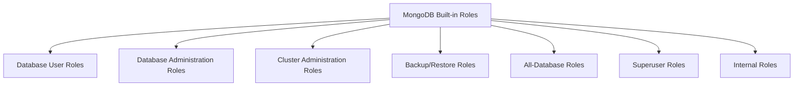

# MongoDB Built-in Roles

## Introduction

In any database system, properly controlling who can access what data is crucial for security. MongoDB provides a robust role-based access control (RBAC) system that allows you to define precisely what actions users can perform on specific databases and collections.

MongoDB's built-in roles provide predefined sets of privileges that can be assigned to users. These roles range from highly permissive administrative roles to tightly scoped roles for specific tasks. Understanding these roles is essential for implementing proper security practices in your MongoDB deployments.

In this tutorial, we'll explore MongoDB's built-in roles, learn how they work, and see how to use them effectively in real-world scenarios.

## Role-Based Access Control Basics

Before diving into specific roles, let's understand the core concepts of MongoDB's authorization model:

- **Users**: Entities that can authenticate and connect to the database
- **Roles**: Collections of privileges that can be assigned to users
- **Privileges**: Permissions to perform specific actions on specific resources
- **Resources**: Databases, collections, or clusters that actions can be performed on

This hierarchical structure allows for precise control over who can do what in your MongoDB environment.

## Types of Built-in Roles

MongoDB organizes its built-in roles into several categories:



Let's explore each category and the specific roles they contain.

### Database User Roles

These roles provide access to read and write data in specific databases.

| Role | Description |
|------|-------------|
| `read` | Read data from any non-system collection in the database |
| `readWrite` | Read and write data to any non-system collection in the database |

### Database Administration Roles

These roles provide administrative capabilities for specific databases.

| Role | Description |
|------|-------------|
| `dbAdmin` | Perform administrative tasks like schema-related operations, indexing, and statistics collection |
| `dbOwner` | Combines `readWrite`, `dbAdmin`, and `userAdmin` privileges |
| `userAdmin` | Create and modify users and roles in the database |

### Cluster Administration Roles

These roles provide administrative capabilities across the entire MongoDB deployment.

| Role | Description |
|------|-------------|
| `clusterAdmin` | Highest cluster management role, combining `clusterManager`, `clusterMonitor`, and `hostManager` |
| `clusterManager` | Manage and monitor the cluster (e.g., add/remove shards) |
| `clusterMonitor` | Read-only access to monitoring tools |
| `hostManager` | Monitor and manage servers |

### Backup and Restore Roles

These roles are specialized for backup and recovery operations.

| Role | Description |
|------|-------------|
| `backup` | Sufficient privileges to use MongoDB's backup tools |
| `restore` | Privileges needed to restore data from backups |

### All-Database Roles

These roles apply the same privileges across all databases in a deployment.

| Role | Description |
|------|-------------|
| `readAnyDatabase` | `read` privilege on all databases |
| `readWriteAnyDatabase` | `readWrite` privilege on all databases |
| `userAdminAnyDatabase` | `userAdmin` privilege on all databases |
| `dbAdminAnyDatabase` | `dbAdmin` privilege on all databases |

### Superuser Roles

These roles provide unrestricted access to the database.

| Role | Description |
|------|-------------|
| `root` | Combined access of `readWriteAnyDatabase`, `userAdminAnyDatabase`, `dbAdminAnyDatabase`, and `clusterAdmin` |

## Using Built-in Roles

Let's see how to work with these roles in practice.

### Viewing Available Roles

To see all available roles in MongoDB, you can run:

```javascript
db.getRoles({ showBuiltinRoles: true })
```

This command returns a list of all roles, including built-in ones.

### Creating a User with a Built-in Role

Here's how to create a new user with the `read` role on a specific database:

```javascript
use mydatabase
db.createUser({
  user: "readOnlyUser",
  pwd: "securePassword123",
  roles: [
    { role: "read", db: "mydatabase" }
  ]
})
```

Output:
```
Successfully added user: {
  "user" : "readOnlyUser",
  "roles" : [
    {
      "role" : "read",
      "db" : "mydatabase"
    }
  ]
}
```

### Assigning Multiple Roles to a User

Users often need different levels of access to different databases. Here's how to assign multiple roles:

```javascript
use admin
db.createUser({
  user: "dbManager",
  pwd: "manager123!",
  roles: [
    { role: "readWrite", db: "products" },
    { role: "read", db: "analytics" },
    { role: "dbAdmin", db: "products" }
  ]
})
```

This creates a user who can:
- Read and write data in the "products" database
- Only read data from the "analytics" database
- Perform administrative tasks on the "products" database

### Creating a Database Administrator

A database administrator typically needs to manage a specific database but not necessarily manipulate data:

```javascript
use admin
db.createUser({
  user: "dbAdministrator",
  pwd: "admin456!",
  roles: [{ role: "dbAdmin", db: "inventory" }]
})
```

### Creating a Superuser (Use with Caution)

For administrative purposes, you might need a superuser with full access:

```javascript
use admin
db.createUser({
  user: "superAdmin",
  pwd: "superSecurePassword789!",
  roles: [{ role: "root", db: "admin" }]
})
```

⚠️ **Warning:** The `root` role provides unrestricted access and should be used sparingly and with great caution.

## Real-World Scenarios

Let's explore some common scenarios and the appropriate roles to use.

### Scenario 1: Development Team Access

For a development team working on an e-commerce application:

```javascript
use admin
db.createUser({
  user: "devTeam",
  pwd: "dev2023!",
  roles: [
    { role: "readWrite", db: "ecommerce_dev" },
    { role: "read", db: "ecommerce_test" }
  ]
})
```

This gives the development team:
- Full read/write access to the development database
- Read-only access to the test database (to prevent accidental changes)

### Scenario 2: Data Analyst Access

For a data analyst who needs to query multiple databases but should not modify data:

```javascript
use admin
db.createUser({
  user: "analyst",
  pwd: "analysis2023!",
  roles: [
    { role: "read", db: "sales" },
    { role: "read", db: "marketing" },
    { role: "read", db: "customers" }
  ]
})
```

### Scenario 3: Backup Operations

For automated backup processes:

```javascript
use admin
db.createUser({
  user: "backupService",
  pwd: "backup2023!",
  roles: [{ role: "backup", db: "admin" }]
})
```

This user can perform backup operations on all databases without having full administrative access.

### Scenario 4: Database Monitoring

For a monitoring service that needs to collect metrics but not modify anything:

```javascript
use admin
db.createUser({
  user: "monitoring",
  pwd: "monitor2023!",
  roles: [{ role: "clusterMonitor", db: "admin" }]
})
```

## Best Practices

1. **Follow the principle of least privilege**: Always assign the minimum privileges necessary for a user to perform their tasks.

2. **Use specific database roles**: When possible, assign roles on specific databases rather than using the "AnyDatabase" versions.

3. **Separate user accounts**: Create separate accounts for different team members or services instead of sharing credentials.

4. **Regularly audit roles**: Periodically review the roles assigned to users to ensure they still align with job responsibilities.

5. **Consider custom roles**: If built-in roles don't match your needs exactly, create custom roles (a topic for another tutorial).

6. **Never use root in production applications**: The `root` role should be reserved for administrative tasks, not application connections.

## Checking a User's Roles

To verify what roles a user has, you can use:

```javascript
db.getUser("username")
```

Example output:
```javascript
{
  "_id" : "admin.dbAdministrator",
  "userId" : UUID("2e937a9c-7e4e-468b-b9c2-ebca42dab5b5"),
  "user" : "dbAdministrator",
  "db" : "admin",
  "roles" : [
    {
      "role" : "dbAdmin",
      "db" : "inventory"
    }
  ],
  "mechanisms" : [
    "SCRAM-SHA-1",
    "SCRAM-SHA-256"
  ]
}
```

## Revoking Roles

To remove a role from a user:

```javascript
use admin
db.revokeRolesFromUser(
  "analyst",
  [{ role: "read", db: "marketing" }]
)
```

This removes the `read` role on the "marketing" database from the "analyst" user, while preserving their other roles.

## Summary

MongoDB's built-in roles provide a comprehensive framework for implementing access control in your database deployments. By understanding these roles and following best practices, you can ensure that users have the permissions they need while maintaining the security of your data.

Key points to remember:
- MongoDB uses role-based access control for authorization
- Built-in roles cover common use cases from read-only access to full administrative control
- Roles can be assigned at database-specific or cluster-wide levels
- Following the principle of least privilege helps enhance security

## Additional Resources

To deepen your understanding of MongoDB security, consider exploring:

1. Custom roles and privileges in MongoDB
2. Authentication mechanisms in MongoDB
3. Encryption options for data at rest and in transit
4. Security audit logging
5. Enterprise security features like LDAP and Kerberos integration

## Practice Exercises

1. Create a user with read-only access to a collection within a database (hint: you'll need to use custom roles for this).
2. Set up a user who can manage users on one database but only has read access to the data.
3. Create a role structure for a three-tier application with separate roles for the API server, analytics system, and administrative interface.

By mastering MongoDB's built-in roles, you'll be better equipped to implement proper security measures in your database systems, ensuring data remains protected while still accessible to those who need it.