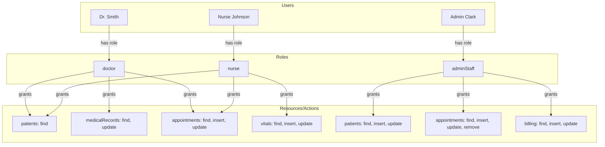

# MongoDB Custom Roles

## Introduction

Security is a crucial aspect of any database system, and MongoDB provides robust mechanisms to protect your data. One of the most powerful features in MongoDB's security model is the ability to create custom roles that precisely define what operations users can perform on specific resources.

Custom roles allow you to implement the principle of least privilege, ensuring that users have only the permissions they need to perform their jobs—no more, no less. This approach minimizes the risk of unauthorized data access or accidental modifications.

In this tutorial, we'll explore how to create and manage custom roles in MongoDB, providing fine-grained access control tailored to your specific application requirements.

## Understanding MongoDB's Role-Based Access Control

Before diving into custom roles, let's understand MongoDB's security model:

1. **Authentication**: Verifies the identity of a user
2. **Authorization**: Determines what operations an authenticated user can perform
3. **Role-Based Access Control (RBAC)**: Assigns privileges to roles, which are then assigned to users

MongoDB comes with built-in roles like `read`, `readWrite`, and `dbAdmin`, but these might be too broad for certain use cases. This is where custom roles become invaluable.

## Prerequisites

To follow this tutorial, you need:

- MongoDB 4.0 or newer
- A user with `userAdmin` or `userAdminAnyDatabase` role
- Basic understanding of MongoDB operations

## Creating Your First Custom Role

Let's start by creating a simple custom role that allows a user to read from one collection and write to another within the same database.

```javascript
// Connect to MongoDB as an admin user
use admin

// Create a custom role that can read from 'products' and write to 'orders' in 'ecommerce' database
db.createRole(
    {
        role: "orderProcessor",
        privileges: [
            {
                resource: { db: "ecommerce", collection: "products" },
                actions: [ "find" ]
            },
            {
                resource: { db: "ecommerce", collection: "orders" },
                actions: [ "find", "insert", "update" ]
            }
        ],
        roles: []
    }
)
```

The output will look something like:

```
{
  "role" : "orderProcessor",
  "ok" : 1
}
```

### Breaking Down The Role Definition

Let's analyze the components of our custom role:

1. **role**: The name of the custom role
2. **privileges**: An array of privilege documents
   - **resource**: Specifies the database and collection the privilege applies to
   - **actions**: Lists the operations allowed on the resource
3. **roles**: Array of other roles from which this role inherits privileges (empty in this example)

## Available Actions

MongoDB provides numerous actions that can be assigned to roles. Here are some common ones:

| Action Category | Examples |
|----------------|----------|
| Query and Write | `find`, `insert`, `update`, `remove` |
| Database Management | `createCollection`, `dropCollection`, `createIndex` |
| Deployment Management | `serverStatus`, `replSetGetStatus` |
| User Management | `createUser`, `dropUser`, `grantRole` |

For a complete list, refer to the [MongoDB documentation on privilege actions](https://www.mongodb.com/docs/manual/reference/privilege-actions/).

## Resource Specification

The resource document defines the scope of the privilege. You can specify:

```javascript
{ db: "dbName", collection: "collectionName" } // Specific collection in a database
{ db: "dbName", collection: "" }                // All collections in a database
{ cluster: true }                               // Cluster-wide operations
{ anyResource: true }                           // All resources
```

## Inheriting from Existing Roles

You can build complex roles by inheriting from existing ones:

```javascript
// Create a reporting role that inherits read access and adds custom actions
db.createRole(
    {
        role: "reportingAnalyst",
        privileges: [
            {
                resource: { db: "analytics", collection: "reports" },
                actions: [ "insert", "update" ]
            }
        ],
        roles: [
            { role: "read", db: "analytics" }
        ]
    }
)
```

This role inherits all privileges of the `read` role on the `analytics` database and adds the ability to insert and update documents in the `reports` collection.

## Database-Specific vs. Admin Database Roles

Roles can be created in two contexts:

1. **Admin Database**: Roles defined in the `admin` database can include privileges on any database
2. **Specific Database**: Roles defined in other databases can include privileges only on the same database

Here's how to create a role in a specific database:

```javascript
// Switch to the ecommerce database
use ecommerce

// Create a role specific to this database
db.createRole(
    {
        role: "inventoryManager",
        privileges: [
            {
                resource: { db: "ecommerce", collection: "products" },
                actions: [ "find", "update" ]
            }
        ],
        roles: []
    }
)
```

## Practical Example: E-commerce Platform Roles

Let's implement custom roles for an e-commerce platform with distinct user responsibilities:

```javascript
// Connect to admin database
use admin

// Customer Support Role
db.createRole(
    {
        role: "customerSupportRep",
        privileges: [
            {
                resource: { db: "ecommerce", collection: "customers" },
                actions: [ "find" ]
            },
            {
                resource: { db: "ecommerce", collection: "orders" },
                actions: [ "find" ]
            },
            {
                resource: { db: "ecommerce", collection: "support_tickets" },
                actions: [ "find", "insert", "update" ]
            }
        ],
        roles: []
    }
)

// Inventory Manager Role
db.createRole(
    {
        role: "inventoryManager",
        privileges: [
            {
                resource: { db: "ecommerce", collection: "products" },
                actions: [ "find", "insert", "update" ]
            },
            {
                resource: { db: "ecommerce", collection: "inventory" },
                actions: [ "find", "insert", "update" ]
            },
            {
                resource: { db: "ecommerce", collection: "suppliers" },
                actions: [ "find" ]
            }
        ],
        roles: []
    }
)

// Sales Analyst Role (with inheritance)
db.createRole(
    {
        role: "salesAnalyst",
        privileges: [
            {
                resource: { db: "ecommerce", collection: "sales_reports" },
                actions: [ "insert", "update" ]
            }
        ],
        roles: [
            { role: "read", db: "ecommerce" }
        ]
    }
)
```

Now, let's assign these roles to users:

```javascript
// Create users with custom roles
db.createUser(
    {
        user: "sarah",
        pwd: "secure_password_here",
        roles: [ { role: "customerSupportRep", db: "admin" } ]
    }
)

db.createUser(
    {
        user: "mike",
        pwd: "different_secure_password",
        roles: [ { role: "inventoryManager", db: "admin" } ]
    }
)

db.createUser(
    {
        user: "ana",
        pwd: "another_secure_password",
        roles: [ { role: "salesAnalyst", db: "admin" } ]
    }
)
```

## Managing Custom Roles

### Viewing Roles

To see all roles in a database:

```javascript
use admin
db.getRoles()
```

For detailed information about a specific role:

```javascript
db.getRole("orderProcessor")
```

### Modifying Roles

You can update an existing role using `updateRole`:

```javascript
db.updateRole(
    "orderProcessor",
    {
        privileges: [
            {
                resource: { db: "ecommerce", collection: "products" },
                actions: [ "find" ]
            },
            {
                resource: { db: "ecommerce", collection: "orders" },
                actions: [ "find", "insert", "update", "remove" ] // Added 'remove' action
            }
        ],
        roles: []
    }
)
```

### Removing Roles

To delete a role:

```javascript
db.dropRole("roleToDelete")
```

## Role Granularity: Action-specific Privileges

MongoDB allows you to define highly specific privileges. For example, you might want to allow a user to update certain fields but not others:

```javascript
// Create a role that can only update product price and stock
db.createRole(
    {
        role: "priceUpdater",
        privileges: [
            {
                resource: { db: "ecommerce", collection: "products" },
                actions: [ "find" ]
            },
            {
                resource: { db: "ecommerce", collection: "products" },
                actions: [ "update" ],
                restrictionType: "fieldAllowed",
                restrictionFields: [ "price", "stock" ]
            }
        ],
        roles: []
    }
)
```

:::caution
Field-level restrictions are only available in MongoDB Enterprise Edition or MongoDB Atlas.
:::

## Role Security Best Practices

1. **Follow the principle of least privilege**: Assign only the permissions that are absolutely necessary
2. **Use role inheritance wisely**: Build roles hierarchically to simplify management
3. **Audit role assignments regularly**: Review who has access to what
4. **Document your role structure**: Maintain documentation of what each role is for
5. **Consider separation of duties**: Critical operations may require multiple roles
6. **Avoid direct resource privileges when possible**: Use role inheritance from built-in roles

## Real-World Example: Healthcare Application

Let's create a comprehensive role structure for a healthcare application:

```javascript
// Connect to admin database
use admin

// Doctor role - can read patient records and update medical notes
db.createRole(
    {
        role: "doctor",
        privileges: [
            {
                resource: { db: "healthcare", collection: "patients" },
                actions: [ "find" ]
            },
            {
                resource: { db: "healthcare", collection: "medicalRecords" },
                actions: [ "find", "update" ]
            },
            {
                resource: { db: "healthcare", collection: "appointments" },
                actions: [ "find", "insert", "update" ]
            }
        ],
        roles: []
    }
)

// Nurse role - can read patient records and update vitals
db.createRole(
    {
        role: "nurse",
        privileges: [
            {
                resource: { db: "healthcare", collection: "patients" },
                actions: [ "find" ]
            },
            {
                resource: { db: "healthcare", collection: "medicalRecords" },
                actions: [ "find" ]
            },
            {
                resource: { db: "healthcare", collection: "vitals" },
                actions: [ "find", "insert", "update" ]
            },
            {
                resource: { db: "healthcare", collection: "appointments" },
                actions: [ "find" ]
            }
        ],
        roles: []
    }
)

// Admin staff - can manage patient records and billing
db.createRole(
    {
        role: "adminStaff",
        privileges: [
            {
                resource: { db: "healthcare", collection: "patients" },
                actions: [ "find", "insert", "update" ]
            },
            {
                resource: { db: "healthcare", collection: "appointments" },
                actions: [ "find", "insert", "update", "remove" ]
            },
            {
                resource: { db: "healthcare", collection: "billing" },
                actions: [ "find", "insert", "update" ]
            }
        ],
        roles: []
    }
)
```

## Visualizing Role Relationships

The following diagram shows the relationship between users, roles, and privileges in our healthcare example:



## Troubleshooting Role Issues

### Common Problems and Solutions

1. **User can't perform an expected action**
   - Check if the role has the correct privileges
   - Ensure the user is assigned to the role
   - Verify the role is in the correct database

2. **Permission errors despite correct role assignment**
   - Remember that roles are additive; a user might have conflicting roles
   - Check if there are any restriction conditions that might be limiting access

3. **Role creation fails**
   - Ensure you have the `userAdmin` role on the relevant database
   - Verify syntax in your role creation command

To see what actions a user can perform, use:

```javascript
db.runCommand({ rolesInfo: "roleToCheck", showPrivileges: true })
```

## Summary

MongoDB custom roles provide a flexible and powerful way to implement fine-grained access control in your database. By creating specific roles tailored to your application's needs, you can enforce the principle of least privilege and enhance your overall security posture.

In this tutorial, we've covered:

- Creating basic custom roles with specific privileges
- Managing roles through viewing, updating, and deleting
- Implementing role inheritance for complex permission structures
- Practical examples for e-commerce and healthcare applications
- Best practices for role management and security

By utilizing custom roles effectively, you can ensure that users have exactly the permissions they need to perform their jobs—nothing more, nothing less—resulting in a more secure MongoDB deployment.

## Additional Resources

- [MongoDB Documentation on Role-Based Access Control](https://www.mongodb.com/docs/manual/core/authorization/)
- [MongoDB Privilege Actions Reference](https://www.mongodb.com/docs/manual/reference/privilege-actions/)
- [MongoDB Built-in Roles](https://www.mongodb.com/docs/manual/reference/built-in-roles/)

## Exercises

1. Create a custom role for a blog platform that allows blog authors to manage only their own posts.
2. Implement a set of roles for a financial application with strict separation of duties.
3. Create a role hierarchy for a multi-tenant application where tenant data must be isolated.
4. Build a custom role that allows read access to all collections except those with sensitive information.
5. Design a role structure for a team of database administrators with different levels of responsibility.