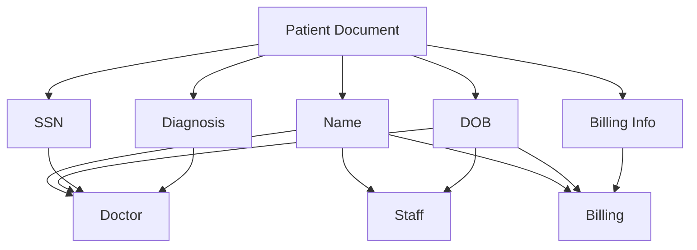

# MongoDB Field Level Security

## Introduction

Field Level Security (FLS) in MongoDB allows you to control which users can access specific fields within documents. Unlike document-level security, which restricts access to entire documents, field-level security provides more granular control, allowing you to hide sensitive fields from certain users while making other fields accessible.

This is particularly useful when:
- Different user roles need different views of the same data
- Some fields contain sensitive information (like personal data or financial details)
- You need to comply with data privacy regulations like GDPR or HIPAA

In this tutorial, we'll explore how to implement field-level security in MongoDB using various approaches.

## Prerequisites

Before diving into field-level security, ensure you have:

- MongoDB Enterprise Server 3.2 or later (for built-in field-level redaction)
- Basic understanding of MongoDB's Role-Based Access Control (RBAC)
- MongoDB Compass or mongo shell for testing

## Understanding Field-Level Security Approaches

MongoDB offers several ways to implement field-level security:

1. **Schema-Based Approach**: Using different schemas or collections for different access levels
2. **View-Based Approach**: Creating views that project only certain fields
3. **Role-Based Field-Level Redaction**: Using the `$redact` operator with role-based restrictions
4. **Application-Level Security**: Implementing field restrictions in your application code

Let's explore each approach with practical examples.

## 1. View-Based Field-Level Security

MongoDB views allow you to create virtual collections with specific projections of documents. This is one of the simplest ways to implement field-level security.

### Creating a Secured View

Imagine we have a `patients` collection with medical records:

```javascript
// Sample document in patients collection
{
  "_id": ObjectId("5f8d7c0f9b8a3e2d6c1a4b5e"),
  "patientId": "PT12345",
  "name": "John Doe",
  "dob": "1980-05-15",
  "ssn": "123-45-6789",
  "diagnosis": "Hypertension",
  "medication": "Lisinopril",
  "billingInfo": {
    "insurance": "Blue Cross",
    "policyNumber": "POL987654321",
    "paymentMethod": "Credit Card"
  }
}
```

Now, we can create different views for different roles:

```javascript
// View for doctors (no billing info)
db.createView(
  "patientsForDoctors",
  "patients",
  [
    { 
      $project: { 
        patientId: 1, 
        name: 1, 
        dob: 1, 
        diagnosis: 1, 
        medication: 1,
        ssn: 1 
      } 
    }
  ]
)

// View for front desk staff (no SSN or diagnosis details)
db.createView(
  "patientsForStaff",
  "patients",
  [
    { 
      $project: { 
        patientId: 1, 
        name: 1, 
        dob: 1,
        billingInfo: 1 
      } 
    }
  ]
)
```

### Configuring Access to Views

After creating the views, we need to assign appropriate permissions to different roles:

```javascript
// Create roles
db.createRole({
  role: "doctorRole",
  privileges: [
    { 
      resource: { db: "hospital", collection: "patientsForDoctors" }, 
      actions: ["find"] 
    }
  ],
  roles: []
})

db.createRole({
  role: "staffRole",
  privileges: [
    { 
      resource: { db: "hospital", collection: "patientsForStaff" }, 
      actions: ["find"] 
    }
  ],
  roles: []
})
```

Now, doctors can only access fields through the `patientsForDoctors` view, and staff can only access fields through the `patientsForStaff` view.

## 2. Role-Based Field-Level Redaction

For more dynamic field-level security, MongoDB Enterprise offers the `$redact` operator, which can be used with the `$cond` operator to check user roles at query time.

### Setting Up Role-Based Redaction

First, let's create a user with specific roles:

```javascript
db.createUser({
  user: "doctor",
  pwd: "securePassword",
  roles: [
    { role: "doctorRole", db: "hospital" }
  ]
})
```

Now we can apply redaction based on roles:

```javascript
// When a doctor queries the collection
db.patients.aggregate([
  {
    $redact: {
      $cond: {
        if: { $in: ["doctorRole", "$$USER_ROLES"] },
        then: "$$DESCEND",
        else: "$$PRUNE"
      }
    }
  }
])
```

This approach requires you to tag each document or field with the roles that are allowed to access it.

## 3. Application-Level Field Security

For more flexibility, you can implement field-level security at the application level.

### Example in Node.js with Mongoose

```javascript
// Define the patient schema with field-level access control
const patientSchema = new mongoose.Schema({
  patientId: String,
  name: String,
  dob: String,
  ssn: {
    type: String,
    access: 'restricted'
  },
  diagnosis: {
    type: String,
    access: 'medical-staff'
  },
  medication: String,
  billingInfo: {
    type: Object,
    access: 'billing-staff'
  }
});

// Add a method to filter fields based on user role
patientSchema.methods.toJSON = function() {
  const obj = this.toObject();
  const userRole = getCurrentUserRole(); // This function would get the role from your auth system
  
  // Remove fields based on user role
  if (userRole !== 'medical-staff' && userRole !== 'admin') {
    delete obj.diagnosis;
  }
  
  if (userRole !== 'billing-staff' && userRole !== 'admin') {
    delete obj.billingInfo;
  }
  
  if (userRole !== 'doctor' && userRole !== 'admin') {
    delete obj.ssn;
  }
  
  return obj;
};

const Patient = mongoose.model('Patient', patientSchema);
```

With this approach, the fields returned will depend on the user's role, and sensitive information will be automatically filtered out.

## 4. Schema-Based Approach

Another simple approach is to store sensitive data in separate collections with different access controls.

### Example of Split Collections

```javascript
// Basic patient info - accessible to most staff
db.patientBasicInfo.insertOne({
  patientId: "PT12345",
  name: "John Doe",
  dob: "1980-05-15"
});

// Medical records - accessible only to medical staff
db.patientMedicalInfo.insertOne({
  patientId: "PT12345",
  diagnosis: "Hypertension",
  medication: "Lisinopril",
  ssn: "123-45-6789"
});

// Billing info - accessible only to billing staff
db.patientBillingInfo.insertOne({
  patientId: "PT12345",
  insurance: "Blue Cross",
  policyNumber: "POL987654321",
  paymentMethod: "Credit Card"
});
```

You can then configure role-based access to each collection:

```javascript
db.createRole({
  role: "basicInfoAccess",
  privileges: [
    { resource: { db: "hospital", collection: "patientBasicInfo" }, actions: ["find"] }
  ],
  roles: []
});

db.createRole({
  role: "medicalInfoAccess",
  privileges: [
    { resource: { db: "hospital", collection: "patientMedicalInfo" }, actions: ["find"] }
  ],
  roles: []
});

db.createRole({
  role: "billingInfoAccess",
  privileges: [
    { resource: { db: "hospital", collection: "patientBillingInfo" }, actions: ["find"] }
  ],
  roles: []
});
```

## Best Practices for Field-Level Security

1. **Layer your security approaches**: Combine multiple security methods for defense in depth
2. **Don't rely on security by obscurity**: Always implement proper authentication and authorization
3. **Use views for read-only access**: Views work well for controlling read access but don't control write operations
4. **Audit access regularly**: Monitor who accesses what data
5. **Encrypt sensitive fields**: Use field-level encryption for highly sensitive data

## Real-World Applications

### Banking Application

In a banking application, different employees need different levels of access:

```javascript
// Bank account document
{
  "_id": ObjectId("..."),
  "accountNumber": "1234567890",
  "customerName": "Alice Johnson",
  "balance": 5000.00,
  "socialSecurityNumber": "123-45-6789",
  "creditScore": 750,
  "transactionHistory": [
    { "date": "2023-07-15", "amount": -120.50, "description": "Grocery Store" },
    { "date": "2023-07-14", "amount": 2500.00, "description": "Salary Deposit" }
  ]
}

// View for tellers (cannot see SSN or credit score)
db.createView(
  "accountsForTellers",
  "accounts",
  [
    {
      $project: {
        accountNumber: 1,
        customerName: 1,
        balance: 1,
        transactionHistory: 1
      }
    }
  ]
)

// View for loan officers (can see everything except transaction details)
db.createView(
  "accountsForLoanOfficers",
  "accounts",
  [
    {
      $project: {
        accountNumber: 1,
        customerName: 1,
        balance: 1,
        socialSecurityNumber: 1,
        creditScore: 1
      }
    }
  ]
)
```

### E-commerce Platform

For an e-commerce platform with both customers and administrators:

```javascript
// User document
{
  "_id": ObjectId("..."),
  "username": "user123",
  "email": "user@example.com",
  "passwordHash": "$2a$10$...",
  "phone": "555-123-4567",
  "address": {
    "street": "123 Main St",
    "city": "Anytown",
    "state": "CA",
    "zip": "12345"
  },
  "paymentMethods": [
    {
      "type": "credit_card",
      "lastFour": "1234",
      "expiryDate": "05/25"
    }
  ]
}

// View for customer service (can't see payment info or password hash)
db.createView(
  "usersForCustomerService",
  "users",
  [
    {
      $project: {
        username: 1,
        email: 1,
        phone: 1,
        address: 1
      }
    }
  ]
)
```

## Visualizing Field-Level Security

Here's a diagram showing how different roles access different fields in the patient example:



## Performance Considerations

Field-level security can impact performance, especially with dynamic redaction:

- Views are efficient for read-only scenarios
- Application-level filtering adds CPU overhead
- Separate collections may increase join complexity
- Field-level encryption adds performance overhead

Always test your security implementation with realistic workloads to ensure performance remains acceptable.

## Summary

Field-level security in MongoDB provides granular control over who can access specific fields within documents. We've explored several approaches:

1. **View-Based Security**: Creating filtered views of collections for different roles
2. **Role-Based Redaction**: Using the `$redact` operator for dynamic field filtering
3. **Application-Level Security**: Implementing field access control in the application code
4. **Schema-Based Approach**: Splitting sensitive data into separate collections

Each approach has its own advantages and use cases. For most scenarios, a combination of these techniques provides the most robust security solution.

## Additional Resources

- [MongoDB Documentation on Access Control](https://docs.mongodb.com/manual/core/authorization/)
- [MongoDB Encryption at Rest](https://docs.mongodb.com/manual/core/security-encryption-at-rest/)
- [Creating and Managing Views](https://docs.mongodb.com/manual/core/views/)

## Exercises

1. Create a view for a `products` collection that shows different fields based on whether the user is a customer or an inventory manager.

2. Implement application-level field security for a user profile system where users can only see their own private information.

3. Design a field-level security system for a multi-tenant application where each tenant's data must be completely isolated.

4. Create a schema using separate collections for different sensitivity levels of medical data, and implement appropriate access controls.