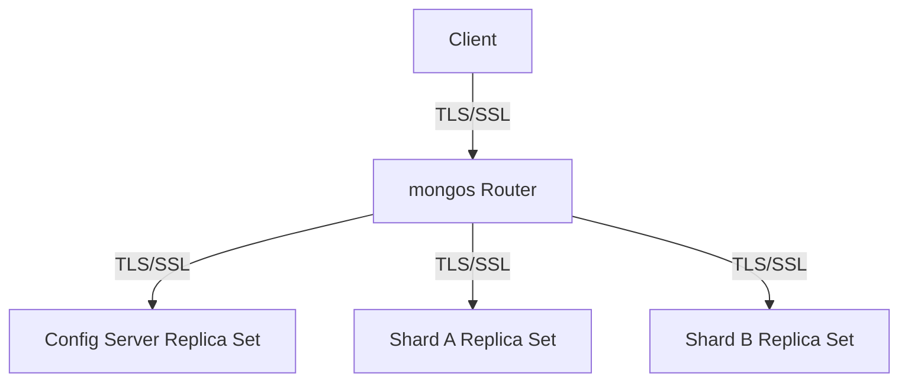

# MongoDB TLS/SSL Configuration

In today's interconnected world, securing your database communications is not just a best practice—it's a necessity. MongoDB provides robust Transport Layer Security (TLS)/Secure Sockets Layer (SSL) support to encrypt data in transit, preventing eavesdropping and man-in-the-middle attacks.

## Introduction to TLS/SSL in MongoDB

TLS (formerly known as SSL) provides a secure channel between two machines operating over a network. When you configure MongoDB with TLS/SSL, you ensure that:

- Data is encrypted during transmission
- Clients can verify the identity of the MongoDB server
- MongoDB servers can require client certificate authentication

This guide will walk you through setting up TLS/SSL for your MongoDB deployments, whether you're running a standalone instance, a replica set, or a sharded cluster.

## Prerequisites

Before configuring TLS/SSL for MongoDB, you'll need:

- MongoDB 4.0 or later (earlier versions also support SSL/TLS but with slightly different parameter names)
- OpenSSL or similar TLS/SSL toolkit installed on your system
- Basic understanding of TLS/SSL certificates
- Administrative access to your MongoDB instances

## Understanding TLS/SSL Certificate Types

When working with MongoDB and TLS/SSL, you'll encounter three main types of files:

1. **Certificate Authority (CA) File**: Contains certificates of trusted CAs
2. **Server Certificate**: Identifies your MongoDB server
3. **Client Certificates**: Identifies clients connecting to your MongoDB server

## Setting Up TLS/SSL for MongoDB

Let's proceed with a step-by-step configuration:

### Step 1: Generate TLS/SSL Certificates

For testing and development, you can create self-signed certificates. For production, consider using certificates from a trusted Certificate Authority.

Here's how to create self-signed certificates using OpenSSL:

```bash
# Create a root CA key
openssl genrsa -out mongodb-ca.key 4096

# Create a root CA certificate
openssl req -x509 -new -key mongodb-ca.key -days 10000 -out mongodb-ca.crt

# Create a server key
openssl genrsa -out mongodb-server.key 4096

# Create a server certificate signing request
openssl req -new -key mongodb-server.key -out mongodb-server.csr

# Create the server certificate
openssl x509 -req -in mongodb-server.csr -CA mongodb-ca.crt \
  -CAkey mongodb-ca.key -CAcreateserial -out mongodb-server.crt -days 365

# Create the PEM file for MongoDB
cat mongodb-server.key mongodb-server.crt > mongodb-server.pem
```

### Step 2: Configure MongoDB to Use TLS/SSL

Edit your MongoDB configuration file (`mongod.conf`) to enable TLS/SSL:

```yaml
net:
  port: 27017
  ssl:
    mode: requireSSL
    PEMKeyFile: /path/to/mongodb-server.pem
    CAFile: /path/to/mongodb-ca.crt
```

Alternatively, you can start the MongoDB server with command-line parameters:

```bash
mongod --sslMode requireSSL --sslPEMKeyFile /path/to/mongodb-server.pem --sslCAFile /path/to/mongodb-ca.crt
```

### Step 3: Restart MongoDB Service

Restart your MongoDB service to apply the changes:

```bash
sudo systemctl restart mongod
```

### Step 4: Connect to MongoDB Using TLS/SSL

To connect to a MongoDB instance that requires TLS/SSL:

```bash
mongosh --tls --tlsCAFile /path/to/mongodb-ca.crt --host your-mongodb-server
```

If you need to authenticate with a client certificate:

```bash
mongosh --tls --tlsCAFile /path/to/mongodb-ca.crt \
  --tlsCertificateKeyFile /path/to/client.pem --host your-mongodb-server
```

## TLS/SSL Connection Examples

### Example 1: Connecting with the MongoDB Shell

```javascript
// Connect to MongoDB with TLS/SSL
mongosh --tls --tlsCAFile /path/to/ca.crt --host mongodb.example.com

// Once connected, verify that the connection is secure
db.runCommand({connectionStatus : 1})
```

Output:

```javascript
{
  "authInfo" : {
    "authenticatedUsers" : [ ],
    "authenticatedUserRoles" : [ ]
  },
  "ok" : 1,
  "connectionId" : 1,
  "ismaster" : true,
  // Notice the SSL field is present
  "connectionDetails": {
    "ssl": {
      "authenticated": true
    }
  }
}
```

### Example 2: Connecting with a MongoDB Driver (Node.js)

```javascript
const { MongoClient } = require('mongodb');
const fs = require('fs');

// Connection URI with TLS parameters
const uri = 'mongodb://localhost:27017';

// TLS/SSL options
const options = {
  tls: true,
  tlsCAFile: '/path/to/mongodb-ca.crt',
  tlsCertificateKeyFile: '/path/to/client.pem'
};

async function connectToMongoDB() {
  try {
    const client = new MongoClient(uri, options);
    await client.connect();
    console.log('Connected successfully to MongoDB with TLS/SSL');
    
    // Perform operations with the client
    const db = client.db('test');
    const collections = await db.listCollections().toArray();
    console.log('Collections:', collections);
    
    // Close the connection
    await client.close();
    console.log('Connection closed');
  } catch (err) {
    console.error('Error connecting to MongoDB:', err);
  }
}

connectToMongoDB();
```

## TLS/SSL Configuration for MongoDB Replica Sets

For a replica set configuration, all members must use TLS/SSL with the same CA. Here's how to configure it:

```yaml
replication:
  replSetName: "myReplicaSet"
net:
  port: 27017
  ssl:
    mode: requireSSL
    PEMKeyFile: /path/to/mongodb-server.pem
    CAFile: /path/to/mongodb-ca.crt
```

When connecting to a replica set:

```bash
mongosh --tls --tlsCAFile /path/to/mongodb-ca.crt \
  --host "myReplicaSet/node1.example.com:27017,node2.example.com:27017,node3.example.com:27017"
```

## TLS/SSL Configuration for Sharded Clusters

For sharded clusters, configure TLS/SSL on all components: mongos routers, config servers, and shard servers. All must use certificates from the same CA.

Here's a diagram showing TLS/SSL connections in a sharded cluster:



## TLS/SSL Modes in MongoDB

MongoDB offers different SSL modes to suit various security requirements:

| Mode | Description |
|------|-------------|
| `disabled` | TLS/SSL is disabled |
| `allowSSL` | TLS/SSL connections are allowed but not required |
| `preferSSL` | TLS/SSL is preferred but not required |
| `requireSSL` | TLS/SSL is required for all connections |

## Common TLS/SSL Issues and Troubleshooting

### Issue 1: Certificate Validation Failures

If you encounter errors like:

```
Error: SSL peer certificate validation failed
```

Check that:
- The server's hostname matches the Common Name (CN) or Subject Alternative Name (SAN) in the certificate
- The certificate hasn't expired
- The certificate is signed by a CA in your trusted CA file

### Issue 2: Connection Refused

If connections are being refused:

```
Error: couldn't connect to server, connection attempt failed
```

Verify that:
- MongoDB is actually listening on the specified port
- Firewall rules permit TLS/SSL connections
- The TLS/SSL configuration parameters are correct in the MongoDB configuration file

### Troubleshooting Commands

To test your TLS/SSL setup directly:

```bash
# Test if the server is listening on the TLS port
openssl s_client -connect mongodb.example.com:27017 -showcerts
```

## Best Practices for MongoDB TLS/SSL Implementation

1. **Use Strong Certificates**: Use certificates with at least 2048-bit RSA keys
2. **Implement Certificate Rotation**: Rotate certificates before they expire
3. **Use Secure Cipher Suites**: Configure MongoDB to use modern, secure cipher suites
4. **Protect Certificate Files**: Restrict access to certificate files with appropriate permissions
5. **Validate Hostnames**: Always enable hostname validation in production
6. **Use Client Certificates**: For additional security, require client certificate authentication

## Summary

Implementing TLS/SSL encryption in MongoDB is a critical step in securing your database infrastructure. By encrypting data in transit, you protect sensitive information from eavesdropping and tampering. The configuration process involves generating certificates, configuring MongoDB to use TLS/SSL, and ensuring clients connect using the appropriate TLS/SSL options.

Remember that TLS/SSL only secures data in transit—you should also implement other security measures like authentication, authorization, and encryption at rest for comprehensive database security.

## Additional Resources

- [MongoDB Security Documentation](https://docs.mongodb.com/manual/tutorial/configure-ssl/)
- [OpenSSL Documentation](https://www.openssl.org/docs/)
- [MongoDB University Security Course](https://university.mongodb.com/)

## Practice Exercises

1. Set up a MongoDB standalone instance with TLS/SSL and connect using the MongoDB shell.
2. Configure a three-node MongoDB replica set with TLS/SSL enabled on all nodes.
3. Create a script that rotates TLS/SSL certificates for a MongoDB deployment without downtime.
4. Implement client certificate authentication for your MongoDB deployment.
5. Compare the performance impact of different TLS/SSL cipher suites on MongoDB operations.