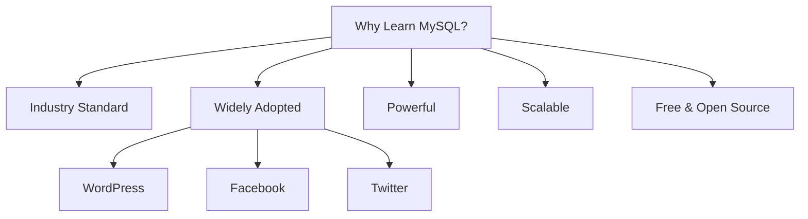
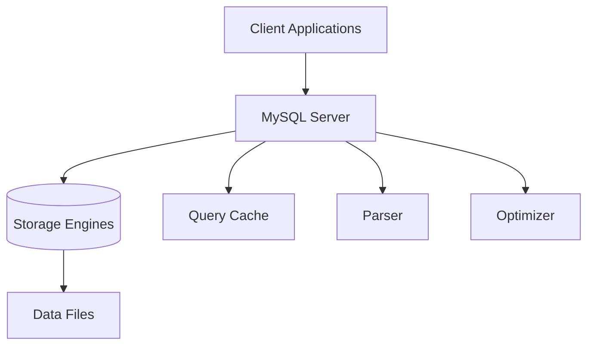

# MySQL Introduction

MySQL is one of the world's most popular open-source relational database management systems (RDBMS). It provides a robust platform for storing, organizing, and retrieving data efficiently, and forms the backbone of countless applications across the web and enterprise environments.

## What is MySQL?

<div style={{
    "width": "20%",
    "margin": "0 auto",
    "text-align": "center"
}}>
    
</div>

MySQL is a database management system that uses Structured Query Language (SQL) to interact with data. It allows you to:

- Store data in organized tables with rows and columns
- Create relationships between different tables
- Enforce data integrity through constraints
- Query data efficiently through indexes
- Support concurrent access from multiple users or applications

Originally developed by MySQL AB (now owned by Oracle Corporation), MySQL has remained open-source and is freely available under the GNU General Public License.

## Why Learn MySQL?



Learning MySQL offers several benefits:

1. **Industry Standard**: MySQL is widely used across industries, making it a valuable skill for developers.
2. **Performance**: It's known for its speed, reliability, and ease of use.
3. **Compatibility**: Works on various platforms (Windows, Linux, macOS, etc.).
4. **Community Support**: Large community with abundant resources for learning and troubleshooting.
5. **Career Opportunities**: High demand for professionals with MySQL skills.

## Key MySQL Features

- **Reliability and Stability**: Built with a focus on stable performance
- **ACID Compliance**: Ensures data integrity through Atomicity, Consistency, Isolation, and Durability
- **Replication**: Allows data to be copied across multiple servers
- **Partitioning**: Improves performance by dividing large tables
- **Stored Procedures**: Support for server-side programming logic
- **Triggers**: Automated responses to data modifications
- **Views**: Virtual tables that simplify complex queries
- **Full-Text Search**: Efficient searching of text content

## MySQL Architecture

MySQL follows a client-server architecture:



1. **Client Applications**: Programs that connect to MySQL server to access data
2. **MySQL Server**: Core component handling connections and executing queries
3. **Storage Engines**: Modules that handle storage and retrieval of data
4. **Parser**: Validates SQL syntax and creates a query tree
5. **Optimizer**: Determines the most efficient way to execute queries
6. **Query Cache**: Stores results of queries for faster retrieval

## Getting Started with MySQL

### Installation

The process of installing MySQL varies by operating system. You can download MySQL from the [official MySQL website](https://dev.mysql.com/downloads/) or use package managers:

For Ubuntu/Debian:
```bash
sudo apt update
sudo apt install mysql-server
```

For macOS (using Homebrew):
```bash
brew install mysql
```

For Windows, the MySQL Installer provides a straightforward installation wizard.

### Starting MySQL Service

On Linux:
```bash
sudo systemctl start mysql
```

On macOS:
```bash
brew services start mysql
```

On Windows, MySQL typically runs as a service that can be started from Services in Administrative Tools.

### Connecting to MySQL

You can connect to MySQL using the command-line client:

```bash
mysql -u root -p
```

This will prompt for a password, and upon successful authentication, you'll see the MySQL prompt:

```
mysql>
```

## Basic MySQL Commands

### Creating a Database

```sql
CREATE DATABASE library;
```

Output:
```
Query OK, 1 row affected (0.05 sec)
```

### Using a Database

```sql
USE library;
```

Output:
```
Database changed
```

### Creating a Table

```sql
CREATE TABLE books (
    id INT AUTO_INCREMENT PRIMARY KEY,
    title VARCHAR(100) NOT NULL,
    author VARCHAR(100) NOT NULL,
    publication_year INT,
    genre VARCHAR(50),
    price DECIMAL(6,2)
);
```

Output:
```
Query OK, 0 rows affected (0.08 sec)
```

### Inserting Data

```sql
INSERT INTO books (title, author, publication_year, genre, price)
VALUES ('To Kill a Mockingbird', 'Harper Lee', 1960, 'Fiction', 12.99),
       ('1984', 'George Orwell', 1949, 'Dystopian', 10.99),
       ('The Great Gatsby', 'F. Scott Fitzgerald', 1925, 'Classic', 9.99);
```

Output:
```
Query OK, 3 rows affected (0.03 sec)
Records: 3  Duplicates: 0  Warnings: 0
```

### Querying Data

```sql
SELECT * FROM books;
```

Output:
```
+----+----------------------+--------------------+------------------+-----------+-------+
| id | title                | author             | publication_year | genre     | price |
+----+----------------------+--------------------+------------------+-----------+-------+
|  1 | To Kill a Mockingbird| Harper Lee         |             1960 | Fiction   | 12.99 |
|  2 | 1984                 | George Orwell      |             1949 | Dystopian | 10.99 |
|  3 | The Great Gatsby     | F. Scott Fitzgerald|             1925 | Classic   |  9.99 |
+----+----------------------+--------------------+------------------+-----------+-------+
3 rows in set (0.00 sec)
```

### Filtering Data

```sql
SELECT title, author FROM books WHERE publication_year < 1950;
```

Output:
```
+------------------+--------------------+
| title            | author             |
+------------------+--------------------+
| 1984             | George Orwell      |
| The Great Gatsby | F. Scott Fitzgerald|
+------------------+--------------------+
2 rows in set (0.00 sec)
```

### Updating Data

```sql
UPDATE books SET price = 11.99 WHERE id = 2;
```

Output:
```
Query OK, 1 row affected (0.01 sec)
Rows matched: 1  Changed: 1  Warnings: 0
```

### Deleting Data

```sql
DELETE FROM books WHERE id = 3;
```

Output:
```
Query OK, 1 row affected (0.01 sec)
```

## Real-world Application: Building a Simple Bookstore Database

Let's build a more comprehensive bookstore database with multiple related tables.

### Creating Related Tables

```sql
-- Authors table
CREATE TABLE authors (
    author_id INT AUTO_INCREMENT PRIMARY KEY,
    first_name VARCHAR(50) NOT NULL,
    last_name VARCHAR(50) NOT NULL,
    birth_year INT,
    country VARCHAR(50)
);

-- Publishers table
CREATE TABLE publishers (
    publisher_id INT AUTO_INCREMENT PRIMARY KEY,
    name VARCHAR(100) NOT NULL,
    founded_year INT,
    headquarters VARCHAR(100)
);

-- Enhanced books table with foreign keys
CREATE TABLE improved_books (
    book_id INT AUTO_INCREMENT PRIMARY KEY,
    title VARCHAR(100) NOT NULL,
    author_id INT,
    publisher_id INT,
    isbn VARCHAR(20) UNIQUE,
    publication_year INT,
    genre VARCHAR(50),
    price DECIMAL(6,2),
    stock INT DEFAULT 0,
    FOREIGN KEY (author_id) REFERENCES authors(author_id),
    FOREIGN KEY (publisher_id) REFERENCES publishers(publisher_id)
);

-- Orders table
CREATE TABLE orders (
    order_id INT AUTO_INCREMENT PRIMARY KEY,
    book_id INT,
    customer_name VARCHAR(100),
    order_date DATE,
    quantity INT,
    total_price DECIMAL(8,2),
    FOREIGN KEY (book_id) REFERENCES improved_books(book_id)
);
```

### Populating the Database

```sql
-- Insert authors
INSERT INTO authors (first_name, last_name, birth_year, country)
VALUES ('Harper', 'Lee', 1926, 'USA'),
       ('George', 'Orwell', 1903, 'United Kingdom'),
       ('F. Scott', 'Fitzgerald', 1896, 'USA');

-- Insert publishers
INSERT INTO publishers (name, founded_year, headquarters)
VALUES ('HarperCollins', 1989, 'New York'),
       ('Penguin Books', 1935, 'London'),
       ('Scribner', 1846, 'New York');

-- Insert books
INSERT INTO improved_books (title, author_id, publisher_id, isbn, publication_year, genre, price, stock)
VALUES ('To Kill a Mockingbird', 1, 1, '978-0446310789', 1960, 'Fiction', 12.99, 25),
       ('1984', 2, 2, '978-0451524935', 1949, 'Dystopian', 10.99, 18),
       ('The Great Gatsby', 3, 3, '978-0743273565', 1925, 'Classic', 9.99, 15);

-- Insert orders
INSERT INTO orders (book_id, customer_name, order_date, quantity, total_price)
VALUES (1, 'John Smith', '2023-09-15', 2, 25.98),
       (2, 'Mary Johnson', '2023-09-16', 1, 10.99),
       (3, 'Robert Brown', '2023-09-16', 3, 29.97);
```

### Complex Queries

Joining multiple tables to get comprehensive information:

```sql
SELECT 
    b.title, 
    CONCAT(a.first_name, ' ', a.last_name) AS author_name,
    p.name AS publisher,
    b.publication_year,
    b.price,
    b.stock,
    SUM(o.quantity) AS total_ordered
FROM 
    improved_books b
JOIN 
    authors a ON b.author_id = a.author_id
JOIN 
    publishers p ON b.publisher_id = p.publisher_id
LEFT JOIN 
    orders o ON b.book_id = o.book_id
GROUP BY 
    b.book_id
ORDER BY 
    total_ordered DESC;
```

Output:
```
+----------------------+------------------+---------------+------------------+-------+-------+---------------+
| title                | author_name      | publisher     | publication_year | price | stock | total_ordered |
+----------------------+------------------+---------------+------------------+-------+-------+---------------+
| The Great Gatsby     | F. Scott Fitzgerald| Scribner      |             1925 |  9.99 |    15 |             3 |
| To Kill a Mockingbird| Harper Lee       | HarperCollins |             1960 | 12.99 |    25 |             2 |
| 1984                 | George Orwell    | Penguin Books |             1949 | 10.99 |    18 |             1 |
+----------------------+------------------+---------------+------------------+-------+-------+---------------+
```

## Common MySQL Data Types

MySQL offers a variety of data types to store different kinds of information:

1. **Numeric Types**:
   - `INT`: Integer values
   - `DECIMAL(M,D)`: Fixed-point number with M digits total and D digits after decimal point
   - `FLOAT`: Floating-point number
   - `BOOLEAN`: True/false values (implemented as TINYINT)

2. **String Types**:
   - `CHAR(N)`: Fixed-length string of N characters
   - `VARCHAR(N)`: Variable-length string with maximum length of N characters
   - `TEXT`: Variable-length string with maximum size of 65,535 characters
   - `ENUM`: String object that can have only one value from a predefined list

3. **Date and Time Types**:
   - `DATE`: Date in format 'YYYY-MM-DD'
   - `TIME`: Time in format 'HH:MM:SS'
   - `DATETIME`: Combined date and time
   - `TIMESTAMP`: Timestamp stored as seconds since the Unix epoch

4. **Binary Types**:
   - `BLOB`: Binary Large Object for storing binary data
   - `BINARY`: Fixed-length binary strings

## MySQL and Web Applications

MySQL is commonly used as the database backend for web applications. Here's a simple example using PHP to connect to a MySQL database:

```php
<?php
// Database connection parameters
$host = "localhost";
$username = "root";
$password = "your_password";
$database = "library";

// Create connection
$conn = new mysqli($host, $username, $password, $database);

// Check connection
if ($conn->connect_error) {
    die("Connection failed: " . $conn->connect_error);
}

// Query to fetch books
$sql = "SELECT id, title, author, price FROM books";
$result = $conn->query($sql);

// Display results
if ($result->num_rows > 0) {
    echo "<table border='1'>";
    echo "<tr><th>ID</th><th>Title</th><th>Author</th><th>Price</th></tr>";
    
    while($row = $result->fetch_assoc()) {
        echo "<tr>";
        echo "<td>" . $row["id"] . "</td>";
        echo "<td>" . $row["title"] . "</td>";
        echo "<td>" . $row["author"] . "</td>";
        echo "<td>$" . $row["price"] . "</td>";
        echo "</tr>";
    }
    
    echo "</table>";
} else {
    echo "No books found";
}

// Close connection
$conn->close();
?>
```

## MySQL Best Practices

1. **Use Appropriate Data Types**: Choose the right data types for columns to optimize storage and performance.

2. **Normalize Your Database**: Organize data to minimize redundancy and dependency.

3. **Index Frequently Queried Columns**: Add indexes to columns used in WHERE clauses and joins.

4. **Use Prepared Statements**: Prevent SQL injection by using prepared statements.

5. **Regular Backups**: Implement a regular backup strategy to prevent data loss.

6. **Optimize Queries**: Write efficient queries and use the EXPLAIN command to analyze them.

7. **Secure Your Database**: Set strong passwords, limit access privileges, and encrypt sensitive data.

8. **Monitor Performance**: Regularly check the performance of your database and queries.

## Summary

MySQL is a powerful, open-source relational database management system that provides a solid foundation for storing and managing data in applications of all sizes. In this introduction, we've covered:

- Basic concepts and features of MySQL
- Setting up a MySQL environment
- Creating and manipulating databases and tables
- Writing SQL queries to interact with data
- Building relationships between tables
- Best practices for database design and management

MySQL's combination of performance, reliability, and ease of use has made it a cornerstone technology for web applications and enterprise systems alike. As you continue your journey with MySQL, you'll discover its extensive capabilities for handling complex data management requirements.

## Further Learning

To deepen your understanding of MySQL, consider exploring these topics:

1. **Advanced SQL Queries**: Subqueries, unions, and complex joins
2. **Stored Procedures and Functions**: Server-side programming
3. **Triggers and Events**: Automating database operations
4. **Database Optimization**: Performance tuning and query optimization
5. **Database Administration**: Backup, recovery, and security

## Exercises

1. Create a database for a music streaming service with tables for artists, albums, songs, and users.
2. Write a query to find all books published after 2000 with a price less than $15.
3. Create a query that joins three tables to show which customers bought which books from which publishers.
4. Implement a simple inventory management system with tables for products, suppliers, and inventory levels.
5. Design a database schema for a blog platform with users, posts, comments, and categories.

With these foundations in place, you're well on your way to becoming proficient in MySQL database management!