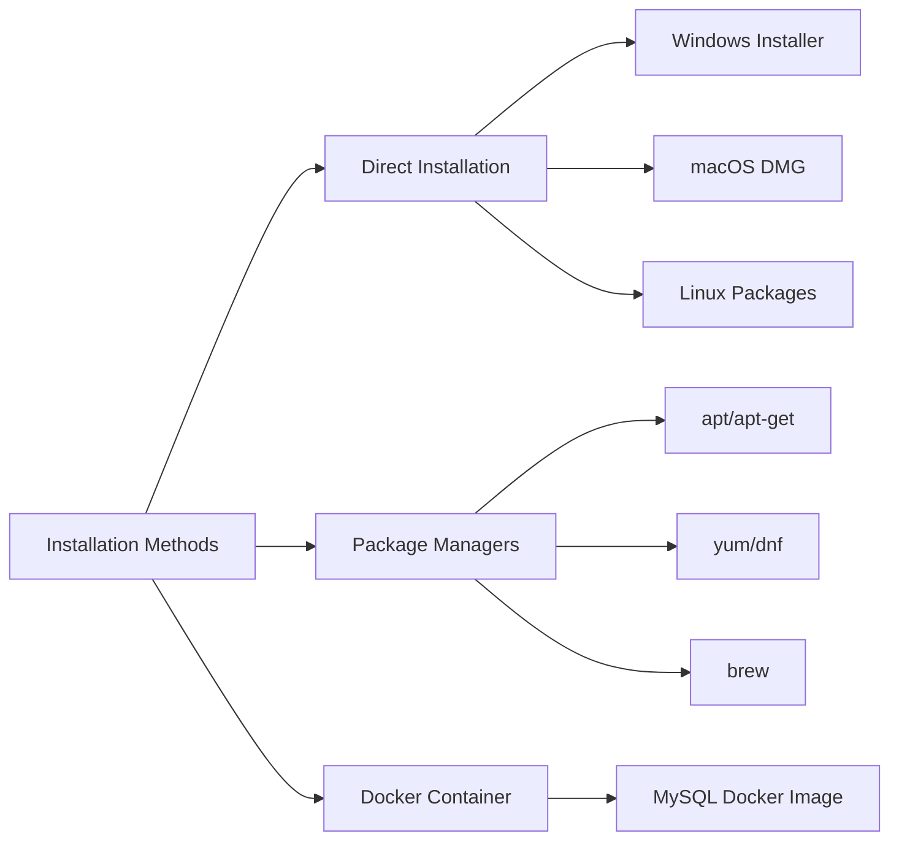

# MySQL Installation

## Introduction

MySQL is one of the most popular open-source relational database management systems. It's used by many web applications, including WordPress, Drupal, and countless custom solutions. Before you can start learning SQL commands or building applications with MySQL, you need to install it on your system.

This guide will walk you through the process of installing MySQL on different operating systems, verifying your installation, and performing initial setup tasks.

## Why MySQL?

MySQL offers several advantages that have contributed to its popularity:

- **Open-source**: Free to use and modify
- **Performance**: Excellent speed and reliability
- **Cross-platform**: Available on Windows, macOS, Linux, and other platforms
- **Community support**: Large user community and extensive documentation
- **Scalability**: Works well for both small applications and large enterprise systems

## Installation Methods

There are three primary ways to get MySQL running on your system:



Let's explore each method in detail.

## Installing MySQL on Windows

### Using the MySQL Installer

1. **Download MySQL Installer**:
   - Go to the [MySQL Downloads page](https://dev.mysql.com/downloads/mysql/)
   - Select "MySQL Installer for Windows"
   - Download the appropriate version (typically the larger "web community" option)

2. **Run the installer**:
   - Double-click the downloaded file
   - Choose "Developer Default" for a complete installation or "Server only" for a minimal installation
   - Click "Next" to proceed

3. **Check requirements**:
   - The installer will check for prerequisites
   - Install any missing components by clicking "Execute"

4. **Configuration**:
   - Choose "Standalone MySQL Server"
   - Select "Development Computer" for configuration type
   - Leave the default port (3306) unless you have a specific reason to change it
   - Set a root password (remember this password!)

5. **Complete installation**:
   - Click "Execute" to apply the configuration
   - Wait for the installation to complete
   - Click "Finish" to exit the installer

### Verify Installation on Windows

Open Command Prompt and type:

```bash
mysql --version
```

You should see output similar to:

```
mysql  Ver 8.0.28 for Win64 on x86_64 (MySQL Community Server - GPL)
```

## Installing MySQL on macOS

### Using Homebrew (Recommended)

If you have Homebrew installed, this is the easiest method:

1. **Install MySQL**:

   ```bash
   brew install mysql
   ```

2. **Start MySQL service**:

   ```bash
   brew services start mysql
   ```

3. **Set up root password**:

   ```bash
   mysql_secure_installation
   ```
   
   Follow the prompts to:
   - Set a root password
   - Remove anonymous users
   - Disallow root login remotely
   - Remove test database
   - Reload privilege tables

### Using DMG Installer

1. **Download MySQL DMG**:
   - Go to the [MySQL Downloads page](https://dev.mysql.com/downloads/mysql/)
   - Select the DMG Archive for macOS
   
2. **Install MySQL**:
   - Open the downloaded DMG file
   - Run the package installer
   - Follow the installation wizard
   - Note the temporary password displayed at the end (you'll need it)

3. **Start MySQL**:
   - Open System Preferences
   - Click on the MySQL icon
   - Click "Start MySQL Server"

### Verify Installation on macOS

Open Terminal and type:

```bash
mysql --version
```

You should see output showing your MySQL version.

## Installing MySQL on Linux (Ubuntu/Debian)

1. **Update package index**:

   ```bash
   sudo apt update
   ```

2. **Install MySQL server**:

   ```bash
   sudo apt install mysql-server
   ```

3. **Start MySQL service**:

   ```bash
   sudo systemctl start mysql
   ```

4. **Enable MySQL to start at boot**:

   ```bash
   sudo systemctl enable mysql
   ```

5. **Secure MySQL installation**:

   ```bash
   sudo mysql_secure_installation
   ```
   
   Follow the prompts to set up root password and secure your installation.

### Verify Installation on Linux

```bash
mysql --version
```

## Installing MySQL on Linux (Red Hat/CentOS/Fedora)

1. **Add MySQL repository** (for MySQL 8.0):

   ```bash
   sudo rpm -Uvh https://repo.mysql.com/mysql80-community-release-el7-3.noarch.rpm
   ```

2. **Install MySQL server**:

   ```bash
   sudo yum install mysql-server
   ```

3. **Start MySQL service**:

   ```bash
   sudo systemctl start mysqld
   ```

4. **Enable MySQL to start at boot**:

   ```bash
   sudo systemctl enable mysqld
   ```

5. **Find temporary root password**:

   ```bash
   sudo grep 'temporary password' /var/log/mysqld.log
   ```

6. **Secure your installation**:

   ```bash
   sudo mysql_secure_installation
   ```

## Using MySQL with Docker

Docker provides a convenient way to run MySQL without installing it directly on your system:

1. **Pull the MySQL image**:

   ```bash
   docker pull mysql:8.0
   ```

2. **Run MySQL container**:

   ```bash
   docker run --name my-mysql -e MYSQL_ROOT_PASSWORD=my-secret-pw -d -p 3306:3306 mysql:8.0
   ```

   This command:
   - Names the container "my-mysql"
   - Sets the root password to "my-secret-pw" (change this!)
   - Runs in detached mode
   - Maps port 3306 on your machine to port 3306 in the container

3. **Connect to MySQL in the container**:

   ```bash
   docker exec -it my-mysql mysql -uroot -p
   ```

## Initial Configuration

After installation, you should perform some basic configuration:

### Connecting to MySQL Server

```bash
mysql -u root -p
```

Enter your password when prompted.

### Creating a New Database

Once connected to MySQL, create a new database:

```sql
CREATE DATABASE my_database;
```

You should see:

```
Query OK, 1 row affected (0.02 sec)
```

### Creating a New User

It's a good practice to avoid using the root user for regular operations:

```sql
CREATE USER 'myuser'@'localhost' IDENTIFIED BY 'mypassword';
```

### Granting Privileges

Grant privileges to your new user:

```sql
GRANT ALL PRIVILEGES ON my_database.* TO 'myuser'@'localhost';
FLUSH PRIVILEGES;
```

### Testing the New User

Exit from the current MySQL session:

```sql
EXIT;
```

Connect with the new user:

```bash
mysql -u myuser -p my_database
```

## Common Installation Issues and Solutions

### "Access Denied for User 'root'@'localhost'"

This occurs when the root password is incorrect or when authentication method has changed.

**Solution**:

1. Stop MySQL service:
   ```bash
   sudo systemctl stop mysql   # Linux
   sudo brew services stop mysql   # macOS
   ```

2. Start MySQL in safe mode:
   ```bash
   sudo mysqld_safe --skip-grant-tables &
   ```

3. Connect to MySQL:
   ```bash
   mysql -u root
   ```

4. Reset password:
   ```sql
   FLUSH PRIVILEGES;
   ALTER USER 'root'@'localhost' IDENTIFIED BY 'new_password';
   EXIT;
   ```

5. Restart MySQL normally:
   ```bash
   sudo systemctl start mysql   # Linux
   sudo brew services start mysql   # macOS
   ```

### "Can't Connect to MySQL Server"

This usually means the server isn't running or there's a port conflict.

**Solution**:

1. Check if MySQL is running:
   ```bash
   sudo systemctl status mysql   # Linux
   brew services list   # macOS
   ```

2. If not running, start it:
   ```bash
   sudo systemctl start mysql   # Linux
   brew services start mysql   # macOS
   ```

3. Check if port 3306 is already in use:
   ```bash
   sudo netstat -tlnp | grep 3306   # Linux
   lsof -i :3306   # macOS
   ```

## Upgrading MySQL

### Windows

1. Download the newest MySQL installer
2. Run the installer and choose "Upgrade" option
3. Follow the prompts to complete the upgrade

### macOS (using Homebrew)

```bash
brew update
brew upgrade mysql
```

### Linux (Ubuntu/Debian)

```bash
sudo apt update
sudo apt upgrade mysql-server
```

## Summary

You've now learned how to:

- Install MySQL on Windows, macOS, and Linux systems
- Use Docker to run MySQL in a container
- Verify your MySQL installation
- Perform initial configuration tasks
- Create databases and users
- Troubleshoot common installation issues
- Upgrade your MySQL installation

These steps provide a solid foundation for working with MySQL. Now that you have MySQL installed, you can proceed to learn SQL commands and database design principles.

## Additional Resources

- [MySQL Official Documentation](https://dev.mysql.com/doc/)
- [MySQL Workbench](https://dev.mysql.com/downloads/workbench/) - A visual database design tool
- [MySQL Command-Line Client](https://dev.mysql.com/doc/refman/8.0/en/mysql.html) - Documentation for the command-line interface

## Exercises

1. Install MySQL on your preferred operating system.
2. Connect to your MySQL server using the command line.
3. Create a new database called "practice".
4. Create a new user called "practice_user" with full privileges on the "practice" database.
5. Connect to MySQL using your new user and create a simple table.

Now that you have MySQL installed and configured, you're ready to dive into learning SQL and database concepts!