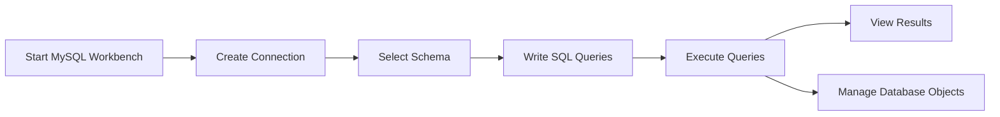

# MySQL Workbench Setup

## Introduction

MySQL Workbench is a unified visual tool that provides database architects, developers, and database administrators with a comprehensive set of capabilities for database design, modeling, development, configuration, administration, and migration. It simplifies the process of working with databases by providing a graphical interface to MySQL servers and databases.

Whether you're a beginner or an experienced developer, MySQL Workbench offers a user-friendly environment to design, model, and manage your databases. In this tutorial, we'll walk through the process of downloading, installing, and configuring MySQL Workbench to get you started with MySQL database development.

## Why Use MySQL Workbench?

Before diving into the setup process, let's understand the key advantages of using MySQL Workbench:

- **Visual database design**: Create and modify database schemas using a visual interface
- **SQL development**: Write, edit, and execute SQL queries with syntax highlighting
- **Database administration**: Manage user accounts, monitor server performance, and backup data
- **Data modeling**: Create entity-relationship diagrams (ERDs) for your database
- **Migration tools**: Migrate schemas and data from other database systems to MySQL

## System Requirements

Before installing MySQL Workbench, ensure your system meets these requirements:

**For Windows:**
- Windows 10 or later
- Microsoft .NET Framework 4.8
- At least 4GB RAM (8GB recommended)
- 2GB of available disk space

**For macOS:**
- macOS 10.14 or later
- At least 4GB RAM (8GB recommended)
- 2GB of available disk space

**For Linux:**
- Any modern Linux distribution (Ubuntu, Fedora, etc.)
- At least 4GB RAM (8GB recommended)
- 2GB of available disk space
- X Window System libraries and GTK+

## Downloading MySQL Workbench

Follow these steps to download MySQL Workbench:

1. Visit the official MySQL download page at [https://dev.mysql.com/downloads/workbench/](https://dev.mysql.com/downloads/workbench/)
2. Select your operating system from the dropdown menu
3. Choose the appropriate version for your system
4. Click on the "Download" button
5. You can either sign in with an Oracle account or click "No thanks, just start my download" to proceed without an account

## Installation Process

### Windows Installation

1. Locate the downloaded `.msi` file and double-click it to start the installation
2. The MySQL Workbench Setup Wizard will appear. Click "Next" to continue
3. Accept the license agreement and click "Next"
4. Choose the installation type (Typical, Complete, or Custom) and click "Next"
   - For beginners, the "Typical" installation is recommended
5. Click "Install" to begin the installation process
6. When the installation completes, click "Finish"

### macOS Installation

1. Locate the downloaded `.dmg` file and double-click it
2. In the opening window, drag the MySQL Workbench icon to the Applications folder
3. You may need to approve the installation in System Preferences > Security & Privacy if your Mac blocks the installation
4. Once installed, you can launch MySQL Workbench from the Applications folder or Launchpad

### Linux Installation

For Ubuntu/Debian-based systems:

```bash
sudo apt update
sudo apt install mysql-workbench-community
```

For Red Hat/Fedora-based systems:

```bash
sudo dnf install mysql-workbench-community
```

For other distributions, you can use the downloaded package from the MySQL website and install it using your package manager.

## Launching MySQL Workbench

After installation, launch MySQL Workbench:

- **Windows**: Click Start > MySQL > MySQL Workbench
- **macOS**: Open Applications folder and click on MySQL Workbench
- **Linux**: Search for "MySQL Workbench" in your applications menu or run `mysql-workbench` in the terminal

When you launch MySQL Workbench for the first time, you'll see the home screen with options for database connections, administration, and data modeling.

## Setting Up a Database Connection

To connect to a MySQL server, follow these steps:

1. From the MySQL Workbench home screen, click on the "+" icon next to "MySQL Connections"
2. In the "Setup New Connection" dialog, enter the following details:
   - **Connection Name**: Provide a descriptive name for your connection (e.g., "Local MySQL Server")
   - **Connection Method**: Choose "Standard (TCP/IP)"
   - **Hostname**: Enter the server address (use `127.0.0.1` or `localhost` for local server)
   - **Port**: Default port is `3306`
   - **Username**: Enter your MySQL username (default is usually `root`)
   - **Password**: Click "Store in Vault..." to securely save your password
3. Click "Test Connection" to verify that MySQL Workbench can connect to your server
4. If the connection is successful, click "OK" to save the connection

Here's what the connection setup looks like in code form:

```
Connection Name: Local MySQL Server
Connection Method: Standard (TCP/IP)
Hostname: 127.0.0.1
Port: 3306
Username: root
Password: [Your Password]
```

## MySQL Workbench Interface Overview

Once connected to a MySQL server, you'll see the main MySQL Workbench interface with several key areas:

### 1. Navigator Panel (Left Side)
- **Administration**: Server status, user management, and other administration tasks
- **Schemas**: List of available database schemas
- **Models**: Database design models

### 2. Query Editor (Center)
- SQL editor where you can write and execute queries
- Results grid for viewing query results

### 3. Information Panel (Right Side)
- Schema information
- Object details
- Context help

Let's visualize the basic workflow in MySQL Workbench:



## Creating Your First Database

Let's create a simple database to verify that everything is working properly:

1. Connect to your MySQL server by clicking on the connection you created
2. In the Query Editor, type the following SQL command:

```sql
CREATE DATABASE my_first_db;
```

3. Click the lightning bolt icon or press Ctrl+Enter (Cmd+Enter on macOS) to execute the query
4. To verify the database was created, type:

```sql
SHOW DATABASES;
```

5. You should see your new database in the results grid
6. To select this database for use, execute:

```sql
USE my_first_db;
```

7. Now let's create a simple table:

```sql
CREATE TABLE customers (
    id INT AUTO_INCREMENT PRIMARY KEY,
    first_name VARCHAR(50),
    last_name VARCHAR(50),
    email VARCHAR(100),
    registration_date DATE
);
```

8. Insert some sample data:

```sql
INSERT INTO customers (first_name, last_name, email, registration_date)
VALUES 
('John', 'Doe', 'john.doe@example.com', '2023-01-15'),
('Jane', 'Smith', 'jane.smith@example.com', '2023-02-20'),
('Robert', 'Johnson', 'robert.j@example.com', '2023-03-05');
```

9. Query the data:

```sql
SELECT * FROM customers;
```

Expected output:
```
+----+------------+---------+------------------------+------------------+
| id | first_name | last_name | email                | registration_date |
+----+------------+---------+------------------------+------------------+
|  1 | John       | Doe     | john.doe@example.com  | 2023-01-15       |
|  2 | Jane       | Smith   | jane.smith@example.com| 2023-02-20       |
|  3 | Robert     | Johnson | robert.j@example.com  | 2023-03-05       |
+----+------------+---------+------------------------+------------------+
```

## Common Configuration Options

### Customizing the SQL Editor

MySQL Workbench allows you to customize the SQL editor to fit your preferences:

1. Go to Edit > Preferences (Windows/Linux) or MySQL Workbench > Preferences (macOS)
2. Select "SQL Editor" from the left panel
3. Here you can adjust settings such as:
   - Font type and size
   - Code completion behavior
   - Query execution options
   - Result grid display

### Setting Default Schema

To set a default schema that opens automatically when you connect:

1. Right-click on your connection in the home screen
2. Select "Edit Connection"
3. Click on the "Advanced" tab
4. Enter your database name in the "Default Schema" field
5. Click "OK" to save

## Troubleshooting Common Issues

### Connection Issues

If you can't connect to your MySQL server:

1. Verify that the MySQL service is running:
   - **Windows**: Open Services (services.msc) and check if MySQL service is started
   - **macOS/Linux**: Run `sudo systemctl status mysql` or `sudo service mysql status`

2. Check if the port is blocked by a firewall:
   - **Windows**: Check Windows Firewall settings
   - **macOS**: Check System Preferences > Security & Privacy > Firewall
   - **Linux**: Check your distribution's firewall settings (e.g., `ufw status` for Ubuntu)

3. Verify connection details:
   - Double-check hostname, port, username, and password
   - Try connecting using the MySQL command line to verify credentials:
   ```bash
   mysql -u username -p -h hostname
   ```

### Error Messages

If you encounter an error message:

1. "Can't connect to MySQL server": Verify that the MySQL server is running and accessible
2. "Access denied for user": Check your username and password or verify user privileges
3. "Unknown database": Make sure you've created the database or check for typos

## Best Practices for Using MySQL Workbench

1. **Regularly save your work**: Use the "Save Script" button frequently to avoid losing your SQL queries
2. **Use SQL formatting**: Press Ctrl+B (Cmd+B on macOS) to format your SQL code for better readability
3. **Create query snippets**: Store frequently used queries as snippets for quick access
4. **Back up your connections**: Export your connections configuration to avoid setting up connections again after reinstalling
5. **Use the Model Designer** for complex database designs before implementing them

## Summary

In this tutorial, we've covered the essential steps to get started with MySQL Workbench:

1. Understanding what MySQL Workbench is and its benefits
2. Downloading and installing MySQL Workbench on different operating systems
3. Launching the application and setting up database connections
4. Navigating the MySQL Workbench interface
5. Creating a sample database and tables
6. Customizing and configuring MySQL Workbench
7. Troubleshooting common issues

MySQL Workbench offers a powerful and user-friendly environment for working with MySQL databases. As you become more familiar with the tool, you'll discover additional features that can enhance your database development workflow.

## Additional Resources

To further develop your MySQL Workbench skills, consider exploring:

1. The official MySQL Workbench documentation
2. MySQL Workbench's data modeling capabilities
3. Server administration features
4. Performance monitoring tools
5. Database migration tools

## Practice Exercises

1. Create a new database for a bookstore with tables for books, authors, and categories
2. Import sample data from a CSV file into your database
3. Create an ER diagram for your bookstore database using MySQL Workbench's modeling tools
4. Write and save a collection of queries that perform common operations on your database
5. Create a user account with limited privileges using the administration tools

By following this guide, you should now have MySQL Workbench installed and configured on your system, ready to help you develop and manage your MySQL databases with ease.