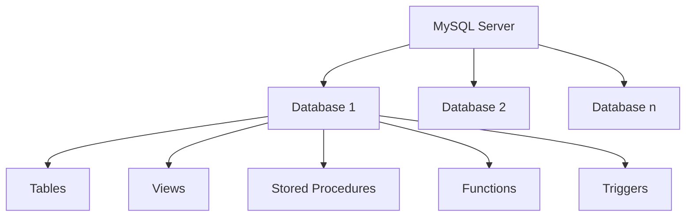

# MySQL Databases

## Introduction

Databases are the foundation of any MySQL implementation. A database in MySQL is a structured collection of data organized in a way that a computer program can quickly select and retrieve specific pieces of data. Think of a database as a digital filing cabinet where all your application's information is stored in an organized manner.

In this guide, we'll explore how to create, manage, and work with MySQL databases. By the end, you'll understand how to perform essential database operations that form the foundation for all your future MySQL work.

## Understanding MySQL Databases

### What is a MySQL Database?

A MySQL database is a container that holds tables, views, stored procedures, and other database objects. In a typical application, you might have a single database containing multiple tables that store different types of information.



Each MySQL server can host multiple databases, and each database can contain multiple database objects. This hierarchical structure allows for organized data management.

## Creating and Managing Databases

### Listing Available Databases

Before creating a new database, you may want to see what databases already exist on your MySQL server:

```sql
SHOW DATABASES;
```

Output:
```
+--------------------+
| Database           |
+--------------------+
| information_schema |
| mysql              |
| performance_schema |
| sys                |
+--------------------+
```

The databases shown in this output are system databases that MySQL creates automatically. Your actual list might differ.

### Creating a New Database

To create a new database, use the `CREATE DATABASE` statement:

```sql
CREATE DATABASE bookstore;
```

Output:
```
Query OK, 1 row affected (0.01 sec)
```

This creates an empty database named "bookstore".

You can also add a condition to avoid errors if the database already exists:

```sql
CREATE DATABASE IF NOT EXISTS online_shop;
```

Output:
```
Query OK, 1 row affected, 1 warning (0.01 sec)
```

### Setting Character Sets and Collations

Best practice involves specifying character sets and collations when creating databases:

```sql
CREATE DATABASE blog_platform
CHARACTER SET utf8mb4
COLLATE utf8mb4_unicode_ci;
```

Output:
```
Query OK, 1 row affected (0.01 sec)
```

Using `utf8mb4` ensures support for the full range of Unicode characters, including emojis and special characters from various languages.

### Selecting a Database to Use

Before you can work with a database, you need to select it:

```sql
USE bookstore;
```

Output:
```
Database changed
```

Now all subsequent commands will apply to the "bookstore" database.

### Deleting a Database

To remove a database and all its contents:

```sql
DROP DATABASE online_shop;
```

Output:
```
Query OK, 0 rows affected (0.02 sec)
```

Be extremely cautious with this command as it permanently deletes the database and all its data!

To avoid errors when dropping a database that might not exist:

```sql
DROP DATABASE IF EXISTS temporary_db;
```

Output:
```
Query OK, 0 rows affected, 1 warning (0.00 sec)
```

## Database Permissions and Security

### Creating a User with Database Access

To create a new user and grant them access to a specific database:

```sql
CREATE USER 'bookstore_user'@'localhost' IDENTIFIED BY 'securepassword';
GRANT ALL PRIVILEGES ON bookstore.* TO 'bookstore_user'@'localhost';
FLUSH PRIVILEGES;
```

Output:
```
Query OK, 0 rows affected (0.01 sec)
Query OK, 0 rows affected (0.01 sec)
Query OK, 0 rows affected (0.00 sec)
```

This creates a user named "bookstore_user" who can access the "bookstore" database from localhost.

### Granting Limited Permissions

You can also grant specific permissions:

```sql
GRANT SELECT, INSERT, UPDATE ON bookstore.* TO 'reader_user'@'localhost';
FLUSH PRIVILEGES;
```

Output:
```
Query OK, 0 rows affected (0.01 sec)
Query OK, 0 rows affected (0.00 sec)
```

This creates a user who can read, insert, and update data, but not delete data or change the structure.

## Working with Database Metadata

### Checking Database Size

To see the size of your databases:

```sql
SELECT 
    table_schema AS 'Database Name',
    ROUND(SUM(data_length + index_length) / 1024 / 1024, 2) AS 'Size (MB)'
FROM 
    information_schema.tables
GROUP BY 
    table_schema;
```

Output:
```
+--------------------+-----------+
| Database Name      | Size (MB) |
+--------------------+-----------+
| bookstore          |      0.23 |
| information_schema |      0.16 |
| mysql              |      2.38 |
| performance_schema |      0.00 |
| sys                |      0.02 |
+--------------------+-----------+
```

### Viewing Database Character Set and Collation

```sql
SELECT 
    SCHEMA_NAME, 
    DEFAULT_CHARACTER_SET_NAME, 
    DEFAULT_COLLATION_NAME
FROM 
    information_schema.schemata
WHERE 
    SCHEMA_NAME = 'bookstore';
```

Output:
```
+-------------+----------------------------+------------------------+
| SCHEMA_NAME | DEFAULT_CHARACTER_SET_NAME | DEFAULT_COLLATION_NAME |
+-------------+----------------------------+------------------------+
| bookstore   | utf8mb4                    | utf8mb4_unicode_ci     |
+-------------+----------------------------+------------------------+
```

## Practical Examples

### Example 1: Setting Up a Database for a Bookstore Application

Let's create a complete database for a bookstore application:

```sql
-- Create the database
CREATE DATABASE IF NOT EXISTS bookstore
CHARACTER SET utf8mb4
COLLATE utf8mb4_unicode_ci;

-- Use the database
USE bookstore;

-- Create tables
CREATE TABLE authors (
    author_id INT AUTO_INCREMENT PRIMARY KEY,
    first_name VARCHAR(50) NOT NULL,
    last_name VARCHAR(50) NOT NULL,
    birth_date DATE,
    nationality VARCHAR(50)
);

CREATE TABLE books (
    book_id INT AUTO_INCREMENT PRIMARY KEY,
    title VARCHAR(100) NOT NULL,
    author_id INT,
    publication_year INT,
    isbn VARCHAR(13) UNIQUE,
    genre VARCHAR(50),
    price DECIMAL(10, 2),
    FOREIGN KEY (author_id) REFERENCES authors(author_id)
);

-- Create a user for the application
CREATE USER 'bookstore_app'@'localhost' IDENTIFIED BY 'app_password';
GRANT SELECT, INSERT, UPDATE, DELETE ON bookstore.* TO 'bookstore_app'@'localhost';
FLUSH PRIVILEGES;
```

This example sets up a complete database environment for a bookstore application, including tables and a dedicated user with appropriate permissions.

### Example 2: Migrating Between Databases

Sometimes you might need to copy data from one database to another:

```sql
-- Create source and target databases
CREATE DATABASE source_db;
CREATE DATABASE target_db;

USE source_db;

-- Create and populate a sample table
CREATE TABLE customer_data (
    customer_id INT PRIMARY KEY,
    name VARCHAR(100),
    email VARCHAR(100)
);

INSERT INTO customer_data VALUES 
    (1, 'Alice Johnson', 'alice@example.com'),
    (2, 'Bob Smith', 'bob@example.com');

-- Copy the table structure to the target database
CREATE TABLE target_db.customer_data LIKE source_db.customer_data;

-- Copy the data
INSERT INTO target_db.customer_data SELECT * FROM source_db.customer_data;

-- Verify the data in the target database
SELECT * FROM target_db.customer_data;
```

Output:
```
+-------------+--------------+-------------------+
| customer_id | name         | email             |
+-------------+--------------+-------------------+
|           1 | Alice Johnson| alice@example.com |
|           2 | Bob Smith    | bob@example.com   |
+-------------+--------------+-------------------+
```

This example demonstrates how to migrate table structures and data between databases.

### Example 3: Database Backup and Restore

Backing up and restoring databases is a critical administration task.

To backup a database from the command line:

```bash
mysqldump -u root -p bookstore > bookstore_backup.sql
```

To restore a database:

```bash
mysql -u root -p bookstore < bookstore_backup.sql
```

For selective backups of specific tables:

```bash
mysqldump -u root -p bookstore authors books > bookstore_partial_backup.sql
```

## Best Practices for MySQL Databases

1. **Use Meaningful Database Names**: Choose descriptive names that reflect the purpose of the database.

2. **Always Specify Character Sets**: Use `utf8mb4` for best Unicode support.

3. **Create Backup Routines**: Implement regular backup procedures.

4. **Use Proper User Permissions**: Follow the principle of least privilege when creating database users.

5. **Document Your Database Structure**: Maintain documentation of your database schema.

6. **Use Version Control**: Track database schema changes in your version control system.

7. **Separate Development and Production Databases**: Never use production databases for development work.

## Common Issues and Solutions

### Issue: "Access Denied" Errors

If you receive "Access denied" errors:

```
ERROR 1045 (28000): Access denied for user 'username'@'localhost' (using password: YES)
```

Solution:
```sql
-- Verify the user exists
SELECT user, host FROM mysql.user WHERE user = 'username';

-- Reset the password if needed
ALTER USER 'username'@'localhost' IDENTIFIED BY 'new_password';
FLUSH PRIVILEGES;
```

### Issue: Database Creation Fails

If creating a database fails:

```
ERROR 1007 (HY000): Can't create database 'bookstore'; database exists
```

Solution: Use the `IF NOT EXISTS` clause:

```sql
CREATE DATABASE IF NOT EXISTS bookstore;
```

### Issue: Character Set Problems

If you see garbled characters in your data:

Solution: Check and potentially convert your database character set:

```sql
-- Check the current character set
SELECT @@character_set_database;

-- Convert a database to utf8mb4
ALTER DATABASE bookstore CHARACTER SET utf8mb4 COLLATE utf8mb4_unicode_ci;
```

## Summary

In this guide, we've covered the fundamentals of working with MySQL databases:

- Creating and managing databases
- Setting character sets and collations
- Managing database users and permissions
- Examining database metadata
- Practical examples of database operations
- Best practices and troubleshooting

Mastering these database operations is essential for any MySQL developer or database administrator. The concepts and techniques covered here provide a solid foundation for your MySQL journey.

## Exercises

1. Create a database named `inventory_system` with the appropriate character set and collation.
2. Create a user named `inventory_manager` with the appropriate permissions on the `inventory_system` database.
3. Create a basic table structure in your new database for tracking products (with fields like product_id, name, price, quantity).
4. Write a query to show all databases and their sizes in megabytes.
5. Back up your `inventory_system` database and then restore it to a new database named `inventory_backup`.

## Additional Resources

- [MySQL Official Documentation on Database Administration](https://dev.mysql.com/doc/refman/8.0/en/database-use.html)
- [MySQL Character Sets and Collations](https://dev.mysql.com/doc/refman/8.0/en/charset.html)
- [MySQL Security Best Practices](https://dev.mysql.com/doc/refman/8.0/en/security.html)
- [MySQL Database Backup Methods](https://dev.mysql.com/doc/refman/8.0/en/backup-methods.html)

By mastering MySQL databases, you've taken the first important step in your database management journey. The next logical steps would be to learn about MySQL tables, data types, and SQL queries to interact with your data effectively.