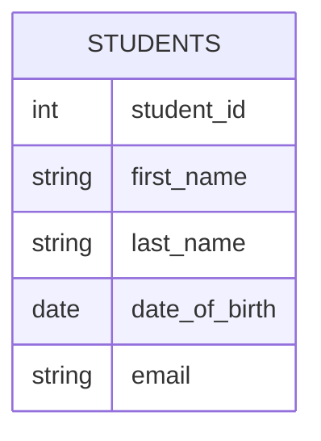

# MySQL Tables

In the world of databases, tables are the foundation for storing and organizing data. If you think of a MySQL database as a filing cabinet, then tables are the individual folders that help organize related information. Understanding how to create and manage tables is fundamental to working with MySQL effectively.

## What are MySQL Tables?

A MySQL table is a structured collection of data organized into rows and columns. Each column has a specific data type that determines what kind of information it can store, while each row represents an individual record.

Let's visualize a simple table structure:



## Creating Tables in MySQL

To create a table in MySQL, we use the `CREATE TABLE` statement. The basic syntax is:

```sql
CREATE TABLE table_name (
    column1 datatype constraints,
    column2 datatype constraints,
    ...
);
```

Let's create a simple table to store student information:

```sql
CREATE TABLE students (
    student_id INT AUTO_INCREMENT PRIMARY KEY,
    first_name VARCHAR(50) NOT NULL,
    last_name VARCHAR(50) NOT NULL,
    date_of_birth DATE,
    email VARCHAR(100) UNIQUE,
    enrollment_date TIMESTAMP DEFAULT CURRENT_TIMESTAMP
);
```

Here's what happens when you run the above command:

```
Query OK, 0 rows affected (0.42 sec)
```

Let's break down what we just did:

- `students` is our table name
- `student_id` is a column with an integer data type that automatically increments for each new record and serves as our primary key
- `first_name` and `last_name` are VARCHAR columns that cannot be empty (NOT NULL)
- `date_of_birth` is a DATE column that can be NULL (optional)
- `email` is a VARCHAR column with a UNIQUE constraint
- `enrollment_date` is a TIMESTAMP column that defaults to the current date and time

## MySQL Data Types

MySQL supports various data types to store different kinds of information. Here are the most commonly used ones:

### Numeric Types

- `INT` / `INTEGER`: Standard integer (-2,147,483,648 to 2,147,483,647)
- `SMALLINT`: Small integer (-32,768 to 32,767)
- `TINYINT`: Tiny integer (-128 to 127)
- `DECIMAL(M,D)`: Fixed-point number with M digits and D decimals
- `FLOAT`: Floating-point number

### String Types

- `VARCHAR(size)`: Variable-length string with a maximum size
- `CHAR(size)`: Fixed-length string
- `TEXT`: Long text string
- `ENUM`: String object with only one value from a list of possible values

### Date and Time Types

- `DATE`: Date in 'YYYY-MM-DD' format
- `TIME`: Time in 'HH:MM:SS' format
- `DATETIME`: Date and time combination in 'YYYY-MM-DD HH:MM:SS' format
- `TIMESTAMP`: Timestamp stored as the number of seconds since '1970-01-01 00:00:00'

### Other Types

- `BINARY` / `VARBINARY`: Binary strings
- `BLOB`: Binary Large Object
- `JSON`: JSON-formatted data (MySQL 5.7.8 and later)

## Table Constraints

Constraints are rules applied to table columns to maintain data integrity:

- `PRIMARY KEY`: Uniquely identifies each record in a table
- `FOREIGN KEY`: Links data from one table to another
- `UNIQUE`: Ensures all values in a column are different
- `NOT NULL`: Ensures a column cannot have a NULL value
- `CHECK`: Ensures values in a column meet a specific condition
- `DEFAULT`: Sets a default value for a column

## Viewing Table Structure

After creating a table, you can view its structure using the `DESCRIBE` or `SHOW COLUMNS` commands:

```sql
DESCRIBE students;
```

Output:

```
+----------------+--------------+------+-----+-------------------+-------------------+
| Field          | Type         | Null | Key | Default           | Extra             |
+----------------+--------------+------+-----+-------------------+-------------------+
| student_id     | int          | NO   | PRI | NULL              | auto_increment    |
| first_name     | varchar(50)  | NO   |     | NULL              |                   |
| last_name      | varchar(50)  | NO   |     | NULL              |                   |
| date_of_birth  | date         | YES  |     | NULL              |                   |
| email          | varchar(100) | YES  | UNI | NULL              |                   |
| enrollment_date| timestamp    | YES  |     | CURRENT_TIMESTAMP |                   |
+----------------+--------------+------+-----+-------------------+-------------------+
6 rows in set (0.00 sec)
```

Alternatively:

```sql
SHOW COLUMNS FROM students;
```

## Modifying Tables

As your application evolves, you may need to modify your table structure. MySQL provides several statements for this purpose.

### Adding a New Column

To add a new column to an existing table:

```sql
ALTER TABLE students ADD COLUMN phone VARCHAR(15);
```

Output:

```
Query OK, 0 rows affected (0.45 sec)
Records: 0  Duplicates: 0  Warnings: 0
```

### Modifying an Existing Column

To change the properties of an existing column:

```sql
ALTER TABLE students MODIFY COLUMN phone VARCHAR(20);
```

Output:

```
Query OK, 0 rows affected (0.56 sec)
Records: 0  Duplicates: 0  Warnings: 0
```

### Renaming a Column

To rename a column:

```sql
ALTER TABLE students CHANGE COLUMN phone contact_number VARCHAR(20);
```

Output:

```
Query OK, 0 rows affected (0.38 sec)
Records: 0  Duplicates: 0  Warnings: 0
```

### Dropping a Column

To remove a column from your table:

```sql
ALTER TABLE students DROP COLUMN contact_number;
```

Output:

```
Query OK, 0 rows affected (0.42 sec)
Records: 0  Duplicates: 0  Warnings: 0
```

## Creating Tables with Foreign Keys

Foreign keys are used to create relationships between tables. Let's create a `courses` table and a `enrollments` table that links students to courses:

```sql
CREATE TABLE courses (
    course_id INT AUTO_INCREMENT PRIMARY KEY,
    course_name VARCHAR(100) NOT NULL,
    credits INT NOT NULL,
    department VARCHAR(50)
);

CREATE TABLE enrollments (
    enrollment_id INT AUTO_INCREMENT PRIMARY KEY,
    student_id INT,
    course_id INT,
    enrollment_date DATE DEFAULT (CURRENT_DATE),
    grade VARCHAR(2),
    FOREIGN KEY (student_id) REFERENCES students(student_id),
    FOREIGN KEY (course_id) REFERENCES courses(course_id)
);
```

This creates a relationship where each enrollment record is linked to a specific student and a specific course.

## Practical Example: School Database

Let's expand our school database example by adding some records and running queries:

```sql
-- Adding students
INSERT INTO students (first_name, last_name, date_of_birth, email)
VALUES 
('John', 'Doe', '2000-05-15', 'john.doe@example.com'),
('Jane', 'Smith', '2001-08-22', 'jane.smith@example.com'),
('Michael', 'Johnson', '1999-11-30', 'michael.j@example.com');

-- Adding courses
INSERT INTO courses (course_name, credits, department)
VALUES 
('Introduction to Programming', 3, 'Computer Science'),
('Database Design', 4, 'Computer Science'),
('Web Development', 3, 'Information Technology');

-- Enrolling students in courses
INSERT INTO enrollments (student_id, course_id, grade)
VALUES 
(1, 1, 'A'),
(1, 2, 'B+'),
(2, 1, 'A-'),
(2, 3, 'A'),
(3, 2, 'B');
```

Now we can retrieve meaningful data using JOIN operations:

```sql
-- Get all enrollments with student names and course names
SELECT 
    s.first_name, 
    s.last_name, 
    c.course_name, 
    e.enrollment_date, 
    e.grade
FROM 
    enrollments e
JOIN 
    students s ON e.student_id = s.student_id
JOIN 
    courses c ON e.course_id = c.course_id;
```

Output:

```
+------------+-----------+-----------------------------+----------------+-------+
| first_name | last_name | course_name                 | enrollment_date| grade |
+------------+-----------+-----------------------------+----------------+-------+
| John       | Doe       | Introduction to Programming | 2023-10-10    | A     |
| John       | Doe       | Database Design             | 2023-10-10    | B+    |
| Jane       | Smith     | Introduction to Programming | 2023-10-10    | A-    |
| Jane       | Smith     | Web Development             | 2023-10-10    | A     |
| Michael    | Johnson   | Database Design             | 2023-10-10    | B     |
+------------+-----------+-----------------------------+----------------+-------+
5 rows in set (0.00 sec)
```

## Deleting Tables

If you need to remove a table completely, use the `DROP TABLE` statement:

```sql
DROP TABLE enrollments;
DROP TABLE courses;
DROP TABLE students;
```

It's important to drop tables in the correct order when foreign keys are involved - drop child tables before parent tables to avoid constraint errors.

## Best Practices for MySQL Tables

1. **Choose appropriate data types**: Select the most efficient data type for your columns to save space and improve performance.

2. **Name tables and columns clearly**: Use meaningful names that reflect the contents.

3. **Always include a primary key**: Every table should have a unique identifier.

4. **Normalize your data**: Split data into multiple related tables to reduce redundancy.

5. **Use indices for frequently queried columns**: Add indexes to columns used in WHERE clauses or joins.

6. **Document your design**: Keep notes about your table design and relationships.

7. **Consider character sets**: Choose appropriate character sets and collations for string columns.

8. **Limit the use of TEXT and BLOB types**: These can impact performance.

## Summary

MySQL tables are the building blocks of any database system. In this lesson, we've covered:

- What tables are and how they're structured
- Creating tables with various data types and constraints
- Modifying table structure with ALTER TABLE
- Establishing relationships between tables using foreign keys
- Basic querying and joining of related tables
- Best practices for designing efficient tables

Understanding how to properly design and manage tables is crucial for creating efficient database systems. With these fundamentals, you're well on your way to building robust database applications.

## Exercises

To reinforce your learning, try these exercises:

1. Create a table called `instructors` with appropriate columns to store information about teachers at a school.

2. Modify the `courses` table to add a foreign key that links to an instructor.

3. Create a `departments` table and establish a relationship with the `courses` table.

4. Write a query that shows all courses along with their instructor names.

5. Design a table structure for a library management system with books, authors, and borrower information.

## Additional Resources

- [MySQL Documentation on Data Types](https://dev.mysql.com/doc/refman/8.0/en/data-types.html)
- [MySQL Documentation on CREATE TABLE](https://dev.mysql.com/doc/refman/8.0/en/create-table.html)
- [Database Normalization Guide](https://www.guru99.com/database-normalization.html)

Working with tables is just the beginning of your MySQL journey. As you progress, you'll learn more advanced techniques for data manipulation, optimization, and management.