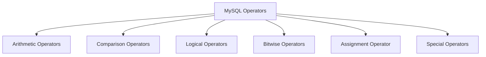

# MySQL Operators

Operators are special symbols or keywords that perform operations on one or more operands (values or variables). MySQL includes several types of operators that enable you to manipulate data efficiently and construct powerful queries. Understanding these operators is essential for effective database interaction.

## Introduction to MySQL Operators

In MySQL, operators allow you to perform calculations, compare values, combine conditions, and manipulate data in various ways. They form the foundation of database queries, filters, and data transformations. By mastering MySQL operators, you'll be able to construct more sophisticated and precise database operations.

Let's explore the different categories of operators available in MySQL:



## Arithmetic Operators

Arithmetic operators perform mathematical operations on numeric values.

| Operator | Description | Example |
|----------|-------------|---------|
| `+` | Addition | `SELECT 5 + 2` returns `7` |
| `-` | Subtraction | `SELECT 10 - 3` returns `7` |
| `*` | Multiplication | `SELECT 4 * 5` returns `20` |
| `/` | Division | `SELECT 20 / 4` returns `5.0000` |
| `%` | Modulo (remainder) | `SELECT 10 % 3` returns `1` |
| `DIV` | Integer division | `SELECT 15 DIV 2` returns `7` |

### Example: Using Arithmetic Operators

Let's create a simple table and perform arithmetic operations:

```sql
CREATE TABLE products (
    product_id INT PRIMARY KEY,
    name VARCHAR(100),
    price DECIMAL(10, 2),
    quantity INT
);

INSERT INTO products VALUES 
(1, 'Laptop', 999.99, 10),
(2, 'Smartphone', 499.50, 25),
(3, 'Tablet', 299.75, 15),
(4, 'Headphones', 89.99, 50);

-- Calculate total inventory value
SELECT 
    name,
    price,
    quantity,
    price * quantity AS inventory_value
FROM products;
```

**Output:**

```
+------------+--------+----------+-----------------+
| name       | price  | quantity | inventory_value |
+------------+--------+----------+-----------------+
| Laptop     | 999.99 |       10 |         9999.90 |
| Smartphone | 499.50 |       25 |        12487.50 |
| Tablet     | 299.75 |       15 |         4496.25 |
| Headphones |  89.99 |       50 |         4499.50 |
+------------+--------+----------+-----------------+
```

### Practical Application: Price Adjustments

```sql
-- Calculate prices after 15% discount
SELECT
    name,
    price,
    ROUND(price * 0.85, 2) AS discounted_price,
    price - ROUND(price * 0.85, 2) AS savings
FROM products;
```

**Output:**

```
+------------+--------+-----------------+---------+
| name       | price  | discounted_price| savings |
+------------+--------+-----------------+---------+
| Laptop     | 999.99 |          849.99 |  150.00 |
| Smartphone | 499.50 |          424.58 |   74.92 |
| Tablet     | 299.75 |          254.79 |   44.96 |
| Headphones |  89.99 |           76.49 |   13.50 |
+------------+--------+-----------------+---------+
```

## Comparison Operators

Comparison operators compare two values and return a boolean result (`1` for true, `0` for false, or `NULL`).

| Operator      | Description           | Example                                 |
|---------------|-----------------------|-----------------------------------------|
| `=`           | Equal                 | `SELECT 5 = 5` returns `1`              |
| `<>` or `!=`  | Not equal             | `SELECT 5 <> 6` returns `1`             |
| `<`           | Less than             | `SELECT 3 < 5` returns `1`              |
| `>`           | Greater than          | `SELECT 7 > 2` returns `1`              |
| `<=`          | Less than or equal    | `SELECT 5 <= 5` returns `1`             |
| `>=`          | Greater than or equal | `SELECT 6 >= 5` returns `1`             |
| `IS NULL`     | Is NULL value         | `SELECT NULL IS NULL` returns `1`       |
| `IS NOT NULL` | Is not NULL value     | `SELECT 5 IS NOT NULL` returns `1`      |
| `BETWEEN`     | Between a range       | `SELECT 5 BETWEEN 1 AND 10` returns `1` |
| `IN`          | In a set of values    | `SELECT 5 IN (1, 3, 5, 7)` returns `1`  |
| `LIKE`        | Pattern matching      | `SELECT 'MySQL' LIKE 'My%'` returns `1` |

### Example: Filtering with Comparison Operators

```sql
-- Find products with price greater than $300
SELECT name, price 
FROM products 
WHERE price > 300;

-- Find products with quantity between 10 and 20
SELECT name, quantity 
FROM products 
WHERE quantity BETWEEN 10 AND 20;

-- Find products with specific prices
SELECT name, price 
FROM products 
WHERE price IN (89.99, 499.50);
```

**Output for first query:**

```
+------------+--------+
| name       | price  |
+------------+--------+
| Laptop     | 999.99 |
| Smartphone | 499.50 |
+------------+--------+
```

### Pattern Matching with LIKE

The `LIKE` operator performs pattern matching using wildcards:
- `%` - Matches zero or more characters
- `_` - Matches exactly one character

```sql
-- Find products that start with 'L'
SELECT name 
FROM products 
WHERE name LIKE 'L%';

-- Find products with 'a' as the second character
SELECT name 
FROM products 
WHERE name LIKE '_a%';
```

**Output for first query:**

```
+--------+
| name   |
+--------+
| Laptop |
+--------+
```

## Logical Operators

Logical operators combine multiple conditions and return a boolean result.

| Operator | Description | Example |
|----------|-------------|---------|
| `AND` | True if both operands are true | `SELECT (5 > 3) AND (2 < 4)` returns `1` |
| `OR` | True if either operand is true | `SELECT (5 > 10) OR (2 < 4)` returns `1` |
| `NOT` | Reverses the result | `SELECT NOT(5 > 10)` returns `1` |
| `XOR` | True if odd number of operands are true | `SELECT (5 > 3) XOR (2 < 4)` returns `0` |

### Example: Combining Conditions

```sql
-- Find expensive products (>$400) with low stock (<20)
SELECT name, price, quantity 
FROM products 
WHERE price > 400 AND quantity < 20;

-- Find products that are either expensive (>$500) or have high stock (>40)
SELECT name, price, quantity 
FROM products 
WHERE price > 500 OR quantity > 40;
```

**Output for first query:**

```
+--------+--------+----------+
| name   | price  | quantity |
+--------+--------+----------+
| Laptop | 999.99 |       10 |
+--------+--------+----------+
```

## Bitwise Operators

Bitwise operators perform bit manipulations on integer values.

| Operator | Description | Example |
|----------|-------------|---------|
| `&` | Bitwise AND | `SELECT 5 & 1` returns `1` |
| `\|` | Bitwise OR | `SELECT 5 \| 1` returns `5` |
| `^` | Bitwise XOR | `SELECT 5 ^ 1` returns `4` |
| `~` | Bitwise negation | `SELECT ~1` returns `-2` |
| `<<` | Left shift | `SELECT 1 << 2` returns `4` |
| `>>` | Right shift | `SELECT 4 >> 2` returns `1` |

While bitwise operators are less commonly used in everyday database operations, they can be useful for specialized applications, particularly when dealing with bit flags or optimizing certain operations.

## Assignment Operator

The assignment operator `=` is used to assign values to variables in MySQL.

```sql
-- Declare and assign a variable
SET @price = 100;
SET @quantity = 5;

-- Use the variables in a query
SELECT @price * @quantity AS total;
```

**Output:**

```
+-------+
| total |
+-------+
|   500 |
+-------+
```

## Special Operators

### REGEXP (Regular Expression)

The `REGEXP` operator performs pattern matching using regular expressions.

```sql
-- Find products where name contains 'phone' (case-insensitive)
SELECT name 
FROM products 
WHERE name REGEXP 'phone';
```

**Output:**

```
+------------+
| name       |
+------------+
| Smartphone |
| Headphones |
+------------+
```

### CASE Expression

The `CASE` expression provides conditional logic.

```sql
-- Categorize products by price range
SELECT 
    name, 
    price,
    CASE 
        WHEN price < 100 THEN 'Budget'
        WHEN price BETWEEN 100 AND 500 THEN 'Mid-range'
        ELSE 'Premium'
    END AS price_category
FROM products;
```

**Output:**

```
+------------+--------+----------------+
| name       | price  | price_category |
+------------+--------+----------------+
| Laptop     | 999.99 | Premium        |
| Smartphone | 499.50 | Mid-range      |
| Tablet     | 299.75 | Mid-range      |
| Headphones |  89.99 | Budget         |
+------------+--------+----------------+
```

### IS Operator

The `IS` operator tests a value against a boolean value.

```sql
-- Check if expressions are true or false
SELECT 
    (1 = 1) IS TRUE AS 'is_true_test',
    (1 = 2) IS FALSE AS 'is_false_test';
```

**Output:**

```
+--------------+---------------+
| is_true_test | is_false_test |
+--------------+---------------+
|            1 |             1 |
+--------------+---------------+
```

## Real-World Application: E-commerce Reporting

Let's combine various operators to create a comprehensive report for an e-commerce database:

```sql
-- Let's add some more data to our products table
INSERT INTO products VALUES 
(5, 'Camera', 599.99, 12),
(6, 'Printer', 199.50, 8),
(7, 'Monitor', 349.99, 20);

-- Create a sales report with multiple categories and calculations
SELECT 
    name,
    price,
    quantity,
    price * quantity AS inventory_value,
    CASE 
        WHEN quantity < 10 THEN 'Low stock'
        WHEN quantity BETWEEN 10 AND 25 THEN 'Adequate stock'
        ELSE 'Sufficient stock'
    END AS stock_status,
    CASE 
        WHEN price < 200 THEN 'Budget'
        WHEN price BETWEEN 200 AND 500 THEN 'Mid-range'
        ELSE 'Premium'
    END AS price_segment,
    IF(price > 400, 'Apply 10% discount', 'Standard pricing') AS pricing_strategy
FROM products
WHERE (price > 300 OR quantity < 15)
ORDER BY inventory_value DESC;
```

**Output:**

```
+------------+--------+----------+-----------------+-----------------+--------------+------------------------+
| name       | price  | quantity | inventory_value | stock_status    | price_segment| pricing_strategy      |
+------------+--------+----------+-----------------+-----------------+--------------+------------------------+
| Laptop     | 999.99 |       10 |         9999.90 | Adequate stock  | Premium      | Apply 10% discount    |
| Camera     | 599.99 |       12 |         7199.88 | Adequate stock  | Premium      | Apply 10% discount    |
| Monitor    | 349.99 |       20 |         6999.80 | Adequate stock  | Mid-range    | Standard pricing      |
| Printer    | 199.50 |        8 |         1596.00 | Low stock       | Budget       | Standard pricing      |
+------------+--------+----------+-----------------+-----------------+--------------+------------------------+
```

This query demonstrates how multiple operators can work together to create powerful business insights.

## Summary

MySQL operators are essential tools for working with databases effectively:

1. **Arithmetic operators** (`+`, `-`, `*`, `/`, `%`) perform mathematical calculations
2. **Comparison operators** (`=`, `<>`, `<`, `>`, `<=`, `>=`, `BETWEEN`, `IN`, `LIKE`) compare values
3. **Logical operators** (`AND`, `OR`, `NOT`) combine conditions
4. **Bitwise operators** (`&`, `|`, `^`, `~`, `<<`, `>>`) manipulate bit-level data
5. **Special operators** (`REGEXP`, `CASE`, `IS`) provide advanced functionality

Understanding these operators allows you to create precise queries, apply complex filtering, perform calculations, and derive meaningful insights from your data.

## Practice Exercises

1. Write a query to find all products with less than 15 items in stock and calculate the additional cost if you were to order enough to reach 20 items for each.

2. Create a query that categorizes products into three price tiers (Low: `<$100`, Medium: `$100-$400`, High: `>$400`) and shows how many products are in each tier.

3. Write a query to find all products whose names contain either 'a' or 'e' but not both.

4. Create a report showing which products would generate more than $5000 in revenue if all current inventory were sold, and calculate a 15% sales tax on those items.

## Additional Resources

- [MySQL Official Documentation on Operators](https://dev.mysql.com/doc/refman/8.0/en/non-typed-operators.html)
- [MySQL Expression Syntax](https://dev.mysql.com/doc/refman/8.0/en/expressions.html)
- [Regular Expressions in MySQL](https://dev.mysql.com/doc/refman/8.0/en/regexp.html)

By mastering MySQL operators, you'll be able to write more efficient and powerful queries, enabling you to extract precisely the data you need from your databases.